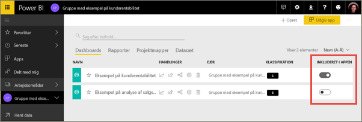
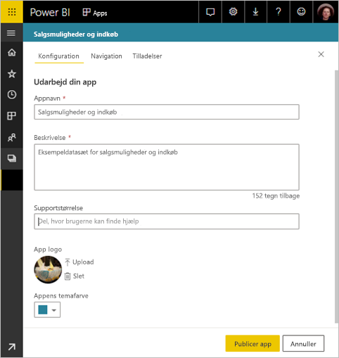
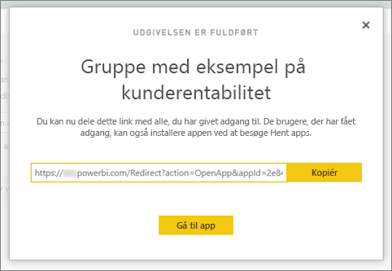
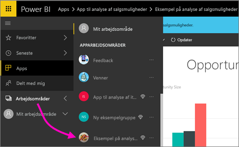
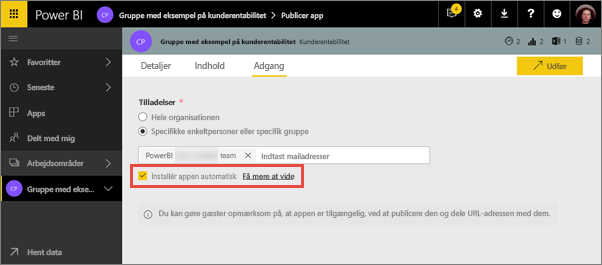
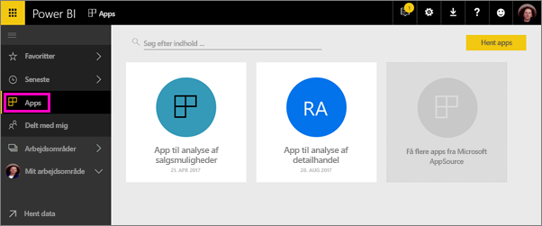
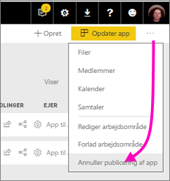

# Publicer en app i Power BI

I Power BI kan du oprette officielt pakket indhold og derefter distribuere det til en bred målgruppe som en *app*. Du opretter apps i *arbejdsområder*, hvor du kan samarbejde om Power BI-indhold med dine kolleger. Du kan derefter publicere de færdige apps til store grupper af personer i din organisation. 

Forretningsbrugere har ofte brug for flere Power BI-dashboards og -rapporter for at kunne drive deres virksomhed. Med Power BI-apps kan du oprette samlinger af dashboards og rapporter og publicere disse samlinger som apps til hele organisationen eller til bestemte personer eller grupper. Hvis du er forfatter af rapporten eller administrator, gør apps det nemmere for dig at administrere tilladelser til disse samlinger.

Forretningsbrugere kan få dine apps på flere måder:

- De kan finde og installere din app fra Microsoft AppSource.
- Du kan sende dem et direkte link.
- Du kan automatisk installere dem i dine kollegaers Power BI-konti, hvis Power BI-administratoren giver dig tilladelse til det.
- Power BI sender ingen mails til interne brugere, når du distribuerer eller opdaterer en app. Hvis du distribuerer den til eksterne brugere, modtager disse brugere en mail med et direkte link. 

Du kan oprette appen med tilpasset, indbygget navigation, så brugerne nemt kan finde rundt i dit indhold. De kan ikke ændre indholdet af appen. De kan interagere med det enten i Power BI-tjenesten eller en af mobilappsene – og selv filtrere, markere og sortere data. De får automatisk opdateringer, og du kan styre, hvor ofte dataene opdateres. Du kan også give dem tilladelsen Opret for at oprette forbindelse til de underliggende datasæt og oprette kopier af rapporterne i appen. Læs mere om [tilladelsen Opret](../connect-data/service-datasets-build-permissions.md).

## Licenser til apps
Hvis du vil oprette eller opdatere en app, skal du have en Power BI Pro-licens. Der er to muligheder for *forbrugere*.

* **Mulighed 1** Arbejdsområdet til denne app er *ikke* i en Power BI Premium-kapacitet: Alle forretningsbrugere skal have licens til Power BI Pro for at få vist din app. 
* **Mulighed 2** Arbejdsområdet for denne app *er* i en Power BI Premium-kapacitet: Forretningsbrugere uden Power BI Pro-licenser i din organisation kan få vist appindhold. De kan dog ikke kopiere rapporterne eller oprette rapporter, der er baseret på de underliggende datasæt. Læs [Hvad er Power BI Premium?](../admin/service-premium-what-is.md) for at få flere oplysninger.

## Publicer din app
Når dashboards og rapporter i dit arbejdsområde er klar, skal du vælge, hvilke dashboards og rapporter du vil publicere, og derefter publicerer du dem som en app. 

1. I listevisning i arbejdsområdet bestemmer du, hvilke dashboards og rapporter der skal **medtages i appen**.

    

    Hvis du vælger ikke at inkludere en rapport, der har et relateret dashboard, får du vist en advarsel ud for rapporten. Du kan stadig publicere appen, men det relaterede dashboard mangler delene fra den pågældende rapport.

    

2. Vælg knappen **Publicer app** øverst til højre for at starte processen til oprettelse og publicering af en app fra arbejdsområdet.
   
    

3. Under **Installation** skal du angive navnet og en beskrivelse, så brugerne nemmere kan finde appen. Du kan angive en temafarve for at gøre den personlig. Du kan også tilføje et link til et supportwebsted.
   
    

4. Under **Navigation** skal du vælge det indhold, der skal publiceres som en del af appen. Derefter kan du tilføje appnavigation for at organisere indholdet i sektioner. Se [Design navigationsoplevelsen til din app](#design-the-navigation-experience) i denne artikel for at få flere oplysninger.
   
    

5. Under **Tilladelser** skal du bestemme, hvem der har adgang til appen, og hvad de kan gøre med den. 

    - I [klassiske arbejdsområder](service-create-workspaces.md): alle i din organisation, bestemte personer eller Azure AD-sikkerhedsgrupper (Azure Active Directory).
    - I [arbejdsområder med den nye oplevelse](service-create-the-new-workspaces.md): bestemte personer, Azure AD-sikkerhedsgrupper og -distributionslister samt Microsoft 365 Grupper. Alle brugere af arbejdsområdet får automatisk adgang til appen for arbejdsområdet.
    - Du kan give brugere af appen tilladelse til at oprette forbindelse til appens underliggende datasæt ved hjælp af tilladelsen Opret. De får vist disse datasæt, når de søger efter delte datasæt. Læs mere om [at give brugerne mulighed for at oprette forbindelse til appens datasæt](#allow-users-to-connect-to-datasets) i denne artikel.
    - Brugere med tilladelse til at oprette kan også have tilladelse til at kopiere rapporter fra denne app til et andet arbejdsområde. Læs mere om at [give brugere mulighed for at kopiere rapporter i appen](#allow-users-to-copy-reports) i denne artikel.
    
    >[!IMPORTANT]
    >Hvis din app er afhængig af datasæt fra andre arbejdsområder, er det dit ansvar at sikre, at alle brugere af appen har adgang til de underliggende datasæt.
    >

6. Du kan installere appen automatisk for modtagerne, hvis din Power BI-administrator har aktiveret denne indstilling for dig på Power BI-administrationsportalen. Læs mere om, hvordan du [installerer en app automatisk](#automatically-install-apps-for-end-users), i denne artikel.

    

7. Når du vælger **Publicer app**, får du vist en meddelelse med en bekræftelse af, at den er klar til at blive publiceret. I dialogboksen **Del denne app** kan du kopiere den URL-adresse, der er et direkte link til denne app.
   
    

Du kan sende dette direkte link til de personer, du har delt den med, eller de kan finde din app under fanen Apps ved at gå til **Download og udforsk flere apps fra AppSource**. Læs mere om [appoplevelsen for forretningsbrugere](../consumer/end-user-apps.md).

## Skift din publicerede app
Når du publicerer din app, vil du muligvis ændre eller opdatere den. Det er nemt at opdatere den, hvis du er administrator eller medlem af det nye arbejdsområde. 

1. Åbn det apparbejdsområde, der svarer til appen. 
   
    

2. Foretag de ønskede ændringer i dashboards eller rapporter.
 
    Arbejdsområdet er dit testområde, så dine ændringer sendes ikke live i appen, før du publicerer igen. Her kan du foretage ændringer, uden at det påvirker publicerede apps.  
 
    > [!IMPORTANT]
    > Hvis du fjerner en rapport og opdaterer appen, mister dine appforbrugere alle tilpasninger, f.eks. bogmærker, kommentarer osv., også selvom du tilføjer rapporten i appen igen.  
 
3. Gå tilbage til arbejdsområdets liste over indhold, og vælg **Opdater app** i hjørnet øverst til højre.
   
1. Opdater evt. **Installation**, **Navigation** og **Tilladelser**, og vælg derefter **Opdater app**.
   
De personer, du har publiceret appen for, får automatisk vist den opdaterede version af appen. 

## Design navigationsoplevelsen
Du kan bruge indstillingen **Ny navigationsgenerator** til at udvikle brugerdefineret navigation til din app. Den brugerdefinerede navigation gør det nemmere for dine brugere at finde og bruge indhold i appen. For eksisterende apps er denne indstilling slået fra, og for nye apps er indstillingen som standard slået til.

Når indstillingen er slået fra, kan du vælge, at **App-landingsside** enten skal angives til **Specifikt indhold**, f.eks. et dashboard eller en rapport, eller vælge **Ingen** for at vise brugeren en grundlæggende oversigt over indhold.

Når du slår **Ny navigationsgenerator** til, kan du designe brugerdefineret navigation. Alle de rapporter, dashboards og Excel-projektmapper, du har medtaget i din app, vises som standard som en flad liste. 

Du kan tilpasse appnavigationen yderligere på følgende måde:

* Omarranger elementer ved hjælp af pil op/ned. 
* Omdøb elementer i **Rapportdetaljer**, **Dashboarddetaljer** og **Projektmappedetaljer**.
* Skjul bestemte elementer i navigationen.
* Brug indstillingen **Ny** til at føje **afsnit** til grupperelateret indhold.
* Brug indstillingen **Ny** til at tilføje et **link** til en ekstern ressource i navigationsruden. 

Når du tilføjer et **link**, kan du vælge, hvor linket åbnes, i **Link-detaljer**. Links åbnes som standard under den **aktuelle fane**, men du kan vælge **Ny fane** eller **Indholdsområde**. 

### Overvejelser ved brug af den nye navigationsgenerator
Her er nogle generelle ting, du skal huske på, når du bruger den nye navigationsgenerator:

* Rapportsider vises i appens navigationsområde som en sektion, der kan udvides. Når en rapport har én synlig side, er det kun rapportnavnet, der vises. Når du klikker på rapportnavnet i navigationen, åbnes den første side i rapporten. 

    > [!NOTE]
    > Din rapport kan kun indeholde én synlig side, fordi du har konfigureret navigation til de øvrige sider med knapper eller detaljeadgang.

* Hvis du slår den nye navigationsgenerator fra og derefter publicerer eller opdaterer din app, mister du de tilpasninger, du har foretaget. Du mister f.eks. alle sektioner, angivelser af rækkefølge, links og brugerdefinerede navne for navigationselementer.
* Det er muligt ikke at bruge App Builder.

Når du tilføjer links til din appnavigation og vælger indstillingen Indholdsområde:
* Sørg for, at linket kan integreres. Nogle tjenester blokerer for integrering af deres indhold på tredjepartswebsteder, som f.eks. Power BI.
* Integration af Power BI-tjenesteindhold, f.eks. rapporter eller dashboards, i andre arbejdsområder understøttes ikke. 
* Integrer indhold på Power BI-rapportserveren via det oprindelige integrerings-URL-indhold fra en udrulning i det lokale miljø. Udfør trinnene i [Opret URL-adressen til Power BI-rapportserveren](https://docs.microsoft.com/power-bi/report-server/quickstart-embed#create-the-power-bi-report-url) for at få URL-adressen. Vær opmærksom på, at der er gældende godkendelsesregler, så hvis du vil have vist indholdet, skal du have en VPN-forbindelse til serveren i det lokale miljø. 
* Der vises en sikkerhedsadvarsel øverst i det integrerede indhold for at gøre opmærksom på, at indholdet ikke er i Power BI.

## Installér automatisk apps for slutbrugere
Hvis en administrator giver dig tilladelser, kan du installere apps automatisk og *pushe* dem til slutbrugere. Denne pushfunktionalitet gør det lettere at distribuere de rette apps til de rette personer eller grupper. Din app vises automatisk på dine slutbrugeres liste over appindhold. De behøver ikke at søge efter den i Microsoft AppSource eller at følge et installationslink. Se, hvordan administratorer gør det muligt at [pushe apps til slutbrugerne](../admin/service-admin-portal.md#push-apps-to-end-users), i artiklen på Power BI-administrationsportalen.

### Sådan pusher du automatisk en app til slutbrugere
Når administratoren har givet dig tilladelser, har du en ny indstilling, hvor du kan **installere appen automatisk**. Når du markerer afkrydsningsfeltet og vælger **Publicer app** (eller **Opdater app**), pushes appen til alle de brugere eller grupper, der er defineret i sektionen **Tilladelser** under fanen **Adgang** i appen.

### Sådan får brugerne de apps, du pusher til dem
Når du har pushet en app, vises den automatisk på deres appliste. På denne måde kan du levere de apps, som specifikke brugere eller jobroller i organisationen har brug for at have lige ved hånden.

### Overvejelser i forbindelse med automatisk installation af apps
Her er nogle ting, du skal huske på, når du pusher apps til slutbrugerne:

* Automatisk installation af en app til brugerne kan tage tid. De fleste apps installeres for brugerne med det samme, men det kan tage tid at pushe apps.  Det afhænger af antallet af elementer i appen og antallet af personer med adgang. Vi anbefaler, at apps pushes efter almindelig arbejdstid, hvor der er god tid til, brugerne skal bruge dem. Få bekræftelse hos flere brugere, før du sender en generel meddelelse til alle om, at appsene er tilgængelige.

* Opdater browseren. Det kan være nødvendigt for en bruger at opdatere eller lukke og genåbne browseren, før vedkommende kan se den pushede app på Apps-listen.

* Hvis brugerne ikke kan se appen på applisten med det samme, skal browseren opdateres eller lukkes og genåbnes.

* Prøv ikke at overvælde brugerne. Pas på ikke at pushe for mange apps, da brugerne skal have en opfattelse af, at de forudinstallerede apps er nyttige for dem. Det er bedst at kontrollere, hvem der kan pushe apps til slutbrugerne, for at koordinere timingen. Etabler et kontaktpunkt i organisationen i forbindelse med push af apps til slutbrugerne.

* Gæstebrugere, der ikke har accepteret en invitation, får ikke installeret apps automatisk.  

## Tillad, at brugere opretter forbindelse til datasæt

Når du markerer indstillingen for at **tillade brugere at oprette forbindelse til appens underliggende datasæt**, giver du appbrugere *tilladelse til at oprette* i disse datasæt. Med denne tilladelse kan de udføre flere vigtige handlinger:

- [Bruge appdatasæt](../connect-data/service-datasets-across-workspaces.md) som udgangspunkt for deres rapporter.
- Søge efter disse datasæt i Power BI Desktop og i brugergrænsefladen til hentning af data i Power BI-tjenesten.
- Oprette rapporter og dashboards baseret på disse datasæt.

Når du fjerner markeringen af denne indstilling, får nye brugere, du føjer til appen, ikke længere tilladelsen Opret. Eksisterende tilladelser for de underliggende datasæt for eksisterende brugere af appen ændres dog ikke. Du kan manuelt fjerne tilladelsen Opret fra brugere af appen, som ikke længere skal have den. Læs mere om [tilladelsen Opret](../connect-data/service-datasets-build-permissions.md).

## Tillad brugere at kopiere rapporter

Når du markerer indstillingen **Giv brugerne tilladelse til at lave en kopi af rapporterne i denne app**, giver du brugerne tilladelse til at gemme rapporterne i appen i deres Mit arbejdsområde eller i et andet arbejdsområde. Det er nødvendigt at have en Pro-licens, hvis man vil lave en kopi, selvom den oprindelige rapport er i et arbejdsområde med en Premium-kapacitet. De kan derefter tilpasse rapporterne til deres unikke behov. Du skal første markere indstillingen **Giv alle brugere tilladelse til at oprette forbindelse til appens underliggende datasæt ved hjælp af tilladelsen Opret**. Når du vælger disse indstillinger, aktiverer du den nye funktion til [kopiering af rapporter fra andre arbejdsområder](../connect-data/service-datasets-copy-reports.md).

## Annuller publicering af en app
Et medlem af et arbejdsområde kan annullere publicering af appen.

>[!IMPORTANT]
>Når du annullerer publiceringen af en app, mister app-brugere deres tilpasninger. De mister alle personlige bogmærker, kommentarer eller abonnementer, der er knyttet til indholdet i appen. Annuller kun publicering af en app, hvis du har brug at fjerne den.
> 

* I et arbejdsområde skal du vælge de tre prikker ( **...** ) i øverste højre hjørne > **Annuller publicering af app**.
  
    

Denne handling fjerner installationen af appen for alle, du har udgivet den til, så de ikke længere har adgang til den. Den sletter ikke arbejdsområdet eller dets indhold.

## Se din publicerede app

Når forbrugerne af din app åbner din app, kan de se den navigation, du har oprettet, i stedet for Power BI-standardnavigationsruden. Appnavigationen indeholder en liste over rapporter og dashboards i de sektioner, du har defineret. Den viser også de enkelte sider i de enkelte rapporter og ikke kun navnet på rapporten. Du kan udvide og skjule den venstre navigationslinje ved hjælp af pilene i menulinjen.

I fuldskærmsvisning kan du få vist eller skjule navigationsvisningen ved at vælge indstillingen i hjørnet.

## Overvejelser og begrænsninger
Ting, du skal være opmærksom i forbindelse med publicering af apps:

* Tilladelsessiden ændrer ikke tilladelsen for datasæt i andre arbejdsområder. Du får vist en advarsel om, at du skal give adgang til disse datasæt uafhængigt af hinanden. Det er en god idé at kontakte ejeren af datasættet, før du begynder at oprette din app, for at sikre, at det er OK at give alle dine appbrugere adgang til disse datasæt. 
* Du kan højst have 100 brugere eller grupper på adgangslisten til appen. Du kan dog give mere end 100 brugere adgang til appen. Hvis du vil gøre det, skal du bruge en eller flere brugergrupper, der indeholder alle de ønskede brugere.
* Hvis den bruger, der blev føjet til adgangslisten, allerede havde adgang til appen via arbejdsområdet, vises vedkommende ikke på adgangslisten til appen i forbindelse med den nye arbejdsområdeoplevelse.  
* Når du bruger det nye udseende for Power BI-tjenesten, vises URL-adressen til supportwebstedet på kortet med oplysninger om elementet. Læs mere om [det nye udseende i Power BI](../consumer/service-new-look.md).
* I forbindelse med apps kan du give brugerne mulighed for at dele appen og appens underliggende datasæt ved hjælp af tilladelsen til deling. Denne indstilling er som standard slået fra for nye apps. Vi anbefaler, at du aktiverer denne indstilling for dine eksisterende apps og opdaterer tilladelsen til de underliggende datasæt. Indstillingen blev aktiveret for eksisterende apps, fordi apps indledningsvis blev udviklet til at erstatte indholdspakker, der havde denne funktionsmåde.

## Næste trin
* [Opret et arbejdsområde](service-create-workspaces.md)
* [Installér og brug apps i Power BI](../consumer/end-user-apps.md)
* [Power BI-apps til eksterne tjenester](../connect-data/service-connect-to-services.md)
* [Power BI-administrationsportal](https://docs.microsoft.com/power-bi/service-admin-portal)
* Har du spørgsmål? [Prøv at spørge Power BI-community'et](https://community.powerbi.com/)
