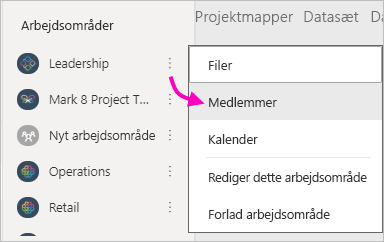
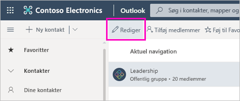
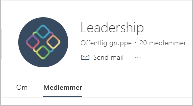

# Opret klassiske arbejdsområder i Power BI

I Power BI kan du oprette *arbejdsområder*, som er steder, hvor du kan samarbejde med kolleger om at oprette og tilpasse samlinger af dashboards, rapporter og sideinddelte rapporter. Derefter kan du gruppere samlingerne i *apps*, som du kan distribuere til hele organisationen eller til bestemte personer eller grupper. 

**Vidste du det?** Power BI tilbyder en ny arbejdsområdeoplevelse, som nu er standard. Læs [Organiser arbejde i de nye arbejdsområder](service-new-workspaces.md) for at få oplysninger om de nye arbejdsområder. Er du klar til at overføre dit klassiske arbejdsområde? Se [Opgrader klassiske arbejdsområder til de nye arbejdsområder i Power BI](service-upgrade-workspaces.md) for at få flere oplysninger.

Når du opretter et klassisk arbejdsområde, opretter du en underliggende tilknyttet Office 365-gruppe. Al administration af arbejdsområder foregår i Office 365. Du kan føje kollegaer til disse arbejdsområder som medlemmer eller administratorer. I arbejdsområdet kan alle samarbejde i dashboards, rapporter og andre artikler, som du vil publicere til en større målgruppe. Alle de brugere, du føjer til et arbejdsområde, skal have en Power BI Pro-licens. 

## Video: Apps og arbejdsområder
<iframe width="640" height="360" src="https://www.youtube.com/embed/Ey5pyrr7Lk8?showinfo=0" frameborder="0" allowfullscreen></iframe>

## Opret et klassisk arbejdsområde på baggrund af en Office 365-gruppe

Når du opretter et arbejdsområde, oprettes det ud fra en Office 365-gruppe.

[!INCLUDE [powerbi-service-create-app-workspace](../includes/powerbi-service-create-app-workspace.md)]

Bemærk, at når du opretter arbejdsområdet første gang, skal du muligvis vente omkring en time, før det er overført til Office 365. 

### Føj et billede til dit Office 365-arbejdsområde (valgfrit)
Power BI opretter som standard en lille farvet cirkel for din app med appens forbogstaver. Det kan også være, at du vil tilpasse den med et billede. Hvis du vil tilføje et billede, skal du have en Exchange Online-licens.

1. Vælg **Arbejdsområder**, vælg **Flere indstillinger** (...) ud for navnet på arbejdsområdet og derefter **Medlemmer**. 
   
     
   
    Outlook til Office 365-kontoen til arbejdsområdet åbnes i et nyt browservindue.
2. Vælg blyanten **Rediger**.
   
     
3. Vælg kameraikonet, og find det billede, du vil bruge.
   
     

     Billeder kan være .png-, .jpg- eller .bmp-filer. Filstørrelsen kan være stor – op til 3 MB. 

4. Vælg **OK** og derefter **Gem**.
   
    Billedet erstatter den farvede cirkel i Office 365 Outlook-vinduet. 
   
     
   
    Efter nogle få minutter vises det også i appen i Power BI.

## Føj indhold til dit arbejdsområde

Når du har oprettet et arbejdsområde, skal du føje indhold til det. Det foregår på samme måde, som når du føjer indhold til Mit arbejdsområde, bortset fra at andre personer i arbejdsområdet også kan se det og arbejde med det. Den store forskel er, at når du er færdig, kan du publicere indholdet som en app. Når du får vist indhold på indholdslisten for et arbejdsområde, vises navnet på arbejdsområdet som ejeren.

### Opret forbindelse til tredjepartstjenester i arbejdsområder

Apps leveres til alle de tredjepartstjenester, som Power BI understøtter, hvilket gør det nemt for dig at hente data fra de tjenester, du bruger, f.eks. Microsoft Dynamics CRM, Salesforce eller Google Analytics. Du kan publicere organisationsapps for at give dine brugere de data, de har brug for.

I de aktuelle arbejdsområder kan du også oprette forbindelse via organisationsindholdspakker og indholdspakker fra tredjepart, f.eks. Microsoft Dynamics CRM, Salesforce eller Google Analytics. Du kan overveje at overføre organisationsindholdspakker til apps.

## Distribuer en app

Hvis du vil distribuere officielt indhold til en stor målgruppe i din organisation, kan du publicere en app fra dit arbejdsområde.  Når indholdet er klar, skal du vælge, hvilke dashboards og rapporter du vil publicere, og derefter skal du publicere dem som en *app*. Du kan oprette en app fra hvert arbejdsområde.

På listen Apps i navigationsruden kan du se alle de apps, du har installeret. Dine kollegaer kan hente dine apps på flere måder. 
- De kan finde og installere din app fra Microsoft AppSource
- Du kan sende dem et direkte link. 
- Du kan automatisk installere dem i dine kollegaers Power BI-konti, hvis Power BI-administratoren giver dig tilladelse til det. 

Brugere ser opdateret appindhold automatisk, efter du har publiceret en opdatering fra dit arbejdsområde. Du kan styre, hvor ofte dataene opdateres ved at angive opdateringstidsplanen i de datasæt, der bruges af appindholdet i dit arbejdsområde. Du kan finde flere oplysninger i [Publicer en app fra de nye arbejdsområder i Power BI](service-create-distribute-apps.md).

## Ofte stillede spørgsmål om klassiske apps i Power BI

### Hvordan adskiller apps sig fra organisationsindholdspakker?
Apps er en udviklet form af organisationsindholdspakker. Hvis du allerede har organisationsindholdspakker, vil de fortsætte med at fungere side om side med apps. Der er et par større forskelle mellem apps og indholdspakker. 

* Når forretningsbrugere installerer en indholdspakke, mister den sin grupperede identitet: Den er bare en liste over dashboards og rapporter blandet med andre dashboards og rapporter. Apps bevarer på den anden side deres gruppering og identitet, også efter installationen. Denne gruppering gør det nemt for forretningsbrugere at fortsætte med at navigere til dem hen over tid.
* Du kan oprette flere indholdspakker fra et vilkårligt arbejdsområde, men en app har en en til en-relation til dens arbejdsområde. 
* Vi vil over tid fraråde organisationsindholdspakker, og vi anbefaler derfor, at du begynder at oprette apps fra nu af.  
* Med den nye arbejdsområdeoplevelse tager vi det første skridt mod udfasning af organisationsindholdspakker. Du kan ikke forbruge eller oprette dem i de nye arbejdsområder.

Se [Forskelle på det nye og klassiske arbejdsområde](service-new-workspaces.md#new-and-classic-workspace-differences) for at sammenligne de to. 

## Næste trin
* [Installér og brug apps i Power BI](service-create-distribute-apps.md)
- [Opret de nye arbejdsområder](service-create-the-new-workspaces.md)
* Har du spørgsmål? [Prøv at spørge Power BI-community'et](https://community.powerbi.com/)
