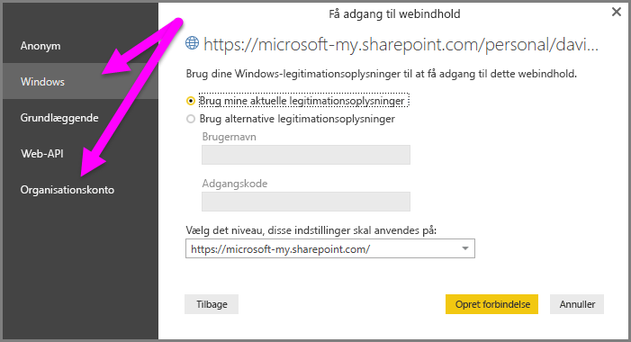

# Brug links til OneDrive for Business i Power BI Desktop
Mange brugere har Excel-projektmapper gemt på deres OneDrive for Business-drev, som vil være velegnet til brug sammen med Power BI Desktop. Med Power BI Desktop kan du bruge onlinelinks til Excel-filer, der er gemt i OneDrive for Business, til at oprette rapporter og visuals. Du kan bruge en OneDrive for Business-gruppekonto eller din egen OneDrive for Business-konto.

Der kræves nogle få specifikke trin, før du kan hente et onlinelink fra OneDrive for Business. I følgende afsnit beskrives de trin, som giver dig mulighed for at dele linket mellem grupper, på tværs af forskellige maskiner og med dine kolleger.

## Hent et link fra Excel
1. Gå til placeringen af OneDrive for Business ved hjælp af en browser. Højreklik på den fil, du vil bruge, og vælg **Åbn i Excel**.
   
   > [!NOTE]
   > Grænsefladen i browseren ligner måske ikke helt følgende billede. Der er mange måder at vælge **Åbn i Excel** på for filer i grænsefladen for browseren med OneDrive for Business. Du kan bruge en hvilken som helst indstilling, der giver dig mulighed for at åbne filen i Excel.
   > 
   > 
   
   
2. I Excel skal du vælge **Filer** > **Oplysninger**og derefter vælge **Kopiér sti** over **Beskyt projektmappe**.
   
   

## Brug linket i Power BI Desktop
Du kan bruge det link, du lige har kopieret til Udklipsholder, i Power BI Desktop. Du kan benytte følgende fremgangsmåde:

1. Vælg **Hent data** > **Web** i Power BI Desktop.
   
   
2. Når du har valgt indstillingen **Grundlæggende**, kan du indsætte linket i dialogboksen **Fra web**.
3. Fjern strenge *? web = 1* i slutningen af linket, så Power BI Desktop kan navigere til filen, og vælg derefter **OK**.
   
     
4. Hvis Power BI Desktop beder dig om legitimationsoplysninger, skal du enten vælge **Windows** (i forbindelse med SharePoint-websteder i det lokale miljø) eller **Organisationskonto** (i forbindelse med Office 365- eller OneDrive for Business-websteder).
   
   

   En dialogboks af typen **Navigator** vises, som giver dig mulighed for at vælge på listen over tabeller, ark og områder, som blev fundet i Excel-projektmappen. Herfra kan du bruge OneDrive for Business-filen på samme måde som enhver anden Excel-fil. Du kan oprette rapporter og bruge dem i datasæt som med enhver anden datakilde.

> [!NOTE]
> Hvis du vil bruge en OneDrive for Business-fil som en datakilde i Power BI-tjenesten med **Opdater tjenesten** aktiveret for denne fil, skal du sørge for at vælge **OAuth2** som **Godkendelsesmetode**, når du konfigurerer indstillingerne for opdatering. Ellers kan der opstå en fejl, f.eks. *Legitimationsoplysninger for datakilde kunne ikke opdateres*, når du forsøger at oprette forbindelse eller opdatere. Når du vælger **OAuth2** som godkendelsesmetode, afhjælpes denne fejl om legitimationsoplysninger.
> 
> 

