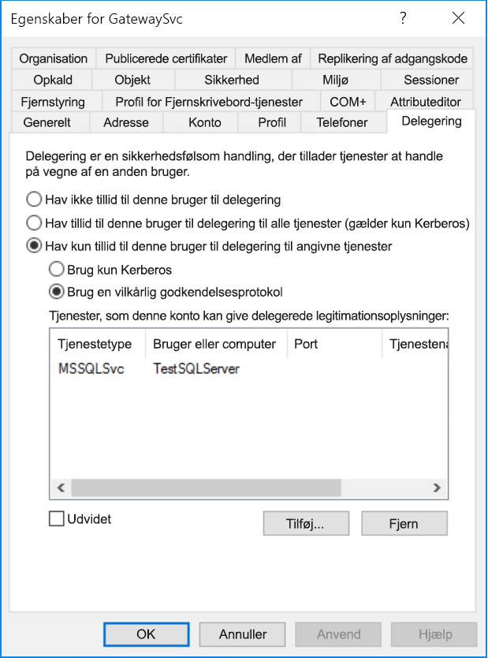
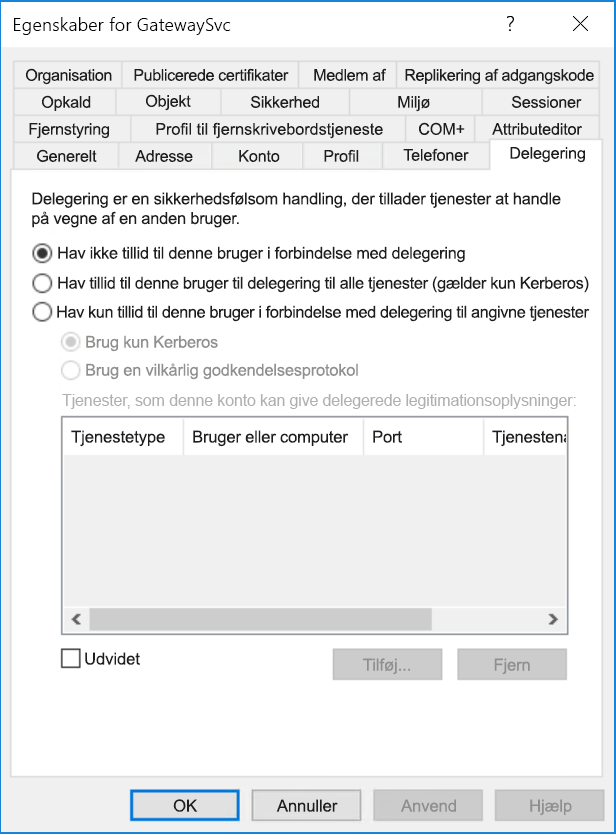
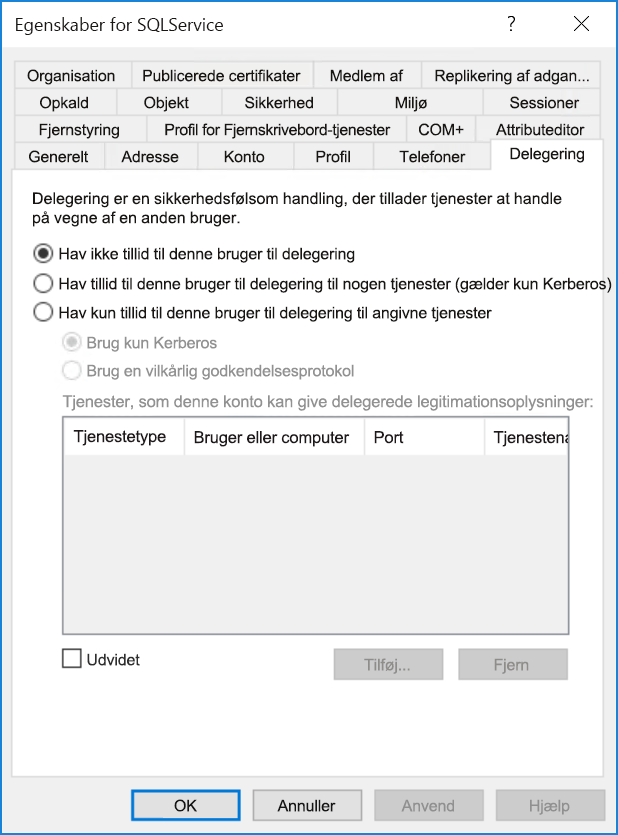
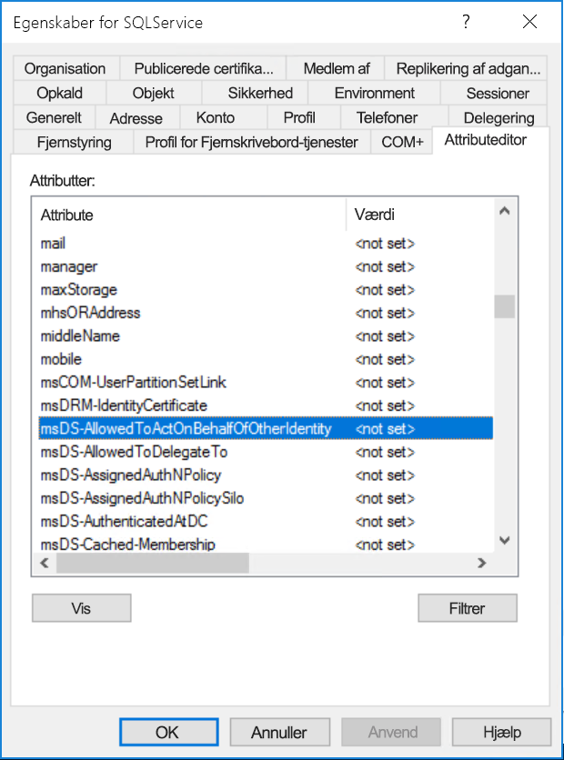
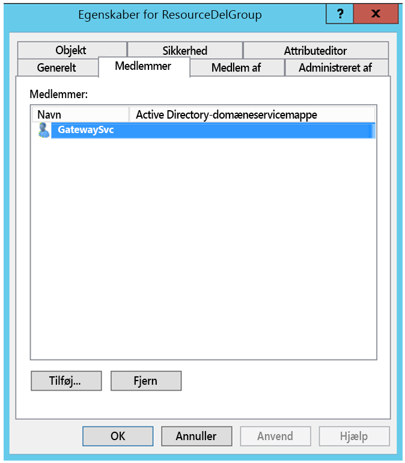

# <a name="configure-kerberos-based-sso-from-power-bi-service-to-on-premises-data-sources"></a>Konfigurer Kerberos-baseret SSO fra Power BI-tjenesten til datakilder i det lokale miljø

Aktivering af SSO gør det nemt for Power BI-rapporter og -dashboards at opdatere data fra kilder i det lokale miljø, samtidig med at de tilladelser på brugerniveau, der er konfigureret for disse kilder, overholdes. Brug [Begrænset Kerberos-delegering](/windows-server/security/kerberos/kerberos-constrained-delegation-overview) for at muliggøre en problemfri SSO-forbindelse. 

## <a name="prerequisites"></a>Forudsætninger

Adskillige elementer skal konfigureres, før begrænset Kerberos-delegering fungerer korrekt, herunder _tjenestens hovednavn (SPN – Service Principal Names)_ og delegeringsindstillinger for tjenestekonti.

### <a name="install-and-configure-the-microsoft-on-premises-data-gateway"></a>Installér og konfigurer Microsoft-datagatewayen i det lokale miljø

Datagatewayen i det lokale miljø understøtter en direkte opgradering samt _overtagelse af indstillinger_ for eksisterende gateways.

### <a name="run-the-gateway-windows-service-as-a-domain-account"></a>Kør gatewayens Windows-tjeneste som en domænekonto.

I en standardinstallation kører gatewayen som tjenestekontoen på en lokal computer (**NT Service\PBIEgwService**).


Hvis du vil aktivere begrænset Kerberos-delegering, skal gatewayen køre som en domænekonto, medmindre din instans af Azure Active Directory (Azure AD) allerede er synkroniseret med din lokale instans af Active Directory (ved hjælp af Azure AD DirSync/Connect). Hvis du vil skifte til en domænekonto, skal du se [Skift gatewaytjenestekonto](/data-integration/gateway/service-gateway-service-account).

> [!NOTE]
> Hvis Azure AD Connect er konfigureret, og brugerkonti er synkroniserede, behøver gatewaytjenesten ikke at udføre lokale Azure AD-opslag på kørselstidspunktet. I stedet kan du blot bruge gatewaytjenestens SID for den lokale tjeneste til at fuldføre al påkrævet konfiguration i Azure AD. De konfigurationstrin for begrænset Kerberos-delegering, der er beskrevet i denne artikel, er de samme konfigurationstrin som kræves i Azure AD-konteksten. De anvendes på gatewayens computerobjekt (identificeret af SID'et for den lokale tjeneste) i Azure AD i stedet for domænekontoen.

## <a name="obtain-domain-admin-rights-to-configure-spns-setspn-and-kerberos-constrained-delegation-settings"></a>Du skal have rettigheder som domæneadministrator for at konfigurere indstillinger for SPN'er (SetSPN) og begrænset Kerberos-delegering

For at konfigurere indstillinger for SPN'er og begrænset Kerberos-delegering skal domæneadministratoren undgå at tildele rettigheder til personer, som ikke har rettigheder som domæneadministrator. I følgende afsnit beskrives de anbefalede konfigurationstrin mere detaljeret.

## <a name="configure-kerberos-constrained-delegation-for-the-gateway-and-data-source"></a>Konfigurer begrænset Kerberos-delegering for gatewayen og datakilden

Hvis det er nødvendigt, kan du som domæneadministrator konfigurere et SPN for gatewaytjenestens domænekonto og konfigurere delegeringsindstillinger for gatewaytjenestens domænekonto.

### <a name="configure-an-spn-for-the-gateway-service-account"></a>Konfigurer et SPN til gatewaytjenestekontoen

Først skal du undersøge, om der allerede er oprettet et SPN for den domænekonto, der bruges som gatewaytjenestenkonto:

1. Start snap-in'et MMC (Microsoft Management Console) for **Active Directory-brugere og -computere** som domæneadministrator.

2. Højreklik på domænet i ruden til venstre, vælg **Find**, og angiv navnet på gatewaytjenestekontoen.

3. Højreklik på gatewaytjenestekontoen i søgeresultatet, og vælg **Egenskaber**.

4. Hvis fanen **Delegering** er synlig i dialogboksen **Egenskaber**, var der allerede oprettet et SPN, og du kan gå videre til [Beslut, hvilken type begrænset Kerberos-delegering der skal bruges](#decide-on-the-type-of-kerberos-constrained-delegation-to-use).

5. Hvis fanen **Delegering** ikke er synlig i dialogboksen **Egenskaber**, kan du manuelt oprette et SPN for den pågældende konto for at aktivere fanen. Brug det [setspn-værktøj](https://technet.microsoft.com/library/cc731241.aspx), der følger med Windows. Du skal have rettigheder som domæneadministrator for at oprette et SPN.

   Forestil dig f.eks., at gatewaytjenestekontoen er **Contoso\GatewaySvc**, og at gatewaytjenesten kører på en computer med navnet **MyGatewayMachine**. Hvis du vil angive SPN'et for gatewaytjenestekontoen, skal du køre følgende kommando:

   ```setspn -a gateway/MyGatewayMachine Contoso\GatewaySvc```

   Du kan også angive SPN'et ved hjælp af MMC-snap-in'et for **Active Directory-brugere og -computere**.
   
### <a name="add-gateway-service-account-to-windows-authorization-and-access-group-if-required"></a>Føj gatewaytjenestekontoen til Windows Authorization and Access Group, hvis det er nødvendigt

I visse scenarier skal gatewaytjenestekontoen føjes til Windows Authorization and Access Group. Disse scenarier omfatter sikkerhedshærdning af Active Directory-miljøet, og når gatewaytjenestekontoen og de brugerkonti, som gatewayen repræsenterer, befinder sig på forskellige domæner eller områder. Du kan også føje gatewaytjenestekontoen til Windows Authorization and Access Group i situationer, hvor domænet/området ikke er hærdet, men det kræves ikke.

Du kan finde flere oplysninger under [Windows Authorization and Access Group](/windows/security/identity-protection/access-control/active-directory-security-groups#bkmk-winauthaccess).

For at fuldføre dette konfigurationstrin skal du gøre følgende for hvert domæne, der indeholder Active Directory-brugere, som gatewaytjenestekontoen skal kunne repræsentere:
1. Log på en computer på domænet, og start MMC-snap-in'et for Active Directory-brugere og -computere.
2. Find gruppen **Windows Authorization and Access Group**, der typisk findes i den **indbyggede** objektbeholder.
3. Dobbeltklik på gruppen, og klik på fanen **Medlemmer**.
4. Klik på **Tilføj**, og skift placeringen af domænet til det domæne, hvor gatewaytjenestekontoen befinder sig.
5. Angiv navnet på gatewaytjenestekontoen, og klik på **Kontrollér navne** for at kontrollere, at gatewaytjenestekontoen er tilgængelig.
6. Klik på **OK**.
7. Klik på **Anvend**.
8. Genstart gatewaytjenesten.

### <a name="decide-on-the-type-of-kerberos-constrained-delegation-to-use"></a>Beslut, hvilken type begrænset Kerberos-delegering der skal bruges

Du kan konfigurere delegeringsindstillinger for enten begrænset Kerberos-standarddelegering eller ressourcebaseret begrænset Kerberos-delegering. Brug ressourcebaseret delegering (kræver Windows Server 2012 eller nyere), hvis din datakilde tilhører et andet domæne end din gateway. Du kan finde flere oplysninger om forskellene mellem de to tilgange til delegering under [Oversigt over begrænset Kerberos-delegering](/windows-server/security/kerberos/kerberos-constrained-delegation-overview).

 Fortsæt til et af følgende afsnit, afhængigt af hvilken tilgang du vil bruge. Fuldfør ikke begge afsnit:
 - [Konfigurer gatewaytjenestekontoen for begrænset Kerberos-standarddelegering](#configure-the-gateway-service-account-for-standard-kerberos-constrained-delegation)
- [Konfigurer gatewaytjenestekontoen for ressourcebaseret begrænset Kerberos-delegering](#configure-the-gateway-service-account-for-resource-based-kerberos-constrained-delegation). 

## <a name="configure-the-gateway-service-account-for-standard-kerberos-constrained-delegation"></a>Konfigurer gatewaytjenestekontoen for begrænset Kerberos-standarddelegering

> [!NOTE]
> Fuldfør trinnene i dette afsnit, hvis du vil aktivere [begrænset Kerberos-standarddelegering](/windows-server/security/kerberos/kerberos-constrained-delegation-overview). Ellers skal du fuldføre trinnene under [Konfigurer gatewaytjenestekontoen for ressourcebaseret begrænset Kerberos-delegering](#configure-the-gateway-service-account-for-resource-based-kerberos-constrained-delegation), hvis du vil aktivere ressourcebaseret begrænset Kerberos-delegering.

Nu angiver vi delegeringsindstillingerne for gatewaytjenestekontoen. Der er mange værktøjer, som kan bruges til at udføre disse trin. Her bruger vi MMC-snap-in'et for **Active Directory-brugere og -computere** til at administrere og publicere oplysninger i mappen. Det findes som standard i domænecontrollere, men på andre computere kan du aktivere det via konfigurationen af Windows-funktioner.

Vi skal konfigurere begrænset Kerberos-delegering med protokoloverførsel. Med begrænset delegering skal du udtrykkeligt angive, hvilke tjenester du vil tillade, at gatewayen præsenterer delegerede legitimationsoplysninger for. Det er f.eks. kun SQL Server- eller SAP HANA-serveren, der accepterer delegeringskald fra gatewaytjenestekontoen.

I dette afsnit forudsættes det, at du allerede har konfigureret SPN'er for de underliggende datakilder (f.eks. SQL Server, SAP HANA, SAP BW, Teradata og Spark). Hvis du vil vide mere om, hvordan du konfigurerer SPN'er for datakildeserveren, skal du se den tekniske dokumentation til den respektive databaseserver og afsnittet *Hvilket SPN kræver dit program?* i blogindlægget [Min Kerberos-tjekliste](https://techcommunity.microsoft.com/t5/SQL-Server-Support/My-Kerberos-Checklist-8230/ba-p/316160).

I følgende trin antager vi, at vi har et lokalt miljø med to computere i det samme domæne: en gatewaycomputer og en databaseserver, der kører SQL Server, og som allerede er blevet konfigureret til Kerberos-baseret SSO. Trinnene kan benyttes for en af de andre understøttede datakilder, så længe datakilden allerede er konfigureret til Kerberos-baseret enkeltlogon. Vi bruger følgende indstillinger i dette eksempel:

* Active Directory-domæne (Netbios): **Contoso**
* Gatewaymaskinens navn: **MyGatewayMachine**
* Gatewaytjenestekonto: **Contoso\GatewaySvc**
* Navn på computer med SQL Server-datakilde: **TestSQLServer**
* SQL Server-datakildens tjenestekonto: **Contoso\SQLService**

Her kan du se, hvordan du konfigurerer delegeringsindstillingerne:

1. Åbn MMC-snap-in'et for **Active Directory-brugere og -computere** med rettigheder som domæneadministrator.

2. Højreklik på gatewaytjenestekontoen (**Contoso\GatewaySvc**), og vælg **Egenskaber**.

3. Vælg fanen **Delegering**.

4. Vælg **Hav kun tillid til denne computer i forbindelse med delegering til de angivne tjenester** > **Brug en vilkårlig godkendelsesprotokol**.

5. Under **Tjenester, som denne konto kan give delegerede legitimationsoplysninger** skal du vælge **Tilføj**.

6. I den nye dialogboks skal du vælge **Brugere eller computere**.

7. Angiv tjenestekontoen for datakilden, og vælg derefter **OK**.

   En SQL Server-datakilde kan f.eks. have en tjenestekonto såsom *Contoso\SQLService*. Der skal allerede være angivet et korrekt SPN for datakilden på denne konto. 

8. Vælg det hovednavn for tjenesten (SPN), du har oprettet for databaseserveren. 

   I dette eksempel begynder SPN med *MSSQLSvc*. Hvis du har tilføjet både det fulde domænenavn (FQDN) og NetBIOS- SPN til din databasetjeneste, vælges begge dele. Du kan muligvis kun se et.

9. Vælg **OK**. 

   Du bør nu kunne se SPN'et på listen over tjenester, som gatewaytjenestekontoen kan give uddelegerede legitimationsoplysninger til.

    

10. Du fortsætter konfigurationsprocessen ved at gå til [Tildel gatewaytjenestekontoen rettigheder til lokale politikker på gatewaycomputeren](#grant-the-gateway-service-account-local-policy-rights-on-the-gateway-machine).

## <a name="configure-the-gateway-service-account-for-resource-based-kerberos-constrained-delegation"></a>Konfigurer gatewaytjenestekontoen for ressourcebaseret begrænset Kerberos-delegering

> [!NOTE]
> Fuldfør trinnene i dette afsnit, hvis du vil aktivere [ressourcebaseret begrænset Kerberos-delegering](/windows-server/security/kerberos/kerberos-constrained-delegation-overview#resource-based-constrained-delegation-across-domains). Ellers skal du fuldføre trinnene under [Konfigurer gatewaytjenestekontoen for begrænset Kerberos-standarddelegering](#configure-the-gateway-service-account-for-standard-kerberos-constrained-delegation), hvis du vil aktivere begrænset Kerberos-standarddelegering.

Du bruger [ressourcebaseret begrænset Kerberos-delegering](/windows-server/security/kerberos/kerberos-constrained-delegation-overview#resource-based-constrained-delegation-across-domains) til at aktivere forbindelse via enkeltlogon for Windows Server 2012 og nyere versioner. Denne type delegering tillader, at front end- og back end-tjenesterne befinder sig på forskellige domæner. Hvis dette skal fungere, skal domænet for back end-tjenesten have tillid til domænet for front end-tjenesten.

I følgende trin antager vi, at vi har et lokalt miljø med to computere i forskellige domæner: en gatewaycomputer og en databaseserver, der kører SQL Server, og som allerede er blevet konfigureret til Kerberos-baseret SSO. Disse trin kan indføres for en af de andre understøttede datakilder, så længe datakilden allerede er konfigureret til Kerberos-baseret enkeltlogon. Vi bruger følgende indstillinger i dette eksempel:

* Active Directory-frontenddomæne (Netbios): **ContosoFrontEnd**
* Active Directory-backenddomæne (Netbios): **ContosoBackEnd**
* Gatewaymaskinens navn: **MyGatewayMachine**
* Gatewaytjenestekonto: **ContosoFrontEnd\GatewaySvc**
* Navn på computer med SQL Server-datakilde: **TestSQLServer**
* SQL Server-datakildens tjenestekonto: **ContosoBackEnd\SQLService**

Fuldfør følgende konfigurationstrin:

1. Brug MMC-snap-in'et for **Active Directory-brugere og -computere** på domænecontrolleren for domænet **ContosoFrontEnd**, og bekræft, at der ikke er anvendt nogen delegeringsindstillinger for gatewaytjenestekontoen.

    

2. Brug **Active Directory-brugere og -computere** på domænecontrolleren for domænet **ContosoBackEnd**, og bekræft, at der ikke er anvendt nogen delegeringsindstillinger for back end-tjenestekontoen.

    

3. På fanen **Attributeditor** for kontoens egenskaber skal du bekræfte, at attributten **msDS-AllowedToActOnBehalfOfOtherIdentity** ikke er angivet.

    

4. Opret en gruppe under **Active Directory-brugere og -computere** på domænecontrolleren for domænet **ContosoBackEnd**. Føj gatewaytjenestekontoen **GatewaySvc** til gruppen **ResourceDelGroup**. 

    

5. Åbn en kommandoprompt, og kør følgende kommandoer i domænecontrolleren for domænet **ContosoBackEnd** for at opdatere attributten **msDS-AllowedToActOnBehalfOfOtherIdentity** for back end-tjenestekontoen:

    ```powershell
    $c = Get-ADGroup ResourceDelGroup
    Set-ADUser SQLService -PrincipalsAllowedToDelegateToAccount $c
    ```

6. Under **Active Directory-brugere og -computere** skal du bekræfte, at opdateringen er afspejlet på fanen **Attributeditor** under egenskaberne for back end-tjenestekontoen. 

## <a name="grant-the-gateway-service-account-local-policy-rights-on-the-gateway-machine"></a>Tildel gatewaytjenestekontoen rettigheder til lokale politikker på gatewaymaskinen

På den computer, der kører gatewaytjenesten (**MyGatewayMachine** i eksemplet), skal du til sidst tildele de lokale politikker **Repræsenter en klient efter godkendelse** og **Funger som en del af operativsystemet (SeTcbPrivilege)** til gatewaytjenestekontoen. Udfør denne konfiguration ved hjælp af editoren for den lokale gruppepolitik (**gpedit.msc**).

1. Kør **gpedit.msc** på gatewaycomputeren.

2. Gå til **Lokal computerpolitik** &gt; **Computerkonfiguration** &gt; **Windows-indstillinger** &gt; **Sikkerhedsindstillinger** &gt; **Lokale politikker** &gt; **Tildeling af brugerrettigheder**.

    

3. Under **Tildeling af brugerrettigheder** på listen over politikker skal du vælge **Repræsenter en klient efter godkendelse**.

    
    
4. Højreklik på politikken, åbn **Egenskaber**, og gennemse derefter listen over konti. 

    Listen skal indeholde gatewaytjenestekontoen (**Contoso\GatewaySvc** eller **ContosoFrontEnd\GatewaySvc**, afhængigt af typen af begrænset delegering).

5. Under **Tildeling af brugerrettigheder** skal du vælge **Funger som en del af operativsystemet (SeTcbPrivilege)** på listen over politikker. Kontrollér, at gatewaytjenestekontoen også er inkluderet på listen over konti.

6. Genstart processen for tjenesten med **datagatewayen i det lokale miljø**.

### <a name="set-user-mapping-configuration-parameters-on-the-gateway-machine-if-necessary"></a>Angiv konfigurationsparametre for brugertilknytning på gatewaycomputeren (om nødvendigt)

Hvis du ikke har konfigureret Azure AD Connect, skal du følge disse trin for at knytte en bruger af Power BI-tjenesten til en Azure AD-bruger. Hver Active Directory-bruger, der tilknyttes på denne måde, skal have SSO-tilladelser til din datakilde. Du kan finde flere oplysninger i [Guy in a Cube-videoen](https://www.youtube.com/watch?v=NG05PG9aiRw).

1. Åbn den primære gatewaykonfigurationsfil Microsoft.PowerBI.DataMovement.Pipeline.GatewayCore.dll. Denne fil er som standard gemt i C:\Programfiler\datagateway i det lokale miljø.

1. Angiv **ADUserNameLookupProperty** til en Active Directory-attribut, der ikke er i brug. Vi bruger `msDS-cloudExtensionAttribute1` i de efterfølgende trin. Denne attribut er kun tilgængelig til Windows Server 2012 og nyere. 

1. Angiv **ADUserNameReplacementProperty** til `SAMAccountName`, og gem derefter konfigurationsfilen.

1. På fanen **Tjenester** i Jobliste skal du højreklikke på gatewaytjenesten og vælge **Genstart**.

    

1. For hver bruger af Power BI-tjenesten, du vil aktivere Kerberos-SSO for, skal du angive egenskaben `msDS-cloudExtensionAttribute1` for en lokal Active Directory-bruger (med SSO-tilladelse til din datakilde) til det fulde brugernavn (UPN – user principal name) for brugeren af Power BI-tjenesten. Hvis du f.eks. logger på Power BI-tjenesten som test@contoso.com, og du vil knytte denne bruger til en lokal Active Directory-bruger med SSO-tilladelser, f.eks. test@LOCALDOMAIN.COM, skal du angive brugerens `msDS-cloudExtensionAttribute1`-attribut til test@contoso.com.

    Du kan angive egenskaben `msDS-cloudExtensionAttribute1` ved hjælp af MMC-snap-in'et for Active Directory-brugere og -computere:
    
    1. Start **Active Directory-brugere og -computere** som domæneadministrator.
    
    1. Højreklik på domænet, vælg **Find**, og angiv derefter kontonavnet på den lokale Active Directory-bruger, som skal tilknyttes.
    
    1. Vælg fanen **Attributeditor**.
    
        Find egenskaben `msDS-cloudExtensionAttribute1`, og dobbeltklik på den. Angiv værdien til det fulde brugernavn (UPN) for den bruger, som du anvender til at logge på Power BI-tjenesten.
    
    1. Vælg **OK**.
    
        
    
    1. Vælg **Anvend**. Kontrollér, at den korrekte værdi er blevet angivet i kolonnen **Værdi**.

## <a name="complete-data-source-specific-configuration-steps"></a>Udfør datakildespecifikke konfigurationstrin

SAP HANA og SAP BW har yderligere specifikke konfigurationskrav og -forudsætninger for datakilden, der skal opfyldes, før du kan etablere en SSO-forbindelse via gatewayen til disse datakilder. Du kan finde flere oplysninger på [siden til konfiguration af SAP HANA](service-gateway-sso-kerberos-sap-hana.md) og [konfiguration af SAP BW – CommonCryptoLib (sapcrypto.dll)](service-gateway-sso-kerberos-sap-bw-commoncryptolib.md). Selvom det er muligt at [konfigurere SAP BW til brug sammen med SNC-biblioteket gx64krb5](service-gateway-sso-kerberos-sap-bw-gx64krb.md), anbefales dette bibliotek ikke, da det ikke længere understøttes af SAP. Du bør bruge CommonCryptoLib _eller_ gx64krb5 som dit SNC-bibliotek. Fuldfør ikke konfigurationstrinnene for begge biblioteker.

> [!NOTE]
> Selvom andre SNC-biblioteker også kan fungere til SSO i BW, understøttes de ikke officielt af Microsoft.

## <a name="run-a-power-bi-report"></a>Kør Power BI-rapport

Når du har fuldført alle konfigurationstrin, kan du bruge siden **Administrer gateway** i Power BI til at konfigurere den datakilde, du vil bruge til SSO. Hvis du har flere gateways, skal du sørge for at vælge den gateway, du har konfigureret til Kerberos SSO. Kontrollér derefter under **Avancerede indstillinger** for datakilden, at **Brug SSO via Kerberos til DirectQuery-forespørgsler** eller **Brug SSO via Kerberos til DirectQuery- og importforespørgsler** er markeret for DirectQuery-baserede rapporter, og at **Brug SSO via Kerberos til DirectQuery- og importforespørgsler** er markeret for opdateringsbaserede rapporter.


Hvis du udgiver en DirectQuery-baseret rapport fra Power BI Desktop og knytter den til en datakilde, hvor **Bruger SSO via Kerberos til DirectQuery-forespørgsler** eller **Bruger SSO via Kerberos for DirectQuery- og importforespørgsler** er markeret, bruger denne rapport data, der er tilgængelige for den bruger, som er knyttet til den (Azure) Active Directory-bruger, der logger på Power BI-tjenesten.

På samme måde gælder det, at hvis du publicerer en opdateringsbaseret rapport fra Power BI Desktop og knytter den til en datakilde, hvor **Bruger SSO via Kerberos til DirectQuery- og importforespørgsler** er markeret, behøver du ikke at angive legitimationsoplysninger. Opdateringen udføres under datasætejerens Active Directory-kontekst.

Men hvis du f. eks. knytter den til en datakilde, hvor **Bruger SSO via Kerberos til DirectQuery- og importforespørgsler** ikke er markeret, bruger opdateringen de legitimationsoplysninger, du angav i felterne **Brugernavn** og **Adgangskode**, da du oprettede datakilden. Det vil sige, at Kerberos SSO *ikke* bruges. 

 Når du publicerer, skal du vælge den gateway, du har konfigureret til SSO, hvis du har flere gateways. 

Denne konfiguration fungerer i de fleste tilfælde. Med Kerberos kan der dog være forskellige konfigurationer afhængigt af dit miljø. Hvis rapporten ikke indlæses, skal du kontakte domæneadministratoren for at få problemet undersøgt yderligere. Hvis din datakilde er SAP BW, kan du også se afsnittet om fejlfinding for de konfigurationssider, der er specifikke for datakilden, for [CommonCryptoLib](service-gateway-sso-kerberos-sap-bw-commoncryptolib.md#troubleshooting) og [gx64krb5/gsskrb5](service-gateway-sso-kerberos-sap-bw-gx64krb.md#troubleshooting), afhængigt af hvilket SNC-bibliotek du har valgt.

## <a name="next-steps"></a>Næste trin

Du kan finde flere oplysninger om datagatewayen i det lokale miljø og DirectQuery i følgende ressourcer:

* [Hvad er en datagateway i det lokale miljø?](/data-integration/gateway/service-gateway-onprem)
* [DirectQuery i Power BI](desktop-directquery-about.md)
* [Datakilder, der understøttes af DirectQuery](power-bi-data-sources.md)
* [DirectQuery og SAP BW](desktop-directquery-sap-bw.md)
* [DirectQuery og SAP HANA](desktop-directquery-sap-hana.md)
