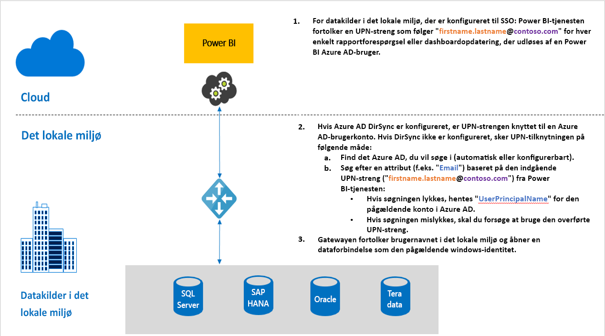

# Oversigt over enkeltlogon (SSO) til gateways i Power BI

Du kan få problemfri forbindelse med enkeltlogon, så Power BI-rapporter og -dashboards kan opdateres fra data i det lokale miljø i realtid, ved at konfigurere din datagateway i det lokale miljø. Du har mulighed for at konfigurere din gateway med enten begrænset [Kerberos](service-gateway-sso-kerberos.md)-delegering eller [SAML](service-gateway-sso-saml.md) (Security Assertion Markup Language). Datagatewayen i det lokale miljø understøtter SSO ved hjælp af [DirectQuery](desktop-directquery-about.md) eller Opdater, som opretter forbindelse til datakilder i det lokale miljø. 

Power BI understøtter følgende datakilder:

* SQL Server (Kerberos)
* SAP HANA (Kerberos og SAML)
* SAP BW-programserver (Kerberos)
* SAP BW-meddelelsesserver (Kerberos) 
* Oracle (Kerberos) 
* Teradata (Kerberos)
* Spark (Kerberos)
* Impala (Kerberos)

Vi understøtter i øjeblikket ikke SSO til [M-udvidelser](https://github.com/microsoft/DataConnectors/blob/master/docs/m-extensions.md).

Når en bruger interagerer med en DirectQuery-rapport i Power BI-tjenesten, kan hver handling for krydsfiltrering, udsnit, sortering og rapportredigering resultere i forespørgsler, der udføres direkte i forhold til den underliggende datakilde i det lokale miljø. Når du konfigurerer SSO for datakilden, udføres forespørgsler i henhold til identiteten for den bruger, som interagerer med Power BI (dvs. via weboplevelsen eller Power BI-mobilapps). Derfor ser hver enkelt bruger præcist de data, de har tilladelser til i den underliggende datakilde. 

Du kan også konfigurere en rapport, der er konfigureret til opdatering i Power BI-tjenesten, til at bruge SSO. Når du konfigurerer SSO for denne datakilde, udføres forespørgslerne under identiteten af datasættes ejer i Power BI. Opdateringen finder derfor sted på baggrund af tilladelserne til den underliggende datakilde for datasættets ejer. Opdatering ved hjælp af SSO er i øjeblikket kun aktiveret for datakilder, der bruger begrænset [Kerberos-delegering](service-gateway-sso-kerberos.md). 

## Forespørgselstrin under kørsel af SSO

En forespørgsel, der køres med SSO, består af tre trin som vist i følgende diagram.

Her følger yderligere oplysninger om hvert trin:

1. For hver forespørgsel inkluderer Power BI-tjenesten *brugerens hovednavn*, som er det fuldt kvalificerede brugernavn for den bruger, der i øjeblikket er logget på Power BI-tjenesten, når der sendes en forespørgselsanmodning til den konfigurerede gateway.

2. Gatewayen skal knytte brugerens hovednavn for Azure Active Directory til en lokal Active Directory-identitet:

   a. Hvis Azure AD DirSync (også kendt som *Azure AD Connect*) er konfigureret, fungerer tilknytningen automatisk i gatewayen.

   b.  Ellers kan gatewayen søge efter og knytte Azure AD-UPN'et til en lokal AD-bruger ved at foretage opslag mod det lokale Active Directory-domæne.

3. Processen for gatewaytjenesten repræsenterer den tilknyttede lokale bruger, åbner forbindelsen til den underliggende database og sender derefter forespørgslen. Du behøver ikke at installere gatewayen på samme computer som databasen.

## De næste trin

Nu, hvor du har en grundlæggende forståelse af aktivering af SSO via gatewayen, kan du læse flere detaljerede oplysninger om Kerberos og SAML:

* [Enkeltlogon (SSO) – Kerberos](service-gateway-sso-kerberos.md)
* [Enkeltlogon (SSO) – SAML](service-gateway-sso-saml.md)
