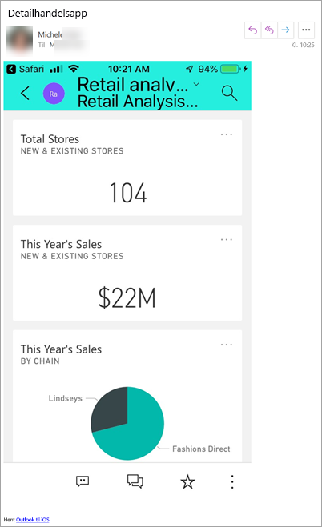
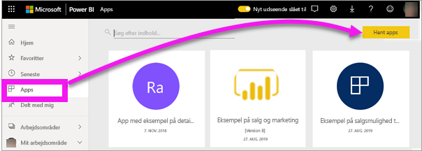
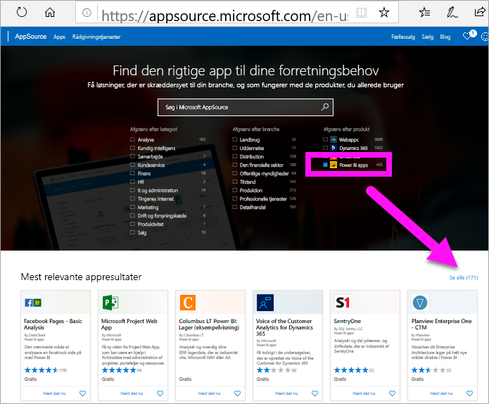
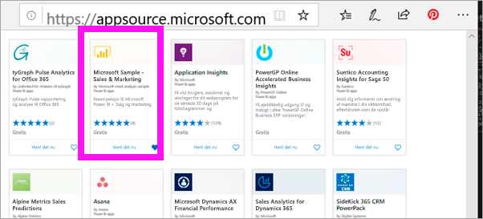

# Installer og brug apps med dashboards og rapporter i Power BI

[!INCLUDE[consumer-appliesto-ynny](../includes/consumer-appliesto-ynny.md)]

[!INCLUDE [power-bi-service-new-look-include](../includes/power-bi-service-new-look-include.md)]

Nu hvor du har en [grundlæggende forståelse af apps](end-user-apps.md), skal vi se på, hvordan du kan åbne og interagere med apps. 

## Måder at få en ny app på
Der er flere måder at få en ny app på. En kollega, der designer en rapport, kan installere appen automatisk på din Power BI-konto eller sende dig et direkte link til en app. Du kan også gå til AppSource og søge efter apps, der er tilgængelige for dig fra appdesignere både i og uden for din virksomhed. 

I Power BI på din mobilenhed kan du kun installere en app fra et direkte link og ikke fra AppSource. Hvis appdesigneren installerer appen automatisk, kan du se den på din liste over apps.

## Installer en app fra et direkte link
Den nemmeste måde selv at installere en ny app på er ved at få et direkte link fra appens designer.  

**På computeren** 

Når du vælger linket i mailen, åbner Power BI-tjenesten ([https://powerbi.com](https://powerbi.com)) appen i din browser. 

**På iOS- eller Android-mobilenhed** 

Når du vælger linket i mailen på din mobilenhed, installeres appen automatisk og åbnes i mobilappen. Du skal muligvis logge på først. 

## Hent appen fra Microsoft AppSource
Du kan også finde og installere apps fra Microsoft AppSource. Der vises kun programmer, du har adgang til, dvs. programudvikleren har givet dig eller alle tilladelse.

1. Vælg **Apps**  > **Hent apps**. 
   
        
2. I AppSource under **Min organisation** kan du udføre en søgning for at afgrænse resultatet og finde den app, du leder efter.
   
    
3. Vælg **Hent den nu** for at føje den til din appindholdsliste. 

## Hent en app fra Microsoft AppSource-webstedet 

I dette eksempel åbner vi en af Microsofts eksempelapps. På AppSource kan du finde apps til mange af de tjenester, du bruger til at køre din virksomhed.  Tjenester som f.eks. Salesforce, Microsoft Dynamics, Google Analytics, GitHub, Zendesk, Marketo og mange flere. Du kan få mere at vide i [Apps til tjenester, du bruger sammen med Power BI](../service-connect-to-services.md). 

1. Åbn [https://appsource.microsoft.com](https://appsource.microsoft.com) i en browser, og vælg **Power BI-apps**.

    

2. Vælg **Se alle** for at få vist en liste over alle de Power BI-apps, der i øjeblikket er tilgængelige på AppSource. Rul eller søg efter appen med navnet **Microsoft Sample-Sales & marketing**.

    

3. Vælg **Hent nu**, og acceptér vilkårene for anvendelse.

    

4. Bekræft, at du vil installere denne app.

    

5. I Power BI-tjenesten vises en meddelelse, når appen er blevet installeret. Vælg **Gå til app** for at åbne appen. Afhængigt af hvordan designeren oprettede appen, vises enten appdashboardet eller apprapporten.

    

    Du kan også åbne appen direkte fra din appindholdsliste ved at vælge **Apps** og **Sales & Marketing**.

    

6. Vælg, om du vil udforske eller tilpasse og dele din nye app. Da vi har valgt en Microsoft-eksempelapp, kan vi begynde med at udforske den. 

    

7.  Din nye app åbnes med et dashboard. *Appdesigneren* kunne have konfigureret, at appen skulle åbne en rapport i stedet for.  

    

## Interager med dashboards og rapporter i appen
Brug lidt tid på at udforske dataene i de dashboards og rapporter, der udgør appen. Du har adgang til alle almindelige Power BI-interaktioner som filtrering, fremhævning, sortering og analyse.  Er du stadig lidt forvirret over forskellen mellem dashboards og rapporter?  Læs [artiklen om dashboards](end-user-dashboards.md) og [artiklen om rapporter](end-user-reports.md).  

## Opdater en app 

Fra tid til tiden kan appudviklere udgive nye versioner af deres apps. Hvordan du får den nye version, afhænger af, hvordan du har modtaget originalen. 

* Hvis du har fået appen fra din organisation, er opdateringen til den nye version helt gennemsigtig – du behøver ikke at foretage dig noget. 

* Hvis du fik appen fra AppSource, vises der et meddelelsesbanner, næste gang du åbner appen. Under meddelelsen kan du se, at der er en ny version tilgængelig. 

    1. Vælg **Hent** for at opdatere.  

        <!-- -->

    2. Når du bliver bedt om at installere den opdaterede app, skal du vælge **Installer**. 

         

    3. Da du allerede har en version af denne app, skal du beslutte, om du vil erstatte den eksisterende version, eller om du vil installere den opdaterede app i et nyt arbejdsområde.   

         

    > [!NOTE] 
    > Hvis du installerer en ny version, overskrives alle de ændringer, du har foretaget af rapporter og dashboards. Hvis du vil beholde dine opdaterede rapporter og dashboards, kan du gemme dem med et andet navn eller på en anden placering, før du installerer dem. 

    4. Når du har installeret den opdaterede version, skal du vælge **Opdater app** for at fuldføre opdateringsprocessen. 

    <!-- -->

## Næste trin
* [Tilbage til oversigten over apps](end-user-apps.md)
* [Få vist en Power BI-rapport](end-user-report-open.md)
* [Andre måder, indhold deles med dig på](end-user-shared-with-me.md)
