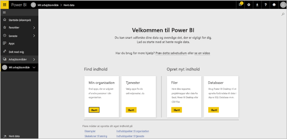
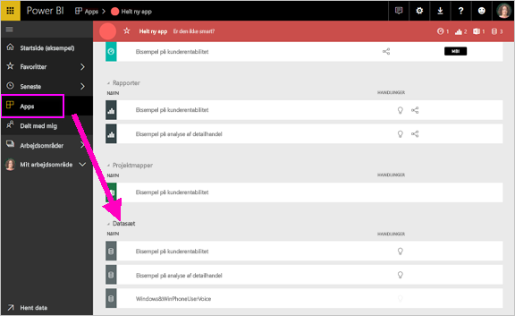
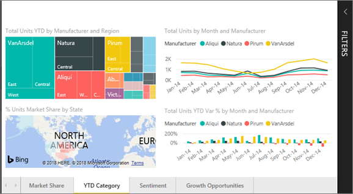
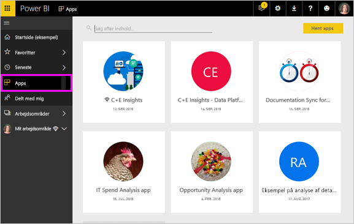

# Grundlæggende koncepter for ***forbrugere*** af Power BI-tjenesten

## Power BI-*forbrugere* og -*designere*
Denne artikel forudsætter, at du allerede har læst [Oversigt over Power BI](../power-bi-overview.md) og har identificeret dig selv som en Power BI-***forbruger***. Forbrugere modtager Power BI-indhold, f.eks. dashboards og rapporter, fra kolleger. Forbrugere bruger Power BI-tjenesten, som er den webstedsbaserede version af Power BI. 

Du hører uden tvivl udtrykket "Power BI Desktop" eller blot "Desktop". Dette er et separat værktøj, som bruges af *designere*, der udarbejder og deler dashboards og rapporter med dig. Det er vigtigt at vide, at der er andre Power BI-værktøjer derude, men så længe du er en forbruger, vil du kun arbejde med Power BI-tjenesten. Denne artikel gælder kun for Power BI-tjenesten. 

## Terminologi og begreber
Denne artikel er ikke en visuel gennemgang af Power BI, og den er heller ikke et praktisk selvstudium. Artiklen byder i stedet på en oversigt, som forhåbentligt hjælper dig med at blive fortrolig med Power BI-terminologien og -begreberne. Du lærer sproget og karakteristikaene. Hvis du vil have en præsentation af Power BI-tjenesten, og hvordan du navigerer i den, skal du se [Få en rundvisning](end-user-experience.md).

## Åbn Power BI-tjenesten første gang
De fleste Power BI-forbrugere får Power BI-tjenesten, fordi 1) deres virksomhed køber licenser, og 2) en administrator tildeler disse licenser til medarbejdere som dig. 

Du kommer i gang ved blot at åbne en browser og skrive **app.powerbi.com**. Første gang, du åbner Power BI-tjenesten, vil du se noget i stil med dette.

I takt med at du bruger Power BI, kan du tilpasse det, du ser, når du åbner webstedet.  Nogle personer foretrækker for eksempel, at Power BI åbner med startsiden, mens andre har et favoritdashboard, de vil have vist først. Bare rolig – vi lærer dig, hvordan du gør. 
- [Start (forhåndsvisning)](https://powerbi.microsoft.com/blog/introducing-power-bi-home-and-global-search)    
- [Angiv indhold som **udvalgt**](end-user-featured.md) 

Før vi fortsætter, skal vi lige vende tilbage og tale om de byggesten, der udgør Power BI-tjenesten.

## Power BI-***indhold***
### Introduktion til byggestenene
For Power BI-forbrugere er de fem byggesten: ***visualiseringer***, ***dashboards***, ***rapporter***, ***apps*** og ***datasæt***. Disse omtales nogle gange som *Power BI*-***indhold***. Og *indhold* findes i ***arbejdsområder***. En typisk arbejdsproces omfatter alle disse byggesten:  En Power BI-*designer* (gul i nedenstående diagram) indsamler data fra *datasæt*, overfører dem til Power BI med henblik på analyse, opretter *rapporter* fuld af *visualiseringer*, der fremhæver interessante fakta og indsigt, fastgør visualiseringerne fra rapporter til et dashboard og deler rapporter og dashboards med *forbrugere* som dig (sort i nedenstående diagram) i form af *apps* eller andre former for delt indhold. 

Kort fortalt. 
*  En ***visualisering*** (eller *visuals*) er en form for diagram, der udarbejdes af Power BI-*designere* ved hjælp af data i *rapporterne* og *datasættene*. *Designere* udarbejder typisk visualiseringerne i Power BI Desktop. 

    Du kan finde flere oplysninger under [Visualiseringer til Power BI-*forbrugere*](end-user-visualizations.md)

*  Et *datasæt* er en objektbeholder med data. Det kan f.eks. være en Excel-fil fra World Health Organization, en virksomhedsejet database over kunder eller en Salesforce-fil.  

*  Et *dashboard* er en enkelt skærm med interaktive visualiseringer, tekst og grafik. På et dashboard samles dine vigtigste metrikværdier på én skærm for at fortælle en historie eller svare på spørgsmål. Dashboardindholdet stammer fra en eller flere rapporter og et eller flere datasæt.

    Du kan finde flere oplysninger under [Dashboards til Power BI-*forbrugere*](end-user-dashboards.md)

*  En *rapport* er en eller flere sider med interaktive visualiseringer, tekst og grafik, der tilsammen udgør en enkelt rapport. En rapport er baseret på et enkelt datasæt. Rapportsider er ofte organiseret, så de hver især behandler en enkelt interesseområde eller besvarer et enkelt spørgsmål.

    Du kan finde flere oplysninger under [Rapporter til Power BI-*forbrugere*](end-user-reports.md)

*  En *app* er måde for *designere* at samle og dele relaterede dashboards og rapporter sammen. *Forbrugere* modtager nogle apps automatisk, men kan søge efter andre apps, der er oprettet af kollegaer eller af community'et. Nogle eksterne tjenester, som du allerede bruger, såsom Google Analytics og Microsoft Dynamics CRM, tilbyder f.eks. Power BI-apps.

For at gøre det helt klart: Hvis du er helt ny bruger, og det er første gang, du logger på Power BI, har du endnu ingen dashboards, apps eller rapporter. 
_______________________________________________________

## Datasæt
Et *datasæt* er en samling af data, som *designere* importerer eller opretter forbindelse til og derefter bruger til at oprette rapporter og dashboards. Som forbruger interagerer du ikke direkte med datasæt, men det er stadig rart at forstå, hvordan de passer ind i den større sammenhæng.  

Hvert datasæt repræsenterer en enkelt datakilde, f.eks. en Excel-projektmappe på OneDrive, et lokalt SSAS-tabeldatasæt eller et Salesforce-datasæt. Der understøttes mange forskellige datakilder.

Når en designer deler en app med dig, kan du se, hvilke datasæt der er inkluderet i appen. 

**ÉT** datasæt...

* kan bruges igen og igen
* kan bruges i mange forskellige rapporter
* Og visualiseringer fra dette ene datasæt kan vises på mange forskellige dashboards
  
  

Derudover kan datasæt fra andre arbejdsområder bruges til at oprette indhold (rapporter, dashboards) i dit arbejdsområde. Disse datasæt vises ved hjælp af ikonet for refereret datasæt: 

Videre til næste byggesten: visualiseringer.
__________________________________________________________

## Visualiseringer
Visualiseringer (dvs. visuals) viser indsigter, der er blevet registreret i dataene. Visualiseringer gør det nemmere at fortolke indsigt, da du opfatter et billede hurtigere end f.eks. et regneark fuld af tal.

Her er blot nogle af de visualiseringer, du kan støde på i Power BI: vandfald, bånd, træstruktur, cirkel, tragtformet, kort, punkt og måler. Se den [fulde liste over visualiseringer, der er inkluderet i Power BI](../power-bi-visualization-types-for-reports-and-q-and-a.md).

   

Visualiseringer er også tilgængelige fra community'et. Disse kaldes for *brugerdefinerede visualiseringer*. Hvis du modtager en rapport med en visualisering, du ikke genkender, er det sandsynligvis en brugerdefineret visualisering. Hvis du har brug for hjælp til at forstå den brugerdefinerede visualisering, <!--[look up the name of the report or dashboard *designer*](end-user-owner.md)-->kan du slå navnet på *designeren* af rapporten eller dashboardet op og kontakte ham eller hende.

**ÈN** visualisering i en rapport...

* kan bruges igen og igen i den samme rapport ved hjælp af kopiér/indsæt
* kan bruges på mange forskellige dashboards
__________________________________________________
## Rapporter
En Power BI-rapport er en eller flere sider med visualiseringer, grafik og tekst. Alle visualiseringerne i en rapport stammer fra et enkelt datasæt. *Designere* deler rapporter med *forbrugere*, som [interagerer med rapporterne i *Læsevisning*](end-user-reading-view.md).

**ÉN** rapport...

* kan være knyttet til flere dashboards (felter, der er fastgjort fra den ene rapport kan vises på flere dashboards).
* oprettes ved hjælp af data fra kun ét datasæt  
* kan være en del af flere apps
  
  

________________________________________________

## Dashboards
Et dashboard repræsenterer en brugerdefineret visning af nogle undersæt af de underliggende datasæt. *Designere* udarbejder dashboards og deler dem med *forbrugere* – enten enkeltvist eller som en del af en app. Et dashboard er et enkelt lærred, der indeholder *felter*, grafik og tekst. 

  

Et felt er en gengivelse af en visualisering, som en *designer* *fastgør* f.eks. fra en rapport til et dashboard.  Hvert fastgjorte felt viser en [visualisering](end-user-visualizations.md), der blev oprettet ud fra et datasæt og fastgjort til det pågældende dashboard. Et felt kan også indeholde en hel rapportside og data til livestreaming eller en video. *Designere* har mange forskellige måder at føje felter til dashboards på – alt for mange til at dække dem alle i dette oversigtsemne. Du kan få mere at vide i [Dashboard-felter i Power BI](end-user-tiles.md). 

En forbruger kan ikke redigere et dashboard. En forbruger kan derimod tilføje kommentarer, få vist relaterede data, angive det som favorit, abonnere og meget mere. 

Hvad er nogle formål med dashboards?  Her er nogle få:

* for hurtigt at se alle de oplysninger, der er nødvendige for at træffe beslutninger
* for at overvåge de vigtigste oplysninger om virksomheden
* for at sikre, at alle kollegaer er på samme side og får vist og bruger de samme oplysninger
* for at overvåge tilstanden for et produkt eller en virksomhed, en afdeling eller marketingkampagne osv.
* for at oprette en tilpasset visning af et større dashboard – alle de målepunkter, der betyder noget for dig

**ÉT** dashboard...

* kan vise visualiseringer fra mange forskellige datasæt
* kan vise visualiseringer fra mange forskellige rapporter
* kan vise visualiseringer, der er fastgjort fra andre funktioner (f.eks. Excel)
  
  

________________________________________________

## Apps
Disse samlinger af dashboards og rapporter organiserer relateret indhold sammen i en enkelt pakke. Power BI-*designere* udarbejder dem og deler dem med enkeltpersoner, grupper, en hel organisation eller offentligheden. Som forbruger kan du være sikker på, at du og dine kolleger arbejder med de samme data – en og samme betroede version af sandheden. 

Det er nemt at finde og installere apps i Power BI-tjenesten (https://powerbi.com)) og på din mobilenhed. Når du har installeret en app, behøver du ikke huske navnene på mange forskellige dashboards, fordi de alle er samlet i én app, i webbrowseren eller på din mobilenhed. 

Denne app har tre relaterede dashboards og tre relaterede rapporter, der udgør en enkelt app.

Med apps ser du automatisk ændringerne, hver gang appens forfatteren udgiver opdateringer. Forfatteren styrer også, hvor ofte dataene er planlagt til opdatering, så du ikke skal bekymre dig om at holde dem opdateret.

Du kan hente apps på nogle forskellige måder. Appdesigneren kan installere appen automatisk på din Power BI-konto eller sende et direkte link til en app til dig. Du kan også søge efter den i Microsoft AppSource, hvor du kan se alle de apps, du har adgang til. I Power BI på din mobilenhed kan du kun installere apps fra et direkte link og ikke fra AppSource. Hvis appdesigneren installerer appen automatisk, kan du se den på din liste over apps.

Når appen er installeret, skal du blot vælge den på listen over apps og vælge, hvilket dashboard eller hvilken rapport du vil åbne og udforske først.   

Jeg håber, at denne artikel gav dig en forståelse af de byggesten, der udgør Power BI-tjenesten for forbrugere. 

## Næste trin
- Gennemse og angiv bogmærke for [ordlisten](end-user-glossary.md)    
- Få en [præsentation af Power BI-tjenesten](end-user-experience.md)
- Læs [oversigten over Power BI, der er skrevet specielt til forbrugere](end-user-consumer.md)    
- Se en video, hvor Will gennemgår de grundlæggende begreber og præsenterer Power BI-tjenesten. <iframe width="560" height="315" src="https://www.youtube.com/embed/B2vd4MQrz4M" frameborder="0" allowfullscreen></iframe>
