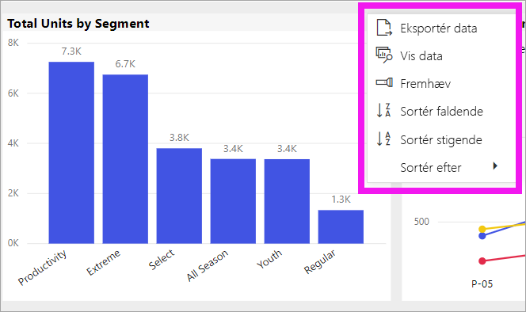

# Rediger, hvordan et diagram sorteres i en rapport i Power BI

[!INCLUDE[consumer-appliesto-ynny](../includes/consumer-appliesto-ynny.md)]

> [!IMPORTANT]
> **Denne artikel er beregnet til Power BI-brugere, der ikke har redigeringstilladelser til rapporten eller datasættet, og som kun arbejder i onlineversionen af Power BI (Power BI-tjenesten). Hvis du er rapport*designer*eller *administrator* eller *ejer*, indeholder denne artikel muligvis ikke alle de oplysninger, du har brug for. Du kan få mere at vide under [Sorter efter kolonne i Power BI Desktop](../desktop-sort-by-column.md)**.

I Power BI-tjenesten kan du ændre, hvordan en visualisering ser ud, ved at sortere den efter forskellige datafelter. Hvis du ændrer, hvordan du sorterer en visualisering, kan du fremhæve de oplysninger, du vil formidle. Uanset om du bruger numeriske data (f.eks. salgstal) eller tekstdata (f.eks. navne på stater), kan du sortere visualiseringerne efter behov. Power BI indeholder mange sorteringsmuligheder og genvejsmenuer, som du kan bruge. 

Visuals på et dashboard kan ikke sorteres, men i en Power BI-rapport kan du sortere de fleste visualiseringer 

## Kom i gang

Du kommer i gang ved at åbne en rapport, som er blevet delt med dig. Vælg en visualisering (der kan sorteres), og vælg **Flere handlinger** (...).  Der er tre sorteringsindstillinger: **Sortér faldende**, **Sortér stigende**, og **Sortér efter**. 
    

### Sortér alfabetisk eller numerisk

Visuals kan sorteres alfabetisk efter tekstnavnene på kategorierne i visual'et eller efter de numeriske værdier for hver kategori. Dette diagram er f.eks. sorteret alfabetisk efter kategorien **Store Name** på X-aksen.

Det er nemt at ændre sorteringen fra en kategori (gem navn) til en værdi (salg pr. kvadratfod) i stedet. Vælg **Flere handlinger** (...), og vælg **Sortér efter**. Vælg en numerisk værdi, der bruges i visual'et.  I dette eksempel har vi valgt **Sales Per Sq Ft**.

Hvis det er nødvendigt, kan du ændre sorteringsrækkefølgen mellem stigende og faldende.  Vælg **Flere handlinger** (...) igen, og vælg **Sortér faldende** eller **Sortér stigende**. Det felt, der bruges til at sortere efter, er med fed skrift og har en gul linje.

   

> [!NOTE]
> Det er ikke alle visualiseringer, der kan sorteres. Følgende visualiseringer kan f.eks. ikke sorteres: træstruktur, kort (map), kartogram, punkt, måler, kort (card) og vandfald.

## Gem dine ændringer af sorteringsrækkefølgen
Filtre, udsnitsværktøjer, sortering og andre ændringer af datavisningen, du foretager, gemmes i Power BI-rapporter – selvom du arbejder i [Læsevisning](end-user-reading-view.md). Det betyder, at hvis du navigerer væk fra en rapport og vender tilbage igen senere, er dine sorteringsændringer blevet gemt.  Hvis du vil ændre indstillingerne tilbage til de indstillinger, som rapportens *designer* oprindeligt valgte, skal du vælge **Nulstil til standard** på den øverste menulinje. 

Hvis knappen **Nulstil til standard** er nedtonet, betyder det, at rapportens *designer* har deaktiveret muligheden for at gemme (bevare) dine egne ændringer.

## Overvejelser og fejlfinding

### Sortering ved hjælp af andre kriterier
Der kan nogle gange være behov for at sortere en visualisering ved hjælp af et andet felt (der ikke er inkluderet i visualiseringen) eller andre kriterier.  Det kan f.eks. være, at du vil sortere efter måned i sekventiel rækkefølge (og ikke i alfabetisk rækkefølge), eller at du vil sortere efter hele tal i stedet for cifre (f.eks. 0, 1, 9, 20 og ikke 0, 1, 20, 9).  

Kun den person, der har designet rapporten, kan foretage disse ændringer for dig. Du kan finde kontaktoplysninger for *designeren* ved at vælge rapportens navn på overskriftslinjen.

Hvis du er *designer* og har redigeringstilladelser til indholdet, kan du læse [Sortér efter kolonne i Power BI Desktop](../desktop-sort-by-column.md) for at få mere at vide om, hvordan du opdaterer datasættet og aktiverer denne type sortering.

## Næste trin
Få mere at vide om [Visualiseringer i Power BI-rapporter](end-user-visualizations.md).

[Power BI – Grundlæggende begreber](end-user-basic-concepts.md)
