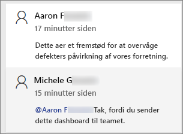
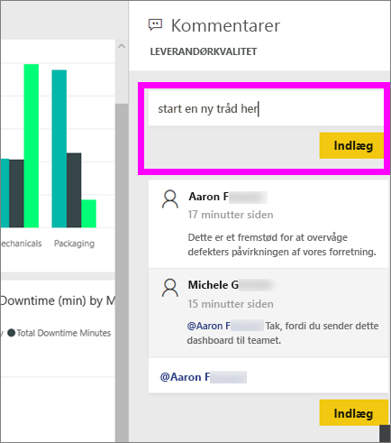
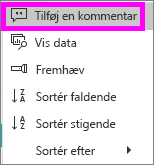
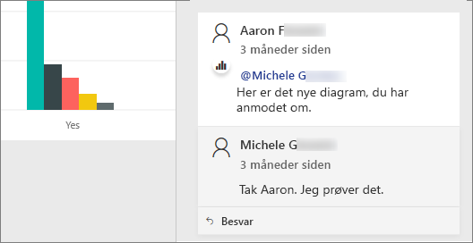

# Tilføj kommentarer til et dashboard eller rapport
Tilføj en kommentar, personlige eller start en samtale om et dashboard eller en rapport med dine kolleger. **Kommentarfunktionen** er bare én af de måder, en *forbruger* kan samarbejde med sine kolleger på. 

## Sådan bruges kommentarfunktionen
Kommentarer kan føjes til et helt dashboard, på individuelle visuelle elementer på et dashboard, på en rapportside og for individuelle visuelle elementer på en rapportside. Tilføj en generel kommentar eller en kommentar, der er rettet mod bestemte kolleger.  

Når du tilføjer en kommentar til en rapport, henter de aktuelle værdier for standardfilter og -udsnit i Power BI. Det betyder, at når du vælger eller svare på en kommentar, siden i rapporten eller rapport kan ændres for at få vist filteret, og valg af udsnit, der var aktive, når du første gang kommentaren blev tilføjet.  

Hvorfor er det vigtigt? Sige, at en kollega anvendes et filter, som afslørede en interessant indsigt, som han vil gerne dele med teamet. Uden at dette filter, der er valgt, kommentaren kan ikke give mening. 

### Føj en generel kommentar til et dashboard eller en rapport
Processerne for at føje kommentarer til et dashboard eller en rapport er ens. I dette eksempel bruger vi et dashboard. 

1. Åbn en Power BI-dashboard eller rapport, og vælg den **kommentarer** ikonet. Herefter åbnes dialogboksen Kommentarer.

    

    Her kan vi se, at opretteren af dashboardet allerede har tilføjet en generel kommentar.  Alle, der har adgang til dette dashboard, kan se denne kommentar.

    

2. Hvis du vil besvare kommentaren, skal du vælge **Besvar**, skrive dit svar og vælge **Send**.  

    

    Power BI sender som standard dit svar til den kollega, der begyndte kommentartråden, i dette tilfælde Aaron F. 

    

 3. Hvis du vil føje en kommentar, ikke der er en del af en eksisterende tråd, skal du angive din kommentar i det øverste tekstfelt.

    

    Kommentarerne til dette dashboard ser nu sådan ud.

    

### Føj en kommentar til et bestemt dashboard eller en rapport
Ud over at tilføje kommentarer til et helt dashboard eller til en hel rapportside, kan du tilføje kommentarer til individuelle dashboardfelter og individuelle visuelle elementer. Processerne, der ligner hinanden, og i dette eksempel bruger vi en rapport.

1. Hold musemarkøren over det visuelle element, og vælg ellipsen (...).    
2. Vælg **Tilføj en kommentar** på rullelisten.

      

3.  Den **kommentarer** åbnes dialogboksen, og de andre visualiseringer på siden, er nedtonet. Dette visuelle element har endnu ikke nogen kommentarer. 

      

4. Skriv din kommentar, og vælg derefter **Post**.

      

    - Side, hvis du vælger en kommentar, der blev foretaget i en visualisering, fremhæves Visualiseringen (se ovenfor) på en rapport.

    - På et dashboard, ikonet  giver mulighed for os, at en kommentar er bundet til et bestemt visuelt element. Kommentarer, der gælder for hele dashboardet har ikke et særligt ikon. At vælge ikonet fremhæves relaterede Visualiseringen på dashboardet.

        

5. Vælg **Luk** for at vende tilbage til dashboardet eller rapporten.

### Få dine kollegers opmærksomhed ved hjælp af @-tegnet
Uanset om du udvikler et dashboard, rapport, felt eller visuelle kommentar, håndtagene dine kollegaer opmærksomhed ved hjælp af den "\@" symbol.  Når du skriver den "\@" symbol, åbner Powerbi en rulleliste, hvor du kan søge efter og Vælg personer i din organisation. Bekræftede navne med "\@"-symbolet foran vises med blå skrift. 

Her er en samtale, jeg har med visualiserings*designeren*. Han bruger symbolet @ for at sikre, at jeg kan se kommentaren. Jeg ved, at denne kommentar er til mig. Når jeg åbne dette appdashboard i Power BI, vælger jeg **Kommentarer** i overskriften. Ruden **Kommentarer** viser vores samtale.

  

## Næste trin
Tilbage til [visualiseringer til forbrugere](end-user-visualizations.md)    
<!--[Select a visualization to open a report](end-user-open-report.md)-->
