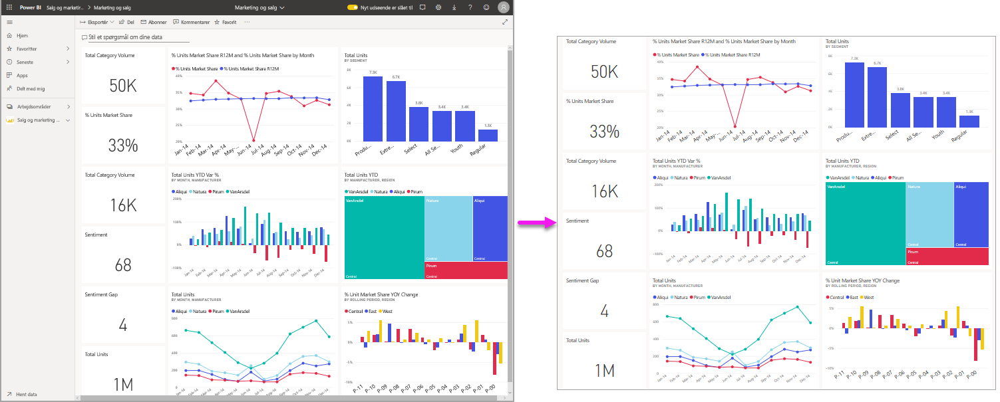
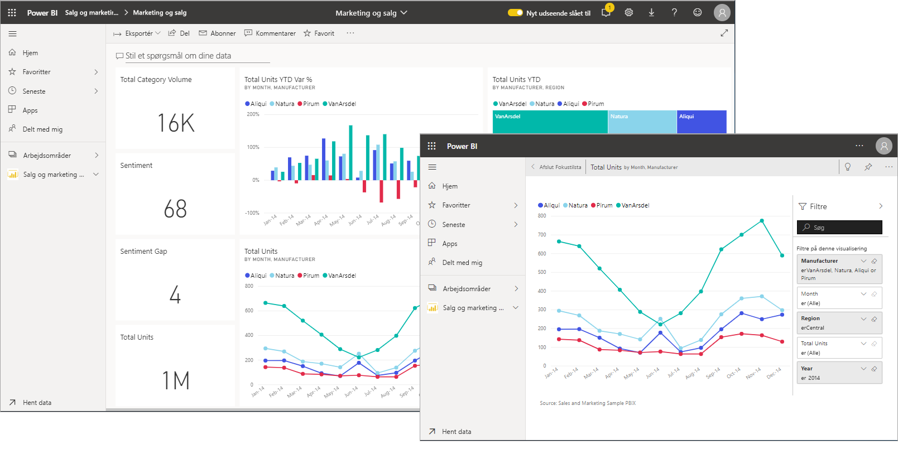
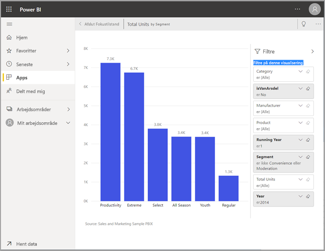

# Vis indhold i flere detaljer: fokustilstand og fuldskærmstilstand

[!INCLUDE [consumer-appliesto-yynn](../includes/consumer-appliesto-yynn.md)]

[!INCLUDE [power-bi-service-new-look-include](../includes/power-bi-service-new-look-include.md)]    

<iframe width="560" height="315" src="https://www.youtube.com/embed/dtdLul6otYE" frameborder="0" allowfullscreen></iframe>

Fokustilstand og fuldskærmstilstand er to forskellige måder at få vist flere detaljer på i dine visualiseringer, rapporter og dashboards.  Den største forskel er, at i fuldskærmsvisningen fjernes alle ruderne omkring dit indhold, mens du i fokustilstand stadig kan interagere med dine visualiseringer. Lad os se nærmere på lighederne og forskellene.  

|Indhold    | Fokustilstand  |Fuldskærmsvisning  |
|---------|---------|----------------------|
|Dashboard     |   Ikke muligt     | ja |
|Rapportside   | Ikke muligt  | ja|
|Rapportvisualisering | ja    | ja |
|Dashboardfelt | ja    | Ikke muligt |
|Windows 10 Mobile | Ikke muligt | Ja |

## Hvad er fuldskærmsvisning

Få vist dit indhold i Power BI-tjenesten (dashboards, rapportsider og visualiseringer) uden forstyrrende menuer og navigationsruder.  Du får en rendyrket og komplet visning af dit indhold med et øjekast – hele tiden. Dette kaldes også tv-tilstand.   

Hvis du bruger Power BI – Mobil, er [fuld skærm tilgængelig for Windows 10 Mobile-apps](./mobile/mobile-windows-10-app-presentation-mode.md). 

Nogle situationer, hvor det giver mening at bruge fuldskærmstilstand, er følgende:

* Præsentation af dit dashboard, din visualisering eller rapport på et møde eller en konference
* Visning på et kontor på en dedikeret stor skærm eller projektor.
* Visning på en lille skærm.
* Gennemse i låst tilstand – du kan røre skærmen eller holde musen over felter uden at åbne underliggende rapporter eller dashboards.

## Hvad er fokustilstand?

***Fokustilstand*** gør det muligt at udvide en visualisering eller et felt for at få vist flere detaljer.  Måske har du et dashboard eller en rapport, der er en smule overfyldt, og du ønsker at zoome ind på kun én visualisering.  Dette er en perfekt brug af fokustilstand.  

I fokustilstand kan en Power BI-*forbruger* interagere med de filtre, der blev anvendt, da visualiseringen blev oprettet.  I Power BI-tjenesten kan du anvende fokustilstand på et dashboardfelt eller en rapportvisualisering.

## Arbejde i fuldskærmstilstand

Fuldskærmstilstand er tilgængelig for dashboards, rapportsider og visualiseringer i rapporter. 

- Hvis du vil åbne et dashboard i fuldskærmsvisning, skal du vælge ikonet for fuld skærm  på den øverste menulinje. 

- Hvis du vil åbne en rapportside i fuldskærmsvisning, skal du vælge **Vis** > **Fuld skærm**.

    

- Hvis du vil se en visualisering i fuldskærmstilstand, skal du først åbne den i fokustilstand og derefter vælge **Vis** > **Fuld skærm**.  

Dit valgte indhold fylder hele skærmen.    Når du er i fuldskærmstilstand, vises en genvejsmenu, når du flytter musen eller markøren. Da fuld skærm er tilgængelig for mange forskellige indholdstyper, er indstillingerne i genvejsmenuen lidt forskellige men umiddelbart forståelige.  Du skal bare pege på et ikon for at få vist en definition.

Menu til dashboards    
    

Menu til rapportsider og visualiseringer i rapporter    
    

  *     
  Brug knappen **Tilbage** for at navigere til den forrige side i browseren. Hvis den forrige side var en Power BI-side, vises den også i fuldskærmsvisning.  Fuldskærmsvisning bevares, indtil du afslutter ved at lukke den.

  *     
  Brug denne knap til at udskrive dit dashboard eller en rapportside i fuldskærmsvisning.

  *     
    Brug knappen **Tilpas til skærm** for at få vist et dashboard i den størst mulige størrelse, uden at der er brug for rullepaneler.  

    

  *        
    Nogle gange er du ligeglad med rullepaneler, men vil have dashboardet til at fylde hele bredden af den tilgængelige plads. Vælg knappen **Tilpas til bredde**.    

    

  *        
    I rapporter i fuldskærmsvisning kan du bruge disse pile til at flytte mellem siderne i rapporten.    
  *      
  Hvis du vil afslutte fuldskærmsvisning, skal du vælge ikonet **Afslut fuld skærm**.

      

## Arbejde i fokustilstand

Fokustilstand er tilgængelig for dashboardfelter og visualiseringer i rapporter. 

- Hvis du vil åbne et dashboardfelt i fokustilstand, skal du pege på et dashboardfelt eller en rapportvisualisering, vælge **Flere indstillinger** (...) og vælge **Åbn i fokustilstand**.

    . 

- Hvis du vil åbne en rapportvisualisering i fokustilstand, skal du pege på visualiseringen og vælge ikonet **fokustilstand**.  

   

Visualiseringen åbnes og fylder hele lærredet. Bemærk, at du stadig har ruden **Filtre**, som du kan bruge til at interagere med visualiseringen. Ruden **Filtre** og navigationsruden kan skjules.

   

     

Udforske yderligere ved at [ændre filtrene](end-user-report-filter.md) og se efter interessante ting i dine data.  

Se nærmere på dataene for at få ny indsigt og svar på spørgsmål. Som *forbruger* kan du ikke tilføje nye filtre, ændre de felter, der bruges i visualiseringerne, eller oprette nye visualiseringer.  Du kan dog interagere med de eksisterende filtre. 

Dine ændringer kan ikke gemmes for et dashboardfelt. For en rapportvisualisering bliver de eventuelle ændringer, du foretager af de eksisterende filtre, dog gemt, når du afslutter Power BI. Hvis du ikke vil have, at dine ændringer huskes i Power BI, skal du vælge **Nulstil til standard**.   

Afslut fokustilstand, og vend tilbage til dashboardet ved at vælge enten  **Afslut fokustilstand** eller **Tilbage til rapport** (i øverste venstre hjørne af visualiseringen).

    

  

## Overvejelser og fejlfinding

* Når du bruger fokustilstand i forbindelse med en visualisering i en rapport, kan du få vist og interagere med alle filtre: Visualiseringsniveau, Sideniveau, Detaljeadgang og Rapportniveau.    
* Når du bruger fokustilstand med en visualisering på et dashboard, kan du kun få vist og redigere filteret Visualiseringsniveau.

## Næste trin

[Få vist indstillinger for rapporter](end-user-report-view.md)