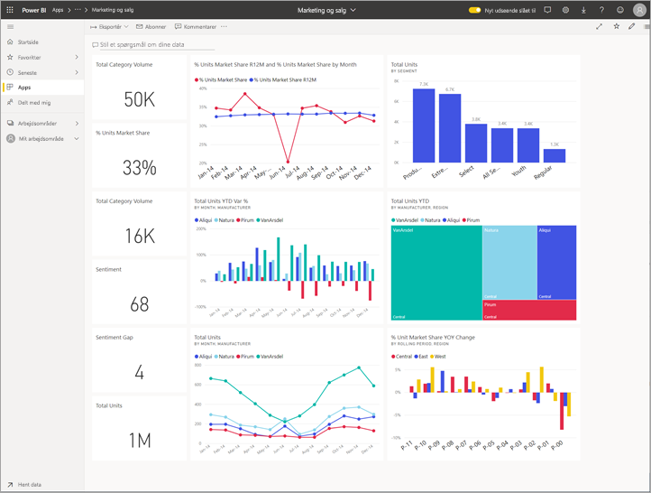
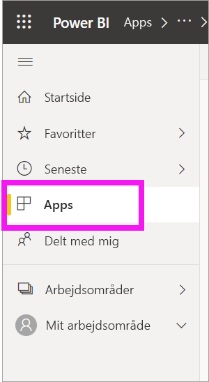
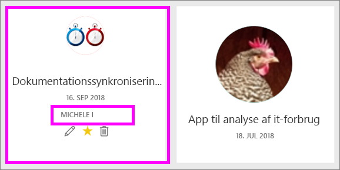
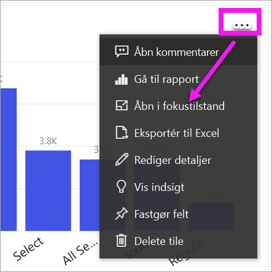
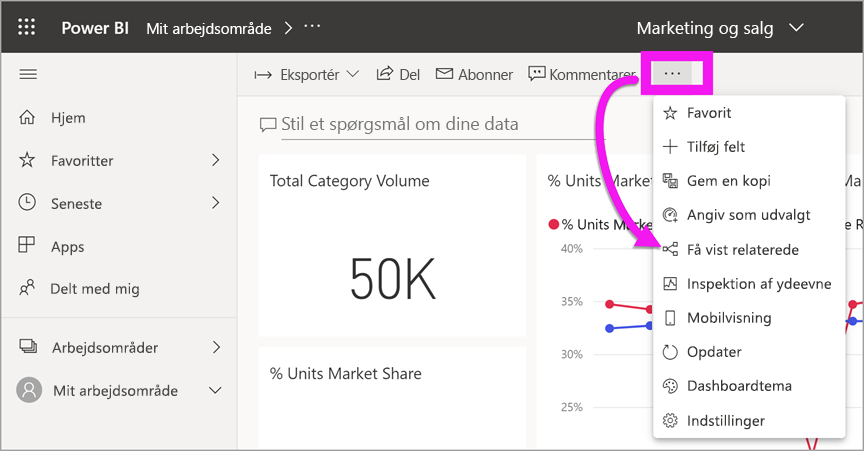
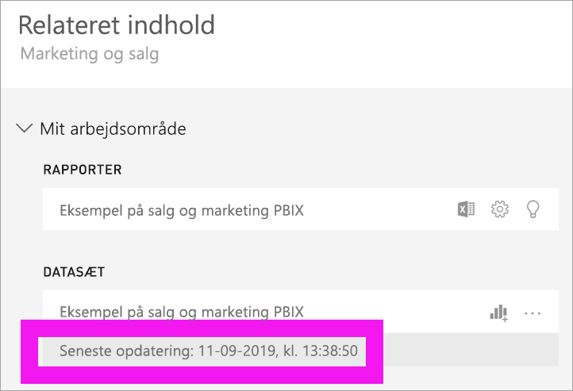

# Dit indhold er opdateret

[!INCLUDE [power-bi-service-new-look-include](../includes/power-bi-service-new-look-include.md)]

Som *forbruger* interagerer du med indhold, der er oprettet af *designere* og delt med dig. Du undrer dig måske over, om indholdet er opdateret, eller du vil måske blot gerne vide, hvornår indholdet senest blev opdateret. Det giver ro i sindet at vide, at du arbejder med det nyeste indhold.  
 

Når du skal træffe beslutninger, skal du være sikker på, at du har de nyeste data. Hvad kan du gøre for at sikre, at du har det nyeste indhold? I de fleste tilfælde skal du slet ikke gøre noget. De apps, der er blevet delt med dig, bliver automatisk opdateret efter en tidsplan, som appdesigneren har defineret. Det samme gælder de dashboards og rapporter, der er delt med dig. Designeren sørger for, at indholdet er opdateret, og det sker enten manuelt eller automatisk efter en tidsplan.  

Hvis du er i tvivl om, hvorvidt dataene er opdateret, skal du kontakte designeren.

## Sådan finder du navnet på designeren eller ejeren

### Dashboard eller rapport

Navnet på ejeren findes på titellinjen i dashboards og rapporter. Vælg navnet på rapporten eller dashboardet for at se yderligere detaljer, herunder **Ejer**.

### Apps

På appskærmen kan du se både navnet på designeren og den dato, hvor appen sidst blev opdateret.  

1. Vælg **Apps** i venstre navigationsrude.

    

2. Hold over appen for at få vist titlen, opdateringsdatoen og navnet på designeren. 

    

### Delt med mig
På skærmen **Delt med mig** kan du se navnet på ejeren af indholdet samt den dato, hvor indholdet sidst blev delt med dig.

 

## Sådan ser du datoen for seneste opdatering
Hvis du vil vide, hvor opdateret indholdet er, kan du finde datoen for seneste opdatering for det meste indhold. 

### Dashboardfelter
For felter i dashboardet kan du se feltet i fokustilstand for at se et tidsstempel for seneste opdatering.

1. Vælg **Flere indstillinger** (...) på et dashboardfelt, og vælg **Åbn i Fokustilstand**.

    

2. Datoen for seneste opdatering vises i øverste højre hjørne. Hvis du ikke kan se datoen, kan du udvide browservinduet. 

    

### Dashboards og rapporter
En anden måde, hvorpå du kan se datoen for seneste opdatering, er ved at vælge **Få vist relaterede**.  **Få vist relaterede** bliver tilgængelig, når du vælger **Flere indstillinger** (…) på den øverste menulinje i Power BI.

I ruden **Relateret indhold** kan du se oplysninger om seneste opdatering for det underliggende datasæt til dashboardet eller rapporten.

## Hvad sker der, hvis en app slettes af designeren?

Hvis en designer sletter en app, fjernes de dashboards og rapporter, der er knyttet til appen, automatisk fra Power BI-arbejdsområdet. De er ikke længere tilgængelige, og appen vises ikke i objektbeholderen Apps eller andre steder på navigationslinjen.

## Abonner for at se ændringer
En anden måde at holde indholdet opdateret på, er at abonnere på en rapport eller et dashboard. I stedet for at logge på for at åbne en rapport eller et dashboard, kan du i Power BI angive, at du vil have tilsendt et snapshot efter din valgte tidsplan.  Du kan få mere at vide om dette i [abonnere på dashboards og rapporter](end-user-subscribe.md).

## Indstil databeskeder
Vil du have besked, hvis dataene ændres over eller under en grænse, du har angivet? [Opret en databesked](end-user-alerts.md).  Det er nemt at holde dig opdateret ved hjælp af databeskeder. Brug databeskeder til at få Power BI til at sende dig en mail, hvis en værdi i en rapport når over eller under en bestemt grænse.  Det kan f.eks. være, hvis lagerbeholdningen af en vare når under 25, eller hvis salget overstiger et mål.  

## Næste trin
[Opret en databesked](end-user-alerts.md)    
[Abonner på dashboards og rapporter](end-user-subscribe.md)    
[Vis relateret indhold](end-user-related.md)    
