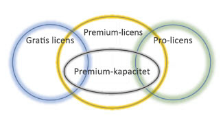
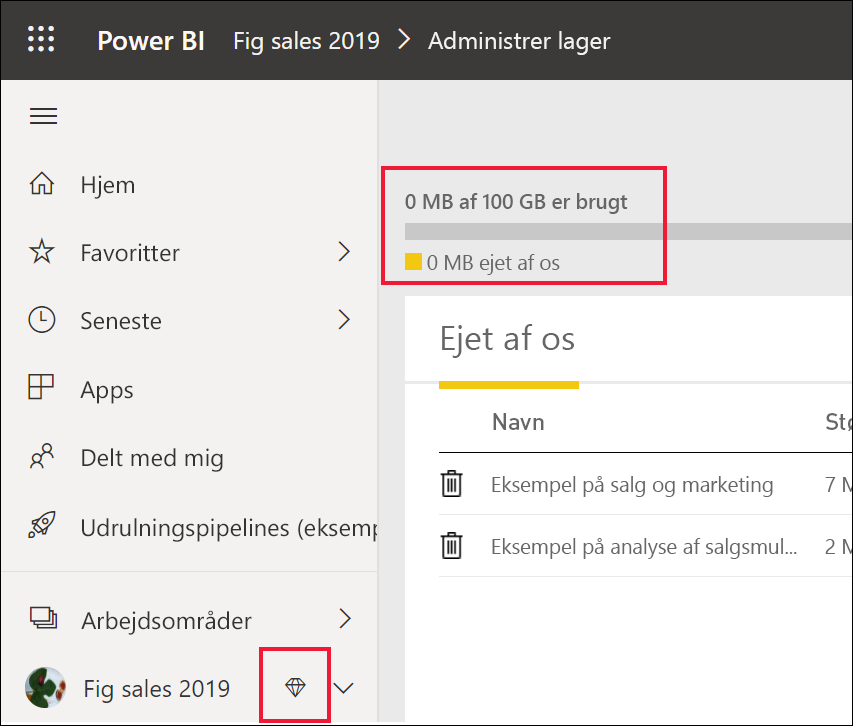

# Typer af Power BI-licenser
Som *forbruger*kan du bruge Power BI-tjenesten til at udforske rapporter og dashboards, så du kan træffe forretningsbeslutninger. Hvis du har brugt Power BI i et stykke tid eller har chattet med dine *designer*kollegaer, har du sandsynligvis opdaget, at nogle funktioner kun virker, hvis du har en bestemt licenstype. 

I denne artikel forklares forskellene mellem licenstyperne og kombinationerne: gratis, Pro, Premium og Premium-kapacitet. Du får også mere at vide om, hvordan du kan finde ud af, hvilken licenskombination du bruger.  

Vi starter med at se på de to licenskategorier – brugerlicenser og organisationslicenser. Vores startpunkt er de standardfunktioner, der er tilgængelige for licenserne. Derefter kigger vi på, hvordan din Power BI-administrator og indholdsejerne kan bruge roller og tilladelser til at ændre standardlicensegenskaberne. 

Hvis din licens tillader det, kan din administrator f.eks. begrænse din mulighed for at foretage dig ting, f.eks. eksport af data, brug af spørgsmål og svar, forespørgsler på naturligt sprog eller publicering på internettet. Når en *rapportdesigner* tildeler indhold til et arbejdsområde, kan de tildele dig til en arbejdsområderolle. Rollerne bestemmer, hvad du kan og ikke kan gøre i dette arbejdsområde. *Designeren* kan justere grænserne for din licens yderligere ved hjælp af tilladelsesindstillinger. Det er med andre ord kompliceret. Denne artikel vil forhåbentlig kaste lidt lys over disse forhold.

## Brugerlicenser
Den første licenstype er en **brugerlicens**. Hver Power BI-tjenestebruger har enten en gratis licens eller en Pro-licens. Visse funktioner er forbeholdt brugere med Pro-licens.  

- **En Power BI Pro-licens** gør det muligt for en bruger at samarbejde med andre Pro-brugere ved at oprette og dele indhold. Det er kun brugere med en Pro-licens, der kan publicere rapporter, abonnere på dashboards og rapporter og samarbejde med kollegaer i arbejdsområder. 

    

    Power BI Pro er en individuel brugerlicens, der giver brugerne mulighed for at læse og interagere med rapporter og dashboards, som andre har publiceret til Power BI-tjenesten. Brugere med denne licenstype kan dele indhold og samarbejde med andre Power BI Pro-brugere. Det er kun brugere med en Power BI Pro-brugerlicens, der kan publicere eller dele indhold med andre brugere eller bruge indhold, der er oprettet af andre, med undtagelse af indhold, der hostes i en [Power BI Premium-kapacitet](#understanding-premium-and-premium-capacity). Pro-licenser bruges typisk af *rapportdesignere* og udviklere. Du kan finde flere oplysninger under [Power BI Premium-kapacitet](#understanding-premium-and-premium-capacity) nedenfor.

- **En separat gratis Power BI-licens**, er, selvom den stadig er effektiv, til de brugere, der lige er startet med Power BI, eller de brugere, der opretter indhold til sig selv. [Tilmeld dig Power BI-tjenesten som enkeltperson](../service-self-service-signup-for-power-bi.md). En gratis separat licens er ikke knyttet til en organisationslicens. 

    En gratis separat brugerlicens er perfekt til nogen, der bruger Microsoft-eksemplerne til at lære Power BI at kende. Brugere med gratis separate licenser kan ikke få vist indhold, der deles med andre, eller dele deres eget indhold med andre Power BI-brugere. 

    

Er du med indtil videre?  OK. Lad os tilføje det næste lag, **Premium-kapacitet**.

## Få en forståelse for Premium og Premium-kapacitet
Premium er en **organisationslicens**. Tænk på den som at tilføje et lag af funktioner og funktionalitet oven på alle Power BI-**brugerlicenserne** i en organisation. 

Når en organisation køber en Premium-licens, tildeler administratoren normalt Pro-licenser til de medarbejdere, der vil oprette og dele indhold. Og administratoren tildeler gratis licenser til alle, der har brug for dette indhold. Pro-brugerne opretter [arbejdsområder](end-user-workspaces.md) og føjer indhold (dashboards, rapporter og apps) til disse arbejdsområder. Pro-brugere kan give andre tilladelse til at samarbejde i disse arbejdsområder ved at bruge en kombination af *kapacitet*, tilladelser og roller. 

Når en organisation køber en Premium-licens, modtager de kapacitet i Power BI-tjenesten, der udelukkende er allokeret til dem. Den er ikke delt. Kapaciteten understøttes af dedikeret hardware, der administreres fuldt ud af Microsoft. Organisationer kan vælge at anvende deres dedikerede kapacitet bredt eller allokere den til bestemte arbejdsområder. Et arbejdsområde i en Premium-kapacitet er et sted, hvor Pro-brugere kan dele og samarbejde med gratis brugere – uden at det er nødvendigt for de gratis brugere at have Pro-konti.  

I en Premium-kapacitet skal indholdsdesignere dog have en Pro-licens. Designerne opretter forbindelse til datakilder og modeldata og opretter rapporter og dashboards, der er pakket som arbejdsområdeapps. Brugere uden en Pro-licens kan stadig få adgang til et arbejdsområde, der er i Power BI Premium, så længe det pågældende indhold befinder sig i en *Premium-kapacitet*, og så længe arbejdsområdets ejer giver dem tilladelse.

I diagrammet nedenfor repræsenterer venstre side de Pro-brugere, der opretter og deler indhold i arbejdsområder.  
- **Arbejdsområde A** er oprettet i en organisation, der ikke har Premium. 

- **Arbejdsområde B** er oprettet i en organisation, der har en Premium-licens, selvom dette bestemte arbejdsområde ikke blev gemt i en Premium-kapacitet. Arbejdsområdet er ikke markeret med et rombeikon.

- **Arbejdsområde C** er oprettet i en organisation, der har en Premium-licens, og blev gemt i en Premium-kapacitet. Dette arbejdsområde er markeret med et rombeikon.  

Power BI Pro-*designeren* kan dele og samarbejde med andre Pro-brugere ved hjælp af et af de tre arbejdsområder. Så længe designeren deler arbejdsområdet med hele organisationen eller tildeler arbejdsområderoller til Pro-brugerne. 

Power BI Pro-*designeren* kan kun dele og samarbejde med gratis brugere ved hjælp af arbejdsområde C. Arbejdsområdet skal være tildelt en Premium-kapacitet, for at gratis brugere kan få adgang til arbejdsområdet. I arbejdsområdet tildeler designeren roller til samarbejdspartnere: *Administrator*, *Medlem*, *Bidragyder* eller *Fremviser*. Din rolle bestemmer, hvilke handlinger du kan udføre i arbejdsområdet. *Forbrugere* i Power BI tildeles normalt rollen *Fremviser*. Hvis du vil vide mere, kan du se [Arbejdsområder for Power BI-forbrugere](end-user-workspaces.md).

## Find ud af, hvilken licens du har
Du kan finde oplysninger om Power BI-licenser på flere måder. 

Først skal du finde ud af, hvilken **bruger**licens, du har.

- Visse versioner af Microsoft Office omfatter en Power BI Pro-licens.  Hvis du vil se, om din version af Office indeholder Power BI, kan du gå til [Office Portal](https://portal.office.com/account) og vælge **Abonnementer**.

    Den første bruger, Pradtanna, har Office 365 E5, som omfatter en Power BI Pro-licens.

    

    Den anden bruger, Zalan, har en gratis Power BI-licens. 

    

Derefter skal du kontrollere, om din konto også har en Premium-licens. Begge brugerne ovenfor kan tilhøre en organisation, der har en Premium-licens.  Lad os se på den anden bruger, Zalan.  

- Vælg **Mit arbejdsområde** i Power BI-tjenesten, og vælg derefter tandhjulsikonet øverst til højre. Vælg **Administrer personligt lager**.

    

    Licenser **pr. bruger**, Pro eller gratis omfatter 10 GB lager i cloudmiljøet, der kan bruges til hosting af Power BI-rapporter eller Excel-projektmapper. Hvis du kan se mere end 10 GB, er du medlem af en organisationskonto med en Premium-licens.

    

    Vær opmærksom på, at Zalans brugerabonnement på Office Portal-siden var til Power BI (gratis). Men da hans organisation købte en Premium-licens i Power BI-tjenesten, er Zalan ikke begrænset til 10 GB lagerplads. Han har 100 GB. Som *forbruger* i en organisation med en Premium-licens, og så længe *designeren* placerer arbejdsområdet i en Premium-kapacitet, har Zalan mulighed for at få vist delt indhold, samarbejde med kolleger, arbejde med apps og meget mere. Omfanget af hans tilladelser angives af hans Power BI-administrator og af indholdsdesigneren. Bemærk, at en Pro-bruger allerede har delt et arbejdsområde med Zalan. Rombeikonet giver ham besked om, at dette arbejdsområde er gemt i en Premium-kapacitet. 

   
## Få mere at vide om arbejdsområderoller
Indtil videre har vi gennemgået licenser pr. bruger, Premium-licenser og Premium-kapacitet. Lad os nu tage et kig på *roller* i arbejdsområdet.

Da dette er en artikel til *forbrugere* af Power BI, har vi følgende scenarie:

-  Du er en *gratis* bruger i en organisation, der har en Power BI Premium-licens. 
- En Power BI Pro-bruger har oprettet en samling dashboards og rapporter og publiceret denne samling som en *app* til hele organisationen.  
- Apps findes i *arbejdsområder*, og arbejdsområdet er i en Premium-kapacitet.    
- Dette app-arbejdsområde har ét dashboard og to rapporter.
- Pro-brugeren har tildelt os rollen **Fremviser**.

### Rollen Fremviser
*Designere* i Power BI kan bruge roller til at administrere, hvem der kan gøre hvad i et arbejdsområde, så teams kan samarbejde. En af disse roller er **Fremviser**. 

Når arbejdsområdet er i en Power BI Premium-kapacitet, kan brugere med rollen som Fremviser få adgang til arbejdsområdet, også selvom de ikke har en Power BI Pro-licens. Men eftersom fremviserrollen ikke kan få adgang til eller eksportere de underliggende data, er det en sikker måde at interagere med dashboards, rapporter og apps på.

> [!TIP]
> Hvis du vil have mere at vide om de andre roller (Administrator, Medlem og Bidragyder), skal du se [Oprettelse af et nyt arbejdsområde](../service-new-workspaces.md).

