<!-- once the sample aps are live, change this so consumers can follow along -->
# Hurtig introduktion: Få mere at vide om egenskaberne for ***forbrugere*** i Power BI
I denne hurtige introduktion får du mere at vide om, hvordan du interagerer med Power BI for at få datadrevet forretningsindsigt. Denne artikel er ikke beregnet som en detaljeret gennemgang, men mere som en hurtig gennemgang af de handlinger, der er tilgængelige for Power BI-**forbrugere**.

Hvis du ikke er tilmeldt Power BI, kan du [tilmelde dig en gratis prøveversion](https://app.powerbi.com/signupredirect?pbi_source=web), før du begynder.

## Forudsætninger
- Power BI-tjeneste (app.powerbi.com) <!-- app from AppSource -->

## Læsevisning
Læsevisning er tilgængelig i Power BI-tjenesten for rapport*forbrugere*. Når en kollega deler en rapport med dig, er Læsevisning den måde, du kan udforske og interagere med rapporten på. 

Den anden rapporttilstand i Power BI-tjenesten er [Redigeringsvisning](../service-interact-with-a-report-in-editing-view.md), som er tilgængelig for rapport*designere*.  

Læsevisning er en effektiv og sikker måde at udforske dine dashboards og rapporter på. Mens du opdeler de dashboards og rapporter, der er delt med dig, forbliver de underliggende datasæt intakte og uændrede. 

I Læsevisning kan du lave tværgående fremhævning og tværgående filtrering af visualiseringer på en side.  Du skal blot fremhæve eller vælge en værdi i ét visuelt element, og straks kan du se dens indvirkning på de andre visuelle elementer. Brug Filterruden til at tilføje og redigere filtre på en rapportside og ændre den måde, hvorpå værdier sorteres i en visualisering. Disse er bare nogle få af egenskaberne for *forbrugere* i Power BI.  Læs videre for at få mere at vide om dem og meget mere.

 
### Få vist en app
I Power BI samles relaterede dashboards og rapporter i *apps* – alt sammen på ét sted.

1. Vælg **Apps**  > **Hent apps**. 
   
     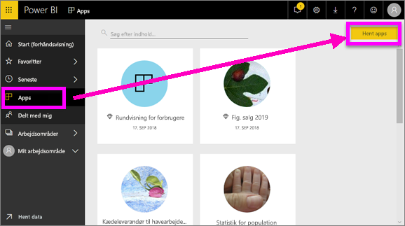
2. I AppSource under **Min organisation** kan du udføre en søgning for at afgrænse resultatet og finde den app, du leder efter.
   
     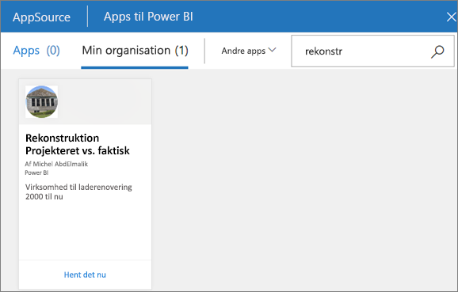
3. Vælg **Hent det nu** for at føje det til objektbeholderen Apps. 

### Få vist et dashboard
Denne app åbnes i et dashboard. Et Power BI-***dashboard*** er en enkelt side, der ofte kaldes et canvas, hvor der bruges visualiseringer til at fortælle en historie. Da det er begrænset til én side, indeholder et dashboard, der er godt designet, kun de vigtigste elementer fra historien.

De visualiseringer, du kan se på dashboardet, kaldes *felter* og er *fastgjort* til dashboardet fra rapporter.

### Abonner på et dashboard (eller en rapport)
Det er ikke nødvendigt at åbne Power BI for at overvåge et dashboard.  Du kan abonnere i stedet for, så Power BI mailer dig et snapshot af det pågældende dashboard iht. en tidsplan, du har angivet. 

.

1. Vælg **Abonner** på den øverste menulinje, eller vælg konvolutikonet .
   
   

3. Brug den gule skyder til at slå abonnementet til og fra.  Alternativt kan du tilføje mailoplysninger. 

    I skærmbilledet nedenfor kan du se, at når du abonnerer på en rapport, abonnerer du rent faktisk på en *rapportside*.  Hvis du vil abonnere på mere end én side i en rapport, skal du vælge **Tilføj et andet abonnement** og vælge en anden side. 
      
   
   
    Opdatering af rapportsiden opdaterer ikke datasættet. Det er kun ejeren af datasættet, der kan opdatere et datasæt manuelt. Hvis du vil søge efter navnet på det eller de underliggende datasæt, skal du vælge **Få vist relaterede** på den øverste menulinje.

### Vis relateret indhold
Ruden **Relateret indhold** viser, hvordan din Power BI-tjenestes indhold – dashboards, rapporter og datasæt – er forbundet. Ruden viser ikke kun relateret indholdet, det gør det også muligt for dig at handle på indholdet og let navigere mellem relateret indhold.

På et dashboard eller i en rapport skal du vælge **Få vist relaterede** på den øverste menulinje.

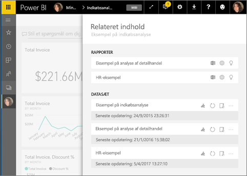

### Brug Spørgsmål og svar til at stille spørgsmål på et naturligt sprog
Den hurtigste måde at få svar ud af dine data på er nogle gange at stille et spørgsmål på et naturligt sprog. Spørgefeltet i Spørgsmål og svar er placeret øverst i dit dashboard. Eksempel: "vis mig antallet af store salgsmuligheder efter salgsfase som en tragt." 

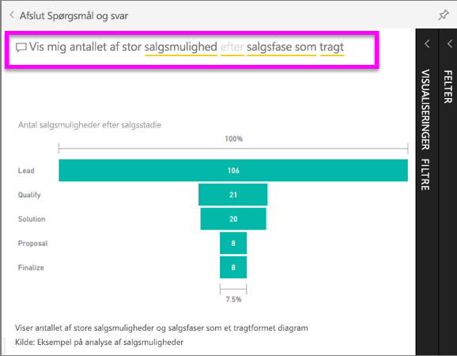

### Gør et dashboard til favorit
Når du gør indhold til en *favorit*, kan du få adgang til det fra navigationslinjen til venstre. Navigationslinjen til venstre er synlig fra næsten alle områder i Power BI. Favoritter er normalt de dashboards, rapportsider og apps, du besøger oftest.

1. Afslut Spørgsmål og svar for at vende tilbage til et dashboard.    
2. Vælg **Favorit** eller ikonet Stjerne  i øverste højre hjørne af Power BI-tjenesten.
   
   

### Åbn og få vist en rapport og rapportsider
En rapport er en eller flere sider med visualiseringer. Rapporter oprettes af Power BI-*rapportdesignere* og [deles med *forbrugere* direkte](end-user-shared-with-me.md) eller som en del af en [app](end-user-apps.md). 

Rapporter kan åbnes fra et dashboard. De fleste dashboardfelter er *fastgjort* fra rapporter. Når du vælger et felt, åbnes den rapport, der blev brugt til at oprette feltet. 

1. Vælg et felt fra et dashboard. I dette eksempel har vi valgt søjlediagramfeltet "Omsætning".

    

2.  Den tilknyttede rapport åbnes. Bemærk, at vi er på siden "Oversigt over omsætning". Dette er rapportsiden, der indeholder det søjlediagram, vi har valgt på dashboardet.

    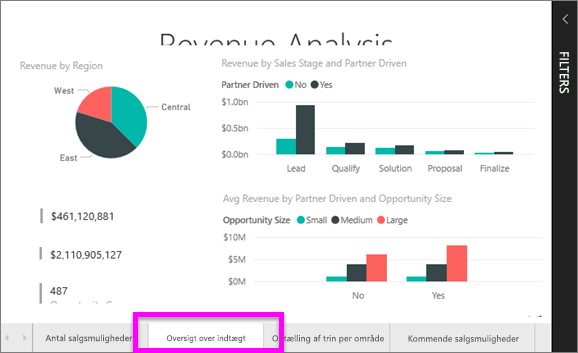

### Tilpas visningsdimensionerne
Rapporter vises på mange forskellige enheder med forskellig skærmstørrelse og størrelsesforhold.  Standardgengivelsen er måske ikke lige det, du ønsker at se på din enhed.  

1. Hvis du vil justere, skal du vælge **Vis** på den øverste menulinje.

    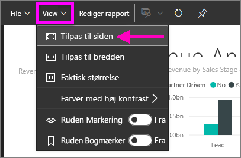

2.  Vælg en af visningsindstillingerne. I dette eksempel har vi valgt **Tilpas til siden**.

        

### Brug ruden Rapportfiltre
Hvis rapportens forfatter har føjet filtre til en side i en rapport, kan du interagere med dem og gemme dine ændringer i rapporten.

1. Vælg ikonet **Filtre** i øverste højre hjørne.
   
     

2. Vælg først en visualisering for at aktivere den. Du får vist alle de filtre, der er anvendt til den pågældende visualisering (Filtre på visualiseringsniveau), på tværs af hele rapportsiden (Filtre på sideniveau) og på tværs af hele rapporten (Filtre på rapportniveau).
   
   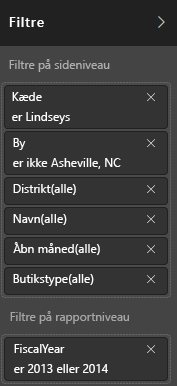

3. Peg på et filter, og udvid det ved at vælge pil ned.
   
   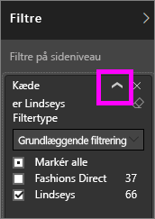

4. Foretag ændringer af filtrene, og se, hvordan de visuelle elementer påvirkes.  
   
     
     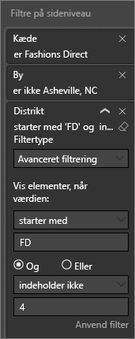

### Se, hvordan alle visualiseringerne på en side er forbundet
Foretag tværgående fremhævning og tværgående filtrering af de relaterede visualiseringer på en side. De visuelle effekter på en enkelt rapportside er alle indbyrdes "forbundet".  Det betyder, at hvis du vælger én eller flere værdier i en visualisering, ændres andre visualiseringer, der bruger den samme værdi, på baggrund af din markering.

> 
### Få vist detaljer på en visualisering
Peg på visuelle elementer for at få vist detaljer

### Sortér en visualisering
Visualiseringer på en rapportside kan sorteres og gemmes sammen med dine anvendte ændringer. 

1. Hold markøren over en visualisering for at aktivere den.    
2. Vælg ellipsen (...) for at åbne sorteringsindstillingerne.

     

###  Åbn **Valgrude**
Du kan nemt navigere mellem visualiseringer på rapportsiden. 

1. Vælg **Vis > ruden Valg** for at åbne ruden Valg. Slå **ruden Valg** Til.

    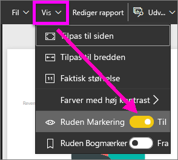

2. Ruden Valg åbnes på dit rapportlærred. Vælg først en visualisering på listen for at aktivere den.

    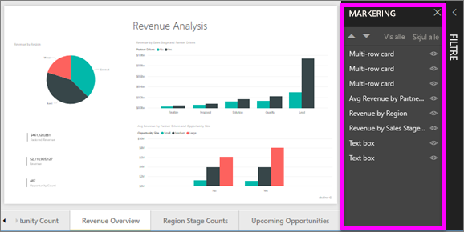

### Zoom ind på individuelle visuelle elementer
Peg på en visuel gengivelse, og vælg ikonet **Fokuseringstilstand**. Når du får vist en visualisering i fokuseringstilstand, udvides den, så den fylder hele rapportlærredet som vist nedenfor.

To display that same visualization without the distraction of menubars, filter pane, and other chrome -- Vælg ikonet **Fuld skærm** i den øverste menulinje  for at vise den samme visualisering uden forstyrrende menulinjer, filterruder og andet.

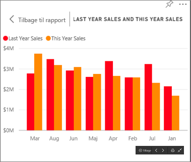

### Få vist de data, der bruges til at oprette en visualisering
En Power BI-visualisering oprettes vha. data fra underliggende datasæt. Hvis du vil se bag kulisserne, kan du i Power BI *få vist* de data, der bruges til at oprette visualiseringen. Når du vælger **Vis data**, vises dataene under (eller ud for) visualiseringen i Power BI.

1. Åbn en rapport i Power BI-tjenesten, og vælg en visualisering.  
2. Hvis du vil have vist de underliggende data for visualiseringen, skal du vælge ellipsen (...) og vælge **Vis data**.
   
   

Dette har været et hurtigt overblik over nogle af de ting, **forbrugere** kan anvende Power BI-tjenesten til.  

## Fjern ressourcer
- Hvis du har oprettet forbindelse til en app, skal du på navigationslinjen til venstre vælge **Apps** for at åbne indholdslisten Apps. Hold markøren over den app, du vil slette, og vælg affaldsspandsikonet.

- Hvis du har importeret eller oprettet forbindelse til en eksempelrapport i Power BI skal du åbne **Mit arbejdsområde** på navigationslinjen til venstre. Ved hjælp af fanerne øverst skal du finde dashboardet, rapporten og datasættet og vælge affaldsspandsikonet for hver enkelt.

## Næste trin

