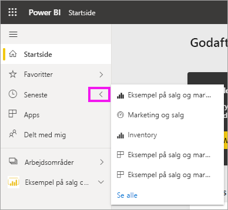

# **Seneste** indhold i Power BI-tjenesten

[!INCLUDE[consumer-appliesto-yyny](../includes/consumer-appliesto-yyny.md)]

Seneste indhold er de seneste elementer, du har fået vist i Power BI-tjenesten, op til maksimalt 20 elementer.  Dette omfatter: dashboards, rapporter, apps og projektmapper.

Se Amanda demonstrere, hvordan indholdslisterne for **Seneste** udfyldes i Power BI-tjenesten, og følg derefter den trinvise vejledning under videoen for at prøve det selv.

<iframe width="560" height="315" src="https://www.youtube.com/embed/G26dr2PsEpk" frameborder="0" allowfullscreen></iframe>

> [!NOTE]
> I denne video bruges en ældre version af Power BI-tjenesten.

## Vis nyligt indhold
Hvis du vil se de fem elementer, du senest har besøgt, skal du på venstre navigationslinje vælge pilen til højre for **Seneste**.  Herfra kan du vælge nyligt indhold for at åbne. Kun de fem seneste elementer vises på listen.

Hvis du har mere end fem elementer, du har besøgt for nylig, skal du vælge **Se alle** for at åbne skærmen Seneste. Du kan også vælge **Seneste**, eller ikonet Seneste  på venstre navigationslinje.

## Tilgængelige handlinger på indholdslisten **Seneste**
De handlinger, der er tilgængelige for dig, afhænger af de indstillinger, *designeren* af indholdet har tildelt. Nogle af dine muligheder kan omfatte:
* Vælg stjerneikonet for at [markere et dashboard, en rapport eller et program som favoritter](end-user-favorite.md) .
* Nogle dashboards og rapporter kan deles igen  .
* [Åbn rapporten i Excel](end-user-export.md)  
* [Vis indsigt](end-user-insights.md), som Power BI finder i dataene .
* Hvis dine lister bliver lange, kan du desuden [bruge søgefeltet og sortering til at finde det, du har brug for](end-user-search-sort.md). Hvis du vil finde ud af, om en kolonne kan sorteres, skal du holde over den for at se, om der vises en pil. Hvis du i dette eksempel holder over **Seneste adgang** vises der en pil – dit seneste indhold kan sorteres efter adgangsdato. 

    

## De næste trin
[Power BI-tjenesteapps](end-user-apps.md)

Har du flere spørgsmål? [Prøv at spørge Power BI-community'et](https://community.powerbi.com/)

