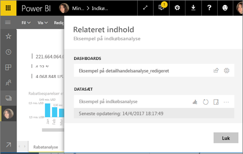

# Få vist relateret indhold i Power BI-tjenesten
Ruden **Relateret indhold** viser, hvordan din Power BI-tjenestes indhold – dashboards, rapporter og datasæt – er forbundet. Ruden Relateret indhold er også startstedet til at udføre en handling. Herfra kan du opdatere, omdøbe, generere indsigt og meget mere. Vælg en relateret rapport eller dashboard, så åbnes den i dit Power BI-arbejdsområde.   

I Power BI er rapporter baseret på datasæt, rapportens visualiseringer er fastgjort til dashboards, og dashboardets visualiseringer linker tilbage til rapporter. Men hvordan ved du, hvilke dashboards der er vært for visualiseringer fra din marketingrapport? Og hvordan kan du finde disse dashboards? Bruger dashboardet Indkøb visualiseringer fra mere end ét datasæt? Hvis det er tilfældet, hvad hedder de så, og hvordan kan du åbne og redigere dem? Bruges dit HR-datasæt overhovedet i nogen rapporter eller på nogen dashboards? Eller kan det flyttes, uden at det medfører brudte links? Denne slags spørgsmål kan du få svar i ruden **Relateret indhold**.  Ruden viser ikke kun relateret indhold, den gør det også muligt for dig at udføre handlinger på indholdet og let navigere mellem relateret indhold.

> [!NOTE]
> Funktionen Relateret indhold virker ikke med streamingdatasæt.
> 
> 

## Få vist relateret indhold for et dashboard
Se Will få vist relateret indhold for et dashboard. Følg derefter de trinvise instruktioner under videoen for selv at afprøve det med datasættet Eksempel på indkøbsanalyse.

<iframe width="560" height="315" src="https://www.youtube.com/embed/B2vd4MQrz4M#t=3m05s" frameborder="0" allowfullscreen></iframe>

Du skal som minimum bruge *visningstilladelser* til et dashboard for at åbne ruden **Relateret indhold**. I dette eksempel bruger vi [eksemplet Indkøbsanalyse](../sample-procurement.md).

**Metode 1**

I et arbejdsområde skal du vælge fanen **Dashboards** og derefter vælge ikonet **Få vist relaterede** .

 

**Metode 2**

Mens du har et dashboard åbent, skal du vælge    øverst i menulinjen.

Ruden **Relateret indhold** åbnes. Den viser alle de rapporter, der har visualiseringer, der er fastgjort til dashboardet, og deres tilknyttede datasæt. Til dette dashboard er der visualiseringer, der er fastgjort fra tre forskellige rapporter, og disse rapporter er baseret på tre forskellige datasæt.

Her kan du handle direkte på det relaterede indhold.  Vælg f.eks. et rapportnavn for at åbne det.  For en angivet rapport skal du vælge et ikon for at [analysere i Excel](../service-analyze-in-excel.md), [omdøbe](../service-rename.md) eller [få indsigt](end-user-insights.md). For et datasæt skal du vælge et ikon for at [oprette en ny rapport](../service-report-create-new.md), [opdatere](../refresh-data.md), omdøbe, [analysere i Excel](../service-analyze-in-excel.md), [få indsigt](end-user-insights.md) eller åbne vinduet **Indstillinger** for datasættet.  

## Få vist relateret indhold for en rapport
Du skal som minimum bruge *visningstilladelser* til en rapport for at åbne ruden **Relateret indhold**. I dette eksempel bruger vi [eksemplet Indkøbsanalyse](../sample-procurement.md).

**Metode 1**

I et arbejdsområde skal du vælge fanen **Rapporter** og derefter vælge ikonet **Få vist relaterede** .

 

**Metode 2**

Åbn rapporten i [Læsevisning](end-user-reading-view.md), og vælg  i den øverste menulinje.

Ruden **Relateret indhold** åbnes. Den viser det tilknyttede datasæt og alle dashboards, der har mindst ét felt, der er fastgjort fra rapporten. Til denne rapport er der visualiseringer, der er fastgjort til to forskellige dashboards.

Her kan du handle direkte på det relaterede indhold.  Vælg f.eks. et dashboardnavn for at åbne det.  For alle dashboards på listen skal du vælge et ikon for at [dele dashboardet med andre](../service-share-dashboards.md) eller for at åbne vinduet **Indstillinger** for dashboardet. For datasættet skal du vælge et ikon for at [oprette en ny rapport](../service-report-create-new.md), [opdatere](../refresh-data.md), omdøbe, [analysere i Excel](../service-analyze-in-excel.md), [få indsigt](end-user-insights.md) eller åbne vinduet **Indstillinger** for datasættet.  

## Få vist relateret indhold for et datasæt
Du skal som minimum bruge *visningstilladelser* til et datasæt for at åbne ruden **Relateret indhold**. I dette eksempel bruger vi [eksemplet Indkøbsanalyse](../sample-procurement.md).

I et arbejdsområde skal du vælge fanen **Datasæt** og finde ikonet **Få vist relaterede** .

Vælg ikonet for at åbne ruden **Relateret indhold**.

Her kan du handle direkte på det relaterede indhold. Vælg f.eks. et dashboard- eller rapportnavn for at åbne det.  For alle dashboards på listen skal du vælge et ikon for at [dele dashboardet med andre](../service-share-dashboards.md) eller for at åbne vinduet **Indstillinger** for dashboardet. For en rapport skal du vælge ikonet for at [analysere i Excel](../service-analyze-in-excel.md), [omdøbe](../service-rename.md) eller [få indsigt](end-user-insights.md).  

## Begrænsninger og fejlfinding
* Hvis du ikke kan se "Få vist relaterede", skal du i stedet kigget efter . Vælg ikonet for at åbne ruden **Relateret indhold**.
* Hvis du vil åbne Relateret indhold for en rapport, skal du være i [Læsevisning](end-user-reading-view.md).
* Funktionen Relateret indhold fungerer ikke til streaming af datasæt.

## Næste trin
* [Introduktion til Power BI-tjenesten](../service-get-started.md)
* Har du flere spørgsmål? [Prøv at spørge Power BI-community'et](http://community.powerbi.com/)

