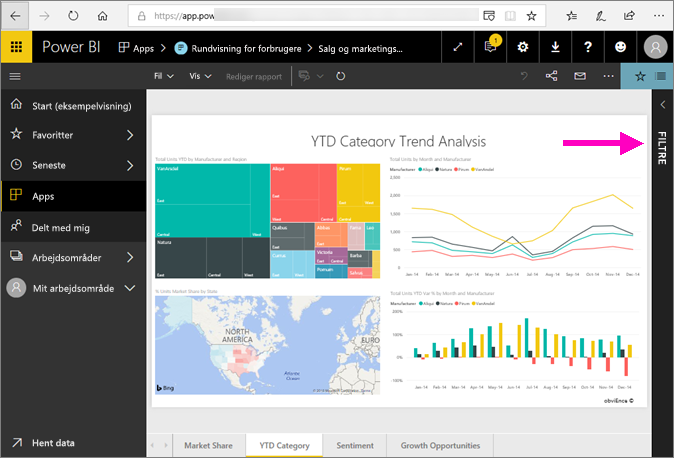
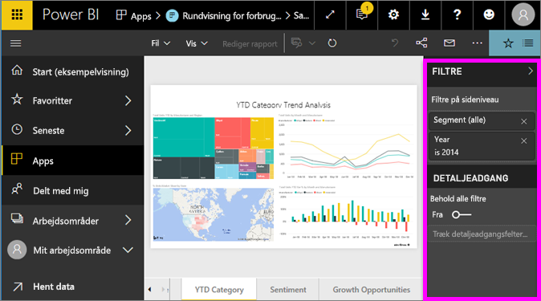
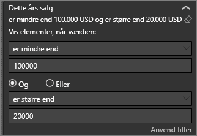

# Få en præsentation af ruden Rapportfiltre
I denne artikel ser vi nærmere på ruden Filtre i rapporter i Power BI-tjenesten.

Der er mange forskellige måder at filtrere data på i Power BI, og vi anbefaler, at du først læser [Om filtre og fremhævning](../power-bi-reports-filters-and-highlighting.md).

## Arbejde med ruden Filtre i rapporter
Når en kollega deler en rapport med dig, skal du søge efter ruden **Filtre**. Nogle gange er den skjult langs højre kant af rapporten. Vælg den for at udvide den.   

Ruden Filtre indeholder filtre, der er føjet til rapporten af rapport*designeren*. *Forbrugere* som dig selv, kan arbejde med filtrene og gemme deres ændringer, men de kan ikke føje nye filtre til rapporten. På skærmbilledet ovenfor har designeren f.eks. tilføjet to filtre på sideniveau: Segment og År. Du kan interagere og ændre filtrene, men du kan ikke tilføje et tredje filter på sideniveau.

I Power BI-tjenesten gemmes de ændringer, du foretager i ruden Filtre, sammen med rapporten og overføres til mobilversionen af rapporten. Du kan nulstille ruden Filtre til designerens standardindstilling ved at vælge **Nulstil til standard** på den øverste menulinje.     

## Åbning af ruden Filtre
Når en rapport er åbnet, vises ruden Filtre i højre side af rapportcanvasset. Hvis du ikke kan se ruden, skal du vælge pilen i øverste højre hjørne for at udvide den.  

I dette eksempel har vi valgt en visualisering, der indeholder seks filtre. Der er også filtre på rapportsiden. De er angivet under overskriften **Filtre på sideniveau**. Der er ét [detaljeadgangsfilter](../power-bi-report-add-filter.md) og et filter for hele rapporten:  **FiscalYear** er 2013 eller 2014.

Ordet **Alle** er vist ud for nogle af filtrene, og det betyder, at alle værdier er inkluderet i filteret.  På skærmbilledet ovenfor viser **Chain(All)** f.eks., at denne rapportside inkluderer data om alle butikskæderne.  På den anden side viser filteret på rapportniveau for **Regnskabsåret er 2013 eller 2014**, at rapporten kun indeholder data for regnskabsårene 2013 og 2014.

Alle, der får vist denne rapport, kan arbejde med disse filtre.

- Søg i filtre for side, visualisering, rapport og detaljeadgang for at finde og vælge den ønskede værdi. 

    

- Få vist oplysninger om filtret ved at pege på det med musen, og vælg pilen ud for filteret.
  
   
* Skift filtret. Du kan f.eks. ændre **Lindseys** til **Fashions Direct**.
  
     

* Nulstil filtrene til den oprindelige tilstand ved at vælge **Nulstil til standard** på den øverste menulinje.    
    
    
* Slet filtret ved at vælge **x** ud for filternavnet.
  
    

  Sletning af et filter, fjerner det fra listen, men det sletter ikke dataene i rapporten.  Hvis du f.eks. sletter filtret **FiscalYear is 2013 or 2014**, bevares dataene for de to regnskabsår i rapporten, men rapporten filtreres ikke længere til kun at vise 2013 og 2014. Den viser alle de regnskabsår, som dataene indeholder.  Når du sletter filteret, kan du dog ikke redigere det igen, da det er fjernet fra listen. Det er bedre at fjerne filteret ved at vælge viskelæderikonet .
  
  

## Ryd et filter
 Vælg viskelæderikonet i den avancerede eller grundlæggende filtreringstilstand   for at fjerne filteret. 

## Filtertyper: filtre for tekstfelter
### Listetilstand
Når du markerer et afkrydsningsfelt, vælger eller fravælger du værdien. Afkrydsningsfeltet **Alle** kan bruges til at slå tilstanden for alle afkrydsningsfelterne til eller fra. Afkrydsningsfelterne repræsenterer alle de værdier, der er tilgængelige for det pågældende felt.  Når du justerer filteret, opdateres afstemningen, så den afspejler dine valg. 

Bemærk, hvordan der nu står "is Mar, Apr or May" for afstemningen.

### Avanceret tilstand
Vælg **Avanceret filtrering** for at skifte til avanceret tilstand. Brug kontrolelementerne på rullelisten og tekstfelterne til at identificere, hvilke felter der skal inkluderes. Ved at vælge mellem **Og** og **Eller** kan du udvikle komplekse filterudtryk. Vælg knappen **Anvend filter**, når du har angivet de ønskede værdier.  

## Filtertyper: filtre for numeriske felter
### Listetilstand
Hvis værdierne er begrænsede, vises der en liste, når du vælger feltnavnet.  Se under **Filtre for tekstfelter** &gt; **Listevisning** ovenfor for at få hjælp til at bruge afkrydsningsfelterne.   

### Avanceret tilstand
Hvis værdierne er uafgrænsede eller repræsenterer et interval, åbnes den avancerede filtertilstand, når du vælger feltnavnet. Brug rullelisten og tekstfelterne til at angive et interval af værdier, du vil have vist. 

Ved at vælge mellem **Og** og **Eller** kan du udvikle komplekse filterudtryk. Vælg knappen **Anvend filter**, når du har angivet de ønskede værdier.

## Filtertyper: dato og klokkeslæt
### Listetilstand
Hvis værdierne er begrænsede, vises der en liste, når du vælger feltnavnet.  Se under **Filtre for tekstfelter** &gt; **Listevisning** ovenfor for at få hjælp til at bruge afkrydsningsfelterne.   

### Avanceret tilstand
Hvis feltværdierne repræsenterer en dato eller et klokkeslæt, kan du angive et start/sluttidspunkt, når du bruger filtrene Dato/Klokkeslæt.  

## Næste trin
[Få mere at vide om, hvordan og hvorfor visuals krydsfiltrerer og krydsfremhæver hinanden på en rapportside](end-user-interactions.md)