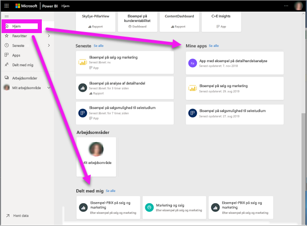
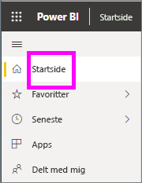
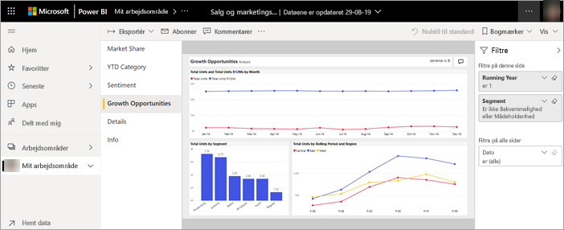
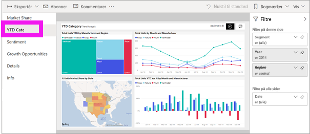
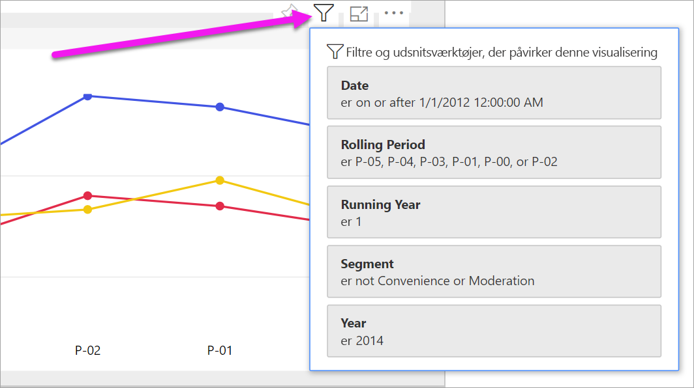
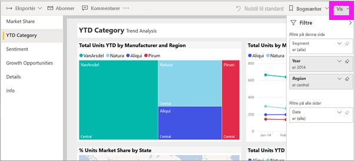
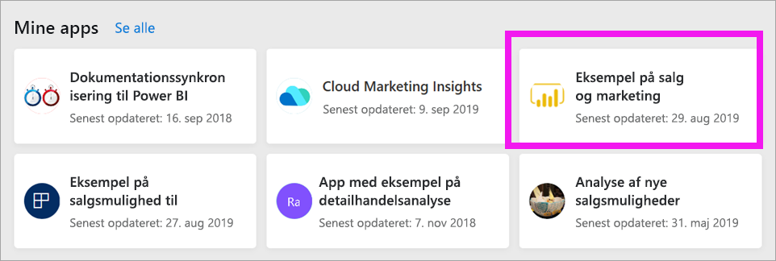
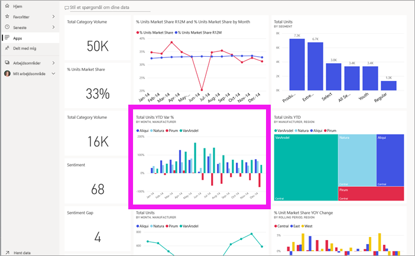
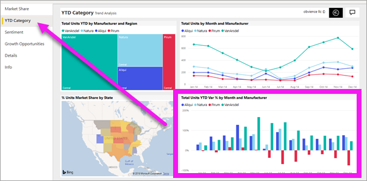

# Få vist en rapport i Power BI-tjenesten for *forbrugere*

[!INCLUDE [power-bi-service-new-look-include](../includes/power-bi-service-new-look-include.md)]

En rapport er en eller flere sider med visualiseringer. Rapporter oprettes af Power BI-*designere* og [deles med *forbrugere* direkte](end-user-shared-with-me.md) eller som en del af en [app](end-user-apps.md). 

Der er mange forskellige måder at åbne en rapport på. Her kan du se to af dem: Åbn fra startsiden, og åbn fra et dashboard. 

<!-- add art-->

## Åbn en rapport fra startsiden i Power BI
Lad os åbne en rapport, der er delt med dig direkte, og derefter åbne en rapport, der blev delt som en del af en app.

   

### Åbn en rapport, der er delt med dig
Power BI-*designere* kan dele en individuel rapport direkte med dig via et link i en mail eller ved at tilføje den automatisk. Indhold, der deles på denne måde, vises i objektbeholderen **Delt med mig** i navigationsruden og i afsnittet **Delt med mig** på lærredet Start.

1. Åbn Power BI-tjenesten (app.powerbi.com).

2. Vælg **Start** i navigationsruden for at få vist lærredet Start.  

   
   
3. Rul ned, indtil du ser **Delt med mig**. Kig efter rapportikonet . På dette skærmbillede har vi ét dashboard og én rapport ved navn*Sales and Marketing sample.* 
   
   

4. Du skal blot vælge *rapportkortet* for at åbne rapporten.

   

5. Bemærk fanerne til venstre.  Hver fane repræsenterer en *side* i rapporten. Siden med *Growth Opportunity* er i øjeblikket åben. Vælg fanen *YTD Category* for at åbne denne rapportside i stedet for. 

   

6. Læg mærke til ruden **Filtre** langs højre side. De filtre, der er anvendt på denne rapportside eller i hele rapporten, vises her.

7. Når du holder over en rapportvisualisering, vises flere ikoner og **Flere indstillinger** (...). Hvis du vil se de filtre, der er anvendt på en bestemt visualisering, skal du vælge filterikonet. Her har vi valgt filterikonet for kurvediagrammet *Total units by rolling period and region*.

   

6. Lige nu får vi vist hele rapportsiden. Hvis du vil ændre visningen af siden (zoom), skal du vælge rullemenuen Vis i øverste højre hjørne og vælge **Faktisk størrelse**.

   

   

### Åbn en rapport, der er en del af en app
Hvis du har modtaget apps fra kolleger eller fra AppSource, er disse apps tilgængelige via Start og via objektbeholderen **Apps** i navigationsruden. En [app](end-user-apps.md) er et bundt af dashboards og rapporter.

### Forudsætninger
Hvis du vil følge med, skal du downloade appen Sales & Marketing.
1. Gå til appsource.microsoft.com i din browser.
1. Søg efter "Sales and marketing" og vælg **Microsoft Sample - Sales & Marketing**.
1. Vælg **Hent det nu** > **Fortsæt** > **Installér** for at installere appen i din objektbeholder til apps. 

Du kan åbne appen fra din objektbeholder til apps eller fra startsiden.
1. Gå tilbage til Start ved at vælge **Start** i navigationsruden.

7. Rul ned, indtil du ser **Mine apps**.

   

8. Vælg din nye app Sales & Marketing for at åbne den. Afhængigt af de indstillinger der er angivet af app*designeren*, åbner appen enten et dashboard eller en rapport. Denne app åbnes i et dashboard.  

## Åbn en rapport fra et dashboard
Rapporter kan åbnes fra et dashboard. De fleste [dashboardfelter](end-user-tiles.md) er *fastgjort* fra rapporter. Når du vælger et felt, åbnes den rapport, der blev brugt til at oprette feltet. 

1. Vælg et felt fra dashboardet. I dette eksempel har vi valgt søjlediagramfeltet "Enheder i alt ÅTD...".

    

2.  Den tilknyttede rapport åbnes. Bemærk, at vi er på siden "ÅTD-kategori". Dette er rapportsiden, der indeholder det søjlediagram, vi har valgt på dashboardet.

    

> [!NOTE]
> Det er ikke alle felter, der fører til en rapport. Hvis du vælger et felt, der er [oprettet med spørgsmål og svar](end-user-q-and-a.md), så åbnes skærmbilledet spørgsmål og svar. Hvis du vælger et felt, der er [oprettet ved hjælp af dashboardets widget **Tilføj felt**](../service-dashboard-add-widget.md), kan der ske flere ting: En video kan blive afspillet, et websted åbnet m.m.  

##  Der er stadig flere måder at åbne en rapport
Når du bliver mere fortrolig med at navigere i Power BI-tjenesten, finder du ud af, hvilke arbejdsprocesser der fungerer bedst for dig. Der er et par enkelte andre måder at få adgang til rapporter på:
- Via navigationsruden ved hjælp af **Favoritter** og **Seneste**    
- Brug [Få vist relaterede](end-user-related.md)    
- Via en mail, når nogen [deler med dig](../service-share-reports.md), eller du [angiver en advarsel](end-user-alerts.md)    
- Fra dit [Meddelelsescenter](end-user-notification-center.md)    
- Fra et arbejdsområde
- og meget mere

## Næste trin
[Åbn og få vist et dashboard](end-user-dashboard-open.md)    
[Rapportfiltre](end-user-report-filter.md)

