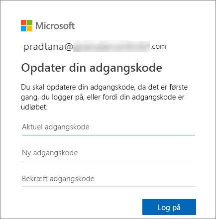
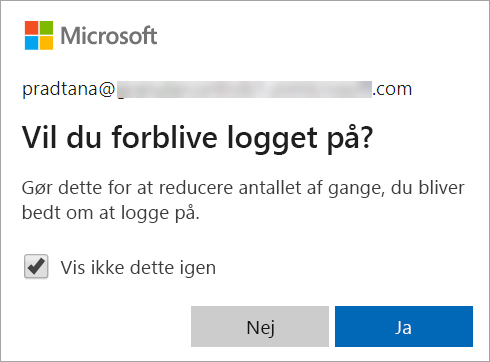
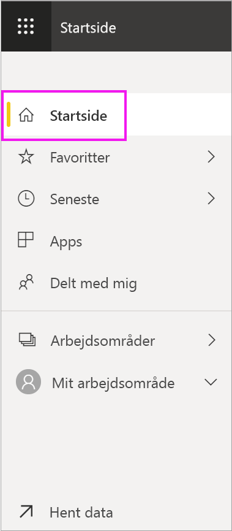
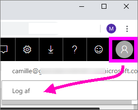

# Log på Power BI-tjenesten

[!INCLUDE[consumer-appliesto-yyny](../includes/consumer-appliesto-yyny.md)]

## Power BI-konti
Du skal have en konto, før du kan logge på Power BI. Du kan få en Power BI-konto på to måder. Den første er, når din virksomhed køber Power BI-licenser til sine medarbejdere. Den anden er, når enkeltpersoner tilmelder sig gratis prøveversioner eller personlige licenser. Denne artikel omhandler det første scenarie.

## Log på for første gang

### Trin 1: Åbn en browser
Power BI-tjenesten kører i en browser.  Så trin 1 er at åbne din foretrukne browser og skrive **app.powerbi.com**.

### Trin 2: Skriv din mailadresse
Første gang, du logger på, bliver du bedt om at angive din mailadresse.  Denne mailadresse er den arbejds- eller skolekonto, der blev brugt under tilmeldingen til Power BI.  

Se efter en mail fra din Power BI-administrator i din indbakke. De fleste administratorer sender dig en velkomstmail, som indeholder en midlertidig adgangskode. Brug denne mailkonto til at logge på. 

 
### Trin 3: Opret en ny adgangskode
Hvis Power BI-administratoren har sendt dig en midlertidig adgangskode, skal du angive den i feltet **Nuværende adgangskode**. Hvis du ikke har modtaget nogen adgangskode i en mail, skal du kontakte Power BI-administratoren.

Hvis du vil have, at Power BI skal huske dine legitimationsoplysninger, skal du vælge **Ja**. 

### Trin 4: Gennemse landingssiden Hjem
Power BI åbner landingssiden **Hjem**, første gang du logger på. Hvis **Hjem** ikke åbnes, skal du vælge den i navigationsruden. 

Du kan se alt det indhold, du har tilladelse til at bruge, på siden Hjem. I første omgang er der måske ikke så meget indhold, men bare rolig, det ændres, i takt med at du begynder at bruge Power BI sammen med dine kolleger. 

Hvis du ikke vil have Power BI til at åbne siden Hjem, kan du [angive et **udvalgt** dashboard eller en udvalgt rapport](end-user-featured.md), der åbnes i stedet. 

## Sikker interaktion med indhold
Som ***forbruger*** kan andre dele indhold med dig, og du interagerer med det pågældende indhold for at udforske dataene og træffe forretningsbeslutninger.  Du behøver ikke bekymre dig, når du filtrerer, laver udsnit, abonnerer, eksporter og tilpasser størrelsen – dit arbejde påvirker ikke det underliggende datasæt eller det oprindelige delte indhold (dashboards og rapporter). Power BI er et sikkert område til at udforske og eksperimentere. Det betyder ikke, at du ikke kan gemme dine ændringer. Det kan du. Men disse ændringer påvirker kun **din** visning af indholdet. Og det er lige så let som at klikke på en knap at vende tilbage til den oprindelige standardvisning.

## Log af Power BI-tjenesten
Når du lukker eller logger af Power BI, gemmes dine ændringer, så du kan fortsætte, hvor du slap.

Du lukker Power BI ved blot at lukke den browserfane, du arbejder under. 

 

Hvis du deler en computer, anbefaler vi, at du logger af, hver gang du lukker Power BI.  Hvis du vil logge af, skal du vælge dit profilbillede i øverste højre hjørne og vælge **Log af**. Ellers skal du lukke browserfanen, når du er færdig.

 

## Fejlfinding og overvejelser
- Hvis du har tilmeldt dig Power BI som enkeltperson, skal du logge på med den mailadresse, du brugte til tilmeldingen.

- Nogle personer bruger Power BI med mere end én konto. Hvis det er tilfældet, bliver du bedt om at vælge en konto på en liste, når du logger på. 

## Næste trin
[Få vist en Power BI-app](end-user-app-view.md)
