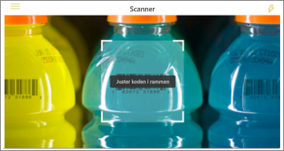
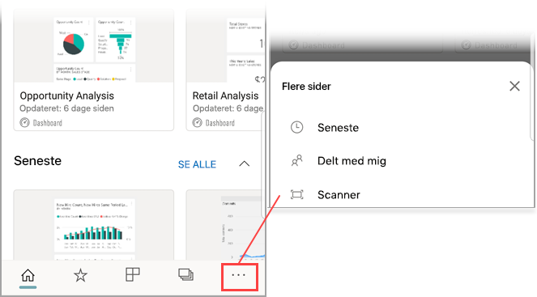

# Scan en stregkode med din iPhone fra Power BI-mobilappen
Scan stregkoder i den virkelige verden for at gå direkte til filtrerede BI-oplysninger i Power BI-mobilappen.

Lad os sige, at en kollegaer har [mærket et stregkodefelt i en rapport i Power BI Desktop](../../desktop-mobile-barcodes.md) og delt rapporten med dig. 

Når du scanner en stregkode for produktet med scanneren i Power BI-appen på din iPhone, får du vist rapporten (eller listen over rapporter) med denne stregkode. Du kan åbne denne rapport på din iPhone, filtreret til denne stregkode.

## Scan en stregkode med Power BI-scanneren
1. Åbn hovedmenuen for navigering i Power BI-mobilappen  øverst til venstre. 
2. Rul ned til **Scanner**, og vælg den. 
   
    
3. Hvis kameraet ikke er aktiveret, skal du godkende Power BI-appen for at bruge kameraet. Dette er en engangsgodkendelse. 
4. Ret scanneren mod en stregkode på et produkt. 
   
    Du kan se en liste over rapporter, der er knyttet til denne stregkode.
5. Tryk på navnet på rapporten for at åbne rapporten på din iPhone, automatisk filtreret til denne stregkode.

## Filtrer efter andre stregkoder, mens du befinder dig inde i en rapport
Mens du ser på en rapport, der er filtreret efter en stregkode på din iPhone, kan det være du gerne vil filtrere den samme rapport ud fra en anden stregkode.

* Hvis stregkodeikonet har et filter , er filtret aktivt, og rapporten er allerede filtreret efter en stregkode. 
* Hvis ikonet ikke indeholder et filter , er filtret ikke aktivt, og rapporten er ikke filtreret efter en stregkode. 

I begge tilfælde skal du trykke på ikonet for at åbne en lille menu med en flydende scanner.

* Ret scanneren mod det nye element for at ændre filtret for rapporten til en anden stregkodeværdi. 
* Vælg **Ryd stregkodefilter** for at gå tilbage til den ufiltrerede rapport.
* Vælg **Filtrer efter de seneste stregkoder** for at ændre rapportfiltret til en af de stregkoder, du har scannet i den aktuelle session.

## Problemer med at scanne en stregkode
Her er nogle meddelelser, som du kan få vist, når du scanner en stregkode på et produkt.

### "Rapporten kunne ikke filtreres ..."
Den rapport, du vælger at filtrere, er baseret på en datamodel, der ikke indeholder denne stregkodeværdi. For eksempel: Produktet "mineralvand" er ikke omfattet af rapporten.  

### Alle/nogle af de visuelle elementer i rapporten indeholder ikke en værdi
Den stregkodeværdi, du scannede, findes i din model, men alle/nogle af de visuelle elementer på rapporten indeholder ikke denne værdi, og derfor returnerer filtreringen til en tom tilstand. Prøv at se på andre rapportsider, eller rediger dine egne rapporter i Power BI Desktop, så de indeholder denne værdi 

### "Det ser ud til, at du ikke har nogen rapporter, der kan filtreres efter stregkoder".
Det betyder, at du ikke har rapporter, der er aktiveret med en stregkode. Stregkodescanneren kan kun filtrere rapporter, som har en kolonne, der er markeret som **Stregkode**.  

Kontrollér, at du eller rapportens ejer har mærket en kolonne som **Stregkode** i Power BI Desktop. Få mere at vide om [markering af et stregkodefelt i Power BI Desktop](../../desktop-mobile-barcodes.md)

### "Rapporten kunne ikke filtreres– Det ser ud til, at denne stregkode ikke findes i rapportdataene".
Den rapport, du valgte at filtrere, er baseret på en datamodel, der ikke indeholder denne stregkodeværdi. For eksempel: Produktet "mineralvand" er ikke omfattet af rapporten. Du kan scanne et andet produkt, vælge en anden rapport (hvis der findes flere rapporter) eller få vist rapporten ufiltreret. 

## Næste trin
* [Markér et stregkodefelt i Power BI Desktop](../../desktop-mobile-barcodes.md)
* [Dashboard-felter i Power BI](../../service-dashboard-tiles.md)
* [Dashboards i Power BI](../../service-dashboards.md)

