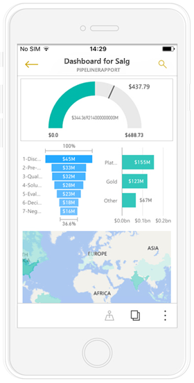
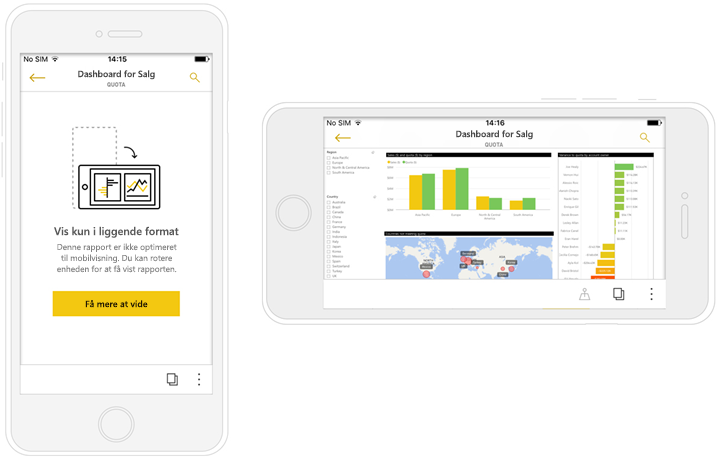
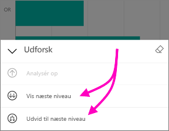
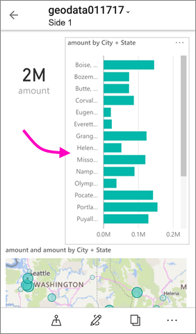

# Få vist Power BI-rapporter, der er optimeret til din telefon

Gælder for:

|  |  |
|:--- |:--- |
| iPhone-telefoner |Android-telefoner |

Når du opretter en Power BI-rapport i Power BI Desktop, kan du også [oprette en version af rapporten optimeret til visning](../../desktop-create-phone-report.md) i Power BI-appen på en telefon.

Når du derefter åbner en Power BI-rapport på en telefon, registrerer Power BI, om rapporten er blevet optimeret til telefoner, og det åbner automatisk den optimerede rapport i stående format.

Hvis der ikke findes en rapport, der er optimeret til telefoner, bliver rapporten stadig åbnet, men den åbnes i liggende format uden optimering til telefoner. Hvis du vender telefonen sidelæns, når du har åbnet en rapport, der er optimeret til telefoner, åbnes rapporten med det oprindelige rapportlayout uden optimering. Hvis det kun er nogle af siderne, der er optimeret, vises der en meddelelse i stående format om, at rapporten er tilgængelig i liggende format.

Alle andre funktioner i Power BI-rapporterne kan stadig bruges i de rapporter, der er optimeret til telefoner. Få mere at vide om, hvad du kan gøre i:

* [Rapporter på iPhone-telefoner](mobile-reports-in-the-mobile-apps.md). 
* [Rapporter på Android-telefoner](mobile-reports-in-the-mobile-apps.md).

## Filtrer rapportsiden på en telefon
Hvis der er defineret filtre i en rapport, der er optimeret til telefoner, kan du bruge filtrene, når du får vist rapporten på en telefon. Rapporten åbnes på din telefon filtreret efter de værdier, der filtreres efter i rapporten på internettet, sammen med en meddelelse om, at der er aktive filtre på siden. Du kan ændre filtrene på telefonen.

1. Tryk på filterikonet  nederst på siden. 
2. Brug grundlæggende eller avanceret filtrering for at få vist de resultater, du er interesseret i.
   
    

## Tværgående fremhævning i visualiseringer
Tværgående fremhævning i visualiseringer fungerer på samme måde i telefonrapporter som i Power BI-tjenesten og i rapporter på telefoner i liggende format: Når du vælger data i den ene visualisering, fremhæves relaterede data i de øvrige visualiseringer på samme side.

Læs mere om [filtre og fremhævning i Power BI](../../power-bi-reports-filters-and-highlighting.md).

## Vælg visualiseringer
Når du vælger en visualisering i en rapport på en telefon, fremhæves visualiseringen, og der fokuseres på den, så du ikke kan bruge fingerbevægelser på dit canvas.

Når du har valgt en visualisering kan du bladre i visualiseringen. Hvis du vil fravælge en visualisering, skal du trykke et sted uden for visualiseringen.

## Åbn visualisering i Fokustilstand
I rapporter på telefoner kan du også bruge Fokustilstand, så du kan få en større visning af den enkelte visualisering og udforske den og rapporten.

* Tryk på de tre prikker (**...**) i øverste højre hjørne af en visualisering i en rapport på telefonen, og vælg **Udvid til fokustilstand**.
  
    

Det, du foretager dig i Fokustilstand, påvirker dit rapportcanvas og omvendt. Hvis du for eksempel fremhæver en værdi i en visualisering og derefter går tilbage til hele rapporten, er det hele rapporten, der bliver filtreret efter den værdi, du fremhævede i visualiseringen.

Nogle handlinger kan kun udføres i Fokustilstand på grund af den begrænsede skærmstørrelse:

* **Brug detailudledning** for at få vist flere oplysninger i en visualisering. Læs mere om [at få vist oplysninger på forskellige niveauer](mobile-apps-view-phone-report.md#drill-down-in-a-visual) i en rapport på en telefon herunder.
* **Sortér** værdierne i visualiseringen.
* **Tilbagefør**: Ryd de trin, du har udført i visualiseringen, og gå tilbage til den definition, der var angivet ved oprettelse af rapporten.
  
    Hvis du vil rydde alle ændringerne fra en visualisering, skal du trykke på de tre prikker (**...**) > **Tilbagefør**.
  
    
  
    Hvis du bruger Tilbagefør på rapportniveau, ryddes alle dine ændringer fra alle visualiseringer. Hvis du bruger Tilbagefør på visualiseringsniveau, ryddes alle dine ændringer i den specifikke visualisering.   

## Detailudledning i en visualisering
Hvis der er defineret hierarkiniveauer i en visualisering, kan du dykke ned i de mere detaljerede oplysninger, som vises i en visualisering, og derefter gå opad i hierarkiet igen. Du kan [tilføje detailudledning i en visualisering](../../power-bi-visualization-drill-down.md) i enten Power BI-tjenesten eller i Power BI Desktop. Når du får vist en rapport på en telefon, virker detailudledning kun i de Power BI-rapporter, der er optimeret til telefoner. 

1. Tryk på de tre prikker (**...**) i øverste højre hjørne i en rapport på telefonen, og vælg **Udvid til fokustilstand**.
   
    
   
    I dette eksempel viser søjlerne de aktuelle værdier for stater.
2. Tryk på udforskningsikonet  nederst til venstre.
   
    
3. Tryk på **Vis næste niveau** eller **Udvid til næste niveau**.
   
    
   
    Nu viser søjlerne værdierne for byer.
   
    
4. Hvis du trykker på pilen i øverste venstre hjørne, kommer du tilbage til telefonrapporten med værdierne udvidet til det nederste niveau.
   
    
5. Hvis du vil tilbage til det oprindelige niveau, skal du trykke på de tre prikker (**...**) igen og vælge **Tilbagefør**.
   
    

## Næste trin
* [Opret rapporter, der er optimeret til Power BI-telefonapps](../../desktop-create-phone-report.md)
* [Opret en telefonvisning af et dashboard i Power BI](../../service-create-dashboard-mobile-phone-view.md)
* [Opret dynamiske visualiseringer, der er optimeret til alle størrelser](../../visuals/desktop-create-responsive-visuals.md)
* Har du flere spørgsmål? [Prøv at spørge Power BI-community'et](http://community.powerbi.com/)

