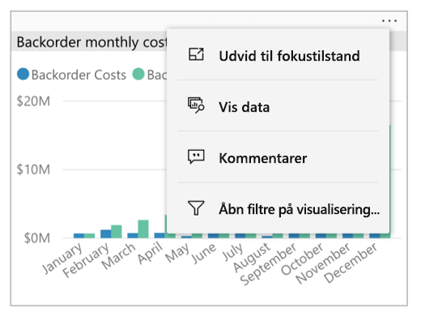
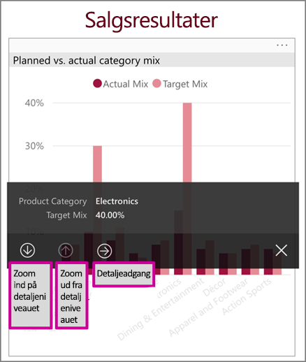
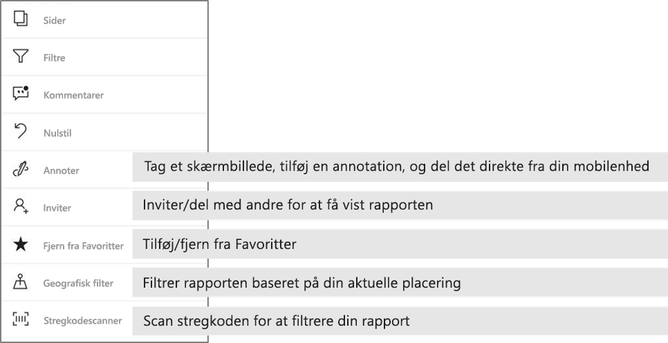

# Udforsk rapporter i Power BI-mobilappsene
Gælder for:

|  |  |  |  |  |
|:--- |:--- |:--- |:--- |:--- |
| iPhone-telefoner |iPad-tablets |Android-telefoner |Android-tablets |Windows 10-enheder |

En Power BI-rapport er en interaktiv visning af dine data, hvor visualiseringer repræsenterer forskellige resultater og indsigter fra disse data. At få vist rapporter i Power BI-mobilapps er det sidste trin i en proces med tre trin.

1. [Opret rapporter i Power BI Desktop](../../desktop-report-view.md). Du kan endda [optimere en rapport til telefoner](mobile-apps-view-phone-report.md) i Power BI Desktop. 
2. Publicer disse rapporter i Power BI-tjenesten [(https://powerbi.com)](https://powerbi.com) eller [Power BI-rapportserver](../../report-server/get-started.md).  
3. Derefter kan du interagere med rapporterne i Power BI-mobilappsene.

## Åbn en Power BI-rapport i mobilappen
Power BI-rapporter er gemt på forskellige steder i mobilappen, afhængigt af hvor du har fået dem. De kan være placeret under Apps, Delt med mig, Arbejdsområder(herunder Mit arbejdsområde) eller på en rapportserver. Nogle gange skal du gennem et relateret dashboard for at komme til en rapport. Andre gange vises de på en liste.

I lister og menuer, kan du se et ikon ud for rapportnavnet på en, hjælper dig med at forstå, at dette element er en rapport. 

 

Der er to ikoner for rapporter i Power BI Mobile apps:

*  Angiver en rapport, der får vist i liggende retning i appen og ser den samme som den ser ud i browseren.

*  Angiver en rapport, der har mindst én telefon optimerede rapportside, der præsenteres i stående. 

Bemærk! Holder telefonen i liggende format, får du altid det liggende layout, selvom rapportsiden har telefonlayout. 

Tryk på ellipsen (...) i øverste højre hjørne af et felt for at få en rapport fra et dashboard, > **Åbn rapport**.
  
  
  
  Det er ikke alle felter, der kan åbnes i en rapport. De felter, der er oprettet ved at stille spørgsmål i feltet Spørgsmål og svar, kan for eksempel ikke åbnes i en rapport, når du trykker på dem. 
  
## Interagere med rapporter
Når du har en rapport, der er åbnet i appen, kan du begynde at arbejde med den. Der er mange ting, du kan gøre med din rapport og de tilhørende data. Du finder handlinger, du kan udføre på rapporten, og ved at trykke på og lange trykke på dataene, der vises i rapporten, du kan også opdele og Opdel dataene i rapportens sidefod.

### Ved hjælp af tryk, og tryk længe på
Tryk på er lig med en mus klik. Hvis du vil fremhæve den rapport, der er baseret på et datapunkt på tværs af tryk så på dette datapunkt.
Trykke på en værdi i udsnittet, gør denne værdi, der er valgt, og udsnit i resten af rapporten ved at denne værdi. Trykke på et link, vil knap eller et bogmærke aktivere den baseret på den handling, der er defineret af forfatteren.

Du bemærket sikkert, at når du trykker på et visuelt element, vises en kant. På den øverste højre hjørne på kanten er der tre prikker (...). Trykke på det får du en menu med de handlinger, du kan udføre på dette visuelle element.

### Værktøjstip og analysér handlinger

Når du langt tryk (Tryk på og hold) et datapunkt, et værktøjstip vises præsentere de værdier, der repræsenterer dette datapunkt. 

Forfattere kan definere hierarkier i data og relationer mellem rapportsider. Hierarki gør det muligt for detailudledning, analysér op, og gå gennem en anden rapportside fra et visuelt element og en værdi. Så når du tryk længe på en værdi, ud over værktøjstippet, vises de relevante analyseindstillinger i sidefoden. 

Når der er mulighed for *detaljeadgang*, og du trykker på en bestemt del af en visualisering, føres du til en anden side i rapporten, der er filtreret, så den værdi, du har klikket på, vises.  En forfatter af en rapport kan angive en eller flere muligheder for detaljeadgang, som hver især fører dig til en anden side. Hvis det er tilfældet, kan du vælge, hvilken mulighed du vil. Knappen tilbage, vender du tilbage til den forrige rapportside.

Læs om, hvordan du [tilføjer detaljeadgang i Power BI Desktop](../../desktop-drillthrough.md).
   
   > [!IMPORTANT]
   > Detailudledning i matrix- og tabelvisuals er aktiveret i Power BI Mobile app via en celleværdi, og ikke af kolonne- og overskrifter.
   
   
   
### Ved hjælp af handlingerne i rapportens sidefod
Rapportens sidefod har handlinger, du kan gøre på den aktuelle rapportside eller hele rapporten. Sidefoden har hurtig adgang til de handlinger, der er mest nyttige, og alle handlinger, der kan være adgang fra de tre prikker (...).

De handlinger, du kan udføre fra sidefoden er:
1) Nulstille rapportfilteret og tværgående fremhævning valg tilbage til den oprindelige tilstand.
2) Åbn samtaleruden for at få vist eller tilføje kommentarer i denne rapport.
3) Åbn filterruden for at få vist og redigere filteret anvendes i øjeblikket i rapporten.
4) Vis alle sider i denne rapport. Trykke på sidenavn indlæser og præsenterer denne side.
Flytte mellem rapportsider kan gøres ved at stryge fra side af skærmen til center.
5) Få vist alle handlinger i rapporter.

#### Alle handlinger i rapporter
Trykke på den... indstillingen i rapportens sidefod, får du alle de handlinger, du kan udføre i en rapport. 

Nogle af handlingerne, der kan være deaktiveret, da de er afhængige af de specifikke rapport-funktioner.
Eksempel:
1) **Filtrer efter den aktuelle placering** er aktiveret, hvis dataene i din rapport er kategoriseret på af forfatteren med geografiske data. [Lær, hvordan du Identificer geografiske data i din rapport](https://docs.microsoft.com/power-bi/desktop-mobile-geofiltering).
2) **Scanning til at filtrere rapporten efter stregkode** aktiveres kun, hvis datasættet i din rapport blev markeret som stregkode. [Hvordan du kan mærke stregkoder i Power BI Desktop](https://docs.microsoft.com/power-bi/desktop-mobile-barcodes). 
3) **Inviter** aktiveres kun, hvis du har tilladelse til at dele denne rapport med andre. Du får tilladelse kun, hvis du er ejeren af rapporten, eller hvis du har fået tilladelse del af ejeren.
4) **Anmærk og del** Deaktiver kan være, hvis der er en [Intune-politik for beskyttelse af](https://docs.microsoft.com/intune/app-protection-policies) i din organisation, der er forbudt deling fra Power BI-mobilappen. 

## Næste trin
* [Få vist og interager med Power BI-rapporter, der er optimeret til din telefon](mobile-apps-view-phone-report.md)
* [Opret en version af en rapport, der er optimeret til telefoner](../../desktop-create-phone-report.md)
* Har du spørgsmål? [Prøv at spørge Power BI-community'et](http://community.powerbi.com/)

