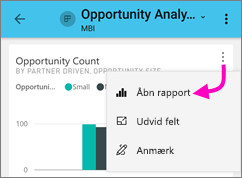
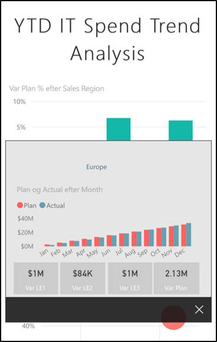
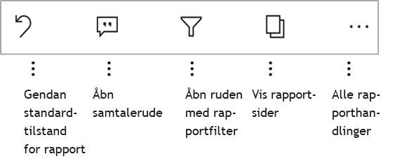
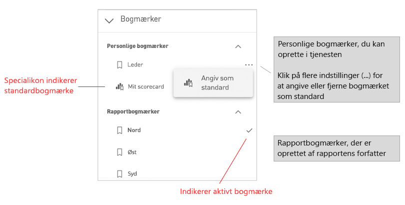
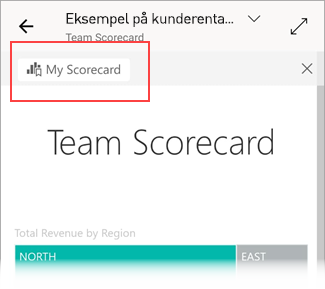

# Udforsk rapporter i Power BI-mobilappsene
Gælder for:

|  |  |  |  |  |
|:---: |:---: |:---: |:---: |:---: |
| iPhone-telefoner |iPad-tablets |Android-telefoner |Android-tablets |Windows 10-enheder |

>[!NOTE]
>Understøttelse af Power BI-mobilapp til **telefoner, der bruger Windows 10 mobile**, ophører den 16. marts 2021. [Få mere at vide](https://go.microsoft.com/fwlink/?linkid=2121400)

En Power BI-rapport er en interaktiv visning af dine data, hvor visualiseringer repræsenterer forskellige resultater og indsigter fra disse data. At få vist rapporter i Power BI-mobilapps er det sidste trin i en proces med tre trin:

1. [Opret rapporter i Power BI Desktop](../../desktop-report-view.md). Du kan endda [optimere en rapport til telefoner](mobile-apps-view-phone-report.md) i Power BI Desktop.
2. Publicer disse rapporter i Power BI-tjenesten [(https://powerbi.com)](https://powerbi.com) eller [Power BI-rapportserver](../../report-server/get-started.md).  
3. Derefter kan du interagere med rapporterne i Power BI-mobilappsene.

## Åbn en Power BI-rapport i mobilappen
Power BI-rapporter er gemt på forskellige steder i mobilappen, afhængigt af hvor du har fået dem. De kan være placeret under Apps, Delt med mig, Arbejdsområder(herunder Mit arbejdsområde) eller på en rapportserver. Nogle gange skal du gennem et relateret dashboard for at komme til en rapport. Andre gange vises de på en liste.

På lister og i menuer kan du finde et ikon ud for et rapportnavn, som hjælper dig med at forstå, at dette element er en rapport:

Der findes to ikoner til rapporter i Power BI-mobilappsene:

*  angiver en rapport, der vises i liggende retning i appen. Den ser ud på samme måde som i en browser.

*  angiver en rapport, der har mindst én rapportside, som er optimeret til telefoner, og som vises i stående format.

> [!NOTE]
> Når du holder din telefon i liggende retning, får du altid det liggende layout, selvom rapportsiden har et layout, der er optimeret til mobiltelefoner.

Hvis du vil hente en rapport fra et dashboard, skal du trykke på **Flere indstillinger** (...) i øverste højre hjørne af et felt og derefter trykke på **Åbn rapport**:
  
  
  
  Det er ikke alle felter, der kan åbnes som rapporter. De felter, der oprettes ved at stille spørgsmål i feltet Spørgsmål og svar, kan for eksempel ikke åbnes i en rapport, når du trykker på dem.
  
## Interager med rapporter
Når du har åbnet en rapport i appen, kan du begynde at arbejde med den. Du kan gøre mange ting med rapporten og dens data. I rapportfoden kan du finde de handlinger, der kan udføres i rapporten. Når du trykker på og trykker længe på de data, der vises i rapporten, kan du også opdele dataene.

### Enkelt tryk i forhold til interaktion med dobbelttryk
Når du downloader Power BI-mobilappen, er den angivet til interaktion med enkelttryk. Det betyder, at når du trykker på en visualisering for at udføre en handling, f.eks. markering af et udsnitselement, tværgående fremhævning, klik på et link eller en knap osv., vælges visualiseringen, når du trykker, og samtidig udføres den handling, du ønsker.

Hvis du foretrækker det, kan du skifte til interaktion med dobbelttryk. Hvis du vælger interaktion med dobbelttryk, skal du først trykke på en visualisering for at markere den og derefter trykke på visualiseringen igen for at udføre den ønskede handling.

Hvis du vil skifte til interaktion med dobbelttryk, eller hvis du vil skifte tilbage til interaktion med enkelt tryk, skal du gå til [indstillinger for app-interaktion](./mobile-app-interaction-settings.md).

### Enkelt markering i forhold til tilstand med flere markeringer for datapunktsmarkering

I en rapport skal du trykke på et datapunkt for at markere det. Du kan vælge, om du vil bruge enkeltmarkering eller tilstand med flere markeringer. Når du trykker på et datapunkt for at markere det i enkeltmarkeringstilstand, erstatter det markerede alle dine forudgående markeringer. Når du trykker på et datapunkt for at markere det i tilstanden med flere markeringer, *føjes* din markering til alle markeringer, du tidligere har foretaget, og det samlede resultat af alle dine markeringer fremhæves på tværs af hele rapportens visualiseringer.

Hvis du vil fjerne markeringen af et datapunkt, skal du bare trykke på det igen.

Hvis du vil skifte mellem enkeltmarkering og tilstanden med flere markeringer, skal du gå til [indstillinger for appinteraktion](./mobile-app-interaction-settings.md).

### Brug af tryk og langt tryk
Et tryk er det samme som et klik med musen. Så hvis du vil fremhæve rapporten på baggrund af et datapunkt, skal du trykke på det pågældende datapunkt.
Når du trykker på en udsnitsværdi, vælges værdien, og resten af rapporten opdeles efter den pågældende værdi.
Når du trykker på et link, en knap eller et bogmærke, vises den handling, der er defineret af rapportens forfatter.

Du har sikkert bemærket, at der vises en kant, når du trykker på et visuelt element. I øverste højre hjørne af kanten vises **Flere indstillinger** (...). Hvis du trykker på ellipsen, får du vist en menu med handlinger, du kan udføre med det visuelle element:

### Værktøjstip og analysehandlinger
Når du trykker længe (trykker og holder nede) på et datapunkt, vises der et værktøjstip, der præsenterer de værdier, som dette datapunkt repræsenterer:

Hvis rapportforfatteren har konfigureret et værktøjstip til rapportsider, erstattes standardværktøjstippet med værktøjstippet fra rapporten:

> [!NOTE]
> Værktøjstip til rapporter understøttes for enheder på mindst 640 pixel og 320 pixel billeder. Hvis enheden er mindre, bruger appen standardværktøjstip.

Rapportforfattere kan definere hierarkier i dataene og relationer mellem rapportsider. Hierarkier gør det muligt at foretage detailudledning, få vist flere detaljer og få detaljeadgang til en anden rapportside fra et visuelt element og en værdi. Så når du trykker længe på en værdi, vises de relevante analyseindstillinger i sidefoden sammen med værktøjstippet:

Når du trykker på en bestemt del af en visualisering og derefter trykker på indstillingen *detaljeadgang*, tager Power BI dig til en anden side i rapporten, der er filtreret, så den værdi, du har klikket på, vises. En forfatter af en rapport kan angive en eller flere muligheder for detaljeadgang, som hver især fører dig til en anden side. Hvis det er tilfældet, kan du vælge, hvilken mulighed du vil foretage detaljeadgang for. Du kan bruge knappen Tilbage til at komme tilbage til den forrige side.

Du kan få flere oplysninger ved at læse om, hvordan du [tilføjer detaljeadgang i Power BI Desktop](../../desktop-drillthrough.md).
   
   > [!IMPORTANT]
   > I Power BI-mobilapps aktiveres detailudledning i matrix-og tabelvisualiseringer kun via celleværdier, ikke via kolonne-eller rækkeoverskrifter.
   
   
   
### Brug af handlingerne i rapportfoden
Fra rapportfoden kan du udføre flere handlinger på den aktuelle rapportside eller hele rapporten. Sidefoden giver hurtig adgang til de mest almindeligt anvendte handlinger. Du kan få adgang til andre handlinger ved at trykke på knappen **Flere indstillinger** (...):

De handlinger, du kan udføre fra sidefoden, er:
* Nulstille rapportfilteret og tværgående fremhævninger til den oprindelige tilstand.
* Åbne samtaleruden for at få vist eller tilføje kommentarer til denne rapport.
* Åbne filterruden for at få vist og ændre det filter, der aktuelt anvendes på rapporten.
* Gennemgå alle siderne i rapporten. Når du trykker på sidenavnet, indlæses og præsenteres den pågældende side.
Du kan flytte mellem rapportsider ved at stryge fra kanten af skærmen til midten.
* Se alle rapporthandlinger.

#### Alle rapporthandlinger
Når du trykker på **Flere indstillinger** (...) i rapportsidefoden, får du vist alle de handlinger, du kan udføre i en rapport:

Nogle af handlingerne kan være deaktiveret, da de er afhængige af de specifikke rapportegenskaber.
Eksempel:

**Bogmærker** er kun til stede, hvis der er blevet angivet [bogmærker](mobile-reports-in-the-mobile-apps.md#bookmarks) i rapporten. Både personlige bogmærker, som du kan definere i Power BI-tjenesten, og bogmærker, der er defineret af rapportopretteren, vises. Hvis et af bogmærkerne er defineret som standardbogmærket, åbnes rapporten med den pågældende visning, når den indlæses.

**Anmærk og del** kan være slået fra, hvis din organisation har en [Intune-beskyttelsespolitik](https://docs.microsoft.com/intune/app-protection-policies), som forbyder deling fra en Power BI-mobilapp.

**Inviter** er kun aktiveret, hvis du har tilladelse til at dele denne rapport med andre. Du har kun tilladelse, hvis du er ejer af rapporten, eller hvis du har fået tilladelse til at dele den igen af ejeren.

**Filtrering efter aktuel placering** er aktiveret, hvis forfatteren af rapporten kategoriserede rapporten med geografiske data. Du kan få flere oplysninger ved at læse om [identifikation af geografiske data i en rapport](https://docs.microsoft.com/power-bi/desktop-mobile-geofiltering).

**Scan for at filtrere rapporten efter stregkode** er kun aktiveret, hvis datasættet i din rapport er mærket som **stregkode**. Du kan finde flere oplysninger om at [tagge stregkoder i Power BI Desktop](https://docs.microsoft.com/power-bi/desktop-mobile-barcodes).

### Bogmærker

Power BI-mobilappen understøtter både rapportbogmærker, som rapportopretteren har defineret, og personlige bogmærker, som du kan definere i Power BI-tjenesten. Du kan finde bogmærkemenuen under **Flere indstillinger** (...) på [værktøjslinjen med rapporthandlinger](mobile-reports-in-the-mobile-apps.md#all-report-actions).

Standardbogmærker er angivet med et særligt ikon. I forbindelse med personlige bogmærker kan du angive, fjerne eller ændre standardindstillingen ved at trykke på **Flere indstillinger (...)** ved siden af det bogmærke, du vil ændre, og vælge **Gør til standard** eller **Ryd standard**.

Når en bogmærkevisning af en rapport er åben, vises navnet på bogmærket øverst i rapporten.

[Få mere at vide om bogmærker i Power BI-tjenesten](https://docs.microsoft.com/power-bi/consumer/end-user-bookmarks).

## Konfigurer din oplevelse med rapporter
Power BI-mobilappen har en række indstillinger, som du kan bruge til at styre din rapportvisning. Du kan i øjeblikket konfigurere
* **Interaktion med rapportvisualiseringer**: Du kan vælge at bruge interaktion med enten enkelt tryk eller dobbelttryk.
* **Metode til dataopdatering**: Du kan vælge enten at have en opdateringsknap eller en handling via rullemenu til opdatering af rapportdata.
* **Synlighed for rapportfod**: Du kan vælge enten at have en fastgjort sidefod, der altid er synlig, eller en dynamisk sidefod, der skjules og vises igen, afhængigt af dine handlinger (f.eks. når du ruller).

Se [indstillinger for app-interaktion](./mobile-app-interaction-settings.md) for at få oplysninger om, hvordan du ændrer disse indstillinger.

## Næste trin
* [Få vist og interager med Power BI-rapporter, der er optimeret til din telefon](mobile-apps-view-phone-report.md)
* [Opret en version af en rapport, der er optimeret til telefoner](../../desktop-create-phone-report.md)
* Har du spørgsmål? [Prøv at spørge Power BI-community'et](https://community.powerbi.com/)

