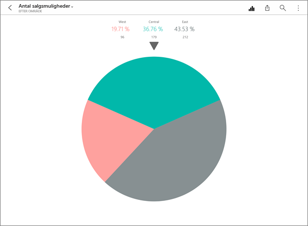
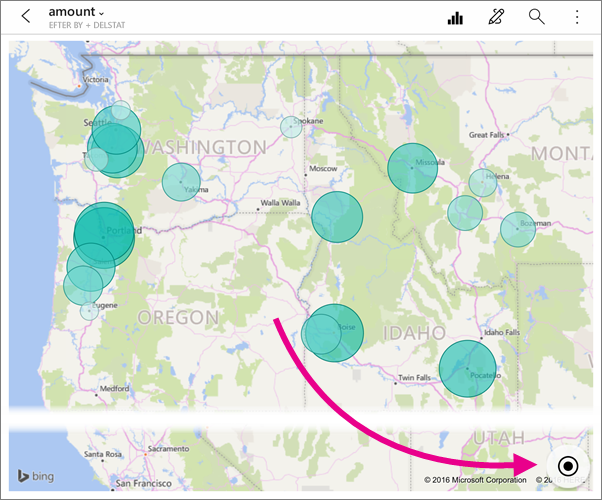
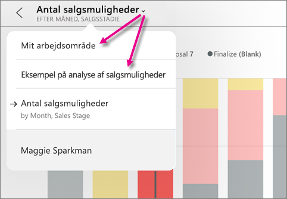

# Udforsk felter i Power BI-mobilappsene
Kan anvendes med:

|  |  |  |  |  |
|:--- |:--- |:--- |:--- |:--- |
| iPhone-telefoner |iPad-tablets |Android-telefoner |Android-tablets |Windows 10-enheder |

Felter er dynamiske øjebliksbilleder af dine data, der er fastgjort til et dashboard. Deres værdier ændres, når dataene ændres. **Du [føjer felter til et dashboard i Power BI-tjenesten](../end-user-tiles.md).** 

Derefter åbner du felter i fokustilstand i Power BI-mobilappsene og interagerer med dem. Du kan åbne felter med alle slags visuelle elementer, herunder felter, der er baseret på Bing og R.

## Felter i iOS-appsene

1. Åbn et [dashboard i mobilappen til iOS](mobile-apps-view-dashboard.md).
2. Tryk på et felt. Det åbnes i fokustilstand, hvor det er lettere at se og udforske feltdataene. I fokustilstand kan du:
   
   Trykke for at få vist værdierne for bestemte dele af visualiseringen i et kurvediagram, et liggende eller et stående søjlediagram.
   
    
   
   *For eksempel er de valgte værdier i dette kurvediagram **Dette års salg** og **Sidste års salg** i **August**.*  
   
   Tryk på en cirkeludsnit i et cirkeldiagram for at få vist dets værdi øverst i diagrammet.  
   
   
3. Tryk på **Centrer kort**-ikonet i et kort  for at centrere kortet efter din nuværende position.
   
     
4. Tryk på ikonet Del  for at [anmærke og dele et felt](mobile-annotate-and-share-a-tile-from-the-mobile-apps.md) med andre.
5. [Føj en besked til feltet](mobile-set-data-alerts-in-the-mobile-apps.md). Hvis værdierne kommer over eller under målene, giver Power BI dig besked.
6. Nogle gange har opretteren af dashboardet føjet et link til et felt. I så fald har det et linkikon , når det er i fokustilstand:
   
    
   
    Links kan føre til andre Power BI-dashboards eller til en ekstern URL-adresse. Du kan [trykke på linket](../../service-dashboard-edit-tile.md#hyperlink) for at åbne det i Power BI-appen. Hvis det er en ekstern side, beder Power BI dig om at give tilladelse til det.
   
    
   
    Når du har åbnet linket i Power BI-appen, kan du kopiere linket og åbne det i et browservindue i stedet for.
7. [Åbn den rapport](mobile-reports-in-the-mobile-apps.md) , som feltet er baseret på.
8. Hvis du vil forlade fokustilstanden, skal du trykke på feltets navn og derefter trykke på dashboardets navn eller **Mit arbejdsområde**.
   
    

## Felter i mobilappen til Android-telefoner og -tablets
1. Åbn et [dashboard i Power BI-mobilappen](mobile-apps-view-dashboard.md).
2. Tryk på et felt for at åbne det i fokustilstand, hvor det er lettere at se og udforske feltdataene.
   
   
   
    I fokustilstand kan du:
   
   * Trykke på diagrammet for at flytte værktøjslinjen i et kurvediagram, et liggende eller stående søjlediagram eller et boblediagram og få vist værdierne for et bestemt sted i visualiseringen.  
   * Trykke på ikonet Del snapshot  for at [anmærke og dele feltet](mobile-annotate-and-share-a-tile-from-the-mobile-apps.md) med andre.
   * Trykke på ikonet Åbn rapport  for at [få vist rapporten](mobile-reports-in-the-mobile-apps.md) i mobilappen.
3. Nogle gange har opretteren af dashboardet føjet et link til et felt. I så fald vil du, når du trykker på den lodrette ellipse (**...**), få vist **Åbn link** :
   
    
   
    Links kan føre til andre Power BI-dashboards eller til en ekstern URL-adresse. Du kan [trykke på linket](../../service-dashboard-edit-tile.md#hyperlink) for at åbne det i Power BI-appen. Hvis det er en ekstern side, beder Power BI dig om at give tilladelse til det.
   
    
   
    Når du har åbnet linket i Power BI-appen, kan du kopiere linket og åbne det i et browservindue i stedet for.
4. Tryk på pilen i det øverste venstre hjørne for at lukke feltet og vende tilbage til dashboardet.

## Felter i mobilappen til Windows 10
1. Åbn et [dashboard i Power BI-mobilappen](mobile-apps-view-dashboard.md) til Windows 10.
2. Tryk på den lodrette ellipse på feltet. Herfra kan du: 
   
    
   
    [Dele et øjebliksbillede af feltet](mobile-windows-10-phone-app-get-started.md).
   
    Trykke på **Åbn rapport**  for at [få vist den bagvedliggende rapport](mobile-reports-in-the-mobile-apps.md).
   
    [Klikke på linket](../../service-dashboard-edit-tile.md#hyperlink), hvis der er et link. Links kan føre til Power BI-dashboards eller til en ekstern URL-adresse.
3. Tryk på **Udvid felt** . Det åbnes i fokustilstand, hvor det er lettere at se og udforske feltdataene. I denne tilstand kan du:
   
   Dreje et cirkeldiagram, så udsnittets værdi bliver vist øverst i diagrammet.  
   
   
   
   Trykke på diagrammet for at flytte værktøjslinjen i et kurvediagram, et liggende eller stående søjlediagram eller et boblediagram og få vist værdierne for et bestemt sted i visualiseringen.  
   
   
   
   *I dette liggende søjlediagram vises værdierne for linjen **Decor** øverst i diagrammet.*
   
   Tryk på ikonet **Fuld skærm**  for at åbne feltet i fuldskærmsvisning uden navigation og menulinjer.
   
   > [!NOTE]
   > Du kan også [få vist dashboards og rapporter i fuldskærmsvisning](mobile-windows-10-app-presentation-mode.md) i Power BI-mobilappen til Windows 10.
   > 
   > 
   
   Tryk på **Centrer kort**-ikonet i et kort  for at centrere kortet efter din nuværende position.
   
   
   
   Tryk på ikonet Del snapshot  for at [dele et felt](mobile-windows-10-phone-app-get-started.md) med andre.   
   
   Tryk på ikonet Åbn rapport  for at [få vist den rapport](mobile-reports-in-the-mobile-apps.md), som feltet er baseret på. 
4. Tryk på pilen Tilbage eller knappen Tilbage for at lukke feltet og vende tilbage til dashboardet.

## Næste trin
* [Hvad er Power BI?](../../power-bi-overview.md)
* Har du spørgsmål? [Prøv at spørge Power BI-community'et](http://community.powerbi.com/)

