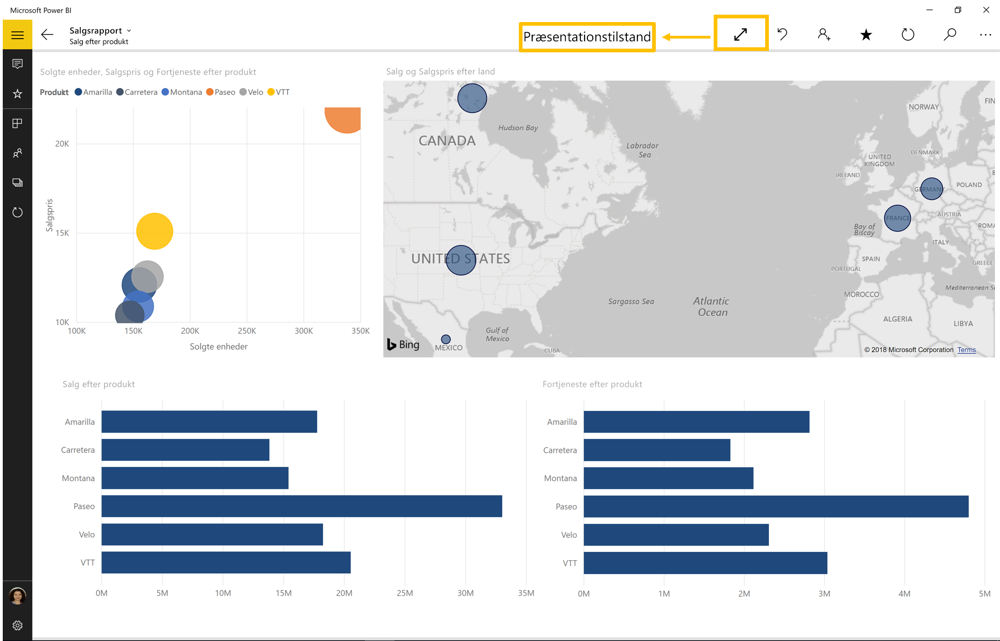

# Få vist rapporter og dashboards i præsentationstilstand på Surface Hub og Windows 10-enheder
Du kan bruge præsentationstilstand til at vise rapporter og dashboards i fuld skærm på Windows 10-enheder og Surface Hub. 

Præsentationstilstand er praktisk til at vise Power BI på et møde eller en konference eller på en dedikeret projektor på et kontor. Du kan også bruge det for at se mest muligt på en lille skærm. 

I præsentationstilstand i Power BI-mobilappen til Windows 10 fjernes alt "chrome", f.eks. navigations- og menulinjerne, så du og dine teammedlemmer kan fokusere på dataene i din rapport. En værktøjslinje med handlinger bliver tilgængelig for dig og giver dig mulighed for at interagere og arbejde med dine data, mens du er i præsentationstilstand.

Du kan også [få vist dashboards og rapporter i fuldskærmsvisning fra Power BI-tjenesten](../end-user-focus.md) på internettet.

> [!NOTE]
> Præsentationstilstand adskiller sig fra [fokuseringstilstand for felter](mobile-tiles-in-the-mobile-apps.md).
> 
> 

## Brug præsentationstilstand
Tryk på ikonet **Fuld skærm** i Power BI-mobilappen for at gå til fuldskærmsvisning.
 Appens chrome forsvinder, og der vises en værktøjslinje nederst på skærmen eller til højre og venstre side (afhænger af skærmstørrelsen).

Fra værktøjslinjen kan du udføre følgende handlinger:

1. Tryk på ikonet Tilbage  for at gå tilbage til den forrige side. Hvis du trykker på ikonet, og holder det nede, åbnes brødkrummevinduerne, hvilket giver dig mulighed for at navigere til mappen med indhold i din rapport eller på dit dashboard.
2. Ikonet Håndskrift  giver dig mulighed for at vælge en farve, når du bruger Surface-pennen til at tegne på og anmærke din rapportside. 
3. Brug ikonet Sider  til at erstatte den rapportside, du præsenterer i øjeblikket.
4. Ikonet Afspil   skjuler handlingslinjen og starter diasshowet der, hvor appen automatisk roterer mellem rapportsiderne. 
5. Tryk på ikonet Søg  for at søge efter andre artefakter i Power BI.
6. Hvis du vil afslutte præsentationstilstand, skal du trykke på ikonet med to pile, der peger ind mod hinanden  på værktøjslinjen.

Du kan fradocke værktøjslinjen og trække den til en hvilken som helst placering på skærmen. Dette er nyttigt i forbindelse med store skærme, når du vil fokusere på et bestemt område i din rapport og gerne vil have de tilgængelige værktøjer ved siden af det. Du skal blot placere fingeren på værktøjslinjen og stryge det ind på rapportlærredet.

## Næste trin
* [Få vist dashboards og rapporter i fuldskærmsvisning fra Power BI-tjenesten](../end-user-focus.md)
* Har du spørgsmål? [Prøv at spørge Power BI-community'et](http://community.powerbi.com/)

