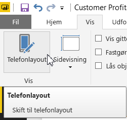
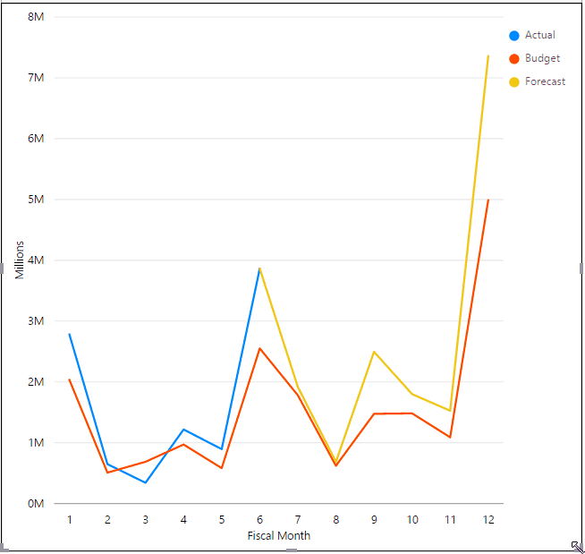
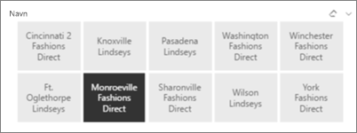

# Optimer Power BI-rapporter til mobilappen
Du kan forbedre visningsoplevelsen af rapporter i mobilapps ved at oprette et stående layout. I Power BI Desktop og Power BI-tjenesten omarrangerer du rapportvisualiseringer og ændrer størrelsen af dem for at få en optimal oplevelse i stående retning.  

Leder du i stedet efter oplysninger om visning af rapporter på en mobilenhed? Prøv denne hurtig start [Udforsk dashboards og rapporter i Power BI-mobilapps](../consumer/mobile/mobile-apps-quickstart-view-dashboard-report.md).

Du kan oprette [dynamiske visualiseringer](#optimize-a-visual-for-any-size) og [dynamiske udsnit](#enhance-slicers-to-work-well-in-phone-reports), hvis størrelse kan tilpasses hvor som helst. Hvis du føjer filtre til din rapport, vises de automatisk i den optimerede rapport.

## Opsæt en stående version af en rapportside

Når du har oprettet en rapport, kan du optimere den til telefoner og tablets.

1. I **Rapportvisning** i Power BI Desktop på fanen **Visning** skal du vælge **Telefonlayout**.  
   
    
   
    I Power BI-tjenesten skal du vælge **Rediger rapport** > **Mobillayout**.

    Du kan se et tomt lærred, der er formet som en telefon. Alle visualiseringerne på den originale rapportside er vist i ruden **Visualiseringer** til højre.

1. Føj en visualisering til telefonlayoutet ved at trække den fra ruden **Visualiseringer** til telefonlærredet.
   
    Telefonrapporter bruger et gitterlayout. Når du trækker visualiseringer til mobilgitteret, falder de på plads i gitteret.
   
    
   
    Du kan føje nogle eller alle visualiseringerne på masterrapportsiden til telefonrapportsiden. Du kan kun tilføje de enkelte visualiseringer én gang, og du behøver ikke at inkludere alle visualiseringerne.

1. Du kan tilpasse størrelsen på dine visualiseringer i gitteret, ligesom du ville gøre det for felter på dashboards og mobildashboards.
   
   Telefonrapportgitteret tilpasses telefoner af forskellig størrelse, så din rapport ser lige så flot ud på telefoner med små som store skærme.
   
   

## Optimer en visualisering til enhver størrelse
Du kan indstille visualiseringerne på dit dashboard eller i din rapport til at være *dynamiske*. Visualiseringer ændres dynamisk, så den maksimale mængde data og indsigt vises uanset skærmstørrelse. 

Når størrelsen af visualiseringen ændres, prioriterer Power BI datavisningen. Udfyldning kan f.eks. fjernes, og forklaringen kan flyttes til toppen af visualiseringen automatisk, så visualiseringen fortsat er informativ, selvom den bliver mindre.

Du kan vælge, om du vil gøre hver enkelt visualisering dynamisk. Læs mere om at [optimere visualiseringer](../visuals/desktop-create-responsive-visuals.md).

## Overvejelser ved oprettelse af layouts for telefonrapporter
* Hvad angår rapporter med flere sider, kan du optimere alle siderne eller kun nogle få. 
* Hvis du har defineret en baggrundsfarve for en rapportside, vil telefonrapporten have den samme baggrundsfarve.
* Du kan ikke modificere formateringsindstillinger kun for telefonen. Formatering er ensartet mellem master- og mobillayouts. Skriftstørrelser vil f.eks. være de samme.
* Du kan ændre en visualisering, f.eks. ændre formateringen, datasættet, filtre eller andre egenskaber, ved at vende tilbage til den almindelige tilstand for rapportskrivning.
* Power BI giver telefonrapporter i mobilappen standardtitler og -sidenavne. Hvis du har oprettet tekstvisualiseringer for titler og sidenavne i din rapport, skal du overveje ikke at føje dem til dine telefonrapporter.     

## Fjern en visualisering fra telefonlayoutet
* Du fjerner en visualisering ved at vælge **X** øverst til højre i visualiseringen på telefonlærredet eller ved at vælge den og trykke på **Slet**.
  
   Hvis du fjerner visualiseringen her, fjernes den kun fra lærredet til telefonlayout. Visualiseringen og den originale rapport ændres ikke.
  
   

## Gør udsnit bedre, så de fungerer godt i telefonrapporter
Udsnit muliggør filtrering af rapportdata på lærredet. Når du designer udsnit i den almindelige tilstand til rapportskrivning, kan du modificere nogle udsnitsindstillinger for at gøre dem mere anvendelige i telefonrapporter:

* Beslut, om læserne af rapporten kun kan vælge ét element eller flere elementer.
* Placer en boks omkring udsnittet for at gøre rapporten nemmere at scanne.
* Gør udsnitsværktøjet lodret, vandret eller *dynamisk*. 

Hvis du gør udsnitsværktøjet dynamisk, når du ændrer dets størrelse og form, vises flere eller færre indstillinger. Det kan være højt, kort, bredt eller smalt. Du kan gøre det så lille, at det blot bliver et filterikon på rapportsiden. 

Læs mere om [oprettelse af dynamiske udsnit](power-bi-slicer-filter-responsive.md).

## Udgiv en telefonrapport
Udgiv en telefonversion af en rapport ved at [udgive hovedrapporten fra Power BI Desktop til Power BI-tjenesten](desktop-upload-desktop-files.md), så udgives telefonversionen på samme tid.
  
Læs mere om [deling og tilladelser i Power BI](../collaborate-share/service-how-to-collaborate-distribute-dashboards-reports.md).

## Få vist optimerede og ikke-optimerede rapporter på en telefon eller tablet
I mobilapperne på telefoner registrerer Power BI automatisk optimerede og ikke-optimerede telefonrapporter. Hvis der findes en telefonoptimeret rapport, åbner Power BI-telefonappen automatisk rapporten i telefonrapporttilstand.

Hvis der ikke findes en telefonoptimeret rapport, åbnes rapporten i ikke-optimeret liggende visning.  

Hvis en telefons retning ændres til liggende i en telefonrapport, åbnes rapporten i den ikke-optimerede visning med det oprindelige rapportlayout, uanset om rapporten er optimeret eller ej.

Hvis du kun optimerer nogle sider, får læserne vist en meddelelse i stående visning, der indikerer, at rapporten er tilgængelig i liggende visning.

Læserne af rapporten kan vende deres telefon eller tablet, så den ligger på siden, for at se rapporten i liggende visning. Læs mere om at [interagere med Power BI-rapporter optimeret til stående visning](../consumer/mobile/mobile-apps-view-phone-report.md).

## De næste trin
* [Opret en telefonvisning af et dashboard i Power BI](service-create-dashboard-mobile-phone-view.md).
* [Få vist Power BI-rapporter, der er optimeret til din telefon](../consumer/mobile/mobile-apps-view-phone-report.md).
* [Opret dynamiske visualiseringer, der er optimeret til alle størrelser](../visuals/desktop-create-responsive-visuals.md).
* Har du flere spørgsmål? [Prøv at spørge Power BI-community'et](https://community.powerbi.com/).
