# Opret værktøjstip baseret på rapportsider i Power BI Desktop
Du kan oprette visuelt omfattende **værktøjstip til rapporter**, som vises, når du holder over visualiseringer, på baggrund af rapportsider, du opretter i **Power BI Desktop**. Ved at oprette en rapportside, der fungerer som et værktøjstip, kan dine brugerdefinerede værktøjstip{1}{2}indeholde visualiseringer, billeder og mange andre samlinger af elementer, du opretter på en rapportside. 

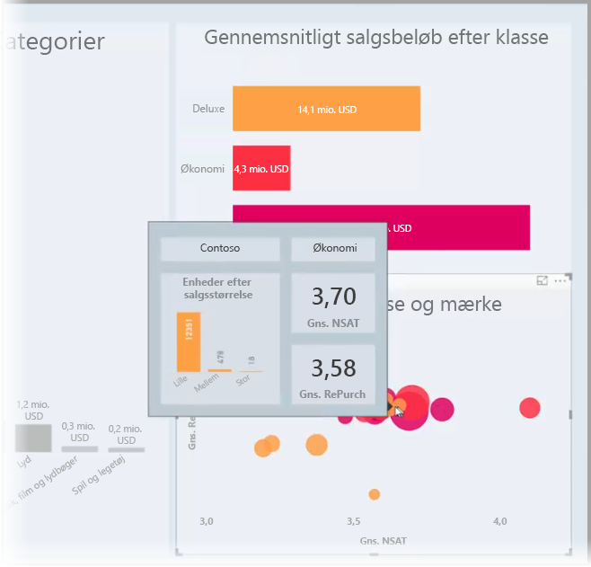

Du kan oprette så mange værktøjstipsider, du vil. Hver værktøjstipside kan tilknyttes et eller flere felter i rapporten, så når du holder over en visualisering, som indeholder det valgte felt, vises det værktøjstip, du oprettede på din værktøjstipside, filtreret efter det datapunkt, som musen holder over. 

Du kan gøre mange forskellige interessante ting med værktøjstip i rapporter. Herunder kan du se, hvordan du opretter værktøjstip, og hvad du skal gøre for at konfigurere dem.

## Opret en værktøjstipside i en rapport
Du starter ved at oprette en ny rapportside. Det gør du ved at klikke på knappen **+** , som du finder nederst på canvasset **Power BI Desktop** i området for fanesider. Knappen er ved siden af den sidste side i rapporten. 

Dit værktøjstip kan have en hvilken som helst størrelse, men husk, at værktøjstip placeres oven på rapportcanvasset, så det kan være en god idé at lave dem relativt små. I ruden **Formatér** på kortet **Sidestørrelse** kan du se en ny sideskabelon, der hedder *Værktøjstip*. Så får du rapportside i canvasstørrelse, som er klar til dit værktøjstip.

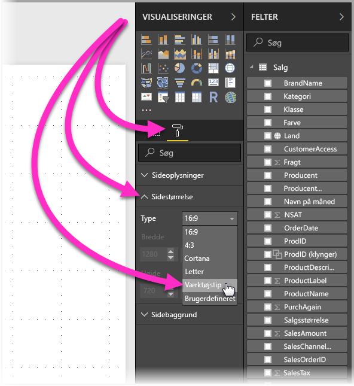

Rapportcanvasset tilpasses som standard til den tilgængelige plads på siden i **Power BI Desktop**. Det er ofte fint, men ikke i forbindelse med værktøjstip. For at få en bedre fornemmelse af og overblik over, hvordan dit værktøjstip kommer til at se ud, når du er færdig, kan du ændre **Sidevisning** til den faktiske størrelse. 

Det gør du ved at vælge fanen **Vis** på båndet. Vælg derfra **Sidevisning > Faktisk størrelse**, som vist på følgende billede.

Du kan også navngive rapportsiden, så formålet med den er tydelig. Du skal blot vælge kortet **Sideoplysninger** i ruden **Formatér** og derefter skrive navnet i feltet **Navn**, som du finder dér. På følgende billede er navnet på værktøjstippet i rapporten *Tooltip 1*, men du kan navngive det til hvad som helst.

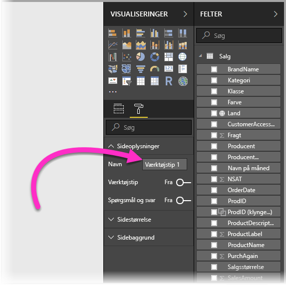

Herfra kan oprette de visualiseringer, som du gerne vil have vist i dit værktøjstip. På følgende billede er der to kort og ét grupperet liggende søjlediagram på værktøjstipsiden sammen med en baggrundsfarve på selve siden og baggrunde for hver visualisering, så det får det udseende, vi ønsker.

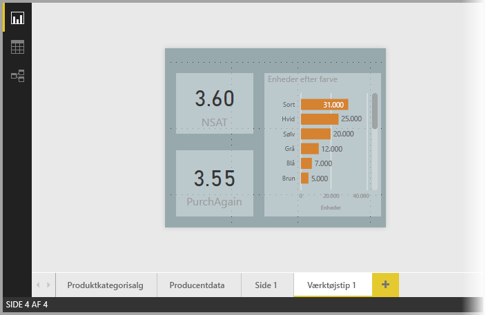

Der er flere trin, der skal udføres, før din værktøjstipside er klar til at fungere som et værktøjstip. Du skal konfigurere værktøjstipsiden på nogle forskellige måder, som beskrevet i næste sektion. 

## Konfigurer din rapportside som værktøjstip

Når du har oprettet rapportsiden som værktøjstip, skal du konfigurere siden, for at **Power BI Desktop** kan registrere den som værktøjstip og for at sikre, at den vises i forbindelse med de relevante visualiseringer.

Til at begynde med skal du skubbe skyderen **Værktøjstip** mod **Til** på kortet **Sideoplysninger** for at gøre siden til et værktøjstip. 

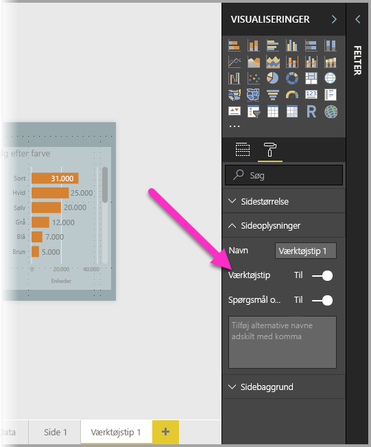

Når skyderen er aktiveret, skal du angive de felter, du vil have rapportværktøjstippet vist for. Værktøjstippet vises for visualiseringer i rapporten, som inkluderer det angivne felt. Du skal angive de relevante felter ved at trække dem til inddelingsenheden **Værktøjstipfelter**, der findes i sektionen **Felter** i ruden **Visualiseringer**. På følgende billede er feltet *SalesAmount* trukket til inddelingsenheden **Værktøjstipfelter**.

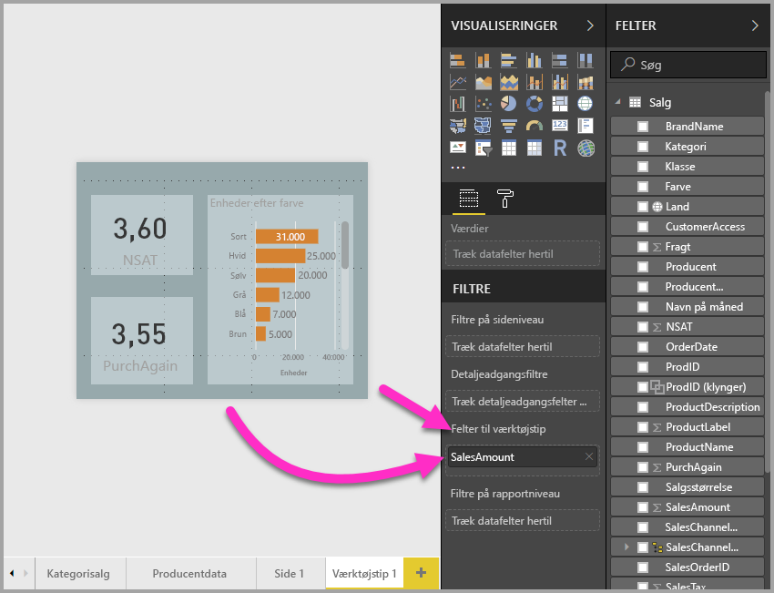
 
Du kan både inkludere kategori- og talfelter i inddelingsenheden **Værktøjstipfelter**, herunder mål.

Når du er færdig, bruges det oprettede værktøjstip til rapportsiden i visualiseringer i rapporten, som bruger de felter, du har placeret i inddelingsenheden **Værktøjstipfelter**, og det erstatter Power BI-standardværktøjstippet.

## Manuel angivelse af et værktøjstip til en rapport

Udover at oprette et værktøjstip, som automatisk vises, når du holder markøren hen over en visualisering, som indeholder det angivne felt, kan du også angive et værktøjstip manuelt. 

Visualiseringer, der understøtter værktøjstip til rapporter, har nu et kort af typen **Værktøjstip** i den tilhørende rude **Formatering**. 

Hvis du vil angive et værktøjstip manuelt, skal du vælge den visualisering, du vil angive det manuelle værktøjstip for. Herefter skal du i ruden **Visualiseringer** vælge sektionen **Formatér** og udvide kortet **Værktøjstip**.

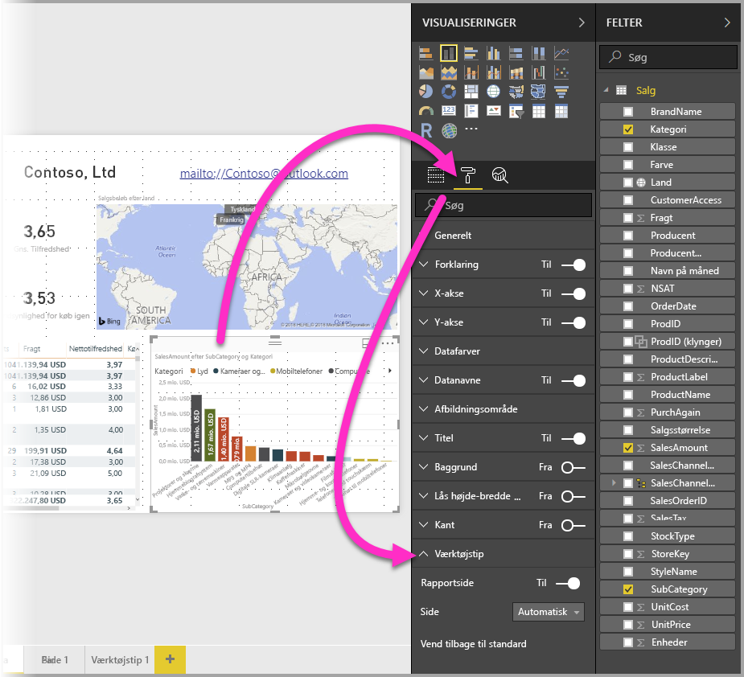

På rullelisten **Side** skal du derefter vælge den værktøjstipside, du vil bruge til den valgte visualisering. Bemærk, at det kun er rapportsider, der er angivet som sider af typen **Værktøjstip**, der vises i dialogboksen.

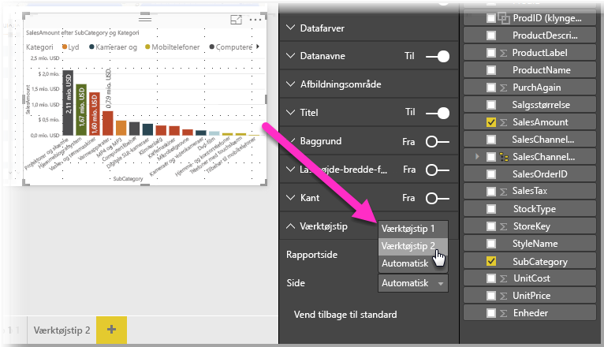

Det er meget anvendeligt at kunne angive et værktøjstip manuelt. Du kan angive en tom side for et værktøjstip og dermed tilsidesætte det værktøjstip, der er valgt som standard i Power BI. Du kan også bruge funktionen, når du ikke ønsker, at de værktøjstip, der som standard er valgt i Power BI, skal være værktøjstip. Hvis du f.eks. har en visualisering, der inkluderer to felter, og der er knyttet et værktøjstip til begge disse felter, er det kun det ene værktøjstip, der vises i Power BI. Det er ikke sikkert, at det er det, du ønsker, og derfor kan du manuelt vælge, hvilket værktøjstip der skal vises.

## Gendannelse til standardværktøjstip

Hvis du opretter et værktøjstip til en visualisering manuelt, men beslutter, at du vil bruge standardværktøjstippet i stedet for, kan du altid gendanne til standardværktøjstippet i Power BI. Det gør du på følgende måde: Når der er valgt en visualisering, og kortet **Værktøjstip** er udvidet, skal du bare vælge *Auto* på rullelisten **Side** for at gå tilbage til standardindstillingen.

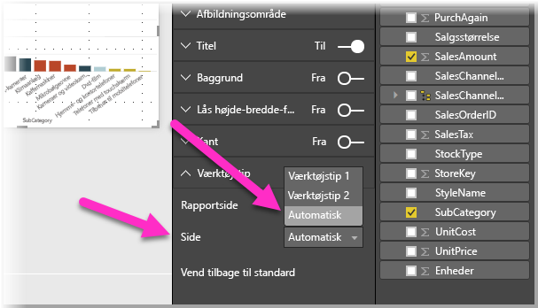

## Brugerdefinerede værktøjstip og kurvediagrammer i rapporter

Der er nogle få ting, du skal huske på, når dine værktøjstip til rapporter interagerer med visualiseringer i form af kurvediagrammer og i forbindelse med visualiseringer, når der fremhæves data på tværs.

### Værktøjstip og kurvediagrammer i rapporter

Når et værktøjstip i rapporter vises i forbindelse med et kurvediagram, vises der kun ét værktøjstip for alle kurver i det pågældende diagram. Det samme gør sig gældende for standardfunktionsmåden for værktøjstip for kurvediagrammer, der også kun viser ét værktøjstip. 

Det skyldes, at feltet i forklaringen ikke overføres som et filter for værktøjstippet. I følgende billede viser det viste værktøjstip alle solgte enheder på den pågældende dag for alle tre viste klasser i værktøjstippet for rapporten (i dette eksempel Deluxe, Economy og Regular). 

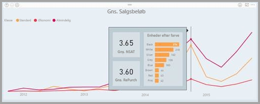

### Værktøjstip i rapporter og fremhævning på tværs

Når en visualisering fremhæves på tværs i en rapport, viser værktøjstippene i rapporten altid de data, der fremhæves på tværs, selvom du holder markøren over den udtonede del af datapunkterne. I følgende billede holdes musen over den udtonede del af søjlediagrammet (den del, der ikke er fremhævet), men værktøjstippet for rapporten viser stadig data for den fremhævede del af det pågældende datapunkt (de fremhævede data).

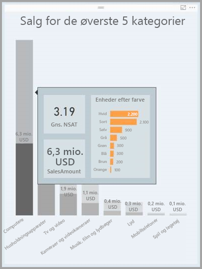

## Begrænsninger og overvejelser
Der er nogle få begrænsninger og overvejelser i forbindelse med **værktøjstip**, som du skal være opmærksom på.

* Fra og med udgivelsen af **Power BI Desktop** i december 2018 understøtter visualiseringer af typen Knapper værktøjstip.
* Værktøjstip til rapporter understøttes ikke for Power BI-visuals. 
* Klynger understøttes ikke i øjeblikket som felter, der kan vises i værktøjstip til rapporter. 
* Når du vælger et felt, der skal vises for værktøjstip til rapporter, når du bruger et felt i forhold til en kategori, vises visualiseringer, der indeholder det pågældende felt, kun det angivne værktøjstip, når der er overensstemmelse mellem opsummeringen og det valgte felt. 

## De næste trin
Du kan finde flere oplysninger om funktioner, der ligner eller interagerer med værktøjstip til rapporter, i følgende artikler:

* [Brug detaljeadgang i Power BI Desktop](desktop-drillthrough.md)
* [Vis et dashboardfelt eller en rapport i fokustilstand](../consumer/end-user-focus.md)
