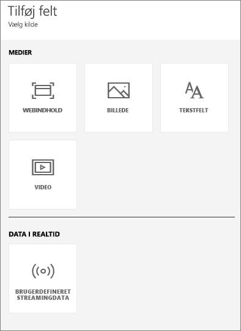
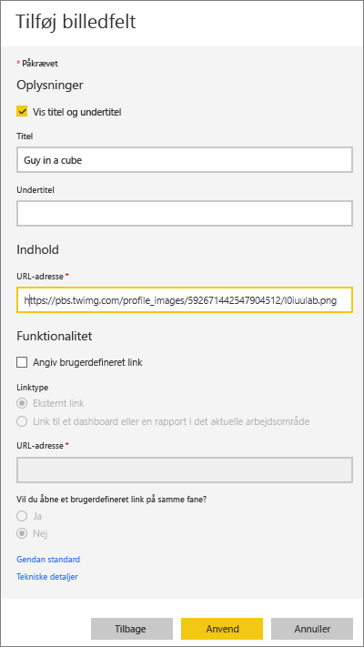
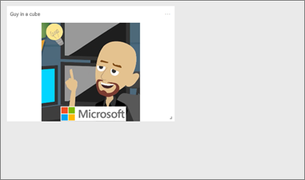
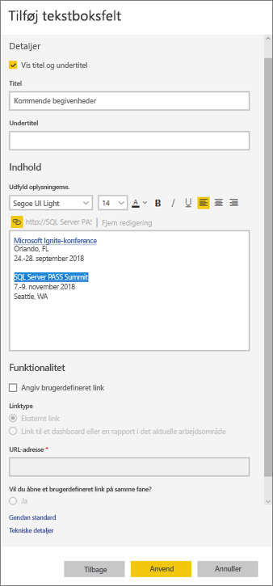
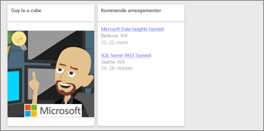
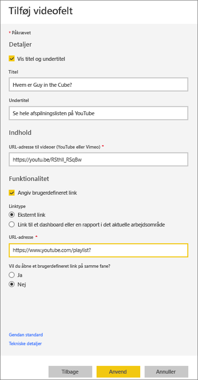
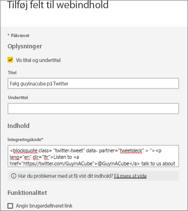
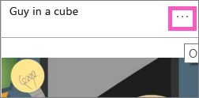
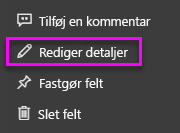

# <a name="add-images-videos-and-more-to-your-dashboard"></a>Føj billeder, videoer og mere til dit dashboard

Når du føjer et felt til dit dashboard, kan du placere et billede, et tekstfelt, en video, streamingdata eller en webkode på dit dashboard. 

Se, hvordan Amanda føjer felter til et dashboard.

   
<iframe width="560" height="315" src="https://www.youtube.com/embed/e2PD8m1Q0vU" frameborder="0" allowfullscreen></iframe>


## <a name="add-an-image-video-or-other-tile"></a>Tilføj et billede, en video eller et andet felt
Du kan føje et billede, et tekstfelt, en video, streamingdata eller en webkode direkte til dit dashboard.

1. Vælg **Tilføj felt** i den øverste menulinje på dashboardet. Afhængigt af pladsbegrænsninger kan du måske kun se plustegnet .
   
    
2. Vælg, hvilken type felt du vil tilføje: 

    **[Webindhold](#add-web-content)**

    **[Billede](#add-an-image)**

    **[Tekstfelt](#add-a-text-box-or-dashboard-heading)**

    **[Video](#add-a-video)**

    **[Brugerdefineret streamingdata](#add-streaming-data)**
   
    

## <a name="add-an-image"></a>Tilføj et billede
Hvis du vil føje dit virksomhedslogo eller et andet billede til dit dashboard, skal du gemme billedfilen online og oprette et link til det. Kontrollér, at der ikke kræves sikkerhedslegitimationsoplysninger for at få adgang til billedfilen. Da der f.eks. kræves godkendelse til OneDrive og SharePoint, kan billeder, der gemmes der, ikke føjes til et dashboard på denne måde.  

1. I vinduet **Tilføj felt** skal du vælge **Billede** > **Næste**.

2. I vinduet **Tilføj billedfelt** skal du tilføje billedoplysningerne:   
   
   a. Hvis du vil have vist en titel over billedet, skal du vælge **Vis titel og undertitel** og skrive en **titel** og evt. en **undertitel**.

   b. Angiv **URL-adressen** til billedet.

   c. Hvis feltet skal være et link, skal du vælge **Angiv brugerdefineret link** og angive **URL-adressen**. 

      Når kolleger klikker på billedet eller titlen, føres de til denne URL-adresse.

   d. Vælg **Anvend**. 

      

3. Tilpas størrelsen på, og flyt billedet efter behov på dashboardet.
     
     

## <a name="add-a-text-box-or-dashboard-heading"></a>Tilføj et tekstfelt eller en dashboardoverskrift

Du kan tilføje en dashboardoverskrift ved at skrive overskriften i tekstfeltet og forøge skrifttypen.

1. I vinduet **Tilføj felt** skal du vælge **Tekstfelt** > **Næste**.

2. Formatér tekstfeltet:
   
   a. Hvis du vil have vist en titel over tekstfeltet, skal du vælge **Vis titel og undertitel** og skrive en **titel** og evt. en **undertitel**.

   b. Angiv og formatér **indholdet** for tekstfeltet.  

   c. Angiv eventuelt et tilpasset link til titlen. Et brugerdefineret link kan være et eksternt websted eller et dashboard eller en rapport i arbejdsområdet. Vi har dog i dette eksempel tilføjet links i selve tekstfeltet, så vi undlader at markere **Angiv brugerdefineret link**.

   d. Vælg **Anvend**. 

     
   
3. Tilpas størrelsen på, og flyt tekstfeltet efter behov på dashboardet.
   
   

## <a name="add-a-video"></a>Tilføj en video
Når du føjer et YouTube- eller Vimeo-videofelt til dit dashboard, afspilles videoen direkte på dashboardet.

1. I vinduet **Tilføj felt** skal du vælge **Video** > **Næste**.
2. Føj videooplysninger til vinduet **Tilføj videofelt**:   
   
   a. Hvis du vil have vist en titel og undertitel øverst i videofeltet, skal du vælge **Vis titel og undertitel** og skrive en **titel** og evt. en **undertitel**. I dette eksempel tilføjer vi en **undertitel** og konverterer den derefter til et link til hele YouTube-afspilningslisten.

   b. Angiv **URL-adressen til videoen**.

   c. Føj et link til **titlen** og **undertitlen**, så dine kolleger kan få vist hele afspilningslisten på YouTube, efter de har set den integrerede video. Det gør du på følgende måde: Under **Funktionalitet** skal du vælge **Angiv brugerdefineret link** og derefter angive **URL-adressen** til afspilningslisten.

   d. Vælg **Anvend**.  

   

3. Tilpas størrelsen på, og flyt videofeltet efter behov på dashboardet.
     
   
4. Vælg videofeltet for at afspille videoen.
5. Vælg undertitlen for at besøge afspilningslisten på YouTube.

## <a name="add-streaming-data"></a>Tilføj streamingdata
Du kan bruge PubNub til at føje streamingdata, f.eks. Twitter-feeds eller sensordata, til et felt på dit dashboard. Power BI har oprettet en integration for at hente dataene fra PubNub. Her forklarer Will, hvordan det fungerer.
   

<iframe width="560" height="315" src="https://www.youtube.com/embed/kOuINwgkEkQ" frameborder="0" allowfullscreen></iframe>

1. I vinduet **Tilføj felt** skal du vælge **Brugerdefinerede streamingdata** > **Næste**.
2. Vælg **Tilføj streamingdatasæt**.
3. Opret et **nyt streamingdatasæt** ved hjælp af Power BI-API eller PubNub.
4. Udfyld felterne **Navn på datasæt**, **Abonnementsnøgle** og **Kanalnavn**. Hvis det er en sikker forbindelse, har den også en autorisationsnøgle. Du kan bruge eksempelværdierne fra PubNub til at prøve det.
5. Vælg **Næste**.
    Du kan se de felter, der er tilgængelige i datasættet, med deres datatyper og JSON-format.
6. Vælg **Connect**.
    Du har oprettet et streamingdatasæt.
7. Gå tilbage til dashboardet, og vælg **Tilføj felt** > **Brugerdefinerede streamingdata** > **Næste** igen.
8. Vælg det datasæt for sensordata, du oprettede > **Næste**.
9. Vælg den ønskede visualiseringstype. En kurvediagram fungerer ofte godt for denne type data.
10. Vælg **Akse**, **Forklaring** og **Værdier**.
11. Vælg den tid, du vil vise, enten i sekunder, minutter eller timer.
12. Vælg **Næste**.
13. Angiv en **titel** og en **undertitel**, hvis du vil.
14. Fastgør det til dit dashboard.


1. I vinduet **Tilføj felt** skal du vælge **Brugerdefinerede streamingdata** > **Næste**.

2. Vælg **Tilføj streamingdatasæt**.

3. Opret et **nyt streamingdatasæt** ved hjælp af Power BI-API eller PubNub.

4. Udfyld felterne **Navn på datasæt**, **Abonnementsnøgle** og **Kanalnavn**. Hvis det er en sikker forbindelse, har den også en autorisationsnøgle. Du kan bruge eksempelværdierne fra PubNub til at prøve det.

5. Vælg **Næste**.

   Du kan se de felter, der er tilgængelige i datasættet, med deres datatyper og JSON-format.

6. Vælg **Connect**.

   Du har oprettet et streamingdatasæt.

7. Gå tilbage til dashboardet, og vælg **Tilføj felt** > **Brugerdefinerede streamingdata** > **Næste** igen.

8. Vælg det datasæt for sensordata, du oprettede > **Næste**.

9. Vælg den ønskede visualiseringstype. En kurvediagram fungerer ofte godt for denne type data.

10. Vælg **Akse**, **Forklaring** og **Værdier**.

11. Vælg den tid, du vil vise, enten i sekunder, minutter eller timer.

12. Vælg **Næste**.

13. Du kan også vælge at angive en **titel** og en **undertitel**.

14. Fastgør det til dit dashboard.

## <a name="add-web-content"></a>Tilføj webindhold
Du kan indsætte eller skrive HTML-indhold som et felt i din rapport eller på dit dashboard. Angiv integreringskoden manuelt, eller kopiér/indsæt fra websteder såsom Twitter, YouTube, embed.ly m.fl.

1. I vinduet **Tilføj felt** skal du vælge **Webindhold** > **Næste**.

2. Føj oplysninger til vinduet **Tilføj felt til webindhold**:
   
   a. Hvis du vil have vist en titel over feltet, skal du vælge **Vis titel og undertitel** og skrive en **titel** og evt. en **undertitel**.

   b. Angiv integreringskoden. I dette eksempel kopierer og indsætter vi et Twitter-feed.

   c. Vælg **Anvend**.

   
   

3. Tilpas størrelsen på, og flyt feltet til videoindholdet som nødvendigt på dashboardet.
     
   

### <a name="tips-for-embedding-web-content"></a>Tip til at integrere webindhold
* Til iframes skal du bruge en sikker kilde. Hvis du angiver din iFrame-integreringskode og får et tomt felt, skal du bekræfte, at du ikke bruger *http* som iFrame-kilden. Hvis det er tilfældet, skal du ændre den til *https*.
  
  ```html
  <iframe src="https://xyz.com">
  ```
* Rediger oplysninger for bredde og højde. Integreringskoden integrerer en video og angiver videoafspilleren til 560 x 315 pixels. Denne størrelse ændres ikke, når du ændrer størrelsen på feltet.
  
  ```html
  <iframe width="560" height="315"
  src="https://www.youtube.com/embed/Cle_rKBpZ28" frameborder="0"
   allowfullscreen></iframe>
  ```
  
  Hvis afspillerens størrelse skal tilpasses feltets størrelse, skal du angive bredden og højden til 100 %.
  
  ```html
  <iframe width="100%" height="100%"
  src="https://www.youtube.com/embed/Cle_rKBpZ28" frameborder="0"
   allowfullscreen></iframe>
  ```
* Denne kode integrerer et tweet og bevarer – som separate links på dashboardet – links til AFK-podcasten, \@GuyInACube's Twitter-side og #analytics samt til at følge, besvare, retweete og synes godt om.  Hvis du vælger selve feltet, føres du til podcasten på Twitter.
  
  ```html
  <blockquote class="twitter-tweet" data-partner="tweetdeck">
  <p lang="en" dir="ltr">Listen to
  <a href="https://twitter.com/GuyInACube">@GuyInACube</a> talk to
  us about making videos about Microsoft Business Intelligence
  platform
  <a href="https://t.co/TmRgalz7tv">https://t.co/TmRgalz7tv </a>
  <a href="https://twitter.com/hashtag/analytics?src=hash">
  #analytics</a></p>&mdash; AFTK Podcast (@aftkpodcast) <a
  href="https://twitter.com/aftkpodcast/status/693465456531771392">
  January 30, 2016</a></blockquote> <script async src="//platform.twitter.com/widgets.js" charset="utf-8"></script>
  ```

## <a name="edit-a-tile"></a>Rediger et felt
Sådan foretager du ændringer af et eksisterende felt:

1. Hold over det øverste højre hjørne af feltet, og vælg **Flere indstillinger** (...).
   
    
2. Vælg **Rediger oplysninger** for at få vinduet **Feltoplysninger**, og foretag ændringer.
   
    

## <a name="considerations-and-troubleshooting"></a>Overvejelser og fejlfinding
* Du kan gøre det lettere at flytte feltet på dashboardet ved at tilføje en titel og evt. en undertitel.
* Hvis du vil integrere indhold fra et websted, men webstedet ikke giver dig integreringskoden, der skal kopieres og indsættes, skal du se embed.ly for at få hjælp til at generere integreringskoden.

## <a name="next-steps"></a>De næste trin
[Introduktion til dashboardfelter for Power BI-designere](service-dashboard-tiles.md)

Har du flere spørgsmål? [Prøv Power BI-community'et](https://community.powerbi.com/).

