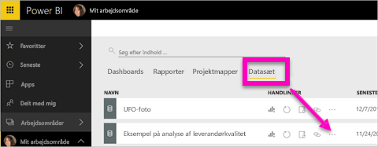
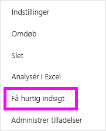
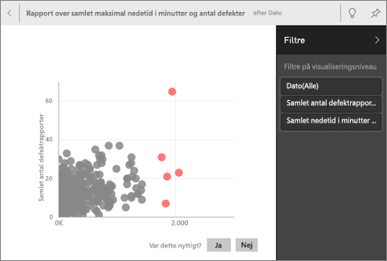

# Generér automatisk dataindsigt med Power BI
Har du et nyt datasæt, og er du ikke helt sikker på, hvor du skal starte?  Har du brug for hurtigt at oprette et dashboard?  Vil du hurtigt søge efter indsigter, som du måske gik glip af?

Kør Quick Insights for at oprette interessante interaktive visualiseringer, der er baseret på dine data. Quick Insights kan køres på et helt datasæt (hurtig indsigt) eller på et bestemt dashboardfelt (områdebaseret indsigt). Du kan endda køre indsigter på en indsigt!

> [!NOTE]
> Insights fungerer ikke med DirectQuery. Det fungerer kun med data, der er uploadet til Power BI.
> 

Funktionen Quick Insights er baseret på et voksende [sæt avancerede analytiske algoritmer](../consumer/end-user-insight-types.md), der er udviklet sammen med Microsoft Research, som vi vil fortsætte med at bruge for at gøre det muligt for flere personer at finde indsigter i deres data på nye og intuitive måder.

## Kør Quick Insights på et datasæt
Se Amanda køre Quick Insights på et datasæt, åbne en indsigt i Fokustilstand, fastgøre en af disse indsigter som et felt på sit dashboard og derefter få indsigter for et dashboardfelt.

<iframe width="560" height="315" src="https://www.youtube.com/embed/et_MLSL2sA8" frameborder="0" allowfullscreen></iframe>

Nu er det din tur. Udforsk Insights ved hjælp af [Eksempel på analyse af leverandørkvalitet](sample-supplier-quality.md).

1. På fanen **Datasæt** skal du vælge **Flere indstillinger** (...) og derefter vælge **Få hurtig indsigt**.
   
    
   
    
2. Power BI bruger [forskellige algoritmer](../consumer/end-user-insight-types.md) til at søge efter tendenser i dit datasæt.
   
    
3. Dine indsigter er klar på få sekunder.  Vælg **Vis indsigt** for at vise visualiseringer.
   
    
   
    > [!NOTE]
    > Nogle datasæt kan ikke generere indsigt, da dataene ikke er statistisk vigtige.  Hvis du vil vide mere, kan du se [Optimer dine data til indsigt](service-insights-optimize.md).
    > 
    
4. Visualiseringerne vises på et særligt **Hurtig indsigt**-lærred med op til 32 separate indsigtskort. Hvert kort har et diagram eller en graf samt en kort beskrivelse.
   
    

## Interager med indsigtskortene

1. Hold markøren over et kort, og vælg ikonet med tegnestiften for at føje visualiseringen til et dashboard.

2. Hold over et kort, vælg **Flere indstillinger** (...), og vælg derefter **Vis indsigt**. 

    Skærmbilledet Indsigt åbnes i fokustilstand.
   
    
3. I fokustilstand kan du:
   
   * Filtrér visualiseringerne. Hvis ruden **Filtre** ikke allerede er åben, skal du udvide den ved at vælge pilen i højre side af vinduet.

       
   * Fastgør indsigtskortet til et dashboard ved at vælge **Fastgør visuelt element**.
   * Kør indsigt på selve kortet, der ofte kaldes for *Områdebaseret indsigt*. Øverst til højre skal du vælge ikonet med elpæren  eller **Få indblik**.
     
       
     
     Indsigterne vises til venstre, og nye kort, som udelukkende er baseret på dataene i den enkelte indsigt, vises til højre.
     
       
4. Vælg **Afslut Fokustilstand** øverst til venstre, hvis du vil vende tilbage til det oprindelige indsigtslærred.

## Kør indsigt på et dashboardfelt
I stedet for at søge efter indsigt i et helt datasæt kan du begrænse din søgning og foretage en områdebaseret indsigt for de data, der er brugt til at oprette et enkelt dashboardfelt. 

1. Åbn et dashboard.
2. Peg på et felt. vælg **Flere indstillinger** (...), og vælg derefter **Vis indsigt**. Feltet åbnes i [Fokustilstand](../consumer/end-user-focus.md) med indsigtskortene vist langs højre.    
   
        
3. Er der en indsigt, der vækker din interesse? Vælg indsigtskortet for at udforske mere. Den valgte indsigt vises til venstre, og nye indsigtskort, som udelukkende er baseret på dataene i den enkelte indsigt, vises til højre.    
4. Fortsæt med udforske dine data, og når du finder en interessant indsigt, kan du fastgøre den til dit dashboard ved at vælge **Fastgør din visual** fra øverste højre hjørne.

## De næste trin
- Hvis du ejer et datasæt, [kan du optimere det til Hurtig indsigt](service-insights-optimize.md).
- Få mere at vide om de [tilgængelige typer Hurtig indsigt](../consumer/end-user-insight-types.md).

Har du flere spørgsmål? [Prøv Power BI-community'et](https://community.powerbi.com/).
