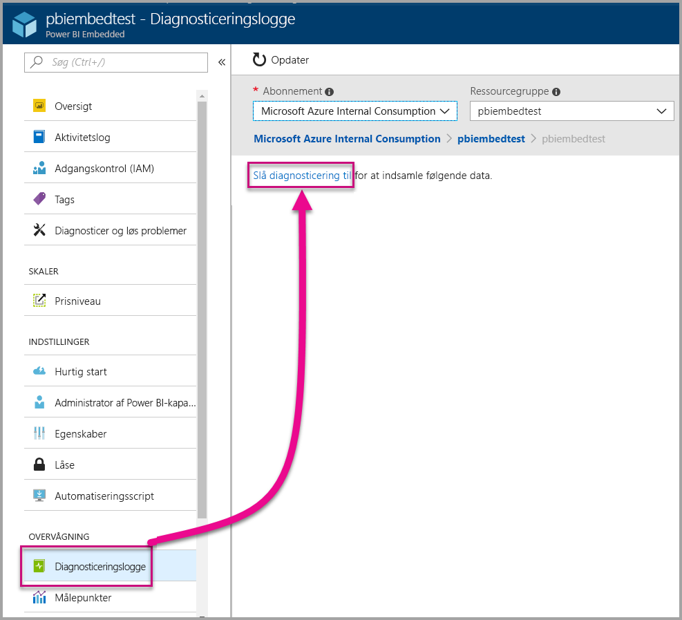
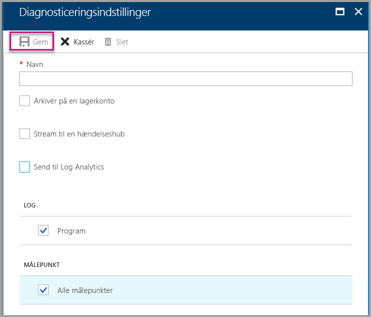
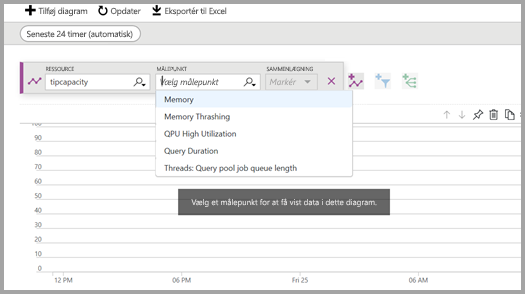
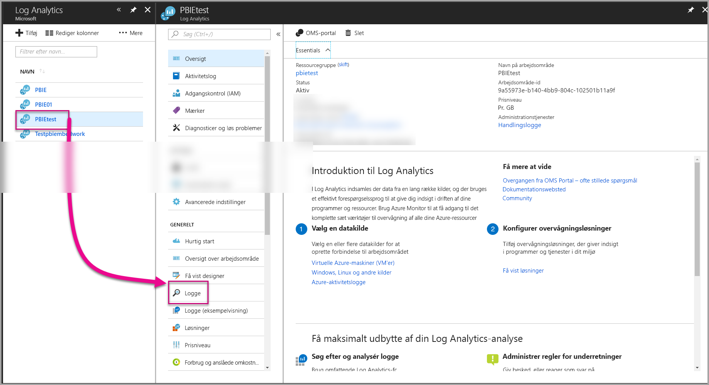
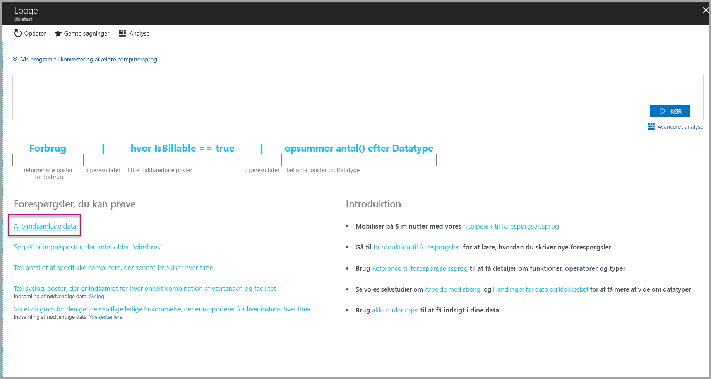
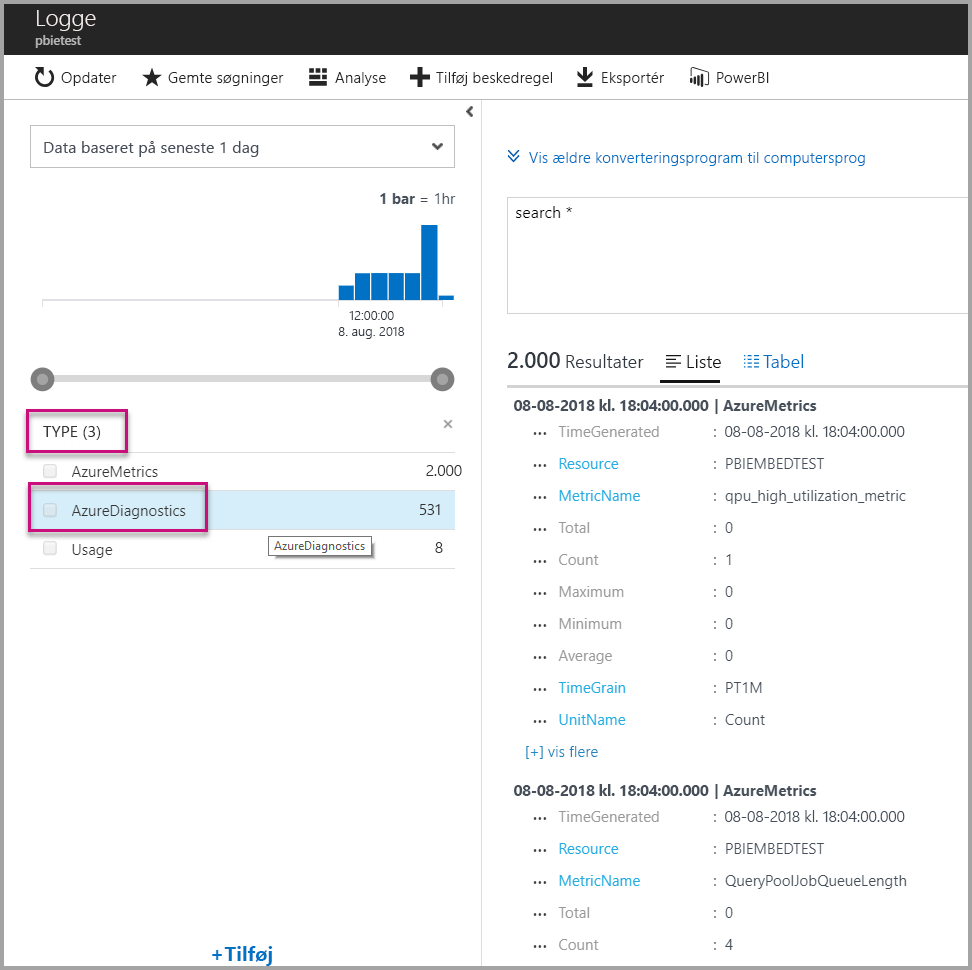

# <a name="diagnostic-logging-for-power-bi-embedded-in-azure"></a>Logføring af diagnosticering for Power BI Embedded på Azure

Med [diagnosticeringslogge for Azure-ressourcer](https://docs.microsoft.com/azure/monitoring-and-diagnostics/monitoring-overview-of-diagnostic-logs) kan du logføre mange hændelser fra din kapacitet, lægge dem i et analyseværktøj og få indsigt i ressourcens funktionsmåde.

Ved hjælp af diagnosticering kan du får svar på nogle få scenarier, f.eks.:

* Registrering af langvarige eller problematiske forespørgsler.
* Afledning af [målepunkter for kapacitet](https://powerbi.microsoft.com/blog/power-bi-developer-community-april-update/).
* Sporing af brug af bestemte datasæt.

## <a name="set-up-diagnostics-logging"></a>Konfigurer logføring af diagnosticering

### <a name="azure-portal"></a>Azure-portal

1. På [Azure Portal](https://portal.azure.com) > Power BI Embedded-ressource skal du vælge **Diagnosticeringslogge** i navigationsruden og derefter vælge **Slå diagnosticering til**.

    

2. Under **Diagnosticeringsindstillinger** skal du angive følgende indstillinger:

    * **Navn** – Angiv et navn for den diagnosticeringindstilling, du vil oprette.

    * **Arkivér til en lagerkonto** – Hvis du vil bruge denne indstilling, skal du oprette forbindelse til en eksisterende lagerkonto. Se [Opret en lagerkonto](https://docs.microsoft.com/azure/storage/common/storage-create-storage-account), og følg instruktionerne for at oprette en lagerkonto. Derefter skal du vælge din lagerkonto ved at gå tilbage til denne side på portalen. Det kan tage et par minutter, før nyligt oprettede lagerkonti vises i rullemenuen. Logfiler lagres i JSON-formatet.
    * **Stream til en hændelseshub** – Hvis du vil bruge denne indstilling, skal du oprette forbindelse til et eksisterende Event Hub-navneområde og en eksisterende hændelseshub. Du kan få mere at vide under [Opret et Event Hubs-navneområde og en hændelseshub ved hjælp af Azure Portal](https://docs.microsoft.com/azure/event-hubs/event-hubs-create).
    * **Send til Log Analytics** – Hvis du vil bruge denne indstilling, skal du enten bruge et eksisterende arbejdsområde eller oprette et nyt Log Analytics-arbejdsområde ved at følge trinnene for at [oprette et nyt arbejdsområde](https://docs.microsoft.com/azure/log-analytics/log-analytics-quick-collect-azurevm#create-a-workspace) på portalen. Dermed udnyttes [Azure Log Analytics](https://docs.microsoft.com/azure/log-analytics/log-analytics-overview), som indeholder indbyggede funktioner til analyse, dashboarding og meddelelser. Du kan bruge Log Analytics til at forbinde flere data fra andre ressourcer og få en enkelt og komplet visning af data på tværs af alle dit programressourcer. Du kan også oprette forbindelse til [Power BI med et enkelt klik](https://docs.microsoft.com/azure/log-analytics/log-analytics-powerbi).
    Du kan få flere oplysninger om visning af dine logge i Log Analytics under [Få vist logge i Log Analytics](https://docs.microsoft.com/azure/log-analytics/log-analytics-activity).
    * **Program** – Vælg denne indstilling for at logføre angivelsen af program[hændelser, der er angivet](#whats-logged) nedenfor.
    * **Alle målepunkter** – Vælg denne indstilling til at gemme detaljerede data i [Målepunkter](https://docs.microsoft.com/azure/analysis-services/analysis-services-monitor#server-metrics). Hvis du arkivering til en lagerkonto, kan du vælge opbevaringsperioden for diagnosticeringslogge. Logfiler slettes automatisk, når opbevaringsperioden udløber.

3. Vælg **Gem**.

    Hvis du vil ændre, hvor dine diagnosticeringslogge gemmes, kan du gå tilbage til denne side for at ændre indstillingerne.

    

### <a name="using-powershell-to-enable-diagnostics"></a>Brug af PowerShell til aktivering af diagnosticering

Hvis du vil aktivere logføring af målepunkter og diagnosticering vha. PowerShell, skal du bruge følgende kommandoer:

* Brug denne kommando til at aktivere lagring af diagnosticeringslogge for en lagerkonto:

    ```powershell
    Set-AzureRmDiagnosticSetting -ResourceId [your resource id] -StorageAccountId [your storage account id] -Enabled $true
    ```
    Id'et for lagerkontoen er ressource-id'et for den lagerkonto, du vil sende loggene til.

* Brug følgende kommando, hvis du vil aktivere streaming af diagnosticeringslogge til en hændelseshub:

    ```powershell
    Set-AzureRmDiagnosticSetting -ResourceId [your resource id] -ServiceBusRuleId [your service bus rule id] -Enabled $true
    ```
* Id'et for Azure Service Bus-reglen er en streng i følgende format:

    ```powershell
    {service bus resource ID}/authorizationrules/{key name}
    ```

* Brug følgende kommando, hvis du vil aktivere afsendelse af diagnosticeringslogge til et Log Analytics-arbejdsområde:

    ```powershell
        Set-AzureRmDiagnosticSetting -ResourceId [your resource id] -WorkspaceId [resource id of the log analytics workspace] -Enabled $true
    ```

* Du kan hente ressource-id'et for dit Log Analytics-arbejdsområde vha. følgende kommando:

    ```powershell
    (Get-AzureRmOperationalInsightsWorkspace).ResourceId
    ```

Du kan kombinere disse parametre for at aktivere flere outputindstillinger.

### <a name="rest-api"></a>REST API

Få mere at vide om, hvordan du [ændrer diagnosticeringsindstillinger vha. Azure Monitor REST-API'en](https://docs.microsoft.com/rest/api/monitor/). 

### <a name="resource-manager-template"></a>Resource Manager-skabelon

Få mere at vide om, hvordan du [aktiverer diagnosticeringsindstillinger i forbindelse med ressourceoprettelse vha. en Resource Manager-skabelon](https://docs.microsoft.com/azure/monitoring-and-diagnostics/monitoring-enable-diagnostic-logs-using-template).

## <a name="whats-logged"></a>Hvad logføres?

Du kan vælge **Program** og/eller **Alle målepunkter**-kategorierne.

### <a name="engine"></a>Program

Programkategorien instruerer ressourcen i at logføre følgende hændelser, og hver af hændelserne indeholder egenskaber:

|     Hændelsesnavn     |     Hændelsesbeskrivelse     |
|----------------------------|----------------------------------------------------------------------------------|
|    Overvågningslogon    |    Registrerer alle nye forbindelse til programhændelserne, siden sporingen startede.    |
|    Sessionsinitialisering    |    Registrerer alle sessionsinitialiseringshændelser, siden sporingen startede.    |
|    Start af VertiPaq-forespørgsel    |    Registrerer alle VertiPaq SE-forespørgsler, siden sporingen startede.    |
|    Forespørgselsstart    |    Registrerer alle starthændelser for forespørgsler, siden sporingen startede.    |
|    Forespørgselsophør    |    Registrerer alle ophørshændelser for forespørgsler, siden sporingen startede.    |
|    Ophør af VertiPaq-forespørgsel    |    Registrerer alle ophørshændelser for VertiPaq SE-forespørgsler, siden sporingen startede.    |
|    Overvågningslogout    |    Registrerer alle afbrydelser af forbindelse til programhændelserne, siden sporingen startede.    |
|    Fejl    |    Registrerer alle programfejlhændleser, siden sporingen startede.    |

<br>
<br>

| Egenskabsnavn | Eksempel på ophør af VertiPaq-forespørgsel | Beskrivelse af egenskab |
|-------------------|---------------------------------------------------------------------------------------------------------------------------------------------------------------------------------------------------------|--------------------------------------------------------------------------------------------------------------------------|
| EventClass | XM_SEQUERY_END | Hændelsesklasse bruges til at kategorisere hændelser. |
| EventSubclass | 0 | Hændelsesunderklasse giver yderligere oplysninger om hver enkelt hændelsesklasse. (for eksempel 0: VertiPaq Scan) |
| RootActivityId | ff217fd2-611d-43c0-9c12-19e202a94f70 | Id for rodaktivitet. |
| CurrentTime | 2018-04-06T18:30:11.9137358Z | Tidspunkt, hvor hændelsen startede, når det er tilgængeligt. |
| StartTime | 2018-04-06T18:30:11.9137358Z | Tidspunkt, hvor hændelsen startede, når det er tilgængeligt. |
| JobID | 0 | Job-id for status. |
| ObjectID | 464 | Objekt-id |
| ObjectType | 802012 | Objekttype |
| EndTime | 2018-04-06T18:30:11.9137358Z | Tidspunkt, hvor hændelsen ophørte. |
| Varighed | 0 | Tid (i millisekunder), der optages af hændelsen. |
| SessionType | Bruger | Sessionstype (hvilken enhed udløste handlingen). |
| ProgressTotal | 0 | Total status. |
| IntegerData | 0 | Heltalsdata. |
| Alvorsgrad | 0 | Niveau for alvorsgrad for en undtagelse. |
| Vellykket | 1 | 1 = succes. 0 = fejl (1 betyder f.eks., at tilladelseskontrol er udført uden fejl, og 0 betyder, at der er fejl i denne kontrol). |
| Fejl | 0 | Fejlnummer for en given hændelse. |
| ConnectionID | 3 | Entydigt forbindelses-id. |
| DatasetID | 5eaa550e-06ac-4adf-aba9-dbf0e8fd1527 | Id'et for det datasæt, som brugerens erklæring kører på. |
| SessionID | 3D063F66-A111-48EE-B960-141DEBDA8951 | Sessions-GUID. |
| SPID | 180 | Serverproces-id. Dette identificerer entydigt en brugersession. Dette svarer direkte til det sessions-GUID, der anvendes af XML/A. |
| ClientProcessID | null | Proces-id for klientprogrammet. |
| ApplicationName | null | Navnet på det klientprogram, der oprettede forbindelse til serveren. |
| CapacityName | pbi641fb41260f84aa2b778a85891ae2d97 | Navnet på Power BI Embedded-kapacitetsressourcen. |


### <a name="allmetrics"></a>Alle målepunkter

Når indstillingen **Alle målepunkter** er markeret, logføres data for alle de målepunkter, du kan bruge med en Power BI Embedded-ressource.

   

## <a name="manage-your-logs"></a>Administrer dine logge

Logge er typisk tilgængeligt inden for et par timer, efter at logføringen er konfigureret. Det er op til dig at administrere dine logge på din lagerkonto:

* Brug standardmetoder til Azure-adgangskontrol til at sikre dine logge ved at begrænse adgangen til dem.
* Slet logge, du ikke længere vil beholde på din lagerkonto.
* Husk at angive en opbevaringsperiode, så gamle logge slettes fra din lagerkonto.

## <a name="view-logs-in-log-analytics"></a>Få vist logge i Log Analytics

Målepunkter og serverhændelser er sammen med xEvents integreret i Log Analytics med henblik på sideløbende analyse. Log Analytics kan også konfigureres til at modtage hændelser fra andre Azure-tjenester, der giver en holistisk visning af diagnosticeringslogføringsdata på tværs af din struktur.

Hvis du vil have vist dine diagnosticeringsdata i Log Analytics, skal du åbne siden **Logge** i menuen til venstre eller i administrationsområdet, som vist nedenfor.



Nu, hvor du har aktiveret dataindsamling, skal du i **Logge** vælge **Alle indsamlede data**.



I **Type** skal du vælge **Azure-diagnosticering** og derefter vælge **Anvend**. Azure-diagnosticering omfatter programhændelser. Bemærk, at der oprettes en Log Analytics-forespørgsel undervejs.



Vælg **Hændelsesklasse\_s** eller et af hændelsesnavnene, så fortsætter Log Analytics med at konstruere en forespørgsel. Sørg for at gemme dine forespørgsler, så de kan genbruges senere.

Sørg for at se i [Log Analytics](https://docs.microsoft.com/azure/log-analytics/), hvor du får oplysninger om et websted med forbedrede forespørgsels-, dashboarding- og meddelelsesfunktioner i forbindelse med indsamlede data.

### <a name="queries"></a>Forespørgsler

Der er hundredvis af forespørgsler, du kan bruge. Her er nogle få, så du kan komme i gang. Du kan få mere at vide om brugen af det nye forespørgselssprog i forbindelse med logsøgning under [Om logsøgninger i Log Analytics](https://docs.microsoft.com/azure/log-analytics/log-analytics-log-search).

* Forespørgselsresultat, det tog mindre end fem minutter (300.000 millisekunder) at generere.

    ```
    search *
    | where Type == "AzureDiagnostics"
    | where ( OperationName == "QueryEnd" )
    | where toint(Duration_s) < 300000
    ```

    

* Identificer kapacitetsnavne.

    ```
    search *
    | where ( Type == "AzureDiagnostics" )
    | summarize count() by CapacityName_s 
    ```

    

## <a name="next-steps"></a>Næste trin

Du kan få mere at vide om logføring af Azure-ressourcediagnosticering.

> [!div class="nextstepaction"]
> [Logføring af Azure-ressourcediagnosticering](https://docs.microsoft.com/azure/monitoring-and-diagnostics/monitoring-overview-of-diagnostic-logs)

> [!div class="nextstepaction"]
> [Set-AzureRmDiagnosticSetting](https://docs.microsoft.com/powershell/module/azurerm.insights/Set-AzureRmDiagnosticSetting)
