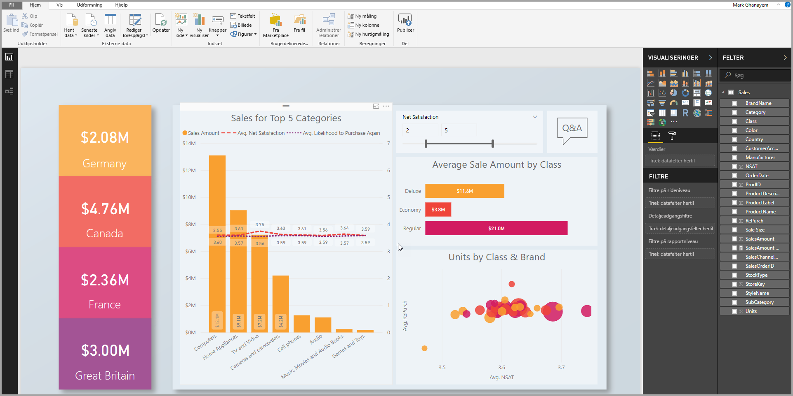
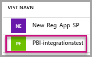
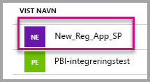
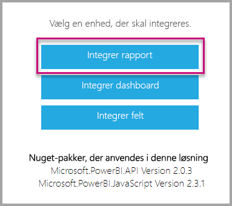
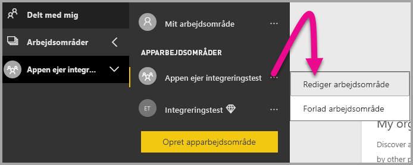
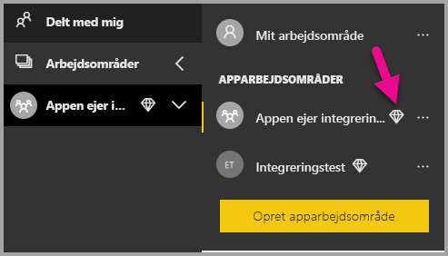

# <a name="tutorial-embed-power-bi-content-into-an-application-for-your-customers"></a>Selvstudium: Integrer Power BI-indhold i en app til dine kunder

Med **Power BI Embedded i Azure** eller **Power BI-integration i Office** kan du integrere rapporter, dashboards eller felter i et program ved hjælp af "appen ejer dataene". **App owns data** handler om at have et program, der bruger Power BI som sin integrerede analyseplatform. Som **ISV** eller **udvikler** kan du oprette Power BI-indhold, der viser rapporter, dashboards eller felter i et program, som er fuldt integreret og interaktivt, uden at brugerne skal have en Power BI-licens. I dette selvstudium kan du se, hvordan du integrerer en rapport i et program ved hjælp af Power BI .NET SDK med Power BI JavaScript-API'en.


I dette selvstudium lærer du, hvordan du kan:
> [!div class="checklist"]
> * Registrere en app i Azure.
> * Integrer en Power BI-rapport i et program.

## <a name="prerequisites"></a>Forudsætninger

Du skal have følgende for at komme i gang:

* En [Power BI Pro-konto](../../service-self-service-signup-for-power-bi.md) (en masterkonto med et brugernavn og en adgangskode, som bruges til at logge på Power BI Pro-kontoen) eller en [tjenesteprincipal (kun program-token)](embed-service-principal.md).
* Du skal have din egen konfiguration af [Azure Active Directory-lejer](create-an-azure-active-directory-tenant.md).

Hvis du ikke er tilmeldt **Power BI Pro**, kan du [tilmelde dig en gratis prøveversion](https://powerbi.microsoft.com/pricing/), før du begynder.

## <a name="set-up-your-embedded-analytics-development-environment"></a>Konfigurer dit integrerede analyseudviklingsmiljø

Før du begynder at integrere rapporter, dashboards eller felter i dit program, skal du sikre dig, at du kan integrere med Power BI i dit miljø.

Du kan gennemgå [værktøjet til konfiguration af integrering](https://aka.ms/embedsetup/AppOwnsData) for hurtigt at komme i gang med og downloade et eksempelprogram, der hjælper dig med at oprette et miljø og integrere en rapport.

Hvis du vælger at konfigurere miljøet manuelt, kan du dog fortsætte nedenfor.

### <a name="register-an-application-in-azure-active-directory-azure-ad"></a>Registrer et program i Azure Active Directory (Azure AD)

[Registrer dit program](register-app.md) med Azure Active Directory for at give dit program adgang til [REST API'erne til Power BI](https://docs.microsoft.com/rest/api/power-bi/). Når du registrerer dit program, får du mulighed for at oprette en identitet for programmet og angive tilladelser til Power BI REST-ressourcer. Den måde, du kommer i gang med at registrere et program på, afhænger af, om du vil bruge en masterkonto eller en [tjenesteprincipal](embed-service-principal.md).

Den valgte metode påvirker, hvilken programtype du registrerer i Azure.

Hvis du fortsætter med en masterkonto, skal du registrere et **oprindeligt** program. Du bruger et oprindeligt program, fordi du arbejder med et logon, der ikke er interaktivt.

Hvis du derimod fortsætter med en tjenesteprincipal, skal du registrere et **serverbaseret webprogram**. Du registrerer et serverbaseret webprogram for at oprette en programhemmelighed.

## <a name="set-up-your-power-bi-environment"></a>Konfigurer dit Power BI-miljø

### <a name="create-a-workspace"></a>Opret et arbejdsområde

Hvis du integrerer rapporter, dashboards eller felter for dine kunder, skal du placere dit indhold i et arbejdsområde. Der er forskellige typer arbejdsområder, som du kan konfigurere: [traditionelle arbejdsområder](../../service-create-workspaces.md) eller [nye arbejdsområder](../../service-create-the-new-workspaces.md). Hvis du bruger en *master*konto, er det ligegyldigt, hvilken type arbejdsområde du bruger. Men hvis du bruger en *[tjenesteprincipal](embed-service-principal.md)* til at logge på dit program, skal du bruge de nye arbejdsområder. I begge scenarier skal både *masterkontoen* og *tjenesteprincipalen* være administrator af arbejdsområderne for dit program.

### <a name="create-and-publish-your-reports"></a>Opret og udgiv dine rapporter

Du kan oprette rapporter og datasæt ved hjælp af Power BI Desktop og derefter publicere disse rapporter i et arbejdsområde. Du kan opnå dette på to måder: Som slutbruger kan du publicere rapporter i et traditionelt arbejdsområde med en masterkonto (Power BI Pro-licens). Hvis du bruger en tjenesteprincipal, kan du publicere rapporter i de nye arbejdsområder ved hjælp af [REST API'erne til Power BI](https://docs.microsoft.com/rest/api/power-bi/imports/postimportingroup).

Nedenstående trin viser, hvordan man publicerer en PBIX-rapport i et Power BI-arbejdsområde.

1. Download eksemplet [Blogdemo](https://github.com/Microsoft/powerbi-desktop-samples) fra GitHub.

    

2. Åbn PBIX-eksempelrapporten i **Power BI Desktop**.

   

3. Publicer i **arbejdsområder**. Denne proces varierer, afhængigt af om du bruger en masterkonto (Power Pro-licens) eller en tjenesteprincipal. Hvis du bruger en masterkonto, kan du publicere din rapport via Power BI Desktop.  Hvis du bruger en tjenesteprincipal, skal du bruge REST API'erne til Power BI.

## <a name="embed-content-using-the-sample-application"></a>Integrer indhold ved hjælp af eksempelprogrammet

Dette eksempel er med vilje enkelt, da det kun skal bruges til demonstrationen. Det er op til dig eller dine udviklere at beskytte programhemmeligheden eller legitimationsoplysningerne til masterkontoen.

Følg nedenstående trin for at begynde at integrere indhold ved hjælp af eksempelprogrammet.

1. Download [Visual Studio](https://www.visualstudio.com/) (version 2013 eller nyere). Sørg for at downloade den nyeste [NuGet-pakke](https://www.nuget.org/profiles/powerbi).

2. Download [eksemplet, hvor appen ejer data,](https://github.com/Microsoft/PowerBI-Developer-Samples) fra GitHub for at komme i gang.

    

3. Åbn filen **Web.config** i eksempelprogrammet. Der er nogle felter, du skal udfylde, for at køre programmet. Du kan vælge **MasterUser** eller **ServicePrincipal** som **AuthenticationType**. Du skal udfylde forskellige felter, afhængigt af hvilken type godkendelsesmetode du vælger.

    > [!Note]
    > **Standardgodkendelsestypen** i dette eksempel er MasterUser.

    <center>

    | **MasterUser** <br> (Power BI Pro-licenser) | **ServicePrincipal** <br> (kun program-token)|
    |---------------|-------------------|
    | [applicationId](#application-id) | [applicationId](#application-id) |
    | [workspaceId](#workspace-id) | [workspaceId](#workspace-id) |
    | [reportId](#report-id) | [reportId](#report-id) |
    | [pbiUsername](#power-bi-username-and-password) |  |
    | [pbiPassword](#power-bi-username-and-password) |  |
    |  | [applicationsecret](#application-secret) |
    |  | [tenant](#tenant) |

   </center>

    

### <a name="application-id"></a>Program-id

Denne attribut er påkrævet for begge AuthenticationTypes (masterkonto og [tjenesteprincipal](embed-service-principal.md)).

Udfyld oplysningerne om **applicationId** med **program-id'et** fra **Azure**. **Program-id'et** bruges af programmet til at identificere sig selv over for de brugere, du anmoder om tilladelser fra.

Hvis du vil hente **applicationId**, skal du følge disse trin:

1. Log på [Azure-portalen](https://portal.azure.com).

2. Vælg **Alle tjenester** i navigationsruden til venstre, og vælg **Appregistreringer**.

    

3. Vælg programmet, der skal bruge **applicationId**.

    

4. Der er angivet et **program-id** som GUID. Brug dette **Program-id** som **applicationId** for programmet.

    

### <a name="workspace-id"></a>Id for arbejdsområde

Denne attribut er påkrævet for begge AuthenticationTypes (masterkonto og [tjenesteprincipal](embed-service-principal.md)).

Udfyld oplysningerne for **workspaceId** med GUID for arbejdsområdet fra Power BI. Du kan få disse oplysninger enten fra URL-adressen, når du er logget på Power BI-tjenesten, eller ved hjælp af Powershell.

URL-adresse <br>


PowerShell <br>

```powershell
Get-PowerBIworkspace -name "App Owns Embed Test"
```

   

### <a name="report-id"></a>Rapport-id

Denne attribut er påkrævet for begge AuthenticationTypes (masterkonto og [tjenesteprincipal](embed-service-principal.md)).

Udfyld **reportId** med GUID for rapporten fra Power BI. Du kan få disse oplysninger enten fra URL-adressen, når du er logget på Power BI-tjenesten, eller ved hjælp af Powershell.

URL-adresse<br>


PowerShell <br>

```powershell
Get-PowerBIworkspace -name "App Owns Embed Test" | Get-PowerBIReport
```


### <a name="power-bi-username-and-password"></a>Brugernavn og adgangskode til Power BI

Disse attributter er kun påkrævet til masterkontoen som AuthenticationType.

Hvis du bruger en [tjenesteprincipal](embed-service-principal.md) til at godkende, behøver du ikke udfylde attributterne for brugernavn og adgangskode.

* Udfyld **pbiUsername** med masterkontoen til Power BI.
* Udfyld **pbiPassword** med adgangskoden til masterkontoen til Power BI.

### <a name="application-secret"></a>Programhemmelighed

Denne attribut bruges kun til [tjenesteprincipalen](embed-service-principal.md) som AuthenticationType.

Udfyld oplysningerne for **ApplicationSecret** ud fra sektionen **Nøgler** i sektionen **Appregistreringer** i **Azure**.  Denne attribut fungerer, når du bruger [tjenesteprincipal](embed-service-principal.md).

Hvis du vil hente **ApplicationSecret**, skal du følge disse trin:

1. Log på [Azure Portal](https://portal.azure.com).

2. Vælg **Alle tjenester** i navigationsruden til venstre, og vælg derefter **Appregistreringer**.

    

3. Vælg programmet, der skal bruge **ApplicationSecret**.

    

4. Vælg **Certifikater og hemmeligheder** under **Administrer**.

5. Vælg **Nye kundehemmeligheder**.

6. Angiv et navn i feltet **Beskrivelse**, og vælg en varighed. Vælg derefter **Gem** for at hente **værdien** til dit program. Når du lukker ruden **Nøgler** efter at have gemt nøgleværdien, vises feltet med værdien kun som skjult. På det tidspunkt kan du ikke hente nøgleværdien. Hvis du mister nøgleværdien, skal du oprette en ny i Azure Portal.

    

### <a name="tenant"></a>Lejer

Denne attribut bruges kun til [tjenesteprincipalen](embed-service-principal.md) som AuthenticationType.

Udfyld oplysningerne om **tenant** med dit lejer-id til Azure. Du kan få disse oplysninger fra [Azure AD Administration](/onedrive/find-your-office-365-tenant-id), når du er logget på Power BI-tjenesten, eller ved hjælp af Powershell.

### <a name="run-the-application"></a>Kør programmet

1. Vælg **Kør** i **Visual Studio**.

    

2. Vælg derefter **Integrer rapport**. Afhængigt af hvilket indhold du vælger at udføre test med – rapporter, dashboards eller felter – skal du vælge den pågældende indstilling i programmet.

    

3. Du kan nu se rapporten i eksempelprogrammet.

    

## <a name="embed-content-within-your-application"></a>Integrer indhold i dit program

Selvom trinnene til at integrere indhold udføres ved hjælp af [REST API'er til Power BI](https://docs.microsoft.com/rest/api/power-bi/), oprettes de eksempelkoder, der er beskrevet i denne artikel, med **.NET-SDK'en**.

Hvis du integrerer for dine kunder i dit program, skal du have et **adgangstoken** til din masterkonto eller en [tjenesteprincipal](embed-service-principal.md) fra **Azure AD**. Du skal have et [Azure AD-adgangstoken](get-azuread-access-token.md#access-token-for-non-power-bi-users-app-owns-data) til dit Power BI-program, før du kan foretage kald til [REST API'erne til Power BI](https://docs.microsoft.com/rest/api/power-bi/).

Hvis du vil oprette Power BI-klienten med dit **adgangstoken**, skal du oprette dit Power BI klientobjekt, som gør det muligt for dig at interagere med [REST API'erne til Power BI](https://docs.microsoft.com/rest/api/power-bi/). Du kan oprette dit Power BI-klientobjekt ved at omgive **AccessToken** med objektet ***Microsoft.Rest.TokenCredentials***.

```csharp
using Microsoft.IdentityModel.Clients.ActiveDirectory;
using Microsoft.Rest;
using Microsoft.PowerBI.Api.V2;

var tokenCredentials = new TokenCredentials(authenticationResult.AccessToken, "Bearer");

// Create a Power BI Client object. it's used to call Power BI APIs.
using (var client = new PowerBIClient(new Uri(ApiUrl), tokenCredentials))
{
    // Your code to embed items.
}
```

### <a name="get-the-content-item-you-want-to-embed"></a>Hent det indholdselementet, du vil integrere

Du kan bruge Power BI-klientobjektet til at hente en reference til det element, du vil integrere.

Her er et kodeeksempel på, hvordan du henter den første rapport fra et givent arbejdsområde.

*Du kan se et eksempel på, hvordan du henter et indholdselement, uanset om det er en rapport, et dashboard eller et felt, du vil integrere, i filen Services\EmbedService.cs i [eksempelprogrammet](https://github.com/Microsoft/PowerBI-Developer-Samples).*

```csharp
using Microsoft.PowerBI.Api.V2;
using Microsoft.PowerBI.Api.V2.Models;

// You need to provide the workspaceId where the dashboard resides.
ODataResponseListReport reports = await client.Reports.GetReportsInGroupAsync(workspaceId);

// Get the first report in the group.
Report report = reports.Value.FirstOrDefault();
```

### <a name="create-the-embed-token"></a>Opret integrationstokenet
Generér et integreringstoken, som kan bruges fra JavaScript-API'en. Der findes to typer API'er. Den første gruppe indeholder fem API'er, der hver især genererer et integreringstoken for et bestemt element. Den anden gruppe, som kun indeholder én API, genererer et token, der kan bruges til at integrere flere elementer.

**API'er til generering af et integreringstoken for et bestemt element**

Det integreringstoken, som oprettes med disse API'er, er specifikt for det element, du integrerer. Når du integrerer et Power BI element (f.eks. en rapport, et dashboard eller et felt) med disse API'er, skal du oprette et nyt integreringstoken til det.
* [GenerateTokenInGroup for dashboards](https://docs.microsoft.com/rest/api/power-bi/embedtoken/dashboards_generatetokeningroup)
* [GenerateTokenInGroup for datasæt](https://docs.microsoft.com/rest/api/power-bi/embedtoken/datasets_generatetokeningroup)
* [GenerateTokenForCreateInGroup for rapporter](https://docs.microsoft.com/rest/api/power-bi/embedtoken/reports_generatetokenforcreateingroup)
* [GenerateTokenInGroup for rapporter](https://docs.microsoft.com/rest/api/power-bi/embedtoken/reports_generatetokeningroup)
* [GenerateTokenInGroup for felter](https://docs.microsoft.com/rest/api/power-bi/embedtoken/tiles_generatetokeningroup)

Prøver på oprettelse af et integreringstoken for en rapport, et dashboard eller et felt er tilgængelige fra følgende filer i [prøveprogrammet](https://github.com/Microsoft/PowerBI-Developer-Samples).
* Services\EmbedService.cs
* Models\EmbedConfig.cs
* Models\TileEmbedConfig.cs

Nedenfor er et kodeeksempel, so kan bruges sammen med API'en for integreringstokenet GenerateTokenInGroup for rapporter.
```csharp
using Microsoft.PowerBI.Api.V2;
using Microsoft.PowerBI.Api.V2.Models;

// Generate Embed Token.
var generateTokenRequestParameters = new GenerateTokenRequest(accessLevel: "view");
EmbedToken tokenResponse = client.Reports.GenerateTokenInGroup(workspaceId, report.Id, generateTokenRequestParameters);

// Generate Embed Configuration.
var embedConfig = new EmbedConfig()
{
    EmbedToken = tokenResponse,
    EmbedUrl = report.EmbedUrl,
    Id = report.Id
};
```

**API til generering af et integreringstoken for flere elementer**<a id="multiEmbedToken"></a>

API'en til integrering, [Generér token](https://docs.microsoft.com/rest/api/power-bi/embedtoken/generatetoken), genererer et token, der kan bruges til at integrere flere elementer.

Det kan også bruges til at vælge et datasæt på en dynamisk måde, mens en rapport integreres. Du kan finde flere oplysninger om denne brug af API'en under [dynamisk binding](embed-dynamic-binding.md).


Nedenfor er et eksempel på brug af denne API.
 
```csharp
using Microsoft.PowerBI.Api.V2;
using Microsoft.PowerBI.Api.V2.Models;

var reports = new List<GenerateTokenRequestV2Report>()
{ 
    new GenerateTokenRequestV2Report()
    {
        AllowEdit = false,
        Id = report1.Id
    },
    new GenerateTokenRequestV2Report()
    {
        AllowEdit = true,
        Id = report2.Id
    }
};

var datasets= new List<GenerateTokenRequestV2Dataset>()
{
    new GenerateTokenRequestV2Dataset(dataset1.Id),
    new GenerateTokenRequestV2Dataset(dataset2.Id),
    new GenerateTokenRequestV2Dataset(dataset3.Id),
};

var targetWorkspaces = new List<GenerateTokenRequestV2TargetWorkspace>()
{
    new GenerateTokenRequestV2TargetWorkspace(workspace1.Id),
    new GenerateTokenRequestV2TargetWorkspace(workspace2.Id),
};

var request = new GenerateTokenRequestV2()
{
    Datasets = datasetsRequestDetails ?? null,
    Reports = reportsRequestDetails,
    TargetWorkspaces = targetWSRequestdetials ?? null,
};

var token = client.GetClient().EmbedToken.GenerateToken(request);
```

### <a name="load-an-item-using-javascript"></a>Indlæs et element ved hjælp af JavaScript

Du kan bruge JavaScript til at indlæse en rapport i et div-element på din webside.

Hvis du vil se et komplet eksempel, hvor JavaScript API'en bruges, kan du bruge [værktøjet Playground](https://microsoft.github.io/PowerBI-JavaScript/demo). Med værktøjet Playground kan du hurtigt prøve dig frem med forskellige typer af eksempler på Power BI Embedded. Du kan også få flere oplysninger om JavaScript-API'en ved at gå til siden [Wiki for PowerBI-JavaScript](https://github.com/Microsoft/powerbi-javascript/wiki).

Her er et eksempel, der anvender modellen **EmbedConfig** og modellen **TileEmbedConfig** sammen med visninger for en rapport.

*Et eksempel på tilføjelse af en visning for en rapport, et dashboard eller et felt er tilgængeligt i Views\Home\EmbedReport.cshtml, Views\Home\EmbedDashboard.cshtml eller Views\Home\Embedtile.cshtml filer i [eksempelprogrammet](#embed-content-using-the-sample-application).*

```javascript
<script src="~/scripts/powerbi.js"></script>
<div id="reportContainer"></div>
<script>
    // Read embed application token from Model
    var accessToken = "@Model.EmbedToken.Token";

    // Read embed URL from Model
    var embedUrl = "@Html.Raw(Model.EmbedUrl)";

    // Read report Id from Model
    var embedReportId = "@Model.Id";

    // Get models. models contains enums that can be used.
    var models = window['powerbi-client'].models;

    // Embed configuration used to describe what and how to embed.
    // This object is used when calling powerbi.embed.
    // This also includes settings and options such as filters.
    // You can find more information at https://github.com/Microsoft/PowerBI-JavaScript/wiki/Embed-Configuration-Details.
    var config = {
        type: 'report',
        tokenType: models.TokenType.Embed,
        accessToken: accessToken,
        embedUrl: embedUrl,
        id: embedReportId,
        permissions: models.Permissions.All,
        settings: {
            filterPaneEnabled: true,
            navContentPaneEnabled: true
        }
    };

    // Get a reference to the embedded report HTML element
    var reportContainer = $('#reportContainer')[0];

    // Embed the report and display it within the div container.
    var report = powerbi.embed(reportContainer, config);
</script>
```

## <a name="move-to-production"></a>Flyt til produktion

Nu, hvor du er færdig med at udvikle dit program, er tiden kommet til at underbygge dit arbejdsområde med en dedikeret kapacitet. 

> [!Important]
> Dedikeret kapacitet er påkrævet for at flytte til produktionen. Alle arbejdsområder (dem, der indeholder rapporter eller dashboards, og dem, der indeholder datasættene) skal være tildelt en kapacitet.

### <a name="create-a-dedicated-capacity"></a>Opret en dedikeret kapacitet

Når du opretter en dedikeret kapacitet, kan du drage fordel af at have en dedikeret ressource for din kunde. Du kan vælge mellem to kapacitetstyper:
* **Power BI Premium** – Et Office 356-abonnement på lejerniveau, der er tilgængeligt i to SKU-serier, *EM* og *P*. Når du integrerer Power BI-indhold, kaldes denne løsning for *integrering i Power BI*. Du kan finde flere oplysninger om dette abonnement under [Hvad er Power BI Premium?](../../service-premium-what-is.md)
* **Azure Power BI Embedded** – du kan købe en dedikeret kapacitet på [Microsoft Azure-portalen](https://portal.azure.com). Dette abonnement bruger *A*-SKU'erne. Du kan finde flere oplysninger om, hvordan du opretter en kapacitet til Power BI Embedded, under [Opret kapacitet til Power BI Embedded på Azure-portalen](azure-pbie-create-capacity.md).
> [!NOTE]
> Med A-SKU'er kan du ikke få adgang til Power BI-indhold med en GRATIS Power BI-licens.

I nedenstående tabel beskrives ressourcerne og begrænsningerne for hver SKU. Hvis du vil finde ud af, hvilken kapacitet der passer bedst til dine behov, skal du se tabellen [Hvilken SKU skal jeg købe til mit scenarie?](https://docs.microsoft.com/power-bi/developer/embedded-faq#which-solution-should-i-choose)

| Kapacitetsnoder | V-kerner i alt | Backend-v-kerner | RAM (GB) | Frontend-v-kerner | DirectQuery/direkte forbindelser (pr. sek.) | Parallel opdatering af modeller |
| --- | --- | --- | --- | --- | --- | --- |
| EM1/A1 | 1 | 0,5 | 2.5 | 0,5 | 3,75 | 1 |
| EM2/A2 | 2 | 1 | 5 | 1 | 7,5 | 2 |
| EM3/A3 | 4 | 2 | 10 | 2 | 15 | 3 |
| P1/A4 | 8 | 4 | 25 | 4 | 30 | 6 |
| P2/A5 | 16 | 8 | 50 | 8 | 60 | 12 |
| P3/A6 | 32 | 16 | 100 | 16 | 120 | 24 |
| | | | | | | |

### <a name="development-testing"></a>Udviklingstest

Brug af integreringstokens med en Pro-licens er beregnet til udviklingstest, så antallet af integreringstokens, der kan genereres af en Power BI-masterkonto eller -tjenesteprincipal, er begrænset. En dedikeret kapacitet kræver integrering i et produktionsmiljø. Der er ingen grænse for, hvor mange integreringstokens du kan generere med en dedikeret kapacitet. Gå til [Tilgængelige funktioner](https://docs.microsoft.com/rest/api/power-bi/availablefeatures/getavailablefeatures) for at undersøge den brugsværdi, der angiver brugen af integrerede tokens i procent. Forbrugsbeløbet er baseret på overordnet konto.

Du kan finde flere oplysninger i [Whitepaper om kapacitetsplanlægning af integreret analyse](https://aka.ms/pbiewhitepaper).

### <a name="assign-a-workspace-to-a-dedicated-capacity"></a>Tildel et arbejdsområde til en dedikeret kapacitet

Når du har oprettet en dedikeret kapacitet, kan du tildele dit arbejdsområde til den dedikerede kapacitet.

Alle arbejdsområder, der indeholder Power BI-ressourcer, som er relateret til det integrerede indhold (herunder datasæt, rapporter og dashboards), skal tildeles til dedikerede kapaciteter. Hvis en integreret rapport og det datasæt, der er bundet til det, f.eks. er placeret i forskellige arbejdsområder, skal begge arbejdsområder tildeles til dedikerede kapaciteter.

Hvis du vil tildele en dedikeret kapacitet til et arbejdsområde ved hjælp af en [tjenesteprincipal](embed-service-principal.md), skal du bruge [REST API'er til Power BI](https://docs.microsoft.com/rest/api/power-bi/capacities/groups_assigntocapacity). Når du bruger REST API'er til Power BI, skal du sørge for at bruge [objekt-id'et for tjenesteprincipalen](embed-service-principal.md).

Følg nedenstående trin for at tildele en dedikeret kapacitet til et arbejdsområde ved hjælp af en **masterkonto**.

1. I **Power BI-tjenesten** skal du udvide arbejdsområder og vælge ellipsen for det arbejdsområde, du bruger til at integrere dit indhold i. Vælg derefter **Rediger arbejdsområder**.

    

2. Udvid **Avanceret**, aktivér derefter **Dedikeret kapacitet**, og vælg derefter den dedikerede kapacitet, du har oprettet. Vælg derefter **Gem**.

    

3. Når du har valgt **Gem**, kan du se en **rombe** ud for navnet på arbejdsområdet.

    

## <a name="next-steps"></a>Næste trin

I dette selvstudium har du lært, hvordan du integrerer Power BI-indhold i en app for dine kunder. Du kan også prøve at integrere Power BI-indhold til din organisation.

> [!div class="nextstepaction"]
>[Integrer til din organisation](embed-sample-for-your-organization.md)

Har du flere spørgsmål? [Prøv at spørge Power BI-community'et](https://community.powerbi.com/)
