# <a name="power-bi-embedded-migration-tool"></a>Overførselsværktøj i Power BI Embedded

Du kan bruge dette overførselsværktøj til at kopiere dine rapporter fra Power BI Embedded Azure-tjenesten (PaaS) til Power BI-tjenesten (SaaS).

Du kan overføre indhold fra dine arbejdsområdesamlinger til Power BI-tjenesten samtidig med din aktuelle løsning, og det medfører ikke nogen nedetid.

## <a name="limitations"></a>Begrænsninger

* Du kan ikke downloade sendte datasæt, og de skal oprettes igen ved hjælp af Power BI REST API'erne til Power BI-tjenesten.
* De PBIX-filer, der er importeret før 26. november 2016, kan ikke downloades.

## <a name="download"></a>Download

Du kan hente eksemplet med overførselsværktøjet fra [GitHub](https://github.com/Microsoft/powerbi-migration-sample). Du kan enten downloade en ZIP-fil fra lageret, eller du kan klone lokalt. Når du har downloadet, kan du åbne *powerbi-migration-sample.sln* i Visual Studio for at bygge og køre overførselsværktøjet.

## <a name="migration-plans"></a>Overførselsplaner

Din overførselsplan er blot metadata, der registrerer indholdet i Power BI Embedded, og som angiver, hvordan du vil publicere dem til Power BI-tjenesten.

### <a name="start-with-a-new-migration-plan"></a>Start med en ny overførselsplan

En overførselsplan er metadataene for de elementer, der findes i Power BI Embedded, og som du vil overføre til Power BI-tjenesten. Overførselsplanen er gemt som en XML-fil.

Du skal starte med at oprette en ny overførselsplan. Du kan oprette en ny overførselsplan ved at gøre følgende:

1. Vælg **File** > **New Migration Plan**.

    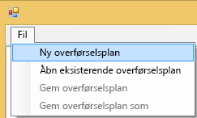

2. I dialogboksen **Select Power BI Embedded Resource Group** skal du vælge rullelisten Environment og vælge prod.

3. Du bliver bedt om at logge på. Du skal logge på med dit Azure-abonnement.

   > [!IMPORTANT]
   > Dette er **ikke** din Office 365-organisationskonto, som du bruger til at logge på Power BI.

4. Vælg det Azure-abonnement, som indeholder dine Power BI Embedded-arbejdsområdesamlinger.

    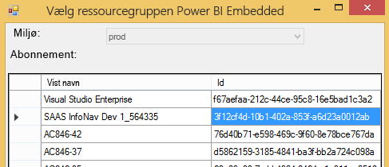
5. Under abonnementslisten skal du vælge den **Resource Group**, der indeholder dine arbejdsområdesamlinger og vælge **Select**.

    

6. Vælg **Analyze**. Dette henter en oversigt over elementerne i dit Azure-abonnement, så du kan påbegynde din plan.

    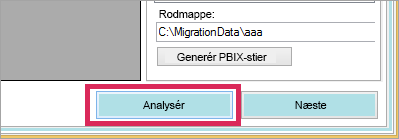

   > [!NOTE]
   > Analysen kan tage nogle minutter. Det afhænger af antallet af arbejdsområdesamlinger og af, hvor meget indhold der findes i arbejdsområdesamlingerne.

7. Når **analysen** er færdig, bliver du bedt om at gemme din overførselsplan.

På nuværende tidspunkt har du forbundet din overførselsplan med dit Azure-abonnement. Herunder kan du læse mere om, hvordan du kan arbejde med din overførselsplan. Dette omfatter Analysér og planlæg overførslen, Download, Opret grupper og Upload.

### <a name="save-your-migration-plan"></a>Gem din overførselsplan

Du kan gemme din overførselsplan, så du kan bruge den igen på et senere tidspunkt. Dette opretter en XML-fil, der indeholder alle oplysningerne i din overførselsplan.

Du kan gemme din overførselsplan på følgende måde.

1. Vælg **File** > **Save Migration Plan**.

    

2. Giv filen et navn, eller brug det genererede navn, og vælg **Save**.

### <a name="open-an-existing-migration-plan"></a>Åbn en eksisterende overførselsplan

Du kan åben en gemt overførselsplan for at fortsætte med at arbejde med overførslen.

Du kan åbne en eksisterende overførselsplan på følgende måde:

1. Vælg **File** > **Open Existing Migration Plan**.

    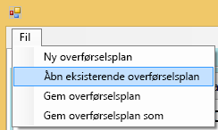

2. Vælg din overførselsfil, og vælg **Open**.

## <a name="step-1-analyze--plan-migration"></a>Trin 1: Analysér og planlæg overførsel

Under fanen **Analyze & Plan Migration** kan du se, hvad der aktuelt findes i ressourcegruppen under dit Azure-abonnement.


Vi bruger *SampleResourceGroup* som eksempel.

### <a name="paas-topology"></a>PaaS-topologi

Dette er en oversigt over dine arbejdsområder under *Resource Group > Workspace collections > Workspaces*. Ressourcegruppen og arbejdsområderne vises med et læsevenligt navn. Arbejdsområderne vises også med et GUID.

Elementerne på listen vises også med en farve og et tal i formatet (#/#). Dette viser, hvor mange rapporter der kan downloades.
En sort farve betyder, at alle rapporterne kan downloades.

En rød farve betyder, at nogle af rapporterne ikke kan downloades. Tallet til venstre indikerer det samlede antal rapporter, der kan downloades. Tallet til højre indikerer det samlede antal rapport i gruppen.

Du kan vælge et element i PaaS-topologien for at få vist rapporterne i rapportsektionen.

### <a name="reports"></a>Reports

I sektionen Reports vises alle de tilgængelige rapporter, og det indikeres, om de kan downloades eller ej.


### <a name="target-structure"></a>Target structure

Under **Target structure** kan du angive, hvor elementerne skal downloades til, og hvordan de skal uploades.

#### <a name="download-plan"></a>Download Plan

Der oprettes automatisk en sti for dig. Du kan ændre stien, hvis du vil. Hvis du ændrer stien, skal du vælge **Update paths**.

> [!NOTE]
> Dette udfører ikke den faktiske download. Her angiver du kun den struktur, som rapporterne downloades til.

#### <a name="upload-plan"></a>Uploadplan

Her kan du angive et præfiks, der skal bruges til de arbejdsområder, som oprettes i Power BI-tjenesten. Efter præfikset placeres GUID for det arbejdsområde, der fandtes i Azure.

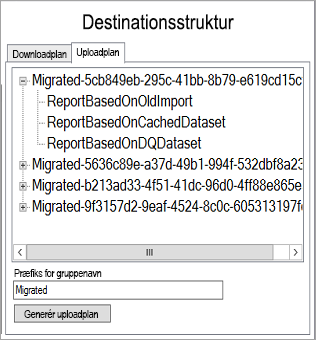

> [!NOTE]
> Dette opretter ikke grupperne i Power BI-tjenesten. Det definerer kun navngivningsstrukturen for grupperne.

Hvis du ændrer præfikset, skal du vælge **Generate Upload Plan**.

Du kan højreklikke på en gruppe og vælge at omdøbe gruppen direkte under Upload plan, hvis du vil.

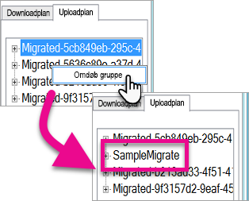

> [!NOTE]
> Navnet på *gruppen* må ikke indeholde mellemrum eller ugyldige tegn.

## <a name="step-2-download"></a>Trin 2: Download

Under fanen **Download** kan du sen en liste over rapporterne og de tilknyttede metadata. Du kan se statussen for eksporten sammen med den tidligere eksportstatus.

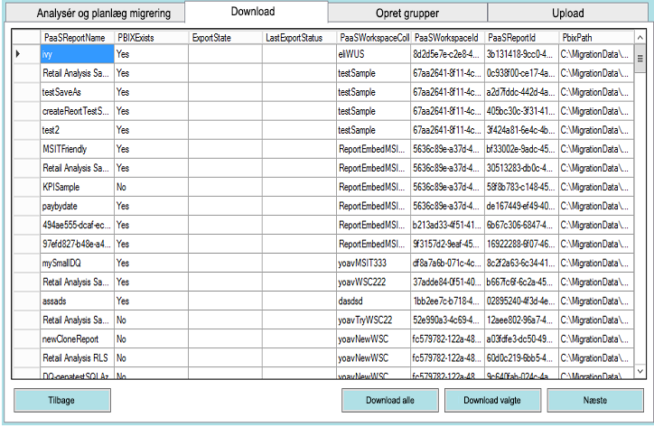

Du har to muligheder.

* Markér bestemte rapporter, og vælg **Download Selected**
* Vælg **Download All**.


Hvis overførslen lykkes, vises statussen *Done*, og det vises, at PBIX-filen findes.

Når overførslen er fuldført, skal du vælge fanen **Create Groups**.

## <a name="step-3-create-groups"></a>Trin 3: Opret grupper

Når du har downloadet rapporterne, kan du gå til fanen **Create Groups**. Under denne fane oprettes arbejdsområderne i Power BI-tjenesten baseret på den migreringsplan, du har oprettet. Der oprettes arbejdsområder med det navn, du har angivet under fanen **Upload** i **Analysér og planlæg migrering**.


Du kan oprette arbejdsområder ved enten at vælge **Opret udvalgte grupper** eller **Opret alle manglende grupper**.

Når du har valgt en af disse indstillinger, bliver du bedt om at logge på. *Du skal bruge dine legitimationsoplysninger til den Power BI-tjeneste, du vil oprette arbejdsområderne i.*

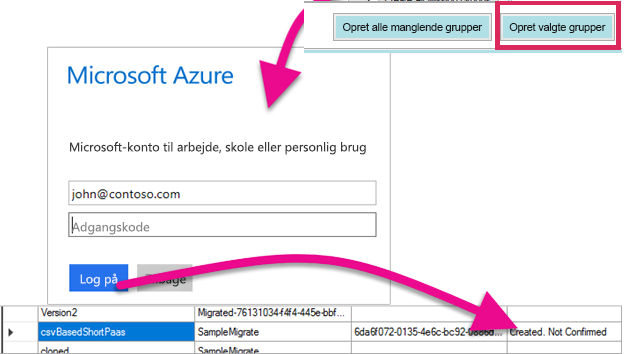

Dermed oprettes arbejdsområdet i Power BI-tjenesten. Rapporterne uploades ikke til arbejdsområdet.

Du kan bekræfte, at arbejdsområdet blev oprettet, ved at logge på Power BI og kontrollere, at det findes. Arbejdsområdet er tomt.


Når arbejdsområdet er oprettet, kan du gå videre til fanen **Upload**.

## <a name="step-4-upload"></a>Trin 4: Upload

Under fanen **Upload** kan du uploade rapporterne til Power BI-tjenesten. Der vises en liste over de rapporter, du har downloadet under fanen Download, og der vises målgruppenavnet baseret på din overførselsplan.


Du kan uploade de valgte rapporter, eller du kan uploade alle rapporterne. Du kan også nulstille statussen for upload for at uploade alle elementerne igen.

Du har også mulighed for at vælge, hvad du vil gøre, hvis der findes en rapport med det samme navn. Du kan vælge mellem **Abort**, **Ignore** og **Overwrite**.

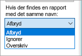

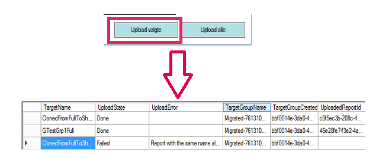

### <a name="duplicate-report-names"></a>Duplikerede rapportnavne

Hvis du allerede har en rapport med samme navn, men du ved, at det er en anden rapport, skal du ændre rapportens **TargetName**. Du kan ændre navnet manuelt ved at redigere XML-filen med overførselsplanen.

Du skal lukke overførselsværktøjet for at ændre dette, og du skal derefter åbne værktøjet og overførselsplanen igen.

I eksemplet herover opstod der en fejl for en af de klonede rapporter, hvilket indikerer, at der allerede findes en rapport med det navn. Du kan se følgende i XML-filen med overførselsplanen.

```xml
<ReportMigrationData>
    <PaaSWorkspaceCollectionName>SampleWorkspaceCollection</PaaSWorkspaceCollectionName>
    <PaaSWorkspaceId>4c04147b-d8fc-478b-8dcb-bcf687149823</PaaSWorkspaceId>
    <PaaSReportId>525a8328-b8cc-4f0d-b2cb-c3a9b4ba2efe</PaaSReportId>
    <PaaSReportLastImportTime>1/3/2017 2:10:19 PM</PaaSReportLastImportTime>
    <PaaSReportName>cloned</PaaSReportName>
    <IsPushDataset>false</IsPushDataset>
    <IsBoundToOldDataset>false</IsBoundToOldDataset>
    <PbixPath>C:\MigrationData\SampleResourceGroup\SampleWorkspaceCollection\4c04147b-d8fc-478b-8dcb-bcf687149823\cloned-525a8328-b8cc-4f0d-b2cb-c3a9b4ba2efe.pbix</PbixPath>
    <ExportState>Done</ExportState>
    <LastExportStatus>OK</LastExportStatus>
    <SaaSTargetGroupName>SampleMigrate</SaaSTargetGroupName>
    <SaaSTargetGroupId>6da6f072-0135-4e6c-bc92-0886d8aeb79d</SaaSTargetGroupId>
    <SaaSTargetReportName>cloned</SaaSTargetReportName>
    <SaaSImportState>Failed</SaaSImportState>
    <SaaSImportError>Report with the same name already exists</SaaSImportError>
</ReportMigrationData>
```

For det element, hvor der opstod fejl, kan jeg ændre navnet for SaaSTargetReportName.

```xml
<SaaSTargetReportName>cloned2</SaaSTargetReportName>
```

Derefter kan jeg åbne planen i overførselsværktøjet og uploade rapporten igen.

Når vi går tilbage til Power BI, kan vi se, at rapporterne og datasættene er blevet uploadet i arbejdsområdet.

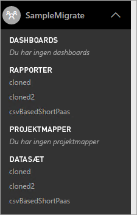

<a name="upload-local-file"></a>

### <a name="upload-a-local-pbix-file"></a>Upload en lokal PBIX-fil

Du kan uploade en lokal version af en Power BI Desktop-fil. Du skal lukke værktøjet, redigere XML-filen og angive den fulde sti til din lokale PBIX-fil i egenskaben **PbixPath**.

```xml
<PbixPath>[Full Path to PBIX file]</PbixPath>
```

Når du har redigeret XML-filen, skal du åbne planen i overførselsværktøjet igen og uploade en rapport.

<a name="directquery-reports"></a>

### <a name="directquery-reports"></a>DirectQuery-rapporter

Du skal opdatere forbindelsesstrengen for DirectQuery-rapporter. Dette kan du gøre på *powerbi.com*, eller du kan programmeringsmæssigt oprette en forepørgsel til forbindelsesstrengen fra Power BI Embedded (PaaS). Du kan se et eksempel i [Udtræk DirectQuery-forbindelsesstrengen fra PaaS-rapport](migrate-code-snippets.md#extract-directquery-connection-string-from-paas-report).

Du kan derefter opdatere forbindelsesstrengen for datasættet i Power BI-tjenesten (SaaS) og angive legitimationsoplysningerne for datakilden. Du kan se følgende eksempler for at få flere detaljer.

* [Opdater DirectQuery-forbindelsesstreng i SaaS-arbejdsområde](migrate-code-snippets.md#update-directquery-connection-string-is-saas-workspace)
* [Angiv DirectQuery-legitimationsoplysninger i SaaS-arbejdsområde](migrate-code-snippets.md#set-directquery-credentials-in-saas-workspace)

## <a name="embedding"></a>Integration

Nu, hvor dine rapporter er migreret fra Azure-tjenesten Power BI Embedded til Power BI-tjenesten, kan du opdatere din applikation og begynde at integrere rapporterne i dette arbejdsområde.

Du kan finde flere oplysninger under [Sådan overfører du indhold fra arbejdsområdesamlinger i Power BI Embedded til Power BI](migrate-from-powerbi-embedded.md).

## <a name="next-steps"></a>Næste trin

[Integrer med Power BI](embedding.md)  
[Sådan overfører du indhold i arbejdsområdesamlingen i Power BI Embedded til Power BI](migrate-from-powerbi-embedded.md)  
[Power BI Premium – hvad er det?](../../admin/service-premium-what-is.md)  
[Git-lager til JavaScript-API](https://github.com/Microsoft/PowerBI-JavaScript)  
[Git-lager til Power BI C#](https://github.com/Microsoft/PowerBI-CSharp)  
[Integreret JavaScript-eksempel](https://microsoft.github.io/PowerBI-JavaScript/demo/)  
[Hvidbog til Power BI Premium](https://aka.ms/pbipremiumwhitepaper)  

Flere spørgsmål? [Prøv at spørge Power BI-community'et](https://community.powerbi.com/)