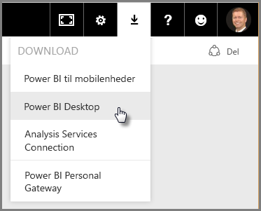
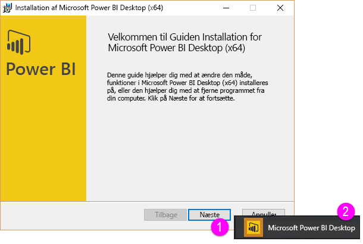
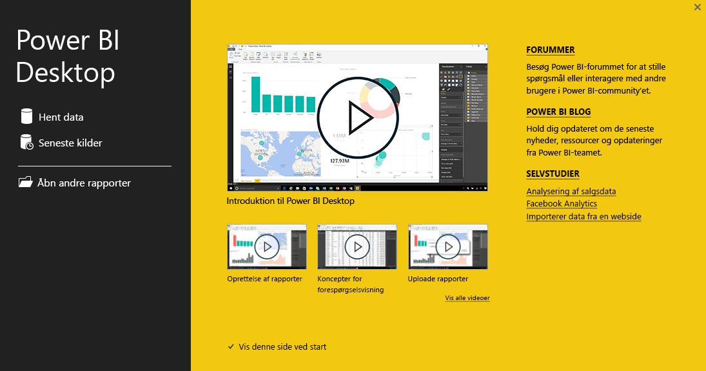

Velkommen til det andet afsnit i dette kursus i **Automatiseret læring** i Power Bi kaldet **Hent data**. Dette afsnit fokuserer på de mange datacentrerede funktioner og værktøjer i Power BI og specielt Power BI Desktop. Mange af disse værktøjer fås også til Power BI-tjenesten, så du får dobbelt så meget ud af læringen i dette afsnit.

Når du henter data, så er de ikke så veludformet eller *rene*, som du ønsker. Så i dette afsnit skal du lære, hvordan du henter data, renser dem (også kaldet *rensning* eller *transformering* af data), samt lære nogle avancerede tricks, der kan afhjælpe datahentning.

Som altid i dette kursus følger din læringsproces den samme rute som arbejdsflowet i Power BI. Så lad os se på **Power BI Desktop**, hvor det ofte begynder.

## En oversigt over Power BI Desktop
Power BI Desktop er et værktøj beregnet til at oprette forbindelse til, rense og visualisere dine data. Du kan bruge Power BI Desktop til at oprette forbindelse til data og derefter udforme og visualisere dem på forskellige måder. De fleste brugere, som arbejder på Business Intelligence-projekter, bruger det meste af tiden i Power BI Desktop.

Du kan hente Power BI Desktop [fra internettet](http://go.microsoft.com/fwlink/?LinkID=521662), eller fra Power BI-tjenesten. Du skal bare vælge pil ned-knappen i den øverste højre side i Power BI og derefter vælge Power BI Desktop.

Power BI Desktop installeres som et program på din Windows-computer.

Så når du har downloadet programmet, skal du installere Power BI Desktop og køre det som ethvert andet program i Windows. Det følgende billede viser startskærmen i Power BI Desktop, der vises, når du starter programmet.

Power BI Desktop opretter forbindelse til en lang række datakilder, fra lokale databaser til Excel-regneark til cloudtjenester. Du kan med fordel bruge programmet til at rense og formatere data, så de er mere anvendelige, herunder opdeling og omdøbning af kolonner, ændring af datatyper og arbejde med datoer. Du kan også oprette relationer mellem kolonner, så det er lettere at udforme og analysere data.

