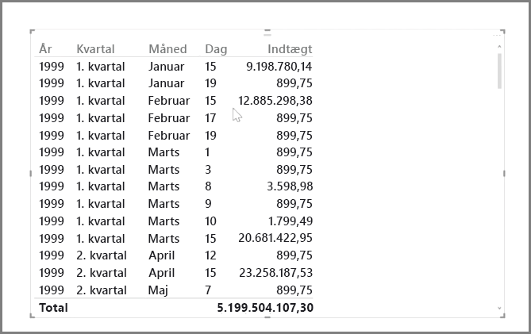
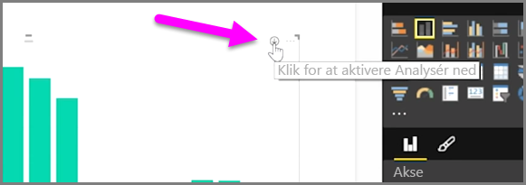
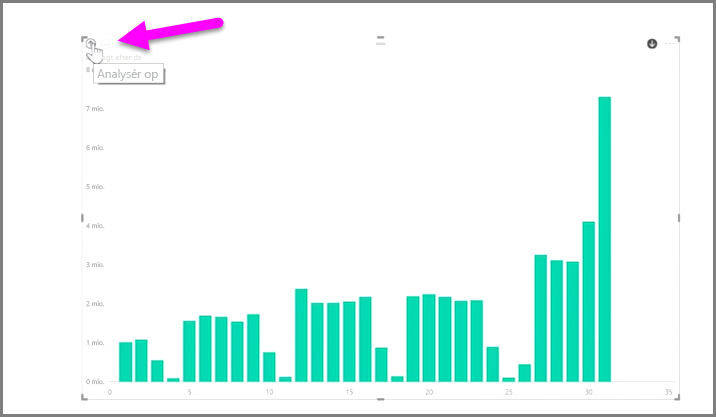
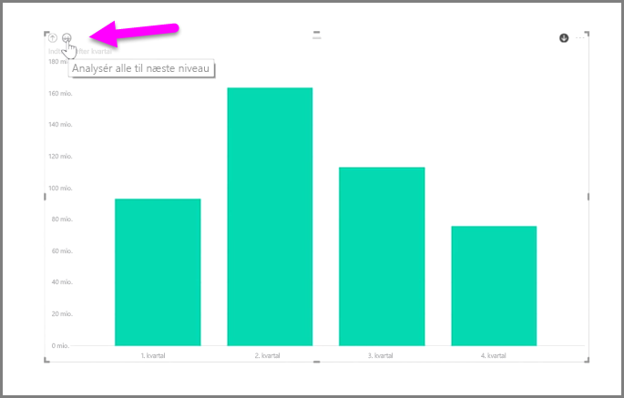
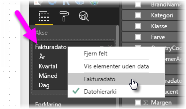

Det er let at analysere tidsbaserede data med Power BI. Modelleringsfunktionerne i Power BI Desktop indeholder automatisk genererede felter, som kan bruges til at analysere gennem år, kvartaler, måneder og dage med et enkelt klik.  

Når du opretter en tabelvisualisering i rapporten ved hjælp af et datofelt, så inkluderer Power BI Desktop automatisk opdelinger efter tidsperiode. F.eks. blev det enkelte datofelt i tabellen **Dato** automatisk opdelt i år, kvartal, måned og dag af Power BI, som vist i det følgende billede.

Visualiseringer viser som standard data på niveauet *år*, men du kan ændre dette ved at aktivere **Analysér ned** i det øverste højre hjørne af det visuelle element.

Når du nu klikker på linjerne i diagrammet, så analyserer det ned til det næste niveau i tidshierarkiet, f.eks. fra *år* til *kvartaler*. Du kan fortsætte med at analysere nedad, indtil du når ned til det mest findelte niveau i hierarkiet, som i dette eksempel er *dage*. For at gå opad igen i tidshierarkiet skal du klikke på **Analysér op** i det øverste venstre hjørne af det visuelle element.

Du kan også analysere nedad gennem alle dataene, der vises på det visuelle element, i stedet for én valgt periode, ved at bruge dobbeltpil-ikonet **Analysér alle**, der også er placeret i det øverste højre hjørne i det visuelle element.

Så længe modellen har et datofelt, så genererer Power BI automatisk forskellige visninger for forskellige tidshierarkier.

For at komme tilbage til individuelle datoer i stedet for at bruge datohierarkiet skal du blot højreklikke på kolonnenavnet i **Felter** (på det følgende billede er det navnet på kolonnen *FakturaDato*) og derefter vælge kolonnenavnet på menuen, der vises, i stedet for **Datohierarki**. Det visuelle element viser derefter dataene baseret på de pågældende kolonnedata uden at bruge datohierarkiet. Har du brug for at gå tilbage til at bruge datohierarkiet? Det er let nok – du skal bare højreklikke igen og vælge **Datohierarki** på menuen.

## Næste trin
**Tillykke!** Du har gennemført dette afsnit af kurset **Automatiseret læring** til Power BI. Nu hvor du er blevet bekendt med *modellering* af data, så er du klar til at få mere at vide om alt det sjove, som venter i det næste afsnit: **Visualiseringer**.

Som nævnt opbygger dette kursus din viden ved at følge det almindelige arbejdsflow i Power BI:

* Overfør data til **Power BI Desktop**, og opret en rapport.
* Udgiv til Power BI-tjenesten, hvor du kan oprette nye **visualiseringer** og oprette dashboards
* **Del** dine dashboards med andre, især personer, der er på farten
* Få vist og interager med delte dashboards og rapporter i **Power BI Mobile**-apps

Selvom du ikke skal gøre alt arbejdet selv, så får du *kendskab* til, hvordan de pågældende dashboards er oprettet, og hvordan de er forbundet til data... og når du er færdig med dette kursus, så kan du oprette dit eget.

Vi ses i næste afsnit!

