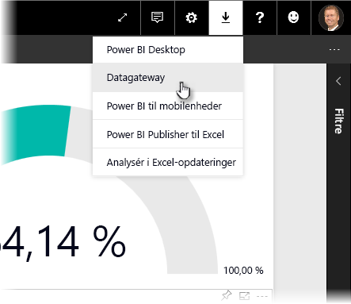
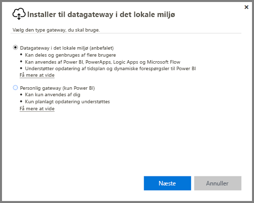
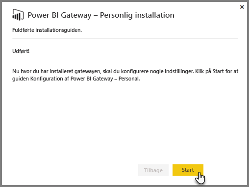
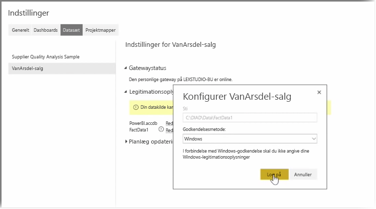
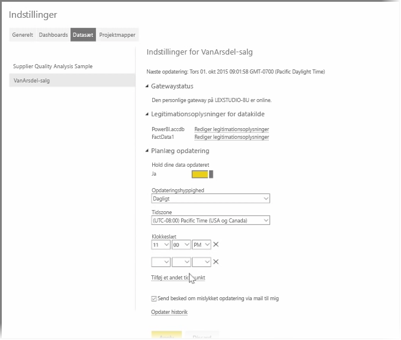

I de forrige emner kiggede vi på, hvordan du kan bruge Power BI til at oprette forbindelse til datakilder, og hvordan du manuelt opdaterer datasæt på Power BI-tjenesten. Det er dog ikke meningen, at du skal opdatere data manuelt ved hver dataændring. Du kan bruge Power BI til at konfigurere en planlagt opdatering, der opretter forbindelse til datakilder og udgiver dem i Power BI-tjenesten automatisk. På denne måde kan du også forbinde tjenesten til givne lokale datakilder, herunder Excel-filer, Access-databaser, SQL-databaser m.m.

Systemet, der giver dig mulighed for at forbinde lokale datakilder til Power BI-tjenesten, kaldes en **datagateway**. Det er et mindre program, der kører på computeren og bruger en foruddefineret plan til at forbinde data, indsamle relevante opdateringer og føre dem op til Power BI-tjenesten. Den **personlige gateway** er en version af den **datagateway**, der kan bruges uden nogen administratorkonfiguration.

>[!NOTE]
>Computeren, der kører den personlige gateway i Power BI, *skal* være tilsluttet internettet, for at den **personlige gateway** fungerer korrekt.
> 

Du konfigurerer den **personlige gateway** ved først at logge på Power BI-tjenesten. Vælg ikonet **Download** i øverste højre hjørne af skærmen, og vælg derefter **Data Gateways** i menuen.

Herfra bliver du ført hen til websiden, hvor du kan vælge **Power BI Gateway – Personlig**, som vist nedenfor.

Kør programmet, når det er færdigt med at downloade, og gennemfør installationsguiden.

Du bliver derefter bedt om at starte konfigurationsguiden for at konfigurere gatewayen.

Du bliver først bedt om at logge på Power BI-tjenestens konto og derefter om at logge på computerens Windows-konto, fordi gateway-tjenesten kører under din konto.

Gå tilbage til Power BI-tjenesten. Vælg ellipsemenuen (tre punkter) ud for det datasæt, du vil opdatere, og vælg derefter **Planlæg opdatering**. Derved åbnes siden **Opdater indstillinger**. Power BI registrerer, at du har installeret en **personlig gateway**, og viser dig dens status.

Vælg **Rediger legitimationsoplysninger** ud for hver relevant datakilde og konfigurer godkendelse.

Endelig skal du konfigurere indstillingerne under **Planlæg opdatering** for at aktivere automatiske opdateringer og konfigurere hvornår og hvor ofte, de skal foregå.

Så er du færdig. På de planlagte tidspunkter vil Power BI etablere forbindelse til de relevante datakilder med de angivne legitimationsoplysninger og via computeren med din **personlige gateway** kørende og opdatere rapporter og datasæt i henhold til din tidsplan. Næste gang du åbner Power BI, så afspejler disse dashboards, rapporter og datasæt, dataene fra den seneste planlagte opdatering.

## Næste trin
**Tillykke!** Du har nu gennemført afsnittet **Udforsk data** i kurset **Automatiseret læring** til Power BI. Power BI-tjenesten er fuld af interessante måder, hvorpå du kan udforske data, dele indsigter og interagere med visuelle elementer. Og det kan alt sammen tilgås via en browser, fra en tjeneste, du kan oprette forbindelse til overalt.

En stærk og velkendt Power BI-partner er **Excel**. Power BI og Excel er designet til at arbejde tæt sammen; så projektmapper hører naturlig hjemme i Power BI, og de kan let overføres dertil.

Hvor let er det? Netop det får du lært i det næste afsnit **Power BI og Excel**.

Vi ses i det næste afsnit!

