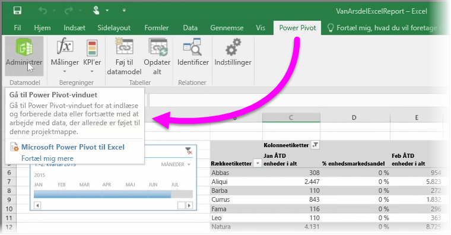

Hvis du bruger nogen af Excels avancerede BI-funktioner såsom **Power Query** (den hedder **Hent og transformér** i Excel 2016) til at forespørge og indlæse data, **Power Pivot** til at oprette stærke datamodeller og **Power View** til at oprette dynamiske rapporter, kan du også importere dem til Power BI.

Hvis du bruger **Power Pivot** til at oprette avancerede datamodeller som dem, der har flere relaterede tabeller, målinger, beregnede kolonner og hierarkier, kan Power BI også importere alle dem.

Det er intet problem, hvis din projektmappe har **Power View-ark**. Power BI opretter dem igen som nye **Rapporter** i Power BI. Du kan starte fastgørelse af de visuelle effekter til dashboards med det samme.

Og her er en af de gode funktioner i Power BI: Hvis du bruger Power Query eller Power Pivot til at oprette forbindelse til, forespørge og indlæse data fra en ekstern datakilde, kan du konfigurere **planlagt opdatering**, når du har importeret din projektmappe i Power BI. Via planlagt opdatering bruger Power BI forbindelsesoplysningerne fra din projektmappe til at oprette direkte forbindelse til datakilden og forespørge og indlæse eventuelle data, der er blevet ændret. Alle visualiseringer i rapporterne opdateres også automatisk.

