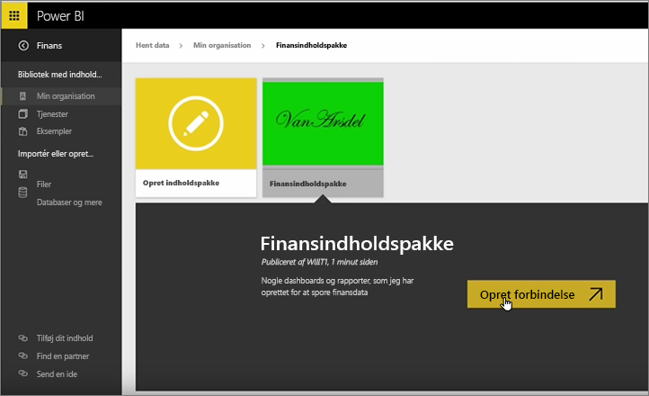
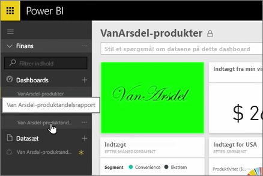

Vi har allerede oprettet en indholdspakke og en gruppe i tidligere lektioner. I denne lektion vil vi oprette en forekomst af indholdspakken til alle i gruppen.

Jeg starter i Mit arbejdsområde ...

... og går tilbage til den økonomigruppe, jeg oprettede i den tidligere lektion.

Gruppen har endnu ikke nogen dashboards, rapporter eller datasæt. Jeg vil bruge den indholdspakke, jeg har oprettet. Jeg gennemser indholdspakker fra min organisation i stedet for dem fra tredjepartstjenester.

Jeg finder den indholdspakke, jeg oprettede for et minut siden. Jeg kan se, hvorfor det er vigtigt at give den en god titel, beskrivelse og et godt billede, så folk kan finde den. Jeg opretter forbindelse til den.

Power BI importerer de dashboards, rapporter og datasæt, der er i indholdspakken.

Når jeg vælger datasættet, spørger Power BI, om jeg vil tilpasse indholdspakken.

Jeg opretter en kopi af indholdspakken, som jeg kan foretage ændringer til, og afbryder forbindelsen til den udgivne version af indholdspakken. Hvis forfatteren af indholdspakken foretager ændringer til den version, der er publiceret, får jeg ikke automatisk disse opdateringer.

Men jeg kan redigere dashboardet, rapporten og selv datasættene, hvis jeg vil.

Så indholdspakker er en nem måde at genbruge indhold, der er oprettet af andre personer i din organisation.

Videre til næste lektion!

