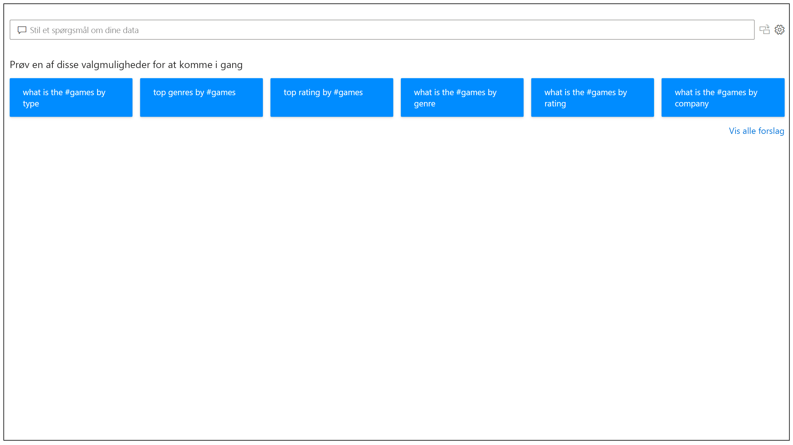
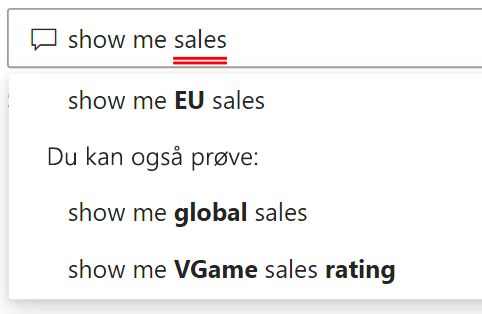
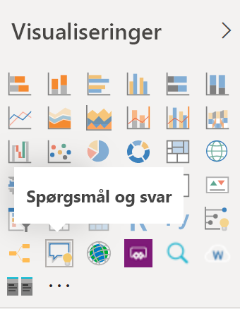
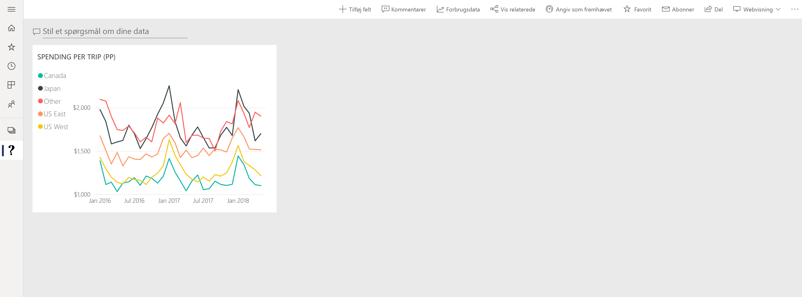

# Introduktion til Spørgsmål og svar i Power BI

Den hurtigste måde at få et svar ud af dine data på er nogle gange at udføre en søgning i dine data ved hjælp af et naturligt sprog. Funktionen Spørgsmål og svar i Power BI giver dig mulighed for at udforske dine data med dine egne ord ved hjælp af et naturligt sprog. Funktionen Spørgsmål og svar er interaktiv, ja endda sjov. Ofte fører ét spørgsmål til andre, da visualiseringerne viser interessante stier, der skal udforskes. At stille spørgsmålet er kun begyndelsen. Gå på opdagelse i dine data, mens du stiller detaljerede eller generelle spørgsmål, finder nye oplysninger, fokuserer på detaljer eller zoomer ud for at få et større overblik. Oplevelsen er interaktiv og hurtig og drives af et lager i hukommelsen. 

Spørgsmål og svar i Power BI er gratis og tilgængelig til alle brugere. I Power BI Desktop kan rapportdesignere bruge Spørgsmål og svar til at udforske data og oprette visualiseringer. I Power BI-tjenesten kan alle udforske deres data med Spørgsmål og svar. Hvis du har tilladelse til at redigere et dashboard eller en rapport, kan du også fastgøre resultaterne fra Spørgsmål og svar.

## Sådan bruger du Spørgsmål og svar

Selv inden du begynder at skrive, viser Spørgsmål og svar en ny skærm med forslag som hjælp til at udforme dit spørgsmål. Start enten fra et af de foreslåede spørgsmål, eller skriv dine egne spørgsmål. Spørgsmål og svar understøtter en lang række spørgsmål, herunder, men ikke begrænset til:

- **Stil naturlige spørgsmål** Hvilket salg har den største omsætning?
- **Brug relativ datofiltrering** Vis salg inden for det sidste år
- **Returner kun de øverste N** De 10 mest populære produkter efter salg
- **Angiv et filter** Vis salg i USA
- **Angiv komplekse betingelser** Vis salg, hvor produktkategori er Kategori 1 eller Kategori 2
- **Returner en bestemt visualisering** Vis salg efter produkt som et cirkeldiagram
- **Brug komplekse sammenlægninger** Vis mediansalg efter produkt
- **Sortér resultater** Vis de 10 mest populære lande efter salg sorteret efter landekode
- **Sammenlign data** Vis dato efter samlet salg i forhold til samlede omkostninger
- **Se tendenser** Vis salg over tid

### Autofuldførelse

I takt med at du skriver dit spørgsmål, kan Spørgsmål og svar i Power BI vise relevante og kontekstafhængige forslag, der kan hjælpe dig med hurtigt at blive produktiv med et naturligt sprog. I takt med at du skriver, får du øjeblikkelig feedback og resultater. Oplevelsen svarer til at skrive i en søgemaskine.

### Rød/blå understregning

I Spørgsmål og svar vises ord med understregninger for at hjælpe dig med at se, hvilke ord systemet har forstået eller ikke genkendt. En hel blå understregning angiver, at systemet har matchet ordet med et felt eller en værdi i datamodellen. I eksemplet nedenfor kan du se, at ordet *EU-salg* blev genkendt i Spørgsmål og svar.

Når du skriver et ord i Spørgsmål og svar, er det ofte markeret med en rød understregning. En rød understregning kan indikere et af to potentielle problemer. Den første problemtype er kategoriseret som *lav tillid*. Hvis du skriver et vagt eller flertydigt ord, understreges feltet med rødt. Et eksempel kunne være ordet "Salg". Flere felter kan indeholde ordet "Salg", så systemet bruger en rød understregning for at bede dig om at vælge det felt, du mener. Et andet eksempel på lav tillid kan være, hvis du skriver ordet "område", men den kolonne, der matches, er "region". Spørgsmål og svar i Power BI genkender ord, der betyder det samme, takket være integrationen med Bing og Office. Ordet understreges med rødt i Spørgsmål og svar, så du ved, at det ikke er et direkte match.

Den anden problemtype er, når ordet overhovedet ikke genkendes i Spørgsmål og svar. Du kan støde på dette problem, når du bruger et domænespecifikt begreb, der ikke er nævnt nogen steder i dataene, eller datafelterne er navngivet forkert. Et eksempel kan være brugen af ordet "omkostninger", selvom det ikke findes nogen steder i dataene. Ordet findes i den danske ordbog, men det markeres med en rød understregning i Spørgsmål og svar.

> [!NOTE]
> Du kan tilpasse farverne blå/rød understregning i ruden **Visuel formatering** i Spørgsmål og svar. Artiklen om [værktøjer til Spørgsmål og svar](q-and-a-tooling-teach-q-and-a.md) indeholder også en forklaring af, hvordan du *oplærer Spørgsmål og svar*, hvor du definerer begreber, som ikke blev genkendt i Spørgsmål og svar.

### Resultater af visualisering

I takt med at du skriver dit spørgsmål, forsøger Spørgsmål og svar øjeblikkeligt at fortolke og visualisere svaret. Som en del af de seneste opdateringer forsøger Spørgsmål og svar nu at fortolke spørgsmålet og automatisk placere felterne på den rette akse. Hvis du f.eks. skriver "Salg efter år", registrerer Spørgsmål og svar, at år er et datofelt og prioriterer altid at placere dette felt på X-aksen. Hvis du vil ændre visualiseringstypen, skal du skrive "som *diagramtype*" efter spørgsmålet. I øjeblikket understøttes følgende visualiseringstyper i Spørgsmål og svar:

- Kurvediagram
- Liggende søjlediagram
- Matrix
- Tabel
- Kort
- Område
- Cirkeldiagram
- Punkt-/boblediagram
 

## Føj Spørgsmål og svar til en rapport

Du kan føje Spørgsmål og svar til en rapport i Power BI Desktop eller Power BI-tjenesten på to forskellige måder:

- Tilføj en visualisering til Spørgsmål og svar.
- Tilføj en knap for Spørgsmål og svar.

Hvis du vil føje visualiseringen til Spørgsmål og svar til en rapport, skal du vælge det nye ikon for **Spørgsmål og svar** og derefter vælge den nye visualisering til Spørgsmål og svar i ruden Visualiseringer. Du kan også dobbeltklikke et vilkårligt sted på rapportlærredet for at indsætte visualiseringen til Spørgsmål og svar.

Hvis du vil tilføje en knap, skal du på båndet **Start** vælge **Knapper** > **Spørgsmål og svar** Du kan tilpasse udseendet af knappen for Spørgsmål og svar fuldstændigt.

> [!NOTE]
> Når du starter Spørgsmål og svar fra knappen, bruger den stadig den gamle version af Spørgsmål og svar. Dette ændres i efterfølgende udgaver af Power BI.

## Brug Spørgsmål og svar til dashboards

Som standard er Spørgsmål og svar tilgængelig øverst på dashboards. Hvis du vil bruge Spørgsmål og svar, skal du skrive i feltet **Stil et spørgsmål til dine data**.

## De næste trin

Du kan integrere et naturligt sprog i dine rapporter på flere forskellige måder. Du kan finde flere oplysninger i disse artikler:

* [Visualisering til Spørgsmål og svar](../visuals/power-bi-visualization-q-and-a.md)
* [Bedste praksis for Spørgsmål og svar](q-and-a-best-practices.md)
