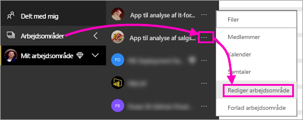
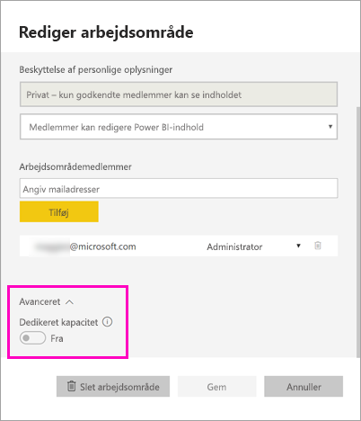
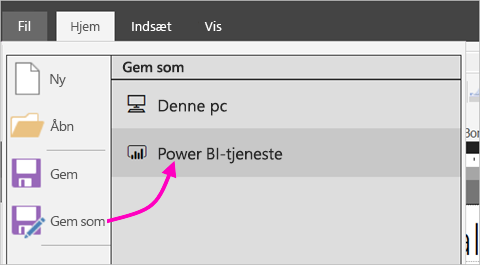
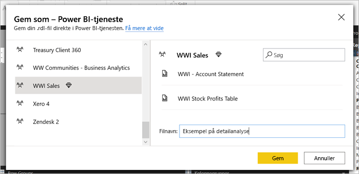
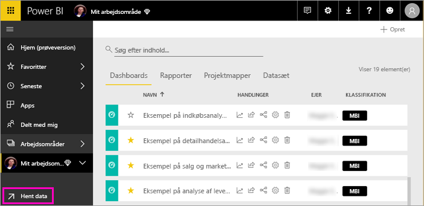
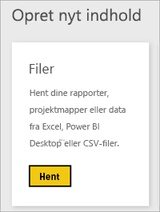
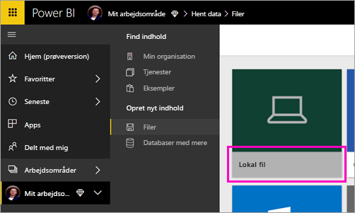
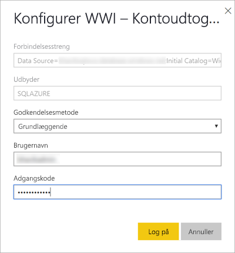

# Publicer en sideinddelt rapport i Power BI-tjenesten

I denne artikel lærer du om publicering af en sideinddelt rapport i Power BI-tjenesten ved at uploade den fra din lokale computer. Du kan uploade sideinddelte rapporter til Mit arbejdsområde eller andre arbejdsområder, så længe arbejdsområdet er i en Premium-kapacitet. Se efter rombeikonet  ud for navnet på arbejdsområdet. 

Hvis din datakilde til rapporten er i det lokale miljø, skal du oprette en gateway, når du har uploadet rapporten. Se afsnittet [Opret en gateway](#create-a-gateway) senere i denne artikel.

## Føj et arbejdsområde til en Premium-kapacitet

Hvis arbejdsområdet ikke har rombeikonet  ud for navnet, skal du føje arbejdsområdet til en Premium-kapacitet. 

1. Vælg **Arbejdsområder**, vælg ellipsen ( **...** ) ud for navnet på arbejdsområdet, og vælg derefter **Rediger arbejdsområde**.

    

1. I dialogboksen **Rediger arbejdsområde** skal du udvide **Avanceret** og derefter sørge for, at indstillingen **Dedikeret kapacitet** er angivet til **Til**.

    

   Du kan muligvis ikke kan ændre den. Hvis ikke, skal du kontakte administratoren af Power BI Premium-kapacitet for at får tildelt rettigheder, så du kan føje dit arbejdsområde til en Premium-kapacitet.

## Udgiv en sideinddelt rapport fra Power BI Report Builder

1. Opret din sideinddelte rapport i Report Builder, og gem den på din lokale computer.

1. I menuen **Filer** i Power BI Report Builder skal du vælge **Gem som**.

    

    Hvis du ikke er logget på Power BI endnu, skal du logge på eller oprette en konto nu. I øverste højre hjørne af Power BI Report Builder skal du vælge **Log på** og udføre trinnene.

2. På listen over arbejdsområder til venstre skal du vælge et arbejdsområde med diamantikonet  ud for navnet. Skriv et **filnavn** i feltet > **Gem**. 

    

4. Åbn Power BI-tjenesten i en browser, og gå til arbejdsområdet Premium, hvor du udgav den sideinddelte rapport. Under fanen **Rapporter** kan du se din rapport.

    

5. Vælg den sideinddelte rapport for at åbne den i Power BI-tjenesten. Hvis den indeholder parametre, skal du vælge dem, før du kan få vist rapporten.

    

6. Hvis din rapportdatakilde er i det lokale miljø, kan du læse om, hvordan du [opretter en gateway](#create-a-gateway) i denne artikel for at få adgang til datakilden.

## Overfør en sideinddelt rapport fra Power BI-tjenesten

Du kan også starte fra Power BI-tjenesten og overføre en sideinddelt rapport.

1. Opret din sideinddelte rapport i Report Builder, og gem den på din lokale computer.

1. Åbn Power BI-tjenesten i en browser, og gå til arbejdsområdet Premium, hvor du vil publicere rapporten. Se efter rombeikonet  ud for navnet. 

1. Vælg **Hent data**.

    

1. Vælg **Hent** i feltet **Filer**.

    

1. Vælg **Lokal fil** > gå til den sideinddelte rapport > **Åbn**.

    

1. Vælg **Fortsæt** > **Rediger legitimationsoplysninger**.

    

1. Konfigurer dine legitimationsoplysninger > **Log på**.

    

   Under fanen **Rapporter** kan du se din rapport.

    

1. Vælg den for at åbne den i Power BI-tjenesten. Hvis den indeholder parametre, skal du vælge dem, før du kan få vist rapporten.
 
    

6. Hvis din rapportdatakilde er i det lokale miljø, kan du læse om, hvordan du [opretter en gateway](#create-a-gateway) i denne artikel for at få adgang til datakilden.

## Opret en gateway

Ligesom alle andre Power BI-rapporter skal du oprette eller oprette forbindelse til en gateway til at få adgang til dataene, hvis datakilden for rapporten er i det lokale miljø.

1. Ud for navnet på rapporten, skal du vælge **Administrer**.

   

1. Du kan se yderligere oplysninger og næste trin i artiklen [Hvad er en datagateway i det lokale miljø](../connect-data/service-gateway-onprem.md) til Power BI-tjenesten.

## Næste trin

- [Publicer en sideinddelt rapport i Power BI-tjenesten](../consumer/paginated-reports-view-power-bi-service.md)
- [Hvad er sideinddelte rapporter i Power BI Premium?](paginated-reports-report-builder-power-bi.md)
- [Selvstudium: Integrer sideinddelte Power BI-rapporter i et program til dine kunder](../developer/embedded/embed-paginated-reports-customers.md)
