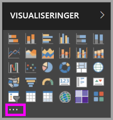
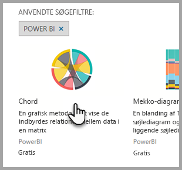
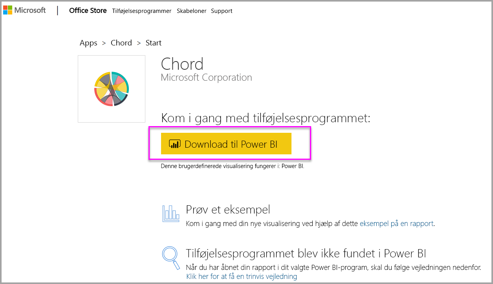
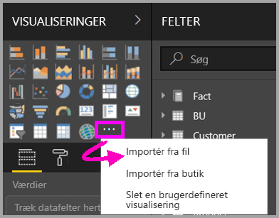

# Brugerdefinerede visualiseringer i Power BI
Når du opretter eller redigerer en Power BI-rapport, er der mange forskellige tilgængelige visualiseringstyper, du kan bruge. Disse visualiseringer vises i ruden **Visualiseringer**. Når du downloader Power BI Desktop eller åbner Power BI-tjenesten (app.powerbi.com), får du dette sæt "forudpakkede" visualiseringer med. 

Du er dog ikke begrænset til dette sæt visualiseringer. Når du vælger ellipsen, åbnes en anden kilde af rapportvisualiseringer: *brugerdefinerede visualiseringer*.

Brugerdefinerede visualiseringer oprettes af communitymedlemmer og af Microsoft, og de hostes på [AppSource](https://appsource.microsoft.com/marketplace/apps?product=power-bi-visuals). Disse visualiseringer kan downloades og føjes til Power BI-rapporter. Alle disse brugerdefinerede visualiseringer er godkendt af Microsoft, og de fungerer på samme måde som de forudpakkede visualiseringer, der er inkluderet i Power BI. De kan filtreres, fremhæves, redigeres, deles osv. 

Hvad er AppSource? Helt enkelt er det det sted, hvor du finder apps, tilføjelsesprogrammer og udvidelser til din Microsoft-software. [AppSource](https://appsource.microsoft.com) forbinder millioner af brugere af produkter som Office 365, Azure, Dynamics 365, Cortana og Power BI med løsninger, der kan hjælpe dem med at arbejde mere effektivt, med større indsigt eller smukkere end før.

## To typer af brugerdefinerede visualiseringer

De brugerdefinerede Power BI-visualiseringer, der er tilgængelige i AppSource, er fordelt på to kategorier: **Godkendt** og **Certificeret**. *AppSource-godkendte* visualiseringer kan køres i browsere, rapporter og på dashboards.  *Power BI-certificerede* visualiseringer har bestået strenge tests og understøttes i flere scenarier, f.eks [mailabonnementer](service-report-subscribe.md), og kan [eksporteres til PowerPoint](service-publish-to-powerpoint.md).

Hvis du vil have vist en liste over certificerede brugerdefinerede visualiseringer eller indsende dine egne, skal du se under [Certificerede brugerdefinerede visualiseringer](power-bi-custom-visuals-certified.md).

Er du webudvikler og interesseret i at oprette dine egne visualiseringer og føje dem til AppSource?  Se under [Introduktion til Udviklerværktøj](service-custom-visuals-getting-started-with-developer-tools.md), og få mere at vide om, hvordan du [publicerer brugerdefinerede visualiseringer på AppSource](https://appsource.microsoft.com/marketplace/apps?product=power-bi-visuals).

## Download eller importér brugerdefinerede visualiseringer fra Microsoft AppSource
Du har to valgmuligheder for download og import af brugerdefinerede visualiseringer – fra Power BI og fra AppSource-webstedet. 

###    Importér brugerdefinerede visualiseringer fra Power BI
1. Vælg ellipsen i bunden af ruden Visualiseringer. 

    

2. På rullelisten skal du vælge **Importåer fra Store**.

    

3. Rul gennem listen for at finde den visualisering, du vil importere. 

    

4.  Du kan få mere at vide om en af visualiseringerne, hvis du fremhæver og vælger den.

    

5.  På siden med detaljer kan du få vist skærmbilleder, videoer, detaljeret beskrivelser med mere. 

    

6. Rul ned til bunden for at se anmeldelser.

    

7.    Importér visualiseringen ved at vælge **Tilføj**. Ikonet for den brugerdefinerede visualisering tilføjes nederst i ruden Visualiseringer og kan nu bruges i din rapport.

       

###    Download og importér brugerdefinerede visualiseringer fra Microsoft AppSource

1. Start med [Microsoft AppSource](https://appsource.microsoft.com), og vælg fanen for **Apps**. 

    

2. Dette fører dig til [siden med appresultater](https://appsource.microsoft.com/en-us/marketplace/apps), hvor du kan få vist de mest populære apps i hver kategori, herunder *Power BI-apps*. Men vi leder efter brugerdefinerede visualiseringer, så lad os indskrænke resultaterne ved at vælge **Power BI-visualiseringer** på listen i navigationsruden til venstre.

    

3. AppSource viser et felt for hver brugerdefinerede visualisering.  Hvert felt har et snapshot af den brugerdefinerede visualisering og indeholder en kort beskrivelse og et downloadlink. Vælg feltet for at få vist flere detaljer. 

    

4. På siden med detaljer kan du få vist skærmbilleder, videoer, detaljeret beskrivelser med mere. Download den brugerdefinerede visualisering ved at vælge **Hent nu** og derefter acceptere Vilkår for anvendelse. 

    

5. Vælg linket for at downloade den brugerdefinerede visualisering.

    

    Downloadsiden indeholder også instruktioner til, hvordan du importerer den brugerdefinerede visualisering i Power BI Desktop og Power BI-tjenesten.

    Du kan også downloade en eksempelrapport, der indeholder den brugerdefinerede visualisering og viser dens egenskaber.

    

6. Gem .pbiviz-filen, og åbn derefter Power BI.    
7. Åbn den rapport, du vil føje den brugerdefinerede visualisering til, og gå derefter til ruden **Visualiseringer**, hvor du neders skal vælge ellipsen > **Importér fra fil**.  

      

8. Vælg den brugerdefinerede visualisering for at tilføje ikonet for visualiseringen nederst i ruden **Visualiseringer**. Den brugerdefinerede visualisering er tilgængelig til brug i rapporten.

    
    
##    Overvejelser og fejlfinding

- En brugerdefineret visualisering føjes til en bestemt rapport, når den importeres. Hvis du vil bruge visualiseringen i en anden rapport, skal du også importere den i denne rapport. Når du gemmer en rapport med en brugerdefineret visualisering vha. indstillingen **Gem som**, gemmes der en kopi af den brugerdefinerede visualisering sammen med den nye rapport.

- Hvis du ikke kan se ruden **Visualiseringer**, betyder det, at du ikke har redigeringstilladelser til rapporten.  Du kan kun tilføje brugerdefinerede visualiseringer til rapporter, som du kan redigere, og ikke til rapporter, der er blevet delt med dig.

Har du flere spørgsmål? [Prøv Power BI-community'et](http://community.powerbi.com/)

