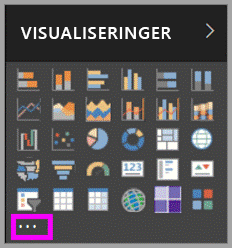
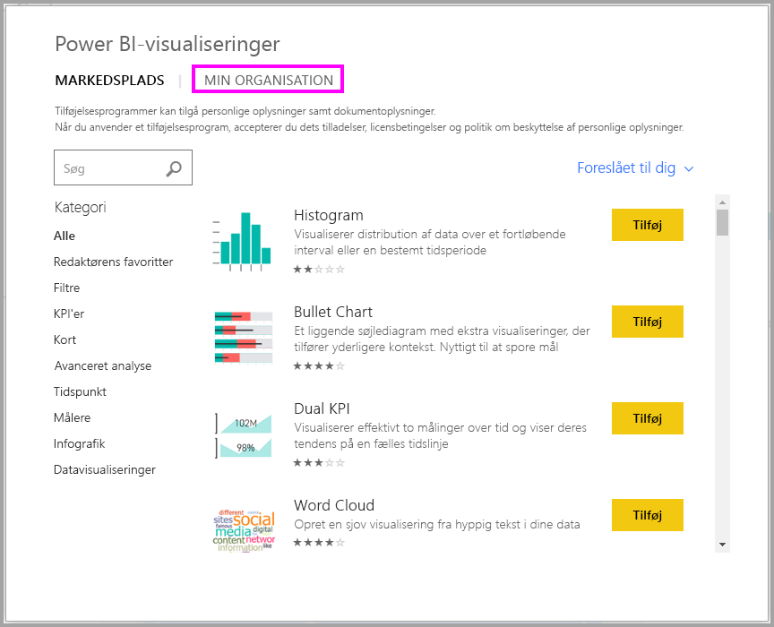
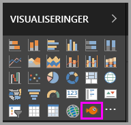
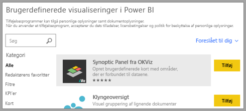

# Brugerdefinerede visualiseringer i Power BI

Når du opretter eller redigerer en Power BI-rapport, kan du bruge mange forskellige typer visualiseringer. Ikonerne for disse visualiseringer vises i den **visualiseringer** rude. Disse visualiseringer kommer færdigpakkede, når du downloader [Power BI Desktop](https://powerbi.microsoft.com/desktop/) eller åbne den [Power BI-tjenesten](https://app.powerbi.com).

Men du ikke er begrænset til dette sæt visualiseringer. Hvis du vælger ellipsen (...) i bunden, en anden kilde af rapportvisualiseringer bliver tilgængelig –*brugerdefinerede visualiseringer*.

Udviklere oprette brugerdefinerede visuelle elementer ved hjælp af SDK'ET til brugerdefinerede visualiseringer. Disse visualiseringer virksomhedsbrugere kan se sine data på en måde, som passer bedst til deres forretning. Forfattere kan derefter importere de brugerdefinerede visualiseringsfiler til deres rapporter og bruge dem efter de ville alle andre visualiseringer i Power BI. Brugerdefinerede visualiseringer er førsteklasses borgerne i Power BI og kan filtreres, fremhæves, redigerede, delt og osv.

Brugerdefinerede visuelle elementer er installeret på tre måder:

* Brugerdefinerede visualiseringsfiler
* Visualiseringer til organisationen
* Visualiseringer på markedspladser

## Brugerdefinerede visualiseringsfiler

Brugerdefinerede visualiseringer er pakker, der indeholder kode til at gengive fodres data. Alle kan oprette en brugerdefineret visualisering og pakke den som en enkelt `.pbiviz` -fil, som derefter kan importeres til en Power BI-rapport.

> [!WARNING]
> En brugerdefineret visualisering kan indeholde kode med sikkerhed eller beskyttelse af personlige oplysninger risici. Kontrollér, at du har tillid til forfatteren og kilden for brugerdefinerede visuelle før du importerer den til din rapport.

## Visualiseringer til organisationen

Power BI-administratorer Godkend og udrulle brugerdefinerede visualiseringer i deres organisation, som forfattere kan nemt finde, opdatere og bruge. Administratorer kan nemt administrere (f.eks, opdatere version, deaktivere/aktivere) disse visualiseringer.

 [Læs mere om visualiseringer](power-bi-custom-visuals-organization.md).

## Visualiseringer på markedspladser

Medlemmer af community'et og Microsoft har bidraget deres brugerdefinerede visualiseringer til offentlig fordel og udgivet dem på den [AppSource](https://appsource.microsoft.com/marketplace/apps?product=power-bi-visuals) marketplace. Du kan hente disse visualiseringer føje dem til Power BI-rapporter. Microsoft har testet og godkendt disse brugerdefinerede visualiseringer for funktionalitet og kvalitet.

Hvad er [AppSource](developer/office-store.md)? Det er det sted, hvor du kan finde apps, tilføjelsesprogrammer og udvidelser til din Microsoft-software. [AppSource](https://appsource.microsoft.com/) forbinder millioner af brugere af produkter som Office 365, Azure, Dynamics 365, Cortana og Power BI med løsninger, der hjælper dem med at arbejde mere effektivt, indsigt, og elegant måde end før.

### Certificerede visualiseringer

Certificerede Powerbi-visualiseringer er markedspladser, der har bestået yderligere strenge kvalitet tests og understøttes i yderligere scenarier, f.eks [mailabonnementer](https://docs.microsoft.com/power-bi/service-report-subscribe), og [Eksportér til PowerPoint](https://docs.microsoft.com/power-bi/service-publish-to-powerpoint).
Hvis du vil have vist en liste over certificerede brugerdefinerede visualiseringer eller indsende dine egne, skal du se under [Certificerede brugerdefinerede visualiseringer](https://docs.microsoft.com/power-bi/power-bi-custom-visuals-certified).

Er du webudvikler og interesseret i at oprette dine egne visualiseringer og føje dem til AppSource? Se [udvikle en brugerdefineret visualisering i Power BI](developer/custom-visual-develop-tutorial.md) og Lær, hvordan du [Publicer brugerdefinerede visuals til AppSource](https://docs.microsoft.com/power-bi/developer/office-store).

### Importér en brugerdefineret visualisering fra en fil

1. Vælg ellipsen i bunden af den **visualiseringer** rude.

    

2. Vælg **Importér fra fil** på rullelisten.

    

3. Menuen Åbn fil, skal du vælge den `.pbiviz` fil, du vil importere, og vælg derefter **åben**. Ikon for den brugerdefinerede visualisering tilføjes nederst i din **visualiseringer** ruden og er nu tilgængelig til brug i din rapport.

    

### Importér visualiseringer til organisationen

1. Vælg ellipsen i bunden af den **visualiseringer** rude.

    

2. Vælg **Importér fra markedsplads** på rullelisten.

    

3. Vælg **MIN ORGANISATION** i øverste fanemenu.

    

4. Rul gennem listen for at finde den visualisering, du vil importere.

    

5. Vælg **Tilføj** til at importere den brugerdefinerede visualisering. Dets ikon, der føjes til bunden af din **visualiseringer** ruden og er nu tilgængelig til brug i din rapport.

    

## Download eller importér brugerdefinerede visualiseringer fra Microsoft AppSource

Har du to valgmuligheder for Download og import af brugerdefinerede visualiseringer: fra Power BI og fra den [AppSource-webstedet](https://appsource.microsoft.com/).

### Importér brugerdefinerede visualiseringer fra Power BI

1. Vælg ellipsen i bunden af den **visualiseringer** rude.

    

2. Vælg **Importér fra markedsplads** på rullelisten.

    

3. Rul gennem listen for at finde den visualisering, du vil importere.

    

4. Du kan få mere at vide om en af visualiseringerne, hvis du fremhæver og vælger den.

    

5. På siden med oplysninger kan du se skærmbilleder, videoer, en detaljeret beskrivelse med mere.

    

6. Rul ned til bunden for at se anmeldelser.

    

7. Vælg **Tilføj** til at importere den brugerdefinerede visualisering. Dets ikon, der føjes til bunden af din **visualiseringer** ruden og er nu tilgængelig til brug i din rapport.

    

### Download og importér brugerdefinerede visualiseringer fra Microsoft AppSource

1. Start med [Microsoft AppSource](https://appsource.microsoft.com), og vælg fanen for **Apps**.

    

2. Gå til [siden med appresultater](https://appsource.microsoft.com/marketplace/apps), hvor du kan få vist de mest populære apps i hver kategori, herunder *Power BI-apps*. Vi er på udkig efter brugerdefinerede visualiseringer, så lad os vælge **Power BI-visualiseringer** fra venstre navigationsrude listen for at begrænse resultaterne.

    

3. AppSource viser et felt for hver brugerdefinerede visualisering.  Hvert felt har et brugerdefineret visual snapshot med en kort beskrivelse og et downloadlink. Vælg feltet for at få vist flere detaljer.

    

4. På siden med oplysninger kan du se skærmbilleder, videoer, en detaljeret beskrivelse med mere. Vælg **Hent det nu** til at downloade den brugerdefinerede visualisering og derefter acceptere vilkårene for anvendelse.

    

5. Vælg linket for at downloade den brugerdefinerede visualisering.

    

    Downloadsiden indeholder også instruktioner om, hvordan du importerer den brugerdefinerede visualisering til Power BI Desktop og Power BI-tjenesten.

    Du kan også downloade et eksempel på en rapport, der indeholder den brugerdefinerede visual og viser dets egenskaber.

    

6. Gem den `.pbiviz` filen, og Åbn derefter Power BI.

7. Import af `.pbiviz` filen til din rapport. Se afsnittet [Importér en brugerdefineret visualisering fra en fil](#import-a-custom-visual-from-a-file) ovenfor.

## Overvejelser og begrænsninger

* En brugerdefineret visualisering føjes til en bestemt rapport, når den importeres. Hvis du vil bruge visualiseringen i en anden rapport, skal du også importere den i denne rapport. Når du gemmer en rapport med en brugerdefineret visualisering vha. indstillingen **Gem som**, gemmes der en kopi af den brugerdefinerede visualisering sammen med den nye rapport.

* Hvis du ikke ser en **visualiseringer** rude, der betyder, at du ikke har en rapport, redigere tilladelser.  Du kan kun tilføje brugerdefinerede visualiseringer til rapporter, som du kan redigere, og ikke til rapporter, der er blevet delt med dig.

## Fejlfind

Du kan foretage fejlfinding, se [fejlfinding i forbindelse med dine egne brugerdefinerede visuals i Power BI](power-bi-custom-visuals-troubleshoot.md).

## Ofte stillede spørgsmål

Du kan finde flere oplysninger og få svar på spørgsmål under [Ofte stillede spørgsmål om brugerdefinerede visualiseringer i Power BI](power-bi-custom-visuals-faq.md#organizational-custom-visuals).

## Næste trin

* [Visualiseringer i Power BI-rapporter](visuals/power-bi-report-visualizations.md)

Har du flere spørgsmål? [Prøv at spørge Power BI-community'et](http://community.powerbi.com/).
