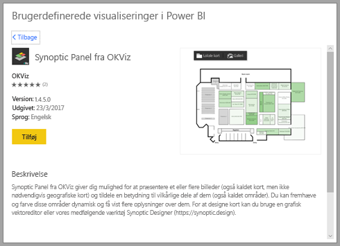

# Visualiseringer i Power BI

Når du opretter eller redigerer en Power BI-rapport, kan du bruge mange forskellige typer visualiseringer. Ikonerne for disse visualiseringer vises i ruden **Visualiseringer**. Disse visualiseringer er pakke på forhånd, når du downloader [Power BI Desktop](https://powerbi.microsoft.com/desktop/) eller åbner [Power BI-tjenesten](https://app.powerbi.com).

Du er dog ikke begrænset til dette sæt visualiseringer. Hvis du vælger ellipsen (...) nederst, bliver en anden kilde til rapportvisualiseringer tilgængelig – *Power BI-visualiseringer*.

Udviklere opretter Power BI-visualiseringer ved hjælp af SDK'er til Power BI-visualiseringer. Disse visualiseringer giver virksomhedsbrugere mulighed for at se deres data på en måde, som passer bedst til deres virksomhed. Forfattere af rapporter kan derefter importere de brugerdefinerede visualiseringsfiler til deres rapporter og bruge dem som en hvilken som helst anden Power BI-visualisering. Power BI-visualiseringer er førsteklasses komponenter i Power BI, og de kan filtreres, fremhæves, redigeres, deles osv.

Power BI-visualiseringer udrulles på tre måder:

* Brugerdefinerede visualiseringsfiler
* Visualiseringer til organisationen
* Visualiseringer på markedspladser

## Brugerdefinerede visualiseringsfiler

Power BI-visualiseringer er pakker, der indeholder kode til gengivelse af de data, de fodres med. Alle kan oprette en brugerdefineret visualisering og pakke den som en enkelt `.pbiviz`-fil, som derefter kan importeres i en Power BI-rapport.

> [!WARNING]
> En brugerdefineret visualisering kan indeholde kode, der kan udgøre en risiko for sikkerheden eller beskyttelsen af personlige oplysninger. Vær sikker på, at du har tillid til forfatteren og kilden til den brugerdefinerede visualisering, før du importerer den i din rapport.

## Visualiseringer til organisationen

Power BI-administratorer godkender og udruller Power BI-visualiseringer i deres organisation, som forfattere af rapporter nemt kan finde, opdatere og bruge. Administratorer kan nemt administrere (f.eks. opdatere version, deaktivere/aktivere) disse visualiseringer.

 [Læs mere om visualiseringer til organisationer](power-bi-custom-visuals-organization.md).

## Visualiseringer på markedspladser

Det er både medlemmer af community'et og Microsoft, der har bidraget med deres Power BI-visualiseringer til offentlig brug og publiceret dem på [AppSource](https://appsource.microsoft.com/marketplace/apps?product=power-bi-visuals)-markedspladsen. Du kan downloade disse visualiseringer og føje dem til dine Power BI-rapporter. Microsoft har testet og godkendt disse Power BI-visualiseringer i forhold til funktionalitet og kvalitet.

Hvad er [AppSource](developer/office-store.md)? Det er det sted, du finder apps, tilføjelsesprogrammer og udvidelser til din Microsoft-software. AppSource forbinder millioner af brugere af produkter som Office 365, Azure, Dynamics 365, Cortana og Power BI med løsninger, der kan hjælpe dem med at arbejde mere effektivt, med større indsigt og smukkere end før.

### Certificerede visualiseringer

Certificerede Power BI-visualiseringer er visualiseringer på markedspladser, der har bestået yderligere strenge kvalitetstest, og understøttes i yderligere scenarier, f.eks. [mailabonnementer](service-report-subscribe.md) og [eksport til PowerPoint](service-publish-to-powerpoint.md).
Hvis du vil se en liste over certificerede Power BI-visualiseringer eller indsende dine egne, skal du se [Certificerede Power BI-visualiseringer](power-bi-custom-visuals-certified.md).

Er du webudvikler og interesseret i at oprette dine egne visualiseringer og føje dem til AppSource? Se under [Udvikling af en brugerdefineret visualisering i Power BI](developer/visuals/custom-visual-develop-tutorial.md), og få mere at vide om, hvordan du [publicerer brugerdefinerede visualiseringer i AppSource](developer/office-store.md).

### Importér en brugerdefineret visualisering fra en fil

1. Vælg ellipsen på knappen i ruden **Visualiseringer**.

    

2. Vælg **Importér fra fil** på rullelisten.

    

3. I filmenuen **Åbn** skal du vælge den `.pbiviz`-fil, du vil importere, og derefter vælge **Åbn**. Ikonet for den brugerdefinerede visualisering tilføjes nederst i ruden **Visualiseringer** og kan nu bruges i din rapport.

    

### Importér visualiseringer til organisationen

1. Vælg ellipsen på knappen i ruden **Visualiseringer**.

    

2. Vælg **Importér fra markedsplads** på rullelisten.

    

3. Vælg **MIN ORGANISATION** i øverste fanemenu.

    

4. Rul gennem listen for at finde den visualisering, du vil importere.

    

5. Vælg **Tilføj** for at importere den brugerdefinerede visualisering. Ikonet for den brugerdefinerede visualisering tilføjes nederst i ruden **Visualiseringer** og kan nu bruges i din rapport.

    

## Download eller importér Power BI-visualiseringer fra Microsoft AppSource

Du har to muligheder for at downloade og importere Power BI-visualiseringer: fra Power BI og fra [AppSource-webstedet](https://appsource.microsoft.com/).

### Importér Power BI-visualiseringer fra Power BI

1. Vælg ellipsen på knappen i ruden **Visualiseringer**.

    

2. Vælg **Importér fra markedsplads** på rullelisten.

    

3. Rul gennem listen for at finde den visualisering, du vil importere.

    

4. Du kan få mere at vide om en af visualiseringerne, hvis du fremhæver og vælger den.

    

5. På siden med oplysninger kan du se skærmbilleder, videoer, en detaljeret beskrivelse med mere.

    

6. Rul ned til bunden for at se anmeldelser.

    

7. Vælg **Tilføj** for at importere den brugerdefinerede visualisering. Ikonet for den brugerdefinerede visualisering tilføjes nederst i ruden **Visualiseringer** og kan nu bruges i din rapport.

    

### Download og importér Power BI-visualiseringer fra Microsoft AppSource

1. Start med [Microsoft AppSource](https://appsource.microsoft.com), og vælg fanen for **Apps**.

    

2. Gå til [siden med appresultater](https://appsource.microsoft.com/marketplace/apps), hvor du kan få vist de mest populære apps i hver kategori, herunder *Power BI-apps*. Vi leder efter Power BI-visualiseringer, så lad os vælge **Power BI-visualiseringer** på listen i navigationsruden til venstre for at indsnævre resultaterne.

    

3. AppSource viser et felt for hver brugerdefinerede visualisering.  Hvert felt har et snapshot af den brugerdefinerede visualisering med en kort beskrivelse og et downloadlink. Vælg feltet for at få vist flere detaljer.

    

4. På siden med oplysninger kan du se skærmbilleder, videoer, en detaljeret beskrivelse med mere. Vælg **Hent det nu** for at downloade den brugerdefinerede visualisering, og acceptér derefter Vilkår for anvendelse.

    

5. Vælg linket for at downloade den brugerdefinerede visualisering.

    

    Downloadsiden indeholder også instruktioner til, hvordan du importerer den brugerdefinerede visualisering i Power BI Desktop og Power BI-tjenesten.

    Du kan også downloade et eksempel på en rapport, der indeholder den brugerdefinerede visual og viser dets egenskaber.

    

6. Gem `.pbiviz`-filen, og åbn derefter Power BI.

7. Importér `.pbiviz`-filen i din rapport. Se afsnittet [Importér en brugerdefineret visualisering fra en fil](#import-a-custom-visual-from-a-file) ovenfor.

## Overvejelser og begrænsninger

* En brugerdefineret visualisering føjes til en bestemt rapport, når den importeres. Hvis du vil bruge visualiseringen i en anden rapport, skal du også importere den i denne rapport. Når du gemmer en rapport med en brugerdefineret visualisering vha. indstillingen **Gem som**, gemmes der en kopi af den brugerdefinerede visualisering sammen med den nye rapport.

* Hvis du ikke kan se ruden **Visualiseringer**, betyder det, at du ikke har redigeringstilladelser til rapporten.  Du kan kun føje Power BI-visualiseringer til rapporter, som du kan redigere, og ikke til rapporter, der kun er blevet delt med dig.

## Fejlfind

Hvis du skal foretage fejlfinding, skal du se [Fejlfinding af dine Power BI-visualiseringer](power-bi-custom-visuals-troubleshoot.md).

## Ofte stillede spørgsmål

Du kan finde flere oplysninger og få svar på spørgsmål under [Ofte stillede spørgsmål om Power BI-visualiseringer](power-bi-custom-visuals-faq.md#organizational-visuals).

## Næste trin

* [Visualiseringer i Power BI-rapporter](visuals/power-bi-report-visualizations.md)

Har du flere spørgsmål? [Prøv at spørge Power BI-community'et](http://community.powerbi.com/).
