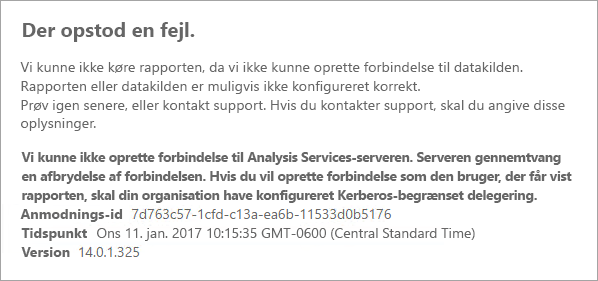
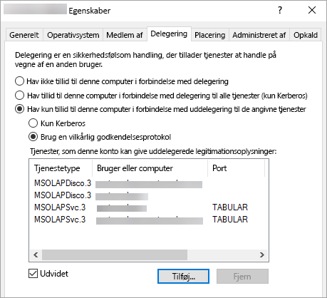

# <a name="configure-kerberos-to-use-power-bi-reports"></a>Konfigurer Kerberos til at bruge Power BI-rapporter
<iframe width="640" height="360" src="https://www.youtube.com/embed/vCH8Fa3OpQ0?showinfo=0" frameborder="0" allowfullscreen></iframe>

Se, hvordan du kan konfigurere din rapportserver til Kerberos-godkendelse af datakilder, der bruges i dine Power BI-rapporter, for et distribueret miljø.

Power BI-rapportserver omfatter muligheden for at hoste Power BI-rapporter. Mange forskellige datakilder understøttes af rapportserveren. Mens denne artikel fokuserer specifikt på SQL Server Analysis Services, kan du bruge koncepterne og anvende dem på andre datakilder som f.eks. SQL Server.

Du kan installere Power BI-rapportserver, SQL Server og Analysis Services på én enkelt computer, og alt bør fungere uden yderligere konfiguration. Dette er godt i et testmiljø. Du kan støde på fejl, hvis du har disse tjenester installeret på separate computere, hvilket kaldes for et distribueret miljø. I dette miljø er du nødt til at bruge Kerberos-godkendelse. Der kræves konfiguration for at implementere dette. 

Specifikt skal du konfigurere begrænset delegering. Du har muligvis konfigureret Kerberos i dit miljø, men det er muligvis ikke konfigureret til begrænset delegering.

## <a name="error-running-report"></a>Der opstod en fejl under kørsel af rapporten
Hvis din rapportserver ikke er konfigureret korrekt, kan du få følgende fejl.

    Something went wrong.

    We couldn’t run the report because we couldn’t connect to its data source. The report or data source might not be configured correctly. 

Du får vist følgende meddelelse under Tekniske detaljer.

    We couldn’t connect to the Analysis Services server. The server forcibly closed the connection. To connect as the user viewing the report, your organization must have configured Kerberos constrained delegation.



## <a name="configuring-kerberos-constrained-delegation"></a>Konfiguration af Kerberos til begrænset delegering
Der er flere elementer, der skal konfigureres, for at begrænset delegering med Kerberos kan fungere. Dette omfatter tjenestens hovednavn (SPN) og delegering af indstillinger på tjenestekonti.

> [!NOTE]
> Du skal være domæneadministrator for at konfigurere SPN'er og delegeringsindstillinger.
> 
> 

Vi er stadig nødt til at konfigurere eller validere følgende.

1. Godkendelsestype i konfigurationen af rapportserveren.
2. SPN'er for kontoen til rapportservertjenesten.
3. SPN'er for Analysis Services-tjenesten.
4. SPN'er for SQL Browser-tjenesten på Analysis Services-computeren. Dette er kun for navngivne forekomster.
5. Delegeringsindstillinger på kontoen til rapportservertjenesten.

## <a name="authentication-type-within-report-server-configuration"></a>Godkendelsestype i konfigurationen af rapportserveren
Vi er nødt til at konfigurere godkendelsestypen for rapportserveren til at tillade begrænset delegering for Kerberos. Dette gøres i **rsreportserver.config**-filen. Standardplaceringen for denne fil er `C:\Program Files\Microsoft Power BI Report Server\PBIRS\ReportServer`.

I filen rsreportserver.config skal du finde sektionen **Authentication/AuthenticationTypes**.

Vi vil gerne sikre os, at RSWindowsNegotiate er angivet, og at det er det første på listen over godkendelsestyper. Det skal se nogenlunde ud som følgende.

```
<AuthenticationTypes>
    <RSWindowsNegotiate/>
    <RSWindowsNTLM/>
</AuthenticationTypes>
```

Hvis blev nødt til at ændre konfigurationsfilen, skal du stoppe og starte rapportserveren for at sikre, at ændringerne træder i kraft.

Du kan få mere at vide i [Konfigurer Windows-godkendelse på rapportserveren](https://docs.microsoft.com/sql/reporting-services/security/configure-windows-authentication-on-the-report-server).

## <a name="spns-for-the-report-server-service-account"></a>SPN'er for kontoen til rapportservertjenesten
Dernæst skal vi sikre, at rapportserveren har gyldige SPN'er tilgængelige. Dette er baseret på den tjenestekonto, som er konfigureret for rapportserveren.

### <a name="virtual-service-account-or-network-service"></a>Virtuel tjenestekonto eller netværkstjeneste
Hvis din rapportserver er konfigureret til den virtuelle tjenestekonto eller netværkstjenestekontoen, skal du ikke foretage dig noget. Disse er i computerkontoens kontekst. Computerkontoen får VÆRTS-SPN'er som standard. Disse dækker HTTP-tjenesten og bruges af rapportserveren.

Hvis du bruger et virtuelt servernavn, et, som ikke er det samme som computerkontoen, dækkes du ikke af VÆRT-posterne, og du skal manuelt tilføje SPN'er for værtsnavnet for den virtuelle server.

### <a name="domain-user-account"></a>Domænebrugerkonto
Hvis din rapportserver er konfigureret til at bruge en domænebrugerkonto, skal du manuelt oprette HTTP-SPN'er på den pågældende konto. Dette kan gøres ved hjælp af værktøjet setspn, som følger med til Windows.

> [!NOTE]
> Du skal bruge domæneadministratorrettigheder for at kunne oprette SPN.
> 
> 

Det anbefales at oprette to SPN'er. Et med NetBIOS-navnet og et andet med det fulde domænenavn (FQDN). SPN er i følgende format.

    <Service>/<Host>:<port>

Power BI-rapportserver bruger HTTP som tjeneste. For HTTP-SPN'er skal du ikke angive en port. Tjenesten, vi er interesseret i her, er HTTP. Værten for SPN bliver det navn, du bruger i en webadresse. Dette er normalt computernavnet. Hvis du har installeret en belastningsjustering, kan dette være et virtuelt navn.

> [!NOTE]
> Du kan bekræfte webadressen ved enten at se på, hvad du angiver i adresselinjen i browseren, eller ved at se i Report Server Configuration Manager (konfigurationsstyring for rapportserver) på fanen Web Portal URL (Webadresse til webportal).
> 
> 

Hvis computernavnet er ContosoRS, vil dine SPN'er være følgende.

| SPN-type | SPN |
| --- | --- |
| Fuldt domænenavn (FQDN) |HTTP/ContosoRS.contoso.com |
| NetBIOS |HTTP/ContosoRS |

### <a name="location-of-spn"></a>Placering af SPN
Hvor vil du så sætte dit SPN? SPN placeres på det, du bruger til din tjenestekonto. Hvis du bruger virtuel tjenestekonto eller netværkstjenestekonto, vil det være computerkontoen. Selvom vi før har nævnt, at du kun behøver at gøre dette for en virtuel webadresse. Hvis du bruger en domænebruger til kontoen til rapporttjenestekontoen, skal du placere SPN på denne domænebrugerkonto.

Hvis vi f.eks. bruger netværkstjenestekontoen, og vores computernavn er ContosoRS, placerer vi SPN på ContosoRS.

Hvis vi bruger domænebrugerkontoen RSService, placerer vi SPN på RSService.

### <a name="using-setspn-to-add-the-spn"></a>Brug af SetSPN til at tilføje SPN
Vi kan bruge værktøjet SetSPN til at tilføje SPN. Vi følger det samme eksempel som ovenfor med computerkontoen og domænebrugerkontoen.

Hvis SPN placeres på en computerkonto for både FQDN og NetBIOS-SPN, vil det ligne følgende, hvis vi har brugt den virtuelle webadresse contosoreports.

      Setspn -a HTTP/contosoreports.contoso.com ContosoRS
      Setspn -a HTTP/contosoreports ContosoRS

Hvis SPN placeres på en domænebrugerkonto for både FQDN og NetBIOS-SPN, vil det ligne følgende, hvis vi har brugt computernavnet til værten for SPN.

      Setspn -a HTTP/ContosoRS.contoso.com RSService
      Setspn -a HTTP/ContosoRS RSService

## <a name="spns-for-the-analysis-services-service"></a>SPN'er for Analysis Services-tjenesten
SPN'er for Analysis Services minder om det, vi gjorde med Power BI-rapportserver. Formatet for SPN er lidt anderledes, hvis du har en navngiven forekomst.

Vi kan bruge MSOLAPSvc.3 som tjeneste til Analysis Services. Vi angiver navnet på forekomsten som portplacering på SPN. Værtsdelen af SPN bliver enten computernavnet eller det virtuelle klyngenavn.

Et eksempel på et Analysis Services-SPN kan se ud som følger.

| Type | Format |
| --- | --- |
| Standardforekomst |MSOLAPSvc.3/ContosoAS.contoso.com<br>MSOLAPSvc.3/ContosoAS |
| Navngiven forekomst |MSOLAPSvc.3/ContosoAS.contoso.com:FOREKOMSTNAVN<br>MSOLAPSvc.3/ContosoAS:FOREKOMSTNAVN |

Placeringen af SPN minder også om det, der er nævnt for Power BI-rapportserver. Det er baseret på tjenestekontoen.  Hvis du bruger lokalt system eller netværkstjeneste, er du i computerkontoens kontekst. Hvis du bruger en domænebrugerkonto til Analysis Services-forekomsten, skal du placere SPN på domænebrugerkontoen.

### <a name="using-setspn-to-add-the-spn"></a>Brug af SetSPN til at tilføje SPN
Vi kan bruge værktøjet SetSPN til at tilføje SPN. I dette eksempel er computernavnet ContosoAS.

Hvis SPN placeres på en computerkonto, vil det se ud som følger for både FQDN og NetBIOS-SPN.

    Setspn -a MSOLAPSvc.3/ContosoAS.contoso.com ContosoAS
    Setspn -a MSOLAPSvc.3/ContosoAS ContosoAS

Hvis SPN placeres på en domænebrugerkonto, vil det se ud som følger for både FQDN og NetBIOS-SPN.

    Setspn -a MSOLAPSvc.3/ContosoAS.contoso.com OLAPService
    Setspn -a MSOLAPSvc.3/ContosoAS OLAPService

## <a name="spns-for-the-sql-browser-service"></a>SPN'er for SQL Browser-tjenesten
Hvis du har en navngiven Analysis Services-forekomst, skal du også at sikre dig, at du har et SPN for browsertjenesten. Dette er unikt for Analysis Services.

SPN'er for SQL Browser minder om det, vi gjorde med Power BI-rapportserver.

Til SQL Browser bruger vi MSOLAPDisco.3 som tjeneste. Vi angiver navnet på forekomsten som portplacering på SPN. Værtsdelen af SPN bliver enten computernavnet eller det virtuelle klyngenavn.
Du behøver ikke at angive noget for forekomstnavn eller port.

Et eksempel på et Analysis Services-SPN kan se ud som følger.

    MSOLAPDisco.3/ContosoAS.contoso.com
    MSOLAPDisco.3/ContosoAS

Placeringen af SPN minder også om det, der er nævnt for Power BI-rapportserver. Forskellen er, at SQL Browser altid kører under den lokale systemkonto. Det betyder, at SPN'er altid går på computerkontoen. 

### <a name="using-setspn-to-add-the-spn"></a>Brug af SetSPN til at tilføje SPN
Vi kan bruge værktøjet SetSPN til at tilføje SPN. I dette eksempel er computernavnet ContosoAS.

Hvis SPN placeres på en computerkonto, vil det se ud som følger for både FQDN og NetBIOS-SPN.

    Setspn -a MSOLAPDisco.3/ContosoAS.contoso.com ContosoAS
    Setspn -a MSOLAPDisco.3/ContosoAS ContosoAS

Du kan få mere at vide i [Der kræves et SPN til SQL Server Browser-tjenesten](https://support.microsoft.com/kb/950599).

## <a name="delegation-settings-on-the-report-server-service-account"></a>Delegeringsindstillinger på kontoen til rapportservertjenesten
Det sidste, vi skal konfigurere, er delegeringsindstillinger på kontoen til rapportservertjenesten. Der er forskellige værktøjer, som kan bruges til at udføre disse trin. I dette dokument holder vi os til Active Directory-brugere og -computere.

Du skal starte med at gå til egenskaberne for kontoen til rapporttjenesten i Active Directory-brugere og -computere. Det vil være computerkontoen, hvis du har brugt den virtuelle tjenestekonto eller netværkstjeneste, eller også er det en domænebrugerkonto.

Vi vil konfigurere begrænset delegering med protokoltransitering. Med begrænset delegering skal du være eksplicit med, hvilke tjenester, vi vil uddelegere til. Vi går ind og føjer både Analysis Services-tjenestens SPN og SQL Browser-SPN til listen, som Power BI-rapportserver kan uddelegere til.

1. Højreklik på kontoen til rapportservertjenesten, og vælg **Egenskaber**.
2. Vælg fanen **Delegering**.
3. Vælg **Hav kun tillid til denne computer i forbindelse med uddelegering til de angivne tjenester**.
4. Vælg **Brug enhver godkendelsesprotokol**.
5. Under **Tjenester, som denne konto kan give uddelegerede legitimationsoplysninger**: skal du vælge **Tilføj**.
6. I den nye dialogboks skal du vælge **Brugere eller computere**.
7. Angiv tjenestekontoen for Analysis Services-tjenesten, og vælg **Ok**.
8. Vælg det SPN, du har oprettet. Det starter med `MSOLAPSvc.3`. Hvis du har tilføjet både det fulde domænenavn (FQDN) NetBIOS-SPN, vælges begge dele. Du får muligvis kun vist et.
9. Vælg **OK**.  Du bør nu kunne se SPN'et på listen.
10. Du kan vælge **Udvidet**, hvis du vil vise både FQDN og NetBIOS-SPN på listen.
11. Vælg **Tilføj** igen. Nu tilføjer vi SQL Browser-SPN.
12. I den nye dialogboks skal du vælge **Brugere eller computere**.
13. Angiv computernavnet på den computer, som SQL Browser-tjenesten findes på, og vælg **Ok**.
14. Vælg det SPN, du har oprettet. Det starter med `MSOLAPDisco.3`. Hvis du har tilføjet både det fulde domænenavn (FQDN) NetBIOS-SPN, vælges begge dele. Du får muligvis kun vist et.
15. Vælg **OK**. Dialogboksen ligner følgende, hvis du har valgt **Udvidet**.
    
    
16. Vælg **OK**.
17. Genstart Power BI-rapportserver.

## <a name="running-a-power-bi-report"></a>Kørsel af en Power BI-rapport
Når al den ovenstående konfiguration er på plads, bør din rapport blive vist korrekt. 


Mens denne konfiguration bør fungere i de fleste tilfælde, kan der med Kerberos være en anden konfiguration afhængigt af dit miljø. Hvis rapporten stadig ikke indlæses, skal du kontakte din domæneadministrator for at få undersøgt det nærmere, eller du kan kontakte support.

## <a name="next-steps"></a>Næste trin
[Administratoroversigt](admin-handbook-overview.md)  
[Installer Power BI-rapportserver](install-report-server.md)  

Har du flere spørgsmål? [Prøv at spørge Power BI-community'et](https://community.powerbi.com/)

