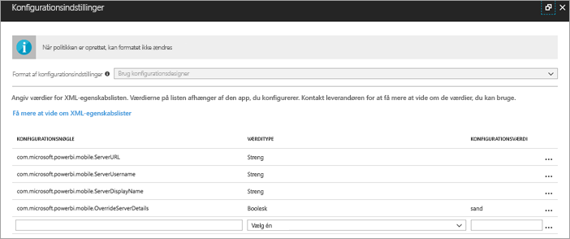
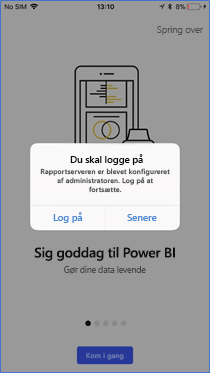
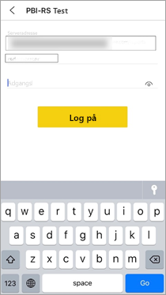

# Konfigurer Power BI iOS-mobilapps til at få ekstern adgang til en rapportserver

I denne artikel kan du se, hvordan du bruger din organisations MDM-værktøj til at konfigurere adgang til en rapportserver for Power BI iOS-mobilapps. Det kræver, at it-administratorer opretter en appkonfigurationspolitik, hvor de nødvendige oplysninger pushes til appen. 

 Når rapportserverforbindelsen allerede er oprettet, kan brugerne af Power BI iOS-mobilappen nemmere oprette forbindelse til organisationens rapportserver. 

## Opret appkonfigurationspolitikken i MDM-værktøjet 

Som administrator skal du følge disse trin i Microsoft Intune for at oprette appkonfigurationspolitikken. Trinnene og oprettelsen af appkonfigurationspolitikken kan være anderledes i andre MDM-værktøjer. 

1. Opret forbindelse til dit MDM-værktøj. 
2. Opret og navngiv en ny appkonfigurationspolitik. 
3. Vælg, hvilke brugere appkonfigurationspolitikken skal distribueres til. 
4. Opret nøgle/værdi-par. 

I følgende tabel kan du se disse par.

|Nøgle  |Type  |Beskrivelse  |
|---------|---------|---------|
| com.microsoft.powerbi.mobile.ServerURL-adresse | String | URL-adresse til rapportserver   Skal starte med http/https |
| com.microsoft.powerbi.mobile.ServerBrugernavn | String | [valgfri]   Det brugernavn, der skal bruges til at oprette forbindelse til serveren.   Hvis der ikke findes et brugernavn, vil appen bede brugeren skrive brugernavnet til forbindelsen.| 
| com.microsoft.powerbi.mobile.ServerVist navn | String | [valgfri]   Standardværdien er "Rapportserver"   Et navn, der bruges til at repræsentere serveren i appen | 
| com.microsoft.powerbi.mobile.OverrideServerDetails | Boolean | Standardværdien er True  Når værdien er angivet til "True", tilsidesætter den alle eksisterende rapportserverdefinitioner på mobilenheden. Eksisterende servere, der allerede er konfigureret, slettes.   Dette forhindrer også, at brugeren kan fjerne konfigurationen.   Hvis indstillingen er angivet til “False”, tilføjes de overførte værdier, og eksisterende indstillinger ændres ikke.   Hvis den samme URL-adresse allerede er konfigureret i mobilappen, forbliver konfigurationen, som den er. Appen beder ikke brugeren om at godkende igen for den samme server. |

Her er et eksempel på, hvordan du indstiller konfigurationspolitikken ved hjælp af Intune.

## Slutbrugere opretter forbindelse til en rapportserver

 Lad os sige, at du publicerer appkonfigurationspolitikken for en distributionsliste. Når brugerne og enhederne på den pågældende distributionsliste starter iOS-mobilappen, oplever de følgende: 

1. De får vist en meddelelse om, at mobilappen er konfigureret med en rapportserver og skal trykke på **Log på**.

    

2.  Detaljerne om rapportserveren er allerede udfyldt på siden **Opret forbindelse til server**. De trykker på **Opret forbindelse**.

    

3. De indtaster en adgangskode som godkendelse og trykker derefter på **Log på**. 

    

Nu kan de få vist og interagere med KPI'er og Power BI-rapporter på rapportserveren.

## Næste trin
[Administratoroversigt](admin-handbook-overview.md)  
[Installer Power BI-rapportserver](install-report-server.md)  

Har du flere spørgsmål? [Prøv at spørge Power BI-community'et](https://community.powerbi.com/)

