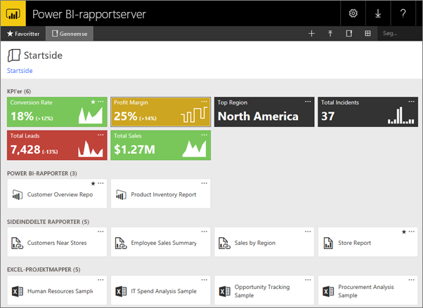

# Administrer indhold på webportalen 
Webportalen Power BI-rapportserver er en placering i det lokale miljø til visning, lagring og administration af dine Power BI-rapporter, dine mobile og sideinddelte rapporter og KPI'er.

Du kan se webportalen i alle moderne browsere. Rapporter og KPI'er er organiseret i mapper i webportalen, og du kan markere dem som favoritter. Du kan også gemme Excel-projektmapper der. Du kan starte de værktøjer, du skal bruge for at oprette rapporter, fra webportalen:

* **Power BI-rapporter**, der er oprettet med Power BI Desktop: Du kan få dem vist i webportalen og i Power BI-mobilappene.
* **Sideinddelte rapporter**, der er oprettet i Report Builder: Dokumenter med et moderne udseende og fast layout, der er optimeret til udskrivning.
* **KPI'er** oprettet direkte i webportalen.

Du kan gennemse mapperne på rapportserveren eller søge efter specifikke rapporter i webportalen. Du kan få vist en rapport, dens generelle egenskaber og indsætte kopier af rapporten, der er registreret i rapporthistorikken. Afhængigt af dine rettigheder kan du muligvis også abonnere på rapporter og få dem leveret til din mailindbakke eller en delt mappe i filsystemet.

## Roller og tilladelser til webportalen
Programmet til webportalen kører i en browser. Når du starter webportalen, afhænger de sider, links og indstillinger, som du kan se, af de tilladelser, du har på rapportserveren. Hvis du har en rolle med fuld tilladelse, har du adgang til samtlige programmenuer og -sider til administrering af en rapportserver. Hvis du har en rolle med tilladelse til at få vist og køre rapporter, kan du kun se de menuer og sider, der skal bruges til disse aktiviteter. Du kan have forskellige rolletildelinger til forskellige rapportservere eller endda til forskellige rapporter og mapper på en enkelt rapportserver.

## Start webportalen
1. Åbn din webbrowser.
   
    Se listen over [understøttede webbrowsere og versioner](browser-support.md).
2. Indtast webportalens URL-adresse i adresselinjen.
   
    URL-adressen er som standard <em>http://[ComputerName]/reports</em>.
   
    Rapportserveren er muligvis konfigureret til at bruge en bestemt port. For eksempel <em>http://[ComputerName]:80/reports</em> eller <em>http://[ComputerName]:8080/reports</em>.
   
    Du kan se, at webportalen deler elementer ind i disse kategorier:
   
   * KPI'er
   * Mobilrapporter
   * Sideinddelte rapporter
   * Power BI Desktop-rapporter
   * Excel-projektmapper
   * Datasæt
   * Datakilder
   * Ressourcer

## Administrer elementer i webportalen
Power BI-rapportserver tilbyder detaljeret kontrol over de elementer, som du gemmer på webportalen. For eksempel kan du konfigurere abonnementer, cachelagring, øjebliksbilleder og sikkerhed for hver enkelte sideinddelte rapport.

1. Vælg ellipsen (...) i øverste højre hjørne, og vælg derefter **Administrer**.
   
    
2. Vælg den egenskab eller anden funktion, som du vil konfigurere.
   
    
3. Vælg **Anvend**.

Læs mere om [arbejde med abonnementer i webportalen](https://docs.microsoft.com/sql/reporting-services/working-with-subscriptions-web-portal).

## Næste trin
[Hvad er Power BI-rapportserveren?](get-started.md)

Har du flere spørgsmål? [Prøv at spørge Power BI-community'et](https://community.powerbi.com/)

