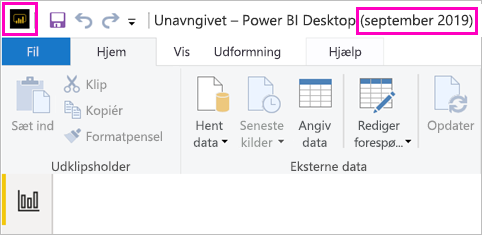

# Installér Power BI Desktop optimeret til Power BI-rapportserver

Hvis du vil oprette Power BI-rapporter for Power BI-rapportserver, skal du downloade og installere den Power BI Desktop-version, der er optimeret til Power BI-rapportserver. Dette er en anden udgivelse end Power BI Desktop, der bruges med Power BI-tjenesten. Versionen af Power BI Desktop til Power BI-tjenesten indeholder f.eks. prøveversionsfunktioner, som ikke findes i versionen Power BI-rapportserver, før de er generelt tilgængelige. Når du bruger denne udgivelse, sikrer du, at rapportserveren kan interagere med en kendt version af rapporterne og modellen. 

Den gode nyhed er, at du kan installere Power BI Desktop og Power BI Desktop optimeret til Power BI-rapportserver side om side på den samme computer.

## Download og installér Power BI Desktop

Den nemmeste måde til at sikre, at du har den nyeste version af Power BI Desktop optimeret til Power BI-rapportserver, er ved at starte fra webportalen på rapportserveren.

1. På webportalen Rapportserver skal du vælge pilen **Download** > **Power BI Desktop**.

    

    Eller gå til hjemmesiden for [Power BI-rapportserver](https://powerbi.microsoft.com/report-server/), og vælg **Avancerede indstillinger for download**.

2. På siden Download Center skal du vælge et sprog og derefter vælge **Download**.

3. Afhængigt af din computer skal du vælge: 

    - **PBIDesktopRS.msi** (32-bit-version) eller
    - **PBIDesktopRS_x64.msi** (64-bit-version).

1. Når du har downloadet installationsprogrammet, skal du køre installationsguiden til Power BI Desktop (september 2019).

2. Til sidst i installationsprocessen skal du vælge **Start Power BI Desktop**.

    Programmet starter automatisk, og du er klar til at gå i gang.

## Kontrollér, at du bruger den korrekte version
Det er nemt at kontrollere, at du bruger den korrekte version af Power BI Desktop: Se på startskærmen eller titellinjen i Power BI Desktop. Du kan se, at du har den rigtige version, fordi der står **Power BI Desktop (september 2019)** på titellinjen. Farverne i Power BI-logoet er også omvendt: gul på sort i stedet for sort på gul.

I versionen af Power BI Desktop til Power BI-tjenesten vises måned og årstal ikke på titellinjen.

## Tilknytning af filtypenavne
Hvis du installerer både Power BI Desktop og Power BI Desktop optimeret til Power BI-rapportserver på den samme computer, er den seneste installation af Power BI Desktop tilknyttet filtypenavnet .pbix. Det betyder, at den version af Power BI Desktop, du senest har installeret, startes, når du dobbeltklikker på en .pbix-fil.

Hvis du har installeret Power BI Desktop og derefter installerer Power BI Desktop optimeret til Power BI-rapportserver, åbnes alle .pbix-filer i Power BI Desktop optimeret til Power BI-rapportserver som standard. Hvis du foretrækker, at Power BI Desktop åbnes som standard, når du dobbeltklikker på en .pbix-fil, kan du geninstallere [Power BI Desktop fra Microsoft Store](https://aka.ms/pbidesktopstore).

Du kan til enhver tid starte med at åbne den version af Power BI Desktop, du vil bruge. Og derefter kan du åbne filen fra Power BI Desktop.

Hvis du redigerer en Power BI-rapport i Power BI-rapportserver eller opretter en ny Power BI-rapport fra webportalen, er det altid den korrekte version Power BI Desktop, der åbnes.

## Overvejelser og begrænsninger

Power BI-rapporter i Power BI-rapportserver, i Power BI-tjenesten (`https://app.powerbi.com`) og i Power BI-mobilapps fungerer stort set ens, men nogle enkelte funktioner er forskellige.

### Vælg et sprog

I forbindelse med Power BI Desktop, der er optimeret til Power BI-rapportserver, skal du vælge sproget, når du installerer appen. Du kan ikke ændre det bagefter, men du kan installere en version på et andet sprog.

### Rapportvisualiseringer i en browser

Rapporter i Power BI-rapportserver understøtter alle visualiseringer, herunder Power BI-visuals. Rapporter i Power BI-rapportserver understøtter ikke:

* R-visuals
* ArcGIS-kort
* Brødkrummer
* Prøveversionsfunktioner i Power Bi Desktop

### Rapporter i Power BI-mobilapps

Rapporter i Power BI-rapportserver understøtter al den grundlæggende funktionalitet i [Power BI-mobilappsene](../consumer/mobile/mobile-apps-for-mobile-devices.md), herunder:

* [Rapport med telefonlayout](../create-reports/desktop-create-phone-report.md): Du kan optimere en rapport til Power BI-mobilapps. På din mobiltelefon har optimerede rapporter et særligt ikon  og layout.
  
    

Rapporter i Power BI-rapportserver understøtter ikke disse funktioner i Power BI-mobilappsene:

* R-visualiseringer
* ArcGIS-kort
* Power BI-visualiseringer
* Brødkrummer
* Geofiltrering eller stregkoder

### Brugerdefineret sikkerhed

Power BI Desktop optimeret til Power BI-rapportserver understøtter ikke brugerdefineret sikkerhed. Hvis din Power BI-rapportserver er konfigureret med en brugerdefineret sikkerhedsudvidelse, kan du ikke gemme en Power BI-rapport fra Power BI Desktop (optimeret til Power BI-rapportserver) til instansen af Power BI-rapportserveren. Du skal gemme PBIX-rapportfilen fra Power BI Desktop og uploade den til portalwebstedet for Power BI-rapportserver.

### Gem rapporter på en Power BI-rapportserver på et andet domæne

Når du gemmer en Power BI-rapport på Power BI-rapportserver, bruges dine Windows-legitimationsoplysninger. Hvis du gemmer direkte på en rapportserver i et andet domæne, understøttes dine Windows-legitimationsoplysninger ikke. Du kan bruge en webbrowser til at få vist rapportserveren og manuelt overføre filen fra computeren i stedet for.

## Power BI Desktop til tidligere versioner af Power BI-rapportserver

Hvis du har en tidligere version af rapportserveren, skal du have den tilsvarende version af Power BI Desktop. Her er linket til at downloade en tidligere version.

- Microsoft Power BI Desktop ([Optimeret til Power BI-rapportserver – september 2019](https://go.microsoft.com/fwlink/?linkid=2103723))

## Næste trin

Nu, hvor du har installeret Power BI Desktop, kan du begynde at oprette Power BI-rapporter.

[Opret en Power BI-rapport til Power BI-rapportserveren](quickstart-create-powerbi-report.md)  
[Hvad er Power BI-rapportserveren?](get-started.md)

Har du flere spørgsmål? [Prøv at spørge Power BI-community'et](https://community.powerbi.com/)

