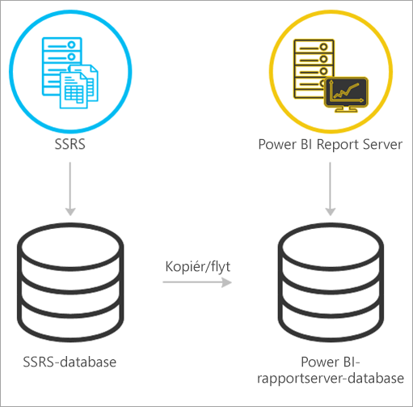
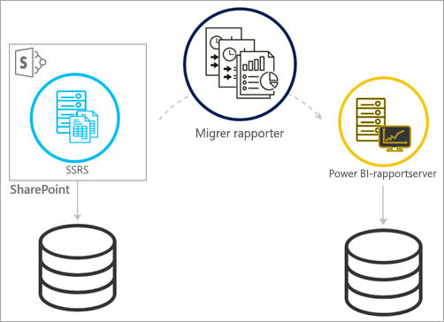
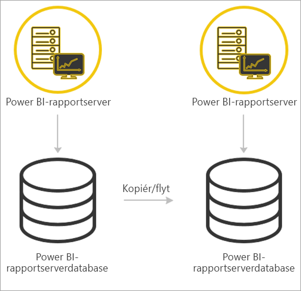

# <a name="migrate-a-report-server-installation"></a>Overfør en rapportserverinstallation
Få mere at vide om, hvordan du overfører din eksisterende SQL Server Reporting Services-forekomst (SSRS) til en forekomst af Power BI Report Server.

Overførsel er defineret som at flytte programdatafiler til en ny Power BI Report Server-forekomst. Følgende er almindelige årsager til, at du kan vælge at overføre din installation:

* Du vil flytte fra SQL Server Reporting Services til Power BI Report Server
  
  > [!NOTE]
  > Der er ikke en opgradering på stedet fra SQL Server Reporting Services til Power BI Report Server. En overførsel er nødvendig.
  > 
  > 
* Du har en installation i stor skala eller opdateringskrav
* Du er ved at ændre din installations hardware eller topologi
* Der opstod et problem, der blokerer for opgraderingen

## <a name="migrating-to-power-bi-report-server-from-ssrs-native-mode"></a>Overførsel til Power BI Report Server fra SSRS (oprindelig tilstand)
Overførsel fra en SSRS-forekomst (oprindelig tilstand) til Power BI Report Server består af nogle få trin.



> [!NOTE]
> SQL Server 2008 Reporting Services og nyere understøttes i forbindelse med overførsel.
> 
> 

* Sikkerhedskopiér database-, program- og konfigurationsfiler
* Sikkerhedskopiér krypteringsnøglen
* Klon din rapportserverdatabase, der er vært for dine rapporter
* Installer Power BI Report Server. Hvis du bruger den samme hardware, kan du installere Power BI Report Server på den samme server som SSRS-forekomsten. Yderligere oplysninger om installation af Power BI Report Server finder du i [Installer Power BI Report Server](install-report-server.md).

> [!NOTE]
> Navnet på forekomsten til Power BI Report Server vil være *PBIRS*.
> 
> 

* Konfigurer rapportserveren ved hjælp af Report Server-konfigurationsstyring, og opret forbindelse til den klonede database.
* Foretag eventuel oprydning, der er nødvendig for SSRS-forekomsten (oprindelig tilstand)

## <a name="migration-to-power-bi-report-server-from-ssrs-sharepoint-integrated-mode"></a>Overførsel til Power BI Report Server fra SSRS (SharePoint-integreret tilstand)
Overførsel fra en SSRS (SharePoint-integreret tilstand) til Power BI Report Server er ikke så ligetil som oprindelig tilstand. Selv om disse trin indeholder nogle retningslinjer, kan du have andre filer og aktiver i SharePoint, der skal administreres uden for disse trin.



Du skal overføre det specifikke rapportserverindhold fra SharePoint til din Power BI Report Server. Det forudsætter, at du allerede har installeret Power BI Report Server et eller andet sted i dit miljø. Yderligere oplysninger om installation af Power BI Report Server finder du i [Installer Power BI Report Server](install-report-server.md).

Hvis du vil kopiere rapportserverindholdet fra SharePoint-miljøet til Power BI Report Server, skal du bruge værktøjer, f.eks. **rs.exe**, til at kopiere indholdet. Nedenfor findes et eksempel på, hvordan scriptet skal være for at kopiere rapportserverindholdet fra SharePoint til Power BI Report Server.

> [!NOTE]
> Eksempelscriptet skal fungere i forhold til SharePoint 2010 og nyere og SQL Server 2008 Reporting Services og nyere.
> 
> 

### <a name="sample-script"></a>Eksempelscript
```
Sample Script
rs.exe
-i ssrs_migration.rss -e Mgmt2010
-s http://SourceServer/_vti_bin/reportserver
-v st="sites/bi" -v f="Shared Documents“
-u Domain\User1 -p Password
-v ts=http://TargetServer/reportserver
-v tu="Domain\User" -v tp="Password"
```

## <a name="migrateing-from-one-power-bi-report-server-to-another"></a>Overførsel fra én Power BI Report Server til en anden
Overførsel fra en Power BI Report Server er den samme proces som overførsel fra SSRS (oprindelig tilstand).



* Sikkerhedskopiér database-, program- og konfigurationsfiler
* Sikkerhedskopiér krypteringsnøglen
* Klon din rapportserverdatabase, der er vært for dine rapporter
* Installer Power BI Report Server. Du *kan ikke* installere Power BI Report Server på den samme server som den, du overfører fra. Yderligere oplysninger om installation af Power BI Report Server finder du i [Installer Power BI Report Server](install-report-server.md).

> [!NOTE]
> Navnet på forekomsten til Power BI Report Server vil være *PBIRS*.
> 
> 

* Konfigurer rapportserveren ved hjælp af Report Server-konfigurationsstyring, og opret forbindelse til den klonede database.
* Foretag eventuel oprydning, der er nødvendig for den gamle installation af Power BI Report Server.

## <a name="next-steps"></a>Næste trin
[Administratorhåndbog](admin-handbook-overview.md)  
[Installer Power BI-rapportserver](install-report-server.md)  
[Scriptet med værktøjet rs.exe og webtjenesten](https://docs.microsoft.com/sql/reporting-services/tools/script-with-the-rs-exe-utility-and-the-web-service)

Har du flere spørgsmål? [Prøv at spørge Power BI-community'et](https://community.powerbi.com/)

