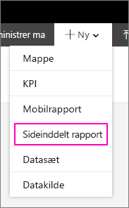
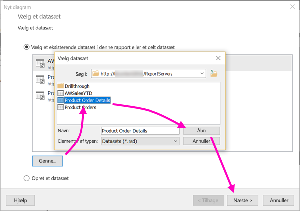
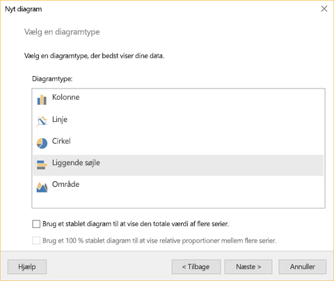
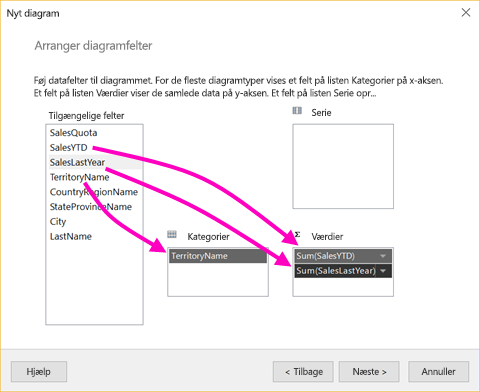
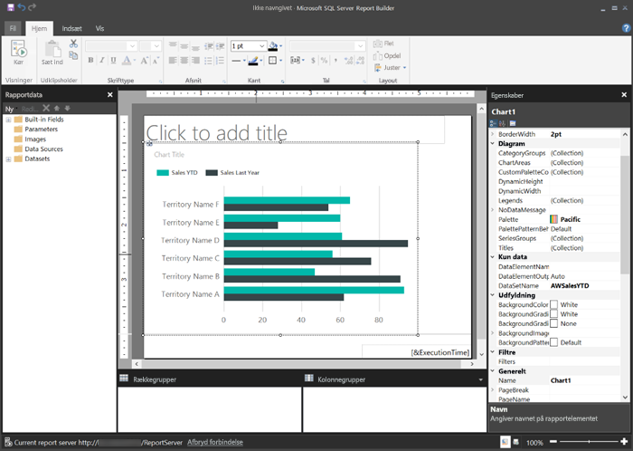
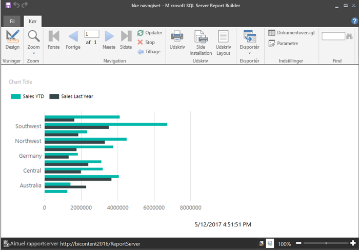
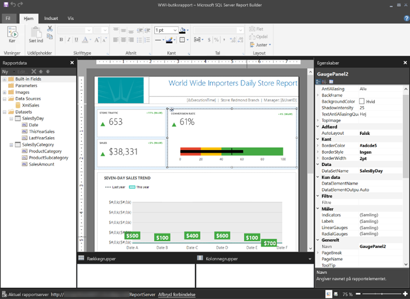

# Opret en sideinddelt rapport til Power BI-rapportserver
Som navnet antyder så kan sideinddelte rapporter løbe op i mange sider. De er udformet i et fast format og tillader præcis tilpasning. Sideinddelte rapporter er .rdl-filer.

Du kan gemme og administrere sideinddelte rapporter på Power BI-rapportserverens webportal nøjagtigt som på SQL Server Reporting Services (SSRS)-webportalen. Du kan oprette og redigere dem i Report Builder eller Rapportdesigner i SQL Server Data Tools (SSDT) og derefter publicere dem på den ene eller anden portal. Derefter kan rapportlæsere i din organisation få vist dem i en browser eller i en Power BI-mobilapp på en mobilenhed.

Hvis du allerede har oprettet sideinddelte rapporter i Report Builder eller Rapportdesigner, så er du klar til at oprette sideinddelte rapporter for Power BI-rapportserveren. Hvis det ikke er tilfældet, får du her nogle hurtige trin til at komme i gang.

## Trin 1: Installér, og start Report Builder
Du har muligvis allerede installeret Report Builder for at oprette rapporter for en SSRS-server. Du kan bruge den samme version eller Report Builder til at oprette rapporter for Power BI-rapportserveren. Hvis du ikke har installeret den, så er fremgangsmåden ret nem.

1. I Power BI-rapportserverens webportal skal du vælge **Ny** > **Sideinddelt rapport**.
   
    
   
    Hvis du ikke allerede har installeret Report Builder, bliver du ført gennem installationsprocessen nu.
2. Når installationen er udført, åbner skærmen **Ny rapport eller datasæt** i Report Builder.
   
    
3. Vælg guiden, svarende til rapporttypen, som du vil oprette:
   
   * Tabel eller matrix
   * Diagram
   * Kort
   * Blank
4. Lad os starte med guiden Diagram.
   
    Guiden Diagram fører dig gennem den trinvise vejledning i at oprette et grundlæggende diagram i en rapport. Derfra har du adgang til næsten ubegrænsede tilpasningsmuligheder af rapporten.

## Trin 2: Gå gennem guiden Diagram
Guiden Diagram fører dig gennem en trinvis grundlæggende vejledning i at oprette en visualisering i en rapport.

Sideinddelte rapporter kan tilsluttes en lang række datakilder, fra Microsoft SQL Server og Microsoft Azure SQL Database til Oracle, Hyperion og meget mere. Læs om [datakilder, der understøttes af sideinddelte rapporter](connect-data-sources.md).

På den første side i guiden Diagram – **Vælg et datasæt**, du kan oprette et datasæt eller vælge et delt datasæt på en server. *Datasæt* returnerer rapportdata fra en forespørgsel på en ekstern datakilde.

1. Vælg **Gennemse** > vælg et delt datasæt på en server > **Åbn** > **Næste**.
   
    
   
     Vil du oprette et datasæt? Se [Opret et delt eller integreret datasæt](https://docs.microsoft.com/sql/reporting-services/report-data/create-a-shared-dataset-or-embedded-dataset-report-builder-and-ssrs).
2. Vælg en diagramtype – i dette tilfælde et søjlediagram.
   
    
3. Organiser felter ved at trække dem hen til felterne **Kategorier**, **Serie** og **Værdier**.
   
    
4. Vælg **Næste** > **Afslut**.

## Trin 3: Design rapporten
Du er nu i visningen Rapportdesign. Bemærk, at dataene er pladsholderdata, ikke dine data.

* Vælg **Kør** for at få vist dine data.
  
     
* Vælg **Design** for at gå tilbage til Designvisning.

Du kan tilpasse diagrammet, du lige har oprettet, ændre layoutet, værdierne, forklaringen... ja, næsten alt.

Du kan desuden tilføje alle mulige andre forskellige visualiseringer: målere, tabeller, matrixer, tabeller, kort m.m. Du kan tilføje sidehoveder og sidefødder for adskillelige sider. Se [Report Builder-selvstudierne](https://docs.microsoft.com/sql/reporting-services/report-builder-tutorials), og prøv dem selv.

## Trin 4: Gem din rapport på rapportserveren
Når rapporten er klar, kan du gemme den på Power BI-rapportserveren.

1. I menuen **Filer** skal du vælge **Gem som** og gemme den på rapportserver. 
2. Nu kan du se den i browseren.
   
    

## Næste trin
Der er mange fantastiske ressourcer til design af rapporter i Report Builder og i Rapportdesigner i SQL Server Data Tools. Report Builder-selvstudier er et godt sted at starte.

* [Report Builder-selvstudier](https://docs.microsoft.com/sql/reporting-services/report-builder-tutorials)
* [Hvad er Power BI-rapportserveren?](get-started.md)  

Har du flere spørgsmål? [Prøv at spørge Power BI-community'et](https://community.powerbi.com/)

