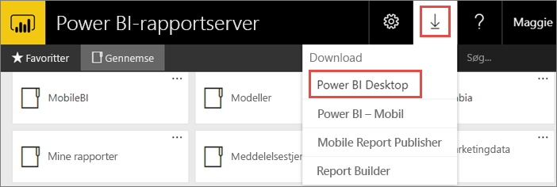
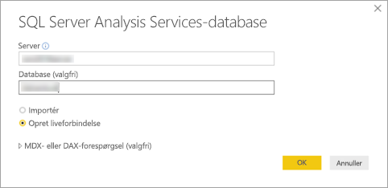

# Opret en Power BI-rapport til Power BI-rapportserveren
Du kan gemme og administrere Power BI-rapporter i det lokale miljø på Microsoft Power BI-rapportservers webportal, på samme måde som du kan gemme Power BI-rapporter i skyen i Power BI-tjenesten (https://powerbi.com). Du kan oprette og redigere rapporter i Power BI Desktop og publicere dem på webportalen. Derefter kan rapportlæsere i din organisation få dem vist i en browser eller i en Power BI-mobilapp på en mobilenhed.

Her er fire hurtige trin til at komme i gang.

## Trin 1: Installér Power BI Desktop optimeret til Power BI-rapportserver

Hvis du allerede har oprettet Power BI-rapporter i Power BI Desktop, er du næsten klar til at oprette Power BI-rapporter til Power BI-rapportserver. Vi anbefaler, at du installerer den version af Power BI Desktop, som er optimeret til Power BI-rapportserver, så du ved, at serveren og appen altid er synkroniseret. Du kan have begge versioner af Power BI Desktop på den samme computer.

1. På webportalen Rapportserver skal du vælge pilen **Download** > **Power BI Desktop**.

    

    Du kan også gå direkte til [Microsoft Power BI Desktop](https://www.microsoft.com/download/details.aspx?id=56723) (optimeret til Power BI-rapportserver – marts 2018) i Microsoft Download Center.

2. På siden Download Center skal du vælge **Download**.

3. Afhængigt af din computer skal du vælge:

    - **PBIDesktopRS.msi** (32-bit-version) eller

    - **PBIDesktopRS_x64.msi** (64-bit-version).

4. Når du har downloadet installationsprogrammet, skal du køre installationsguiden til Power BI Desktop (marts 2018).

2. Til sidst i installationsprocessen skal du markere **Start Power BI Desktop nu**.
   
    Programmet starter automatisk, og du er klar til at gå i gang. Du kan se, at du har den rigtige version, hvis der står "Power BI Desktop (marts 2018)" i titellinjen.

    

3. Hvis du ikke kender til Power BI Desktop, bør du overveje at se videoerne på velkomstskærmbilledet.
   
    

## Trin 2: Vælg en datakilde
Du kan oprette forbindelse til en række forskellige datakilder. Læs mere om at [oprette forbindelse til datakilder](connect-data-sources.md).

1. På velkomstskærmen skal du vælge **Hent data**.
   
    Eller du kan vælge **Hent data** på fanen **Hjem**.
2. Vælg din datakilde – i dette eksempel **Analysis Services**.
   
    
3. Udfyld **Server** og eventuelt **Database**. Sørg for, at **Opret liveforbindelse** er valgt > **OK**.
   
    
4. Vælg den rapportserver, hvor du vil gemme dine rapporter.
   
    

## Trin 3: Design rapporten
Det her er den sjove del: Du får lov at oprette visuals, som illustrerer dine data.

Du kan f.eks. oprette et tragtformet diagram over kunder og gruppere værdier efter årsomsætning.

1. I **Visualiseringer** skal du vælge **Tragtformet diagram**.
2. Træk det felt, som skal tælles, til kategorien **Værdier**. Hvis det ikke er et numerisk felt, gør Power BI Desktop det automatisk til en *optælling* af værdien.
3. Træk det felt, der skal grupperes, over på kategorien **Gruppér**.

Læs meget mere om at [designe en Power BI-rapport](../desktop-report-view.md).

## Trin 4: Gem din rapport på rapportserveren
Når rapporten er klar, kan du gemme den på den Power BI-rapportserver, du har valgt i Trin 2.

1. I menuen **Filer** skal du vælge **Gem som** > **Power BI-rapportserver**.
   
    
2. Nu kan du se den i webportalen.
   
    

## Overvejelser og begrænsninger
Rapporter i Power BI-rapportserver og i Power BI-tjenesten (http://powerbi.com) fungerer stort set ens, men enkelte funktioner er forskellige.

### I en browser
Power BI-rapportserver understøtter alle visualiseringer, herunder:

* Brugerdefinerede visuals

Rapporter i Power BI-rapportserver understøtter ikke:

* R-visuals
* ArcGIS-kort
* Brødkrummer
* Prøveversionsfunktioner i Power Bi Desktop

### I Power BI-mobilappsene
Rapporter i Power BI-rapportserver understøtter al den grundlæggende funktionalitet i [Power BI-mobilappsene](../mobile-apps-for-mobile-devices.md), herunder:

* [Rapport med telefonlayout](../desktop-create-phone-report.md): Du kan optimere en rapport til Power BI-mobilapps. På din mobiltelefon har optimerede rapporter et særligt ikon, , og layout.
  
    

Rapporter i Power BI-rapportserver understøtter ikke disse funktioner i Power BI-mobilappsene:

* R-visuals
* ArcGIS-kort
* Brugerdefinerede visuals
* Brødkrummer
* Geofiltering eller stregkoder

## Næste trin
### Power BI Desktop
Der er så mange fantastiske ressourcer til at oprette rapporter i Power BI Desktop. Dette link er et godt udgangspunkt.

* [Kom i gang med Power BI Desktop](../desktop-getting-started.md)

### Power BI Report Server
* [Installer Power BI Desktop optimeret til Power BI-rapportserver](install-powerbi-desktop.md)  
* [Brugerhåndbog til Power BI-rapportserver](user-handbook-overview.md)  

Har du flere spørgsmål? [Prøv at spørge Power BI-community'et](https://community.powerbi.com/)
