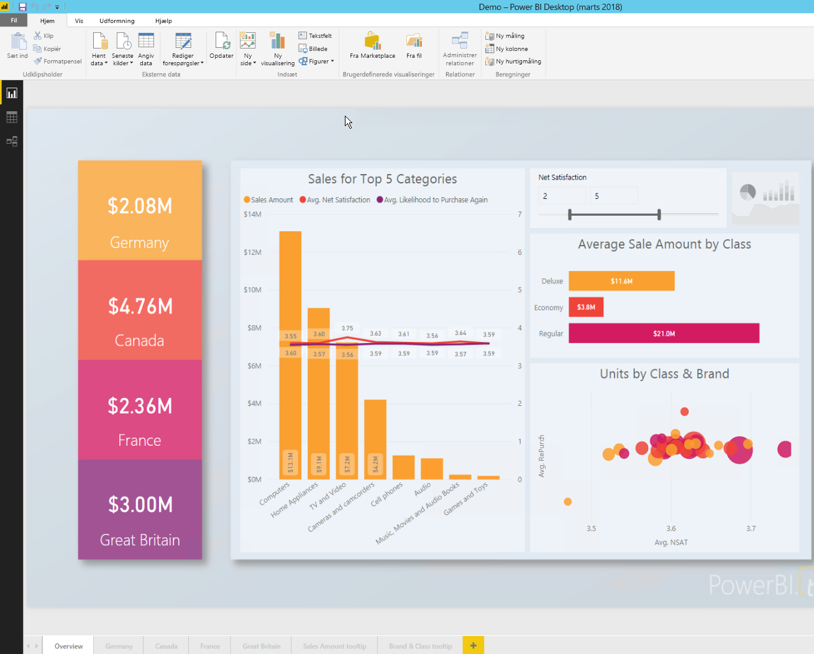
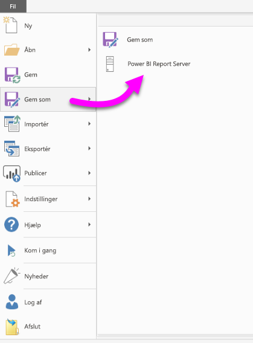
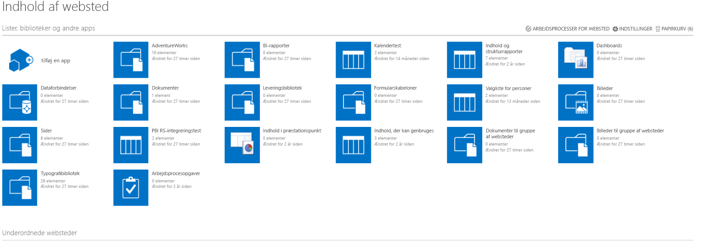
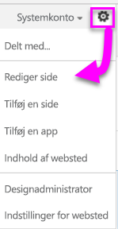
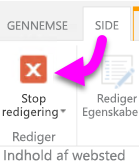

# <a name="embed-a-power-bi-report-server-report-using-an-iframe-in-sharepoint-server"></a>Integrer en rapport på Power BI-rapportserveren ved hjælp af en iFrame på SharePoint Server

I denne artikel får du mere at vide om, hvordan du integrerer en rapport fra Power BI-rapportserver ved hjælp af en iFrame på en SharePoint-side. Hvis du arbejder med SharePoint Online, skal Power BI-rapportserveren være offentligt tilgængelig. I SharePoint Online fungerer den Power BI-webdel, der fungerer med Power BI-tjenesten, ikke med Power BI-rapportserveren.  


## <a name="prerequisites"></a>Forudsætninger
* [Power BI-rapportserveren](https://powerbi.microsoft.com/report-server/) skal være installeret og konfigureret.
* [Power BI Desktop optimeret til Power BI-rapportserveren](install-powerbi-desktop.md) skal være installeret.
* Et [SharePoint](https://docs.microsoft.com/sharepoint/install/install)-miljø skal være installeret og konfigureret.
* Internet Explorer 11 understøttes kun, hvis dokumenttilstanden er angivet til IE11 (Edge), eller når du bruger SharePoint Online. Du kan bruge andre understøttede browsere med SharePoint i det lokale miljø og SharePoint Online.

## <a name="create-the-power-bi-report-url"></a>Opret URL-adressen til Power BI-rapporten

1. Download eksemplet fra GitHub: [Blogdemo](https://github.com/Microsoft/powerbi-desktop-samples). Vælg **Klon eller download**, og vælg derefter **Download ZIP**.

    

2. Pak filen ud, og åbn .pbix-eksempelfilen i Power BI Desktop, der er optimeret til Power BI-rapportserver.

    

3. Gem rapporten på **Power BI-rapportserveren**. 

    

4. Få vist rapporten på webportalen til Power BI-rapportserveren.

    

### <a name="capture-the-url-parameter"></a>Hent parameteren for URL-adressen

Når du har URL-adressen, kan du oprette en iFrame på en SharePoint-side, der er vært for rapporten. For en hvilken som helst URL-adresse til en rapport fra Power BI-rapportserver skal du tilføje følgende parameter for en forespørgselsstreng for at integrere rapporten i en SharePoint iFrame: `?rs:embed=true`.

   Eksempel:
    ``` 
    https://myserver/reports/powerbi/Sales?rs:embed=true
    ```
## <a name="embed-the-report-in-a-sharepoint-iframe"></a>Integrer rapporten i en SharePoint iFrame

1. Naviger til en SharePoint-side med **webstedsindhold**.

    

2. Vælg den side, hvor du vil tilføje din rapport.

    

3. Vælg tandhjulsikonet øverst til højre, og vælg derefter **Rediger side**.

    

4. Vælg **Tilføj en webdel**.

5. Under **Kategorier** skal du vælge **Medier og indhold**. Under **Dele** skal du vælge **Indholdseditor** og derefter vælge **Tilføj**.

    

6. Vælg **Klik her for at tilføje nyt indhold**.

7. Vælg **Formatér tekst** i den øverste menu, og vælg derefter **Rediger kilde**.

     

8. I vinduet **Rediger kilde** skal du indsætte iFrame-koden i **HTML-kilden** og derefter vælge **OK**.

    

     Eksempel:
     ```html
     <iframe width="800" height="600" src="https://myserver/reports/powerbi/Sales?rs:embed=true" frameborder="0" allowFullScreen="true"></iframe>
     ```

9. Vælg **Side** i den øverste menu, og vælg derefter **Stop redigering**.

    

    Rapporten vises på siden.

    

## <a name="next-steps"></a>Næste trin

- [Opret en Power BI-rapport til Power BI-rapportserveren](quickstart-create-powerbi-report.md).  
- [Opret en sideinddelt rapport til Power BI-rapportserveren](quickstart-create-paginated-report.md).  

Har du flere spørgsmål? [Prøv at spørge Power BI-community'et](https://community.powerbi.com/). 
