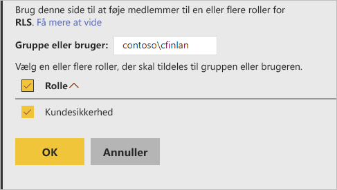
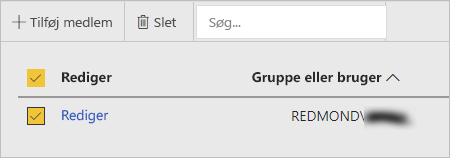

# Sikkerhed på rækkeniveau i Power BI-rapportserver

Konfiguration af sikkerhed på rækkeniveau med Power BI-rapportserver kan begrænse adgang til datakilder for bestemte brugere. Filtre begrænser adgangen til data på rækkeniveau, og du kan definere filtre inden for roller.  Hvis du bruger standardtilladelserne i Power BI-rapportserver, kan alle brugere med tilladelser som udgiver eller indholdsbestyrer for Power BI-rapporten tildele medlemmer til roller for den pågældende rapport.    

Du kan konfigurere sikkerhed på rækkeniveau for rapporter, der er importeret til Power BI, med Power BI Desktop. Du kan også konfigurere sikkerhed på rækkeniveau for rapporter, der anvender DirectQuery, f.eks. SQL Server.  Husk, at sikkerhed på rækkeniveau tilsidesættes, hvis DirectQuery-forbindelsen bruger integreret godkendelse for læserne af rapporten. I forbindelse med direkte forbindelser i Analysis Services kan du konfigurere sikkerhed på rækkeniveau for modellen i det lokale miljø. Sikkerhedsindstillingen vises ikke for datasæt med direkte forbindelse. 

[!INCLUDE [rls-desktop-define-roles](../includes/rls-desktop-define-roles.md)]

## Tovejskrydsfiltrering

Som standard bruger filtrering af sikkerhed på rækkeniveau envejsfiltre, uanset om relationerne er angivet til envejs eller tovejs. Du kan aktivere tovejskrydsfiltrering med sikkerhed på rækkeniveau manuelt.

- Vælg relationen, og markér afkrydsningsfeltet **Anvend sikkerhedsfilter i begge retninger**. 

    

Marker dette afkrydsningsfelt, når du implementerer [dynamisk sikkerhed på rækkeniveau](https://docs.microsoft.com/sql/analysis-services/supplemental-lesson-implement-dynamic-security-by-using-row-filters) baseret på brugernavn eller logon-id. 

Du kan få mere at vide i [Tovejskrydsfiltrering ved hjælp af DirectQuery i Power BI Desktop](../desktop-bidirectional-filtering.md) og det tekniske whitepaper [Sikring af modellen for tabellarisk BI-semantik](http://download.microsoft.com/download/D/2/0/D20E1C5F-72EA-4505-9F26-FEF9550EFD44/Securing%20the%20Tabular%20BI%20Semantic%20Model.docx).

[!INCLUDE [rls-desktop-view-as-roles](../includes/rls-desktop-view-as-roles.md)]

## Føj medlemmer til roller 

Når du har gemt din rapport i Power BI-rapportserver, kan du administrere sikkerheden og tilføje eller fjerne medlemmer på serveren. Kun brugere med tilladelser som enten udgiver eller indholdsbestyrer for rapporten har adgang til indstillingen for sikkerhed på rækkeniveau.

 Hvis rapporten ikke har de roller, der skal bruges, skal du åbne den i Power BI Desktop, tilføje eller redigere roller og derefter gemme i Power BI-rapportserver igen. 

1. I Power BI Desktop skal du gemme rapporten i Power BI-rapportserver. Du skal bruge den version af Power BI Desktop, der er optimeret til Power BI-rapportserver.
2. Vælg ellipsen (**...**) i Power BI-rapporttjenesten ud for rapporten. 

3. Vælg **Administrer** > **Sikkerhed på rækkeniveau**. 

     

    Du kan føje medlemmer til en rolle, du har oprettet i Power BI Desktop, på siden**Sikkerhed på rækkeniveau**.

5. Du tilføjer et medlem ved at vælge **Tilføj medlem**.

1. Angiv brugeren eller gruppen i tekstfeltet i brugernavnsformatet (DOMÆNE\bruger), og vælg de roller, du vil tildele dem. Medlemmet skal tilhøre din organisation.   

    

    Afhængigt af hvordan Active Directory er konfigureret, fungerer det også at angive brugerens hovednavn her. I så fald viser rapportserveren det tilsvarende brugernavn på listen.

1. Klik på **OK** for at anvende indstillingen.   

8. Hvis du vil fjerne medlemmer, skal du markere afkrydsningsfeltet ud for deres navne og vælge **Slet**.  Du kan slette flere medlemmer ad gangen. 

    

## username() og userprincipalname()

Du kan benytte username() eller userprincipalname() for DAX-funktionerne i datasættet. Du kan bruge dem i udtryk i Power BI Desktop. Når du publicerer din model, bruger Power BI-rapportserver dem.

I Power BI Desktop returnerer username() en bruger i formatet DOMÆNE\bruger, og userprincipalname() returnerer en bruger i formatet user@contoso.com.

I Power BI-rapportserver returnerer både username() og userprincipalname() brugerens hovednavn, som ligner en mailadresse.

Hvis du benytter brugerdefineret godkendelse i Power BI-rapportserver, returneres det format for brugernavnet, du har konfigureret for brugere.  

## Begrænsninger 

Her er de aktuelle begrænsninger for sikkerhed på rækkeniveau i Power BI-modeller. 

Brugere, der havde rapporter ved hjælp af username() i DAX-funktionen, vil bemærke en ny funktionsmåde, nu hvor brugerens hovednavn returneres, undtagen når DirectQuery med integreret sikkerhed benyttes.  Eftersom sikkerhed på rækkeniveau ikke overholdes i dette scenarie, er funktionsmåden i det pågældende scenarie uændret.

Du kan kun definere sikkerhed på rækkeniveau for de datasæt, der er oprettet ved hjælp af Power BI Desktop. Hvis du vil aktivere sikkerhed på rækkeniveau for de datasæt, der er oprettet i Excel, skal du først konvertere dine filer til .pbix-filer (Power BI Desktop). Få mere at vide om [konvertering af Excel-filer](../desktop-import-excel-workbooks.md).

Kun ETL- (extraction, transformation og loading) og DirectQuery-forbindelser, der bruger lagrede legitimationsoplysninger, understøttes. Direkte forbindelser til Analysis Services og DirectQuery-forbindelser, der bruger integreret godkendelse, skal håndteres i den underliggende datakilde. 

Hvis du bruger integreret sikkerhed med DirectQuery, oplever dine brugere muligvis, at:
- Sikkerhed på rækkeniveau er deaktiveret, og alle data returneres.
- Brugere ikke kan opdatere deres rolletildelinger og får vist en fejl på siden til administration af sikkerhed på rækkeniveau.
- I forbindelse med DAX-funktionen for brugernavne modtager du fortsat brugernavnet som DOMÆNE\BRUGER. 

Forfattere til rapporter har ikke adgang til at få vist rapportdataene i Power BI-rapportserver, før de har tildelt sig selv roller, der er i overensstemmelse hermed, efter overførsel af rapporten. 

 

## Ofte stillede spørgsmål 

### Kan jeg oprette disse roller til Analysis Services-datakilder? 

Det kan du, hvis du importerede dataene til Power BI Desktop. Hvis du bruger en direkte forbindelse, kan du ikke konfigurere sikkerhed på rækkeniveau i Power BI-tjenesten. Sikkerhed på rækkeniveau defineres i Analysis Services-modellen i det lokale miljø. 

### Kan jeg bruge sikkerhed på rækkeniveau til at begrænse, hvilke kolonner eller målinger brugerne har adgang til? 

Nej. Hvis en bruger har adgang til en bestemt række data, kan vedkommende se alle kolonner med data for den række. 

### Vil sikkerhed på rækkeniveau lade mig skjule detaljerede data, men samtidig give adgang til de data, der er opsummeret i visualiseringer? 

Nej. Du beskytter individuelle rækker, men brugerne kan altid se enten detaljer eller de opsummerede data. 

### Kan jeg tilføje nye roller i Power BI Desktop, hvis jeg allerede har eksisterende roller og medlemmer, der er tildelt? 

Ja, hvis du allerede har eksisterende roller defineret og tildelt medlemmer i Power BI-rapportserver, kan du oprette yderligere roller og publicere din rapport, uden at det påvirker aktuelle tildelinger. 
 

## Næste trin

[Hvad er Power BI-rapportserveren?](get-started.md) 
[Administratorhåndbog](admin-handbook-overview.md)  

Har du flere spørgsmål? [Prøv at spørge Power BI-community'et](https://community.powerbi.com/)
